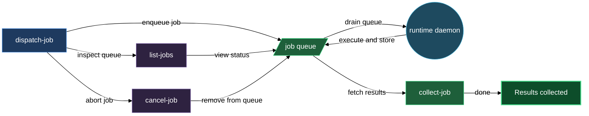

# Expert workers — dispatch, keep working, collect later

The experts block lets you hand a long-running task to a named specialist worker and come back for the result when it's ready. You run `/lazy-expert.dispatch-job`, receive a `job_id` and `queue_path` in seconds, and carry on with whatever else you are doing. The runtime daemon — a persistent process you start once with `./run.sh` — drains the queue on its own: it picks up each `READY` job, spawns the configured expert agent, waits for it to finish, and writes the result. When you want the output, you run `/lazy-expert.collect-job` with the `job_id`. The main session is never blocked waiting for expert work.

Each expert is a named role defined in `experts.settings.json` at install time. The role carries its own system prompt and tool allowlist, so a `designer` expert and a `reviewer` expert behave differently even though the same daemon runs both. The daemon runs one job at a time per repo, which means no two experts ever contend over the working tree or git state.

## When you'd use this

- You want to run a lengthy review, doc-generation, or analysis task without holding the main session open the whole time.
- You have multiple jobs in flight and need to check their status at a glance before deciding which result to retrieve first.
- You dispatched a job but your requirements changed — you want to cancel it before the daemon starts it.
- You need to filter the queue by expert name or state (pending, done, failed) to find a specific job.

## How it fits together

`/lazy-expert.dispatch-job` is the entry point. You supply three required fields — `kind` (what type of work this is), `role` (which expert should handle it), and `request` (the task description) — plus optional `source`, `context`, and `result` arrays for file references. The skill validates the payload against the protocol contract, writes the job directory under `.experts/.jobs/<expert_name>/`, and returns a `job_id` and `queue_path`. From that point the main session is free.

The runtime daemon, which you start separately with `./run.sh`, polls the queue. For each `READY` job it spawns the configured expert agent, waits for completion, and writes `response.json` plus a `DONE` marker. You never interact with the daemon directly.

`/lazy-expert.list-jobs` gives you a live view of the queue at any point. It lists every job sorted oldest-first with columns for expert, job_id, status, and age. Pass `expert=<name>` to narrow to one worker, or `status=pending|done|failed` to filter by state. Use this before collecting to confirm a job has finished, or to locate a job_id you've lost track of. Filtering by `status=failed` works by inspecting each `response.json` for `outcome == "error"` — one extra read per job, only when the filter is active.

`/lazy-expert.collect-job` retrieves the result for a specific job. You supply the `expert_name` and `job_id`; the skill returns `{status, response}`. When status is `done` it prints the result file paths from `response.json` so you can read them directly. When status is `pending` the daemon has not finished yet — run the skill again later. When status is `failed` it prints the error from `response.json`. When status is `missing` the job directory does not exist — verify the job_id and expert_name or re-dispatch.

`/lazy-expert.cancel-job` removes a job directory. For pending jobs it warns that the daemon may already be processing the job and asks for confirmation before deleting. For jobs that are already done it asks whether you want to discard the result. Nothing is deleted until you confirm.

## Common adjustments

- **Add optional file references.** The `source`, `context`, and `result` fields in the dispatch payload are arrays of repo-relative file paths. Pass `source` for files the expert should read, `context` for background material, and `result` for paths where the expert should write its output. These are passed through to the expert agent via the protocol contract.
- **Verify the expert name before dispatching.** If you mistype the expert key, `dispatch-job` will silently create a job directory under the misspelled name — the daemon will never pick it up because no matching expert is configured. Confirm the name against `experts.settings.json` first.
- **Filter the job list by expert.** `/lazy-expert.list-jobs expert=<name>` is the fastest way to check the queue for one worker when you have several experts configured.
- **Re-dispatch a failed job.** If `/lazy-expert.collect-job` returns `status: failed`, read the error from `response.json` and check `transcript.jsonl` in the same job directory for the full expert subprocess output — the transcript is retained for 7 days by default. Fix the underlying issue (e.g. a missing source file), cancel the failed job with `/lazy-expert.cancel-job`, and dispatch a new one.
- **Add or reconfigure expert roles.** Each expert's prompt and tools are set in `experts.settings.json`. Run `/lazy-core.install` to re-run the expert wizard and update that file.

## See also

- [runtime](runtime.md) — the per-repo serial daemon that drives the expert queue; start here if the daemon is not running or the working tree is halted.
- [setup-expert](walkthroughs/setup-expert.md) — end-to-end walkthrough: add a named expert, dispatch your first job, list the queue, and collect the result.

## How the pieces fit together

