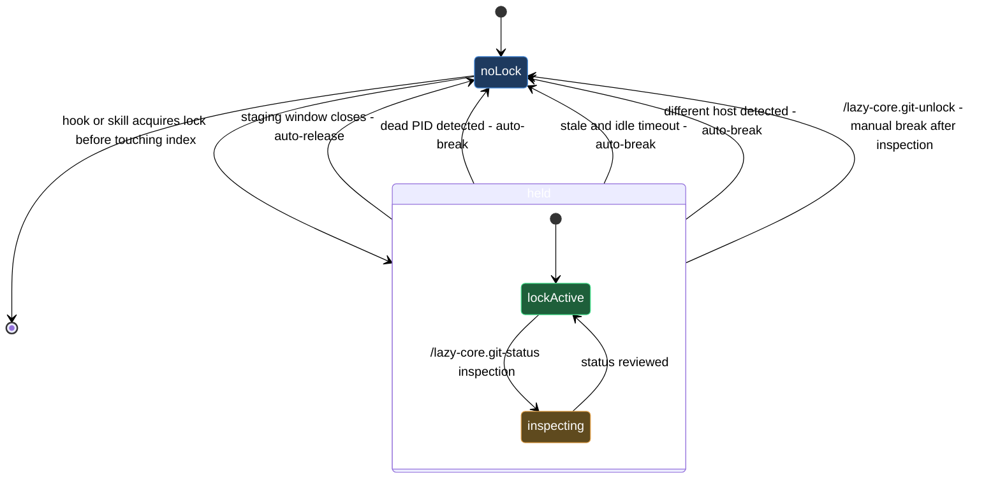

# git staging coordination

When multiple lazycortex hooks and skills are active in the same repo they can all try to touch the git index at the same moment — a `lazy-guard.check-public` pre-commit scan, a model-router dispatch, a pre-commit pipeline step. Without coordination those concurrent writes corrupt the index or cause one operation to silently overwrite another's staged changes.

The staging lock prevents that. Before any hook or skill modifies the index it acquires `.git/lazy-git.lock`, does its work, then releases it. Anything else that finds the lock held waits or yields rather than ploughing ahead. On a healthy day this is invisible — the lock appears for a fraction of a second and disappears. This block covers the two moments when you need to look at it: understanding the current state, and breaking a stuck lock by hand when the automatic heuristics don't apply.

## When you'd use this

- A commit or hook appears to hang and you want to check whether a staging lock is the cause.
- `/lazy-core.doctor` surfaces a stale-lock warning and you need to investigate before deciding whether to act.
- You know a session was interrupted mid-staging-window (crash, forced kill, IDE restart) and the PID is either dead or reused, but the lock file persisted.
- You want to confirm the lock has already cleared before triggering a re-run of a blocked operation.

## How it fits together

Start with `/lazy-core.git-status`. It reads `.git/lazy-git.lock` and prints everything relevant — the holder's session ID and PID, how long the lock has been held, when the index was last touched, whether the holder process is still alive on the same host, and whether the automatic break-the-lock heuristics would fire if another operation arrived. It never writes, never deletes, and never modifies anything.

Three outcomes are possible after running `/lazy-core.git-status`:

- **"Lock: NONE"** — nothing is held. Whatever stall you were seeing has already resolved; no action needed.
- **"Breakable: YES"** — the heuristics already qualify this lock for removal (dead PID, stale-and-idle, or different host). The next hook invocation will auto-break it; you don't need to act, but you can run `/lazy-core.git-unlock` immediately if you'd rather not wait.
- **"Breakable: NO (within thresholds)"** — the holder process appears alive and the lock is not yet stale. If you have independent knowledge that the holder has genuinely abandoned the staging window — the session was interrupted, the PID belongs to a zombie, the Claude Code instance that held it is no longer running — reach for `/lazy-core.git-unlock`.

`/lazy-core.git-unlock` force-deletes the lock after showing you the same holder details that `/lazy-core.git-status` would and asking you to confirm. You see the session ID, PID, age, host, branch, and liveness status in the confirmation prompt, so you don't need to cross-reference the status output separately. If you confirm, the lock is gone and any queued operation resumes on its next attempt. If you cancel, nothing changes.

If you are uncertain whether the holder is truly stuck, run `/lazy-core.git-status` again after a few seconds. The "Held for" counter will increment; if the index-touch timestamp is also advancing the holder is still active and should not be interrupted.

## Common adjustments

The lock's automatic break-the-lock thresholds (how long before "stale-and-idle" fires, the idle-index grace period) are configurable in `lazy.settings.json`. If you find the defaults too aggressive or too conservative for your workflow, run `/lazy-core.install` and navigate to the git-guard configuration section — the skill writes the threshold fields; do not edit `lazy.settings.json` directly for this.

## Where this fits

The staging lock is an infrastructure detail that the rest of the lazycortex-core block set depends on silently — the install-and-audit lifecycle, the pre-commit pipeline, the expert runtime daemon. You will not interact with this block on a healthy day. It becomes relevant when a commit or hook appears to hang, when `/lazy-core.doctor` surfaces a stale-lock warning, or when `/lazy-runtime.recover` notes a staging-lock conflict as part of a daemon halt.

## Lock lifecycle

