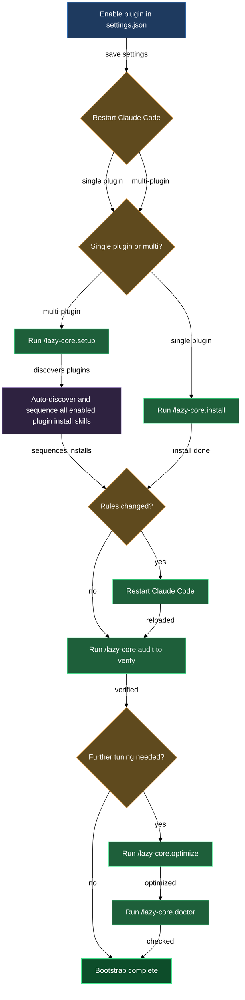

# Install, audit, and maintain lazycortex-core

Every lazycortex plugin ships lifecycle skills — install, audit, and sometimes doctor, optimize, and setup. For most plugins those skills are scoped to their own rules and config. For `lazycortex-core` the stakes are higher. Core ships the shared scaffolding every other plugin assumes is already in place: the rule authoring templates, the `lazy.settings.json` runtime structure, the agent-model routing layer, and the expert runtime daemon. Bootstrapping core is bootstrapping the whole lazycortex baseline.

This block covers all five of core's lifecycle skills. The order they run in and the way they build on each other is what matters — this is the only place they are documented together.

## When you'd use this

- Starting a project from scratch: run `/lazy-core.install` (or `/lazy-core.setup` if you have multiple plugins enabled) to drop all rule templates, seed `lazy.settings.json`, and optionally bootstrap the expert runtime and daemon supervisor.
- After cloning an existing repo onto a new machine: re-run the install to register the daemon supervisor for the current machine — runtime artifacts like the launchd plist or systemd unit are per-machine and are not committed.
- After `/plugin update`: re-run `/lazy-core.install` (or `/lazy-core.setup`) to pick up any new or changed rule templates from the refreshed plugin cache; the plugin update does not auto-sync rules into your `.claude/rules/` directory.
- Checking what is actually loaded at session start: run `/lazy-core.audit` to measure context weight, confirm compliance, and see the merged model-routing view.
- When the config feels off or you want a periodic health check: run `/lazy-core.doctor` for a deeper read across rules, settings, memory, hooks, and MCP config.
- When startup feels slow or after adding several new rules: run `/lazy-core.optimize` to slim oversized rule files and fix settings leakage.

## How it fits together

### lazy-core.install

`/lazy-core.install` is the foundation step. Run it once per project (or globally) right after enabling the plugin and restarting Claude Code.

It works in two phases. The first phase syncs every rule template the plugin ships into the correct rules directory — `.claude/rules/` for project scope, `~/.claude/rules/` for user scope. For each rule it detects whether the file is new, unchanged, drifted, or orphaned and asks you what to do one question at a time, with the rule's purpose surfaced so you can decide without digging. It also syncs authoring templates into `.claude/templates/core/` and bootstraps the scaffold registry.

The second phase seeds `lazy.settings.json` with the three built-in agent-model routing defaults, then offers the expert runtime wizard. The wizard writes the `.experts/` directory layout, the `lazy.runtime.sh` shim, and the `lazy-core.runtime` block in `lazy.settings.json`. If you register at least one expert, it also bootstraps the expert-pump routine and — optionally — installs a launchd or systemd supervisor so the daemon starts automatically.

The skill is idempotent: re-running it after a plugin update picks up new or changed rule templates without clobbering rules you chose to keep local. Running it from inside each repo where you want the runtime sets up runtime artifacts there; runtime is always per-repo regardless of whether the plugin itself is installed at user or project scope.

### lazy-core.audit

`/lazy-core.audit` is a read-only context-weight and compliance measurement. Run it after install to confirm what is actually loaded, and again whenever you add new rules, agents, or skills.

It dispatches four parallel scan agents and renders the merged result. Agent A measures everything that loads at conversation start — global and project CLAUDE.md files, always-loaded rules, and the memory index — sorted by size. Agent B covers on-demand assets (agents, skills, commands, path-scoped rules), MCP server enablement, Python runtime availability, path hygiene, and naming hygiene. Agent B also runs skill-writing, agent-writing, and rule-writing compliance checks: missing Execution-Discipline preambles, "Optional" headings, narrative padding, broken artifact references, oversize files, and non-canonical `paths:` shapes.

Agent C checks help-doc coverage and staleness against the `## Scenarios` list in each plugin's README, flagging scenarios without a walkthrough chapter and chapters whose `last_regen` is older than their source skills. Agent D audits the expert runtime: `experts.settings.json` schema, agent and protocol reference resolution, `lazy-core.runtime` section in `lazy.settings.json`, orphan job directories, stale completed jobs, and daemon liveness.

No changes are made. The audit closes with a model-routing section showing the merged `agent_models` view from both project and global `lazy.settings.json` files, with provenance and gap/orphan annotations.

### lazy-core.doctor

`/lazy-core.doctor` is the deeper, interactive health check. Run it when something feels off, after a configuration change, or periodically as a hygiene routine.

It dispatches three parallel scan agents. Agent A checks artifact integrity: rule frontmatter, size budgets, orphaned and drifted rule files, agent and skill frontmatter, hook-language gitignore coverage, cross-reference integrity, plugin dependency declarations, plugin rule sync state, and `lazy.settings.json` schema at both project and global scope. Agent B checks config and memory: settings file validity, permissions leakage into tracked `settings.json`, memory index consistency, CLAUDE.md file health, the always-loaded context budget (WARN at 20 KB total, FAIL at 40 KB), hook registration, MCP enablement and permission hygiene, and MCP permission wildcard detection. Agent C greps all project-level config files for hardcoded absolute paths.

After collecting findings, the doctor checks plugin version currency (live fetch with a 5-second timeout, falling back to the cached manifest) and applies release-mode suppression: content-level findings on a plugin's own rule files are silenced when that plugin is outdated, keeping you focused on the root cause (run `/plugin update`) rather than chasing issues that will be overwritten on upgrade. The doctor then delegates to sibling audit skills — `lazy-guard.check-public` when `.guard-waivers.json` exists, `lazy-log.audit` when `lazycortex-log` is installed, and similarly for `lazycortex-diagram`, `lazycortex-observe`, and `lazycortex-review`. It also re-runs the expert runtime checks from `lazy-core.audit` Agent D inline.

It then offers targeted fixes — applying them only after your explicit confirmation — and a per-WARN waive loop. Waivers are stored as files under the project memory directory so they persist across sessions; `FAIL`-severity findings are never waiveable. Three loop-runtime fixes are available when relevant: restarting a stalled daemon, deleting orphan job directories, and unregistering routines whose plugin bin path has gone missing.

### lazy-core.optimize

`/lazy-core.optimize` addresses the two most common sources of bloat: oversized rule files and project-specific entries that leaked into global settings.

For each rule file over 3 KB it classifies every section as a constraint (a prohibition or one-liner fact that needs to load every turn) or reference material (layouts, tables, procedures, API details). It shows you the classification and, on confirmation, rewrites the rule file to constraints only and moves reference material into the corresponding agent definition. It also runs a readability audit across all rules, skills, agents, and commands — flagging decision-logic tables, abstract-header tables, narrative preambles, restated cross-references, decorative markers, and long explanatory paragraphs — and offers rewrites with a diff preview per finding.

On the settings side it audits your global `~/.claude/settings.json` for entries that are actually project-specific (service permissions, `additionalDirectories`, domain-specific MCP servers, path-specific Read/Write/Edit rules) and migrates them to the correct project `settings.local.json`. It closes by running `/lazy-core.agent-models` to fill any missing model-routing entries.

### lazy-core.setup

`/lazy-core.setup` is the shortcut for a fresh project bootstrap when you have multiple lazycortex plugins enabled.

It scans `~/.claude/plugins/installed_plugins.json` for every enabled plugin, discovers their `<namespace>.install` skills and any skill opting in via `lazy_setup_phase:` frontmatter, builds a dependency-ordered execution plan (with `lazy-core.install` always first), shows you a preview, asks for a single confirmation, and then runs each child in sequence. Children that fail are logged but do not abort the loop — you get one coherent summary at the end. Pass `--dry-run` to see the plan without executing it.

The plan is deterministic and the children are all idempotent: re-running `/lazy-core.setup` after a plugin update, after a fresh clone, or after enabling a new plugin is always safe.

## Common adjustments

**Scope: project vs user** — `/lazy-core.install` detects whether the plugin is enabled at user or project scope and installs rules and templates to the matching directory. If you have both scopes, it asks which to target. For most workflows the project scope (`<repo-root>/.claude/`) is correct; user scope is useful when you want the hygiene and security rules in every project without re-running install per repo.

**Skipping the expert runtime** — during install, Steps 7–11 cover the runtime daemon and expert wizard. You can decline all of them without affecting the rule and settings steps; just choose "Skip — this repo doesn't need runtime/experts" when prompted. You can re-run `/lazy-core.install` later to set them up.

**Skipping the daemon supervisor** — if you prefer to start the expert-pump daemon manually (`./lazy.runtime.sh` or `bash .claude/bin/lazy.runtime.sh`), choose "Skip — I'll start the daemon manually" when `/lazy-core.install` offers to install the launchd or systemd unit. The supervisor is a convenience, not a requirement.

**Adding experts after initial install** — re-run `/lazy-core.install` to run the expert-add wizard again. It filters out already-registered experts so only new candidates are presented.

**Previewing the setup chain** — run `/lazy-core.setup --dry-run` to see the ordered list of install skills that would run, grouped by phase, with no changes applied.

**Filling missing model-routing entries** — run `/lazy-core.agent-models` directly (or let `/lazy-core.optimize` Phase 7 do it) to assign haiku/sonnet/opus tiers to any newly discovered agents without running the full optimize pipeline.

## Where this fits

Every other lazycortex plugin assumes that `lazy.settings.json` exists and carries the `agent_models` structure, that the scaffold registry in `.claude/templates/core/` is populated, and that the always-loaded hygiene and security rules are in place. Those are all artifacts of `/lazy-core.install`. Other plugins' own install-and-audit documentation covers their plugin-specific bootstrap, but each starts from a foundation that core has already laid.

The audit and doctor can run at any time without side effects and do not require install to have completed first — though their findings are more meaningful once the plugin is properly bootstrapped.

## Bootstrap order

