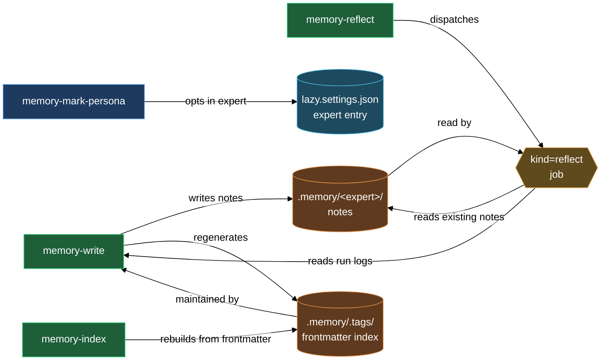

# Expert memory — notes that survive runs

Most experts are stateless across jobs: each dispatch starts fresh, each pattern re-learned. The memory subsystem changes that. An expert opted into memory carries a private notebook at `.memory/<expert>/` that travels with the repo in git. Before every job, the expert consults that notebook. During a job, it may add to it as a side-effect of its work. On a dedicated reflect pass, it reviews recent run logs, finds patterns worth keeping, and consolidates them into durable notes. Teammates can see what any expert has learned and read peer notes on shared topics.

Four skills make this work: one to opt an expert in, one to write notes atomically, one to trigger consolidation, and one to recover if the tag index drifts.

## What's in this block

**`/lazy-memory.mark-persona`** is the entry gate. It appends the memory behavior layer (`lazycortex-core:lazy-memory.persona-aspect`) to an expert's `aspects[]` in `lazy.settings.json`. After this runs, the expert's prompt gains memory obligations: it must consult `.memory/<self>/.tags/*.md` before primary work, may write notes as a side-effect of any job, and must handle `kind=reflect` dispatch. The skill is idempotent — re-running on an already-marked expert is a no-op.

**`/lazy-memory.write`** is the only blessed writer of `.memory/`. Every note goes through this skill — neither the expert nor you should write to `.memory/` directly. The skill validates note frontmatter (required fields: `title`, `tags`, `type`, `summary`; every tag must be prefixed `memory/`), picks a non-colliding slug from the title, writes the note under `.memory/<expert>/`, and regenerates the touched `.tags/` files both locally (`.memory/<expert>/.tags/<topic>.md`) and globally (`.memory/.tags/<topic>.md`). The global tag file is how other experts discover who has notes on a topic. Optionally, you (or the expert) may pass `--consolidate <log-path>…` to drop older run-log files in the same atomic operation, keeping the logs directory tidy.

**`/lazy-memory.reflect`** triggers a consolidation pass. It dispatches a `kind=reflect` job to a persona-marked expert: the job payload includes recent `.logs/claude/<expert>/*.md` run logs (last 30 days by default, configurable via `--days`) and all current `.memory/<expert>/*.md` notes. The expert reads this material, identifies patterns worth retaining, and calls `/lazy-memory.write` to create or update notes, returning `outcome=edited` (with modified note paths) or `outcome=empty` (nothing new to consolidate). You can run this manually after a burst of work, or register it as a periodic subprocess routine so it runs automatically between jobs.

**`/lazy-memory.index`** is a recovery-only tool. Under normal operation, `/lazy-memory.write` keeps the `.tags/` files in sync automatically — you never need to run `/lazy-memory.index` unless hand-edits have drifted the tree. When you do run it, it walks every expert under `.memory/`, recomputes the topic set from note frontmatter, regenerates the local and global `.tags/` trees, and removes stale tag files with no backing note.

## How they work together

The lifecycle flows in three stages.

**Stage 1 — Opt in.** Run `/lazy-memory.mark-persona <expert>`. The skill reads `lazy.settings.json`, appends `lazycortex-core:lazy-memory.persona-aspect` to the expert's `aspects[]`, and saves. From the next dispatch onward, the expert's runtime context includes the aspect's obligations — consulting memory before work, writing notes only through `/lazy-memory.write`, and handling reflect jobs.

**Stage 2 — Accumulate.** As the expert works on ordinary jobs, it may call `/lazy-memory.write` during the job to capture a pattern, rule, or fact it wants to remember. Each write is atomic: note lands, `.tags/` files update, the caller (or the expert's job script) commits both. After a few jobs you'll have a growing notebook under `.memory/<expert>/`, indexed by topic in `.memory/<expert>/.tags/`.

**Stage 3 — Consolidate.** When the notebook feels thin relative to the run log, run `/lazy-memory.reflect <expert>`. The skill dispatches a reflect job with recent logs and current notes as input. The daemon picks it up, the expert reads the material, calls `/lazy-memory.write` one or more times with consolidated insights, and returns `outcome=edited`. You collect the job (`/lazy-expert.collect-job`) and commit the new notes. Run `/lazy-memory.reflect` again periodically or wire it as a routine so consolidation happens automatically.

**Cross-expert discovery.** The global `.memory/.tags/<topic>.md` file aggregates pointers to every expert's local tag file for that topic. When one expert wants to know what a peer knows about authentication, for example, it reads `.memory/.tags/auth.md` to find who has notes there, then reads the relevant peer's `.memory/<other>/.tags/auth.md` to find the specific note paths, then reads those notes directly. All of this happens inside the expert's own job execution — reads are explicit, not ambient. No expert can write to a peer's notebook.

**Recovery.** If a hand-edit somewhere in `.memory/` leaves `.tags/` out of sync — a note's `tags:` field changed but the tag file wasn't regenerated — run `/lazy-memory.index`. It rebuilds the full tree from frontmatter and removes stale tag entries.

## Common adjustments

- **Reflect window.** By default `/lazy-memory.reflect` pulls run logs from the last 30 days. Pass `--days <N>` to widen or narrow the window. Use a longer window after a period of inactivity; use a shorter window for a high-frequency expert that produces many runs per day.

- **Periodic reflect.** Register a subprocess routine that runs `lazycortex-core memory-reflect-all` on a cycle via `/lazy-routine.register`. The CLI verb dispatches a reflect job for every persona-marked expert in sequence. The daemon drains the queue and the notes accumulate without manual intervention.

- **Consolidating log files.** Pass `--consolidate <path>…` to `/lazy-memory.write` when a note supersedes older log entries. The writer deletes those log files atomically with the note write. Only paths under `.logs/` or `.memory/` are accepted — paths outside that scope reject the entire operation.

- **Hierarchical tags.** Tags follow `memory/<topic>` and may nest — `memory/auth/oauth`, `memory/release-process`, etc. Obsidian renders nested tags as a tree under `Tags/memory/`. Keep tags consistent across an expert's notes so the tag index stays meaningful.

- **Removing a tag from a note.** Remove the tag from the note's `tags:` frontmatter field and run `/lazy-memory.write` again with the same `--slug` override. The writer regenerates `.tags/` and the now-orphaned entry disappears from both the local and global tag files.

## How the four skills compose

## See also

- [experts](experts.md) — dispatch jobs to named expert workers; aspects and arguments are configured on the same expert entries the memory skills read.
- [add-memory-to-expert](walkthroughs/add-memory-to-expert.md) — end-to-end walkthrough: opt an existing expert into memory, dispatch jobs to accumulate run logs, then run the first reflect pass.
- [runtime](runtime.md) — register a periodic routine that triggers `memory-reflect-all` automatically between jobs.
