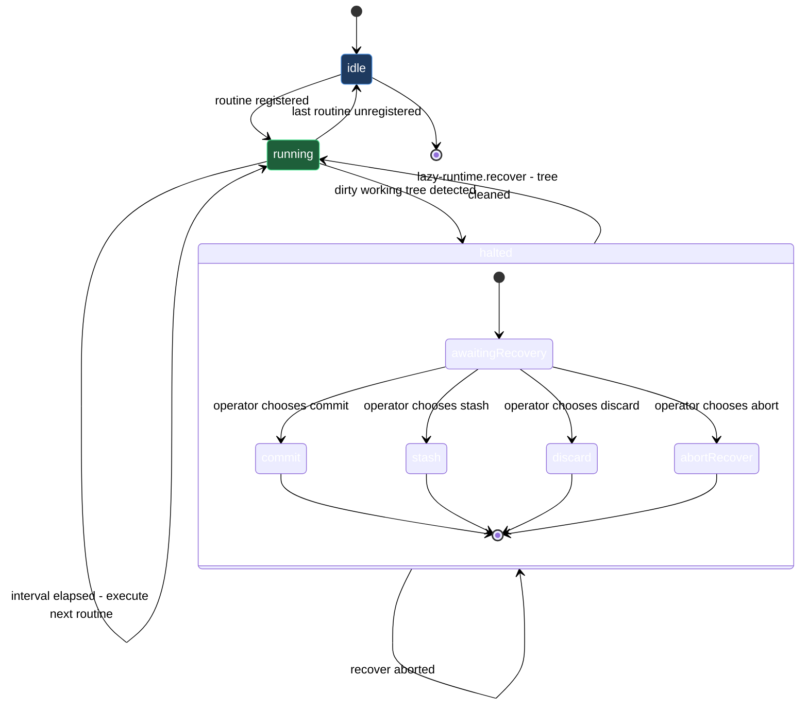

# Runtime daemon — routine management and recovery

The lazycortex-core runtime daemon is a per-repo serial loop. It reads the routine registry from `.claude/lazy.settings.json`, runs each entry in order according to its `interval_sec` (or cron expression), and repeats. Because routines execute one at a time, no two ever contend over the working tree or git state — the daemon is the single serializing authority for all background work in the repo.

Three skills manage that loop from the outside. `/lazy-routine.register` is a type-aware wizard that adds a named periodic job to the registry. It supports four routine types: `subprocess` (a periodic CLI command), `inbox` (scan a directory and dispatch one expert job per file), `schedule` (cron-driven, one fire per boundary), and `git` (watch a remote branch for changes and dispatch jobs on new commits or file changes). `/lazy-routine.unregister` removes a named routine cleanly and is idempotent — calling it on a name that does not exist is an INFO, not an error. `/lazy-runtime.recover` is the escape hatch for a halted daemon: when a routine or expert leaves the working tree dirty, the daemon halts to protect the next run; this skill reads the halt context, walks you through cleanup (commit, stash, discard, or abort), and clears the halt once the tree is clean so the daemon resumes on its next iteration.

## When you'd use this

- Add a periodic background command to the daemon — a linting pass, a sync script, a cache refresh — that runs on a fixed interval without holding up the main session.
- Wire an `inbox` directory so the daemon automatically dispatches one expert job per file that lands there, consuming the queue as files arrive.
- Set up a `schedule` routine that fires on a cron boundary (daily backup, weekly audit) rather than a polling interval.
- Watch a remote branch for new commits or file changes and trigger expert jobs automatically when the upstream moves.
- Remove a routine you no longer need, or overwrite an existing one with updated parameters.
- Unblock the daemon after a halt — get back to a clean working tree without losing changes you want to keep, or leave the daemon halted intentionally while you investigate.

## How it fits together

Routine management has a natural lifecycle. You run `/lazy-routine.register` once — typically as part of your plugin's install step — and the daemon picks up the new entry on its very next cycle without a restart. The wizard collects only the fields the chosen type needs, validates against the per-type schema, and enforces `<plugin>.<verb>` dot-namespace naming (e.g. `lazy-review.tick`). If you attempt to register a name that already exists, the skill refuses unless you pass `--force` to overwrite in one step.

When a routine is no longer needed, you run `/lazy-routine.unregister <name>` and the daemon drops it from the schedule immediately. One routine is protected: `lazy-expert.pump`, the built-in job that drains the expert queue. Removing it requires `--force` and surfaces a warning that expert jobs will stop processing until the routine is re-registered or `/lazy-core.install` is re-run.

The halt-and-recover path is a separate concern that does not require registration or unregistration. When the daemon halts, `/lazy-runtime.recover` reads `.logs/lazy-core/runtime/state.json` to surface the halt context — which routine triggered the halt, which expert and job were involved if applicable, and which paths are dirty — then asks how to clean up. You have four options: `commit` keeps the dirty changes permanently (you supply the message); `stash` tucks them into a git stash you can restore later with `git stash pop`; `discard` throws them away irreversibly; and `abort` leaves everything as-is and exits, keeping the daemon halted so you can investigate on your own schedule. Once the cleanup produces a clean tree the skill clears the `daemon_halted` block and the daemon resumes on its next iteration. If the tree is still dirty after cleanup (for example, a submodule left behind uncommitted state), the skill reports `still-dirty` without clearing the halt — run `git status` manually, resolve, and re-invoke `/lazy-runtime.recover`.

For `inbox` routines there is one extra consideration: the inbox directory must be gitignored. Inbox routines move files between iterations, and an unignored path dirties the working tree on every cycle, triggering repeated halts. The register wizard detects this automatically and offers to add the path to `.gitignore` on the spot.

## Common adjustments

- **Change a routine's configuration** — run `/lazy-routine.register <name> --force` to overwrite in one step, or run `/lazy-routine.unregister <name>` first and then re-register with the new parameters.
- **Remove `lazy-expert.pump`** — only do this if you are intentionally disabling expert job processing. Pass `--force` to `/lazy-routine.unregister lazy-expert.pump`. Run `/lazy-core.install` to restore it.
- **Recover without losing changes** — pick `stash` in the `/lazy-runtime.recover` wizard. Your dirty changes land in a git stash you can restore later with `git stash pop`. Pick `commit` if you want to keep them permanently.
- **Investigate before cleaning up** — pick `abort` in the `/lazy-runtime.recover` wizard. The daemon stays halted and no changes are made; run `git status` to inspect the dirty paths, then re-invoke `/lazy-runtime.recover` when you are ready.
- **Check daemon halt status before recovering** — inspect `.logs/lazy-core/runtime/state.json` directly to confirm halt state and read the `dirty_paths` before running the recover skill.

## Runtime lifecycle

## See also

- [install-and-audit](install-and-audit.md) — Bootstrap the daemon via `/lazy-core.install`, which writes the `lazy-core.runtime` block and optionally sets up a launchd/systemd supervisor.
- [experts](experts.md) — The async expert team whose jobs are drained by the `lazy-expert.pump` routine this block manages.
- [setup-runtime](walkthroughs/setup-runtime.md) — Bootstrap the per-repo serial daemon so the async expert team has an executor.
- [setup-routine](walkthroughs/setup-routine.md) — Register a dot-namespaced periodic routine with the runtime daemon and remove it cleanly when it is no longer needed.
