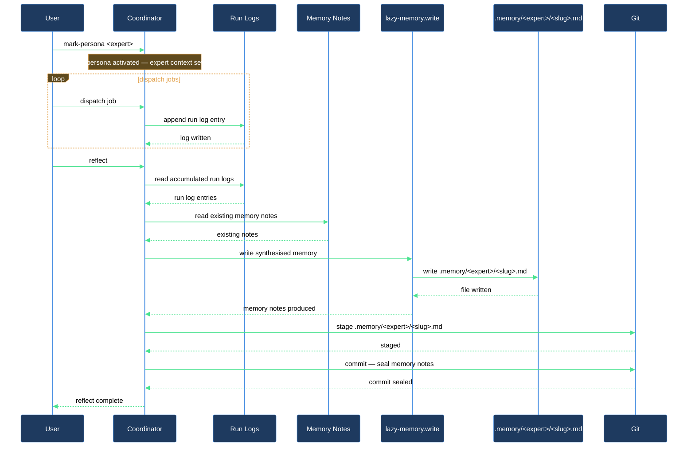

# Add long-term memory to an existing expert

Your experts already run jobs and leave run logs under `.logs/claude/<expert>/`. This walkthrough turns one of them into a persona-marked expert — one that consults its accumulated notes before primary work, writes new notes as a side-effect of jobs, and consolidates older runs into durable `.memory/<expert>/*.md` entries via reflect passes. Three skills do the work: `/lazy-memory.mark-persona` opts the expert in, `/lazy-memory.reflect` dispatches the consolidation job, and `/lazy-memory.write` (invoked by the expert itself during a reflect job) commits each note atomically.

## Outcome

After this walkthrough your expert:

- carries `lazycortex-core:lazy-memory.persona-aspect` in its `aspects[]` — meaning every future job brief prepends a read of `.memory/<expert>/` before primary work.
- has at least one `.memory/<expert>/<slug>.md` note with valid frontmatter and the expert's first consolidated learnings.
- has a populated `.memory/<expert>/.tags/` index and matching entries in the global `.memory/.tags/` aggregator.
- is ready for a weekly reflect routine that keeps memory growing automatically.

## What you need

- `lazy-core.install` has run in this repo (`.experts/` and `.memory/` exist).
- At least one expert is registered in `.claude/lazy.settings.json[experts]` and has run at least a few jobs so run logs exist under `.logs/claude/<expert>/`.
- The runtime daemon is running (`./run.sh`). If it halted, run `/lazy-runtime.recover` first.
- You know the expert's registered name (the key in `lazy.settings.json[experts]`).

## The journey

### Step 1 — Opt the expert into the memory subsystem

Run `/lazy-memory.mark-persona <expert>`, substituting the expert's registered name.

The skill appends `lazycortex-core:lazy-memory.persona-aspect` to the expert's `aspects[]` in `lazy.settings.json`. The outcome line shows the resulting aspects list. Running it a second time is a no-op (`already-marked`) — it is safe to re-run.

**Verification gate:** the outcome line should read something like:

```
expert:        <your-expert>
aspects_after: lazycortex-core:lazy-memory.persona-aspect
```

If the skill reports `<expert> is not registered in lazy.settings.json[experts]`, verify the name matches a key under `experts` in `.claude/lazy.settings.json`, then re-run.

### Step 2 — Dispatch real jobs to accumulate run logs

The reflect pass consolidates what the expert has actually done, so it needs material to work with. Dispatch a handful of representative jobs:

```
/lazy-expert.dispatch-job expert_name=<expert> payload='{"kind": "...", "role": "...", "request": "..."}'
```

Each job the daemon completes leaves a `.logs/claude/<expert>/<timestamp>.md` run log. Run `/lazy-expert.list-jobs status=done` to confirm the daemon has drained them before proceeding. Aim for at least two or three completed jobs so the reflect pass has patterns to identify.

If the expert already has a history of completed jobs in `.logs/claude/<expert>/`, you can skip fresh dispatches and proceed directly to Step 3 — the reflect skill looks back 30 days by default.

**Verification gate:** confirm run logs exist:

```
ls .logs/claude/<expert>/
```

One `.md` file per completed job should be present.

### Step 3 — Dispatch the first reflect pass

Run `/lazy-memory.reflect <expert>`.

The skill checks that the expert is persona-marked, then dispatches a `kind=reflect` job. The job payload includes recent run logs (default: 30 days back) and every existing memory note as `source[]`. The expert receives this source context, applies its persona-aspect obligations, identifies patterns worth retaining, and calls `/lazy-memory.write` once per note.

Use `--days <N>` to widen the look-back window if you want the expert to consolidate older runs:

```
/lazy-memory.reflect <expert> --days 60
```

The skill prints the dispatched job's details:

```
expert:       <your-expert>
job_id:       <uuid>
queue_path:   .experts/.jobs/<expert>/<job-id>/
source_count: <N>
```

If `source_count` is 0, the expert has no recent run logs and no existing memory; dispatch more jobs first.

If the skill reports `<expert> is not marked persona`, run `/lazy-memory.mark-persona <expert>` (Step 1) and re-try.

### Step 4 — Collect the reflect job's result

Wait for the daemon to drain the reflect job, then collect it:

```
/lazy-expert.collect-job expert=<expert> job_id=<job_id>
```

Expected `status` values:

| Status | Meaning |
|---|---|
| `pending` | The daemon has not yet picked it up — wait a moment and retry. |
| `running` | The reflect job is in flight — wait for it to complete. |
| `done`, `outcome=edited` | The expert wrote at least one note. `result[]` lists the new `.memory/<expert>/<slug>.md` paths. |
| `done`, `outcome=empty` | Nothing was worth consolidating yet. Dispatch more jobs covering the kind of work you want the expert to remember and re-run `/lazy-memory.reflect`. |
| `error` | Something went wrong — check `error_detail` in the collect output and the run log at `.logs/claude/<expert>/<timestamp>.md`. |

### Step 5 — Verify the memory tree

Once the reflect job reports `outcome=edited`, inspect what the expert wrote:

```
ls .memory/<expert>/
ls .memory/<expert>/.tags/
ls .memory/.tags/
```

Expected state:

- One or more `<slug>.md` files under `.memory/<expert>/` — each with valid frontmatter (`title`, `tags`, `type`, `summary`) and the expert's consolidated learnings as the body.
- One `<topic>.md` per tag the expert used, under `.memory/<expert>/.tags/`, listing the notes tagged with that topic.
- Matching entries in the global `.memory/.tags/` aggregator, pointing at the per-expert tag file.

To check the frontmatter of a specific note:

```
/lazy-core.audit
```

`lazy-core.audit` reports any memory-hygiene findings (missing required fields, malformed tags) under its "Memory hygiene" section.

### Step 6 (optional) — Commit the new notes

`lazy-memory.write` writes files atomically but does not commit. Commit the notes when you are satisfied:

```
git add .memory/<expert>/
git commit -m "memory(<expert>): first reflect pass — <summary of what was retained>"
```

### Step 7 (optional) — Schedule periodic reflection

To have the daemon consolidate memory automatically without manual triggers, register a weekly routine:

```
/lazy-routine.register name=lazy-memory.reflect-all command='["lazycortex-core", "memory-reflect-all"]' interval_sec=604800
```

This fires every 7 days, dispatching one reflect job per persona-marked expert across the repo. Use `/lazy-routine.unregister name=lazy-memory.reflect-all` to remove it.

## After you're done

The expert now reads its memory notes at the start of every job. As it handles more work, the memory grows — either via notes the expert writes inline during regular jobs or via periodic reflect passes you trigger manually or via the routine above. When the expert writes a note (via `/lazy-memory.write`), tag files in `.memory/<expert>/.tags/` and `.memory/.tags/` update automatically; you do not need to rebuild the index unless you hand-edit notes (in which case run `/lazy-memory.index <expert>` to repair).

To extend memory to another expert, start again at Step 1 with the new expert's name.

## How memory grows over time



