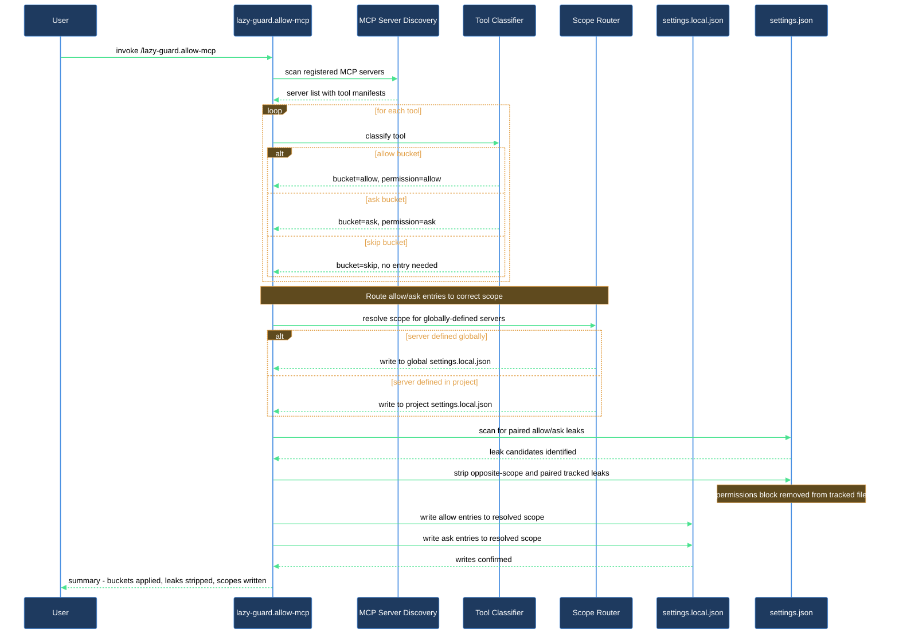

# Register a new MCP server

Every time you add a new MCP server, Claude Code greets you with a fresh round of permission prompts — one per tool, per session, until you tell it what to trust. `/lazy-guard.allow-mcp` does that registration in a single run: it finds every tool the server exposes, classifies each one into the right bucket, and writes the results directly into your settings file.

## What you need

- `lazycortex-core` installed and the plugin enabled in `~/.claude/settings.json`.
- The new MCP server already defined in `~/.mcp.json` (global) or `./.mcp.json` (project) and loaded in the current Claude Code session. If you just added the server definition, restart Claude Code first so the tools are live — the skill enumerates only tools it can see in the active session.
- Python 3 available on your `$PATH` — the bundled `lazy-guard.settings.py` hook that guards settings writes requires it.

## The flow

### Step 1 — Run the skill

```
/lazy-guard.allow-mcp <server-name>
```

Replace `<server-name>` with the name you used in `.mcp.json` — for example, `context7`, `git`, or `brave-search`. To register every discovered server at once, pass `all` or leave the argument empty.

### Step 2 — The skill discovers and classifies tools

The skill reads your `.mcp.json` files to locate the server, then inspects every tool currently available in the session whose name matches `mcp__<server>__*`. Each tool lands in exactly one of three buckets:

- **Allow** — safe or trivially reversible operations (reads, searches, staging, branch creation). These go into `permissions.allow`; Claude Code will never prompt for them again.
- **Ask** — truly destructive operations (deletions, force-pushes, working-tree resets). These go into `permissions.ask`; Claude Code prompts on every call.
- **Skip** — medium-risk operations (for example, `git_commit`). These are written to neither list. Claude Code uses its built-in per-call prompt and you decide in context.

The classifier works at the tool level, not the server level. A read-shaped tool on a "dangerous" server still goes to allow; a destructive tool on a "safe" server still goes to ask. When a tool's shape is ambiguous, the skill defaults to skip — it never silently allows an unknown-shape mutation.

### Step 3 — Choose a scope, if asked

If the server is defined in `~/.mcp.json` (global), the skill first checks whether you have already registered any of its tools at the global or project scope:

- If existing entries are found at one scope only, the skill routes there silently — no question.
- If entries exist at both scopes, the skill asks which one to treat as authoritative.
- If no prior entries exist, the skill asks once: **Global** (covers every project on this machine, written to `~/.claude/settings.local.json`) or **Project only** (this repo only, written to `./.claude/settings.local.json`). The default recommendation is Project only — smaller blast radius and easy to revert.

If the server is defined in `./.mcp.json` (project-local), the skill always routes to `./.claude/settings.local.json` without asking. If everything is already registered at the inferred scope, the skill skips this question entirely and reports a no-op.

### Step 4 — Review the preview and confirm

Before writing anything, the skill prints a diff-style preview:

```
./.claude/settings.local.json  (settings.local.json — gitignored)
  allow:
    + mcp__context7__resolve-library-id     # new
    + mcp__context7__get-library-docs        # new
  ask:
    + mcp__context7__<destructive-tool>     # new
  skip (not written — Claude Code prompts per call):
    mcp__context7__<medium-risk-tool>
  notes:
    mcp__context7__<safe-tool> is in ask but classified as allow — left as-is (stricter than default)
```

If any tool that was previously in `allow` is now classified as destructive, the skill asks about each one individually before the bundled confirmation — it never moves a prior trust choice without your explicit go-ahead. If a tool is already in `ask` but the classifier would put it in `allow`, the skill surfaces an info note and leaves it alone — a stricter-than-default pin is a valid choice.

Skip-bucket tools you pinned in a prior run (moved to `allow` or `ask` by hand or a past run) are never touched or re-asked. Your pin stands.

### Step 5 — Cross-scope leaks are cleaned up

The skill checks two places for entries that ended up in the wrong file:

**Paired tracked `settings.json`.** Permission entries should live in `settings.local.json`, not in the tracked settings file your teammates inherit. If any `mcp__<server>__*` entries are still sitting in the paired tracked `settings.json`, the skill surfaces each one and asks whether to remove it. You confirm each removal individually; anything you choose to keep is noted in the final report.

**Opposite-scope `settings.local.json`.** If the server is routed to project scope but a global local file also contains entries for it (or vice versa), those wrong-scope entries are surfaced and removed the same way — one per-entry question, one confirmation.

### Step 6 — Optionally install the SessionStart preload hook

After the permission write, the skill asks whether you want a SessionStart hook that tells the agent to preload the server's tool schemas at session start.

Without this hook, MCP tool schemas are loaded on demand — every call that the agent hasn't seen yet requires a `ToolSearch` round-trip first. That asymmetry with always-loaded tools like `Bash` causes the agent to drift toward shell equivalents even when a rule says not to. The preload hook pays roughly 1.1k tokens once at session start and makes MCP tools first-class for the rest of the session. The alternative (turning off deferred loading entirely with `ENABLE_TOOL_SEARCH=false`) loads every tool upfront and costs 13–16k tokens per session — significantly more expensive.

You choose the scope (global or project) and the skill writes it to the same gitignored `settings.local.json` — it never touches tracked settings. If you decline, the skill re-asks on subsequent runs (a past decline is not treated as permanent).

### Step 7 — Read the result summary

The skill prints a table showing, for each server: how many tools went to allow, how many to ask, how many were skipped, any promotions from allow to ask, tracked-file and wrong-scope entries removed, and whether the preload hook was installed.

## After you're done

All entries are written to a gitignored `settings.local.json`, so your permission choices stay on this machine and never land in commits. If you later add tools to the server, re-run `/lazy-guard.allow-mcp <server-name>` — the skill is idempotent and only adds what is missing.

If a server was defined but had zero tools in the session, the skill warns you and skips it. Restart Claude Code so the server loads, then re-run.

## How the skill routes each tool


