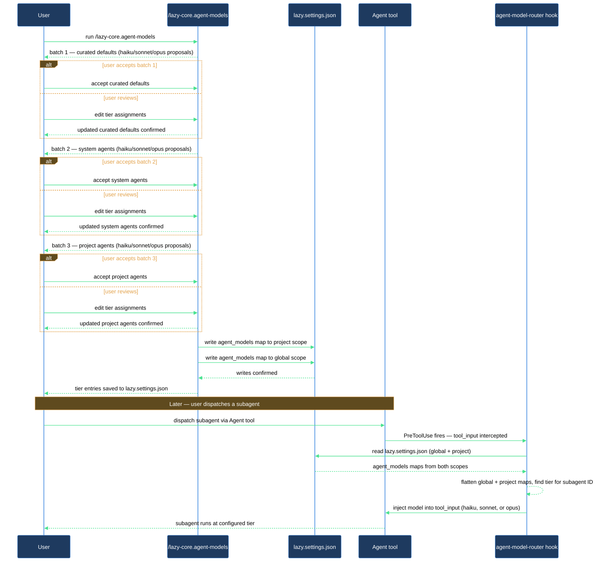

# Control which model each agent uses

Every time Claude Code dispatches a subagent — a scan, a planner, a distiller — it uses a model. Without explicit routing, every agent runs at whatever tier the caller inherits, which is often the most capable (and most expensive) one available. Most agents do not need that. A log-distiller is mechanical; a code-reviewer is not. Misrouting burns budget and, paradoxically, can reduce quality when a heavy model adds prose where a fast one would have been precise.

`/lazy-core.agent-models` walks you through assigning a tier to every dispatchable agent in your vault. The companion hook (`agent-model-router`) then intercepts every `Agent` dispatch and silently injects the right model — no per-call overhead, no manual flags.

## What you need

- `lazycortex-core` installed and enabled in `~/.claude/settings.json`.
- Claude Code restarted at least once after installation so the `agent-model-router` PreToolUse hook is active.
- A git repo as the working directory (the skill reads project-local config from `.claude/`).

## The flow

### Step 1 — Run the wizard

Type `/lazy-core.agent-models` and wait for it to start. The skill discovers every dispatchable agent across four sources: built-ins (`Explore`, `Plan`, `general-purpose`, `statusline-setup`), global user agents (`~/.claude/agents/*.md`), project agents (`./.claude/agents/*.md`), and plugin-shipped agents. It then cross-checks against the `agent_models` section in your `lazy.settings.json` files and builds a list of entries that have no routing decision yet. Agents already set to any tier — including `default` — are excluded; only genuine gaps surface.

If every agent already has an entry, the skill exits immediately with `nothing to do`.

### Step 2 — Work through the batch prompts

Missing entries arrive in three ordered batches:

**Batch 1 — Curated defaults.** Built-in agents and LazyCortex plugin agents whose recommended tier is pre-defined. The skill shows you a table of each agent alongside its suggested tier and destination file. Accepting the whole batch is usually the right call here; the suggestions are conservative and based on each agent's structural role.

**Batch 2 — System and other plugin agents.** Agents from non-LazyCortex plugins or user-global agents not covered by batch 1. Suggested tiers come from a heuristic: names containing words like `log`, `distill`, `tag`, or `timeline` with mechanical descriptions default to `haiku`; names like `review`, `audit`, or `design` default to `opus`; everything else defaults to `sonnet`.

**Batch 3 — Project agents.** Agents that live in your project's `.claude/agents/`. Same heuristic as batch 2. The suggested tier is shown alongside the destination — these route to your project-level `.claude/lazy.settings.json` by default.

For each batch you choose one of four responses: accept all suggestions, review each agent individually, mass-set the whole batch to `default` (useful when you want a batch off the prompt list but do not care about tier-tuning it yet), or skip the batch to decide later.

### Step 3 — Review individually (optional)

If you picked "review each individually" for any batch, the skill loops through those agents one at a time. Each prompt shows the agent's description, the suggested tier with its rationale, the destination file, and four options: add at the suggested tier, add as `default`, add at the nearest alternate tier, or skip.

`default` means the agent inherits whatever tier the harness or caller provides — it is the right choice when an agent does not need a project-specific override.

### Step 4 — Writes and report

After the last batch, the skill groups all planned entries by destination file and writes them. It never overwrites existing entries — only fills gaps. The final report shows a table of how many entries were added and skipped per destination, plus one line per added entry.

If you passed `--dry-run`, no files are touched — the report shows what would have been written.

### Step 5 — Verify routing is live

The `agent-model-router` hook is already wired in as a `PreToolUse` hook for the `Agent` tool. It loads both `lazy.settings.json` files (project takes precedence per group on key collisions), flattens the `agent_models` map, and checks the dispatch string on every `Agent` call. When it finds a match, it injects `model` into the tool input before the call goes through — no action needed on your part.

One edge case: if the caller already sets a `model` on the dispatch and that value is different from the configured tier, the caller wins. The hook only acts when the field is absent or the `LAZY_AGENT_MODEL_FLOOR` environment variable applies a stricter ceiling.

## After you're done

Re-run `/lazy-core.agent-models` any time you add new agents. It is fully idempotent — agents that already have entries are excluded from the wizard, so only genuinely new gaps surface. If `/lazy-core.audit` reports missing `agent_models` entries, that is the same signal.

To override a single project's tier without touching global config, run `/lazy-core.agent-models --scope=project`. All answers will write to `./.claude/lazy.settings.json` regardless of each agent's home scope, letting you tune cost/quality for one repo while leaving global defaults untouched.

## How model routing works end-to-end

