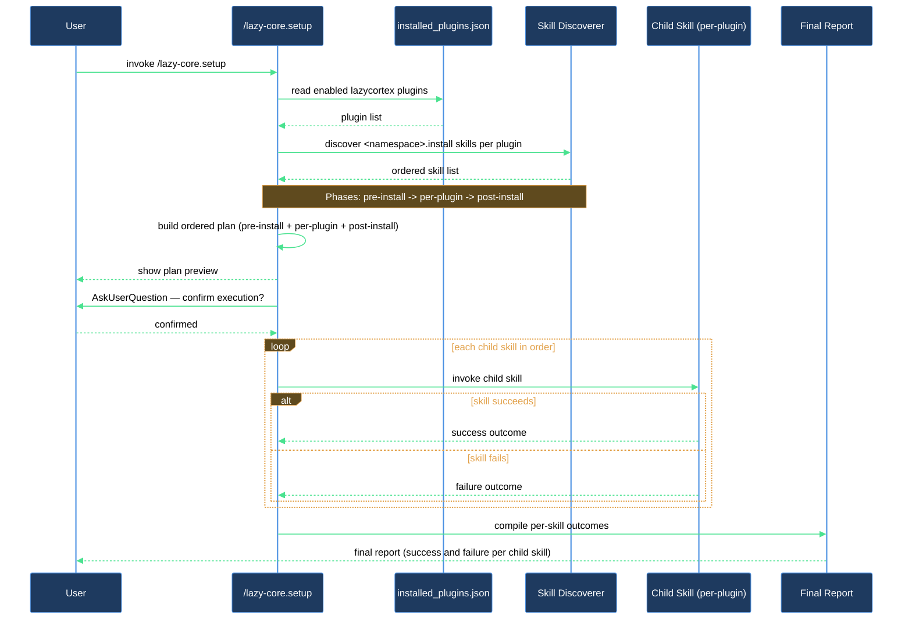

# I just enabled several lazycortex plugins — how do I install them all at once?

When you enable multiple lazycortex plugins and restart Claude Code, none of their project-level artifacts (rule templates, settings scaffolds, configurators) are wired into your project yet. `/lazy-core.setup` is the single command that closes that gap: it reads which plugins are enabled, locates each plugin's install skill, sorts them into the right execution order, shows you the plan, asks once for confirmation, and runs each installer in sequence. You end up with every plugin fully bootstrapped in one go.

## What you need

- At least one lazycortex plugin enabled in `~/.claude/settings.json` and installed via `/plugin update` (so its cache is present and listed in `~/.claude/plugins/installed_plugins.json`).
- Claude Code restarted after enabling the plugin(s) so the skills are available.
- A git-tracked project directory as your working directory (the installers write files relative to it).

## The flow

### Step 1 — Run the command

Type `/lazy-core.setup` in the Claude Code prompt. The skill immediately creates a task checklist so no step can be silently skipped, then moves to discovery.

If you want to see what would run without committing to it, pass the flag: `/lazy-core.setup --dry-run`. The plan renders and the skill stops before asking for confirmation.

### Step 2 — Review the discovery report

The skill reads `~/.claude/plugins/installed_plugins.json` to identify your enabled plugins, then follows each entry's `installPath` to locate skills whose directory name ends in `.install`. It also scans for any skill whose frontmatter declares `lazy_setup_phase:` — these are cross-cutting configurators that opt in without an edit to the core skill. You'll see a one-line summary:

```
discovered: N skills (M install + K configurator)
```

If the count is zero (no enabled plugin ships an install skill), the skill reports `nothing-to-do` and exits without prompting.

### Step 3 — Read the preview

Before asking for confirmation, the skill prints the full ordered plan grouped by phase:

```
pre-install:
  (none)
per-plugin:
  • lazycortex-core:lazy-core.install
  • lazycortex-log:lazy-log.install
  • lazycortex-obsidian:lazy-obsidian.install
post-install:
  • lazycortex-core:lazy-guard.allow-mcp
  • lazycortex-core:lazy-core.agent-models
```

`lazy-core.install` always runs first among the per-plugin installers because it seeds `lazy.settings.json`, which later installers read. Everything else runs alphabetically within its phase.

### Step 4 — Confirm once

A single question appears: "Run the planned setup chain (N skills across pre-install / per-plugin / post-install)?" Answer `run` to proceed or `abort` to stop. If you abort, nothing has been written — re-run whenever you're ready.

### Step 5 — Watch each child run

Each installer runs in sequence. Child skills own their own interactivity: if an installer has its own confirmation prompts or sub-questions, those appear inline. If one child fails, the skill logs the failure and continues with the rest rather than stopping — so you get a complete result even when one installer hits a problem.

### Step 6 — Read the final report

After all children finish, the report lists every child under one of three headings: ran successfully, failed, or skipped. A failed child shows the reason verbatim. If anything failed, the report ends with:

```
Re-run /lazy-core.setup after fixing — idempotent.
```

Fix the reported issue and re-run. Children that already succeeded the first time will complete quickly (they are individually idempotent) and the failed one gets another chance.

## After you're done

Every enabled plugin is now bootstrapped for the current project. You can verify the result by running `/lazy-core.doctor`, which checks that all expected rule files, agents, and settings scaffolds are in place. If you later enable another plugin or run `/plugin update`, re-run `/lazy-core.setup` — it is safe to run as many times as needed.

## How the run unfolds


