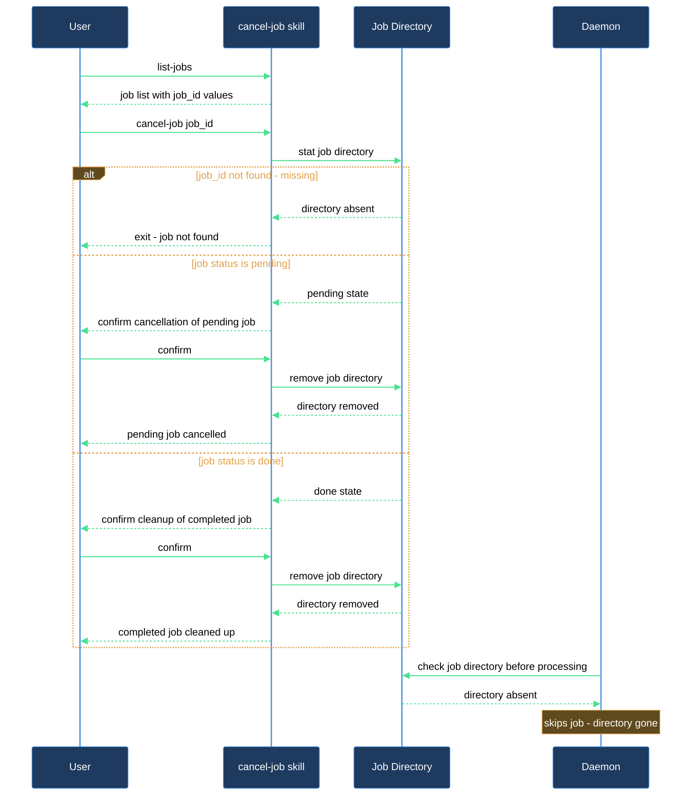

# I dispatched an expert job I no longer need — how do I stop it?

This walkthrough is for anyone who submitted a job via `/lazy-expert.dispatch-job` and wants to pull it back before the runtime daemon picks it up (or while it is running). `/lazy-expert.cancel-job` removes the job directory; `/lazy-expert.list-jobs` helps you confirm the `job_id` first if you don't have it handy.

## What you need

- `lazycortex-core` installed in this repo (`/lazy-core.install` run at least once with the expert runtime enabled).
- The `.claude/experts/.jobs/` directory present — created during install. If it is absent, run `/lazy-core.install` and enable the expert runtime when prompted.
- The `job_id` of the job you want to cancel, or enough information to find it with `/lazy-expert.list-jobs`.

## The flow

### Step 1 — Find the job_id (skip if you already have it)

Run `/lazy-expert.list-jobs` to see everything currently in the queue:

```
/lazy-expert.list-jobs
```

The output is a table of `expert`, `job_id`, `status`, and `age_sec`. Jobs with status `pending` have not yet been completed by the daemon. To narrow the view, pass a filter:

```
/lazy-expert.list-jobs status=pending
/lazy-expert.list-jobs expert=<expert-name>
```

Note the `job_id` for the job you want to cancel.

### Step 2 — Cancel the job

Run `/lazy-expert.cancel-job` with the expert name and job id:

```
/lazy-expert.cancel-job <expert_name> <job_id>
```

Both arguments are required. If either is missing the skill will abort immediately and tell you which one to supply.

### Step 3 — Confirm when prompted

The skill checks the current state of the job and asks for confirmation before deleting anything:

- **Pending job** (no `DONE` marker yet): you will be asked "Job `<job_id>` is pending — the runtime daemon may be processing it. Cancel anyway?" Answer Yes to proceed or No to leave it in place.
- **Done job** (`DONE` marker present): you will be asked "Job `<job_id>` is already done. Remove it anyway?" This is a cleanup confirmation, not a cancellation.

If the job directory does not exist at all, the skill reports "Job `<job_id>` not found" and exits without prompting.

If you answer No at either prompt, no files are touched and the job stays in its current state.

### Step 4 — Verify

After a successful cancellation the skill prints "Job `<job_id>` cancelled." Run `/lazy-expert.list-jobs` again if you want to confirm the entry is gone.

## After you're done

The job directory has been removed. If the daemon was already mid-flight on the job it will encounter a missing directory and skip gracefully. If you need the work done after all, re-dispatch it with `/lazy-expert.dispatch-job`.

## How cancellation works


