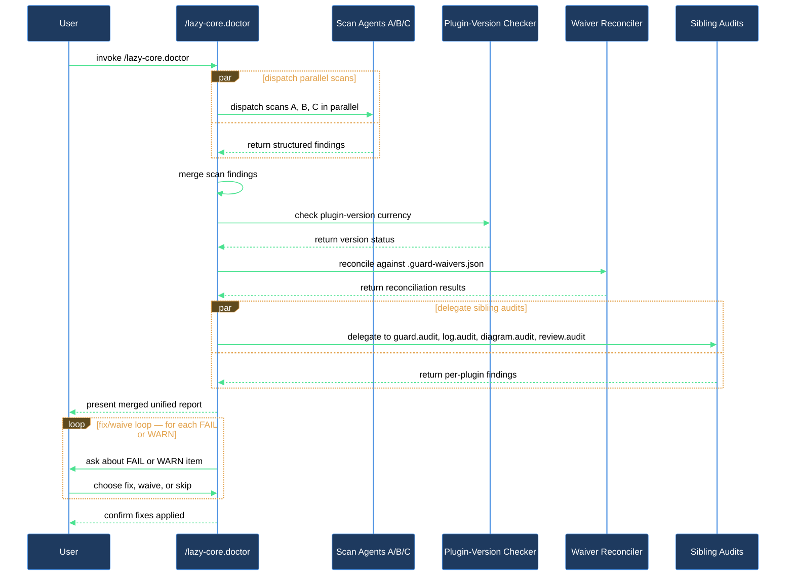

# Diagnose project config

When something feels off in your Claude Code setup — a skill that won't load, a rule you expected to fire that didn't, settings you're not sure belong where they are — `/lazy-core.doctor` is the starting point. It reads everything that matters (rules, agents, skills, commands, settings, memory, hooks, CLAUDE.md) and gives you one report covering all of it.

Doctor never changes anything without your say-so: it collects all findings first, presents them, then asks which fixes to apply.

## What you need

- `lazycortex-core` enabled in `~/.claude/settings.json` and Claude Code restarted at least once after enabling.
- A git repo (most checks are git-aware; doctor still runs outside one, but some checks are skipped).
- Python 3 on your `PATH` (required only if you have hook scripts — the hook-import checks need it).
- Optional: `lazycortex-log`, `lazycortex-diagram`, or `lazycortex-review` enabled if you want those coverage checks folded into the same report. Doctor skips them silently when they're not installed.

## The flow

**1. Run the skill.**

```
/lazy-core.doctor
```

Doctor starts by detecting whether this repo authors plugins (local tool mode) or consumes them (release mode). In local tool mode it also scans the plugin source tree under `claude/`; in release mode it focuses on the installed copies under `.claude/`.

**2. Wait for the parallel scan to finish.**

Behind the scenes, doctor dispatches three read-only agents at the same time:

- **Agent A** checks artifact integrity: rules frontmatter, agent and skill definitions, namespace format, hook scripts, plugin-rule drift versus installed sources, and `lazy.settings.json` validity.
- **Agent B** checks config and memory: all four settings files for leakage and JSON validity, the always-loaded context budget across CLAUDE.md and unscoped rules, your memory index for broken links and unindexed files, CLAUDE.md for oversized content and missing references, hooks for missing scripts and undeclared imports, and every MCP server entry for wildcard permission entries and destructive tools sitting in the `allow` list.
- **Agent C** checks path hygiene: grepping every config file for hardcoded `/Users/` paths, `<project>/` prefixes, and user-specific home subdirectories.

All three run at once. You will see their results after they all return.

**3. Doctor checks plugin version currency.**

After the parallel agents finish, doctor compares each installed plugin's version against the latest from its marketplace (a live `git fetch` with a 5-second timeout). If a plugin is outdated you will see a WARN. If the network is unreachable it falls back to the cached manifest and logs an INFO note.

In release mode, content-level findings on rules owned by an outdated plugin are suppressed — upgrading will overwrite those files, so chasing the content issues first is noise. You will see a summary line telling you how many findings were suppressed and which plugin to upgrade.

**4. Waivers are applied.**

Doctor loads any WARN findings you have permanently waived from previous runs and moves them out of the main issue list into a collapsed "Waived (N)" section. Waivers are stored per-finding in a `doctor.waivers/` directory inside your project memory folder, not in `.guard-waivers.json`. FAIL findings are never suppressed by waivers.

**5. Delegated audits run (if plugins are installed).**

Doctor folds in results from sibling skills when they are available:

- `lazy-guard.check-public` — runs when `.guard-waivers.json` exists at the repo root. Surfaces secret, PII, and path findings.
- `lazy-log.audit` — runs when `lazycortex-log` is installed. Surfaces logging-coverage gaps.
- `lazy-diagram.audit` — runs when `lazycortex-diagram` is installed.
- `lazy-review.audit` — runs when `lazycortex-review` is installed.
- **Expert runtime** — runs inline (no separate plugin needed) when `experts.settings.json` or a `lazy-core.runtime` section in `lazy.settings.json` is present. Checks queue integrity, job directory layout, registered routine commands, and daemon liveness. Results appear in a "Loop runtime" subsection.

If none of these plugins are present and no expert runtime is configured, this step is silent.

**6. Read the health report.**

The report opens with a summary line: `PASS: N | WARN: N | FAIL: N | Waived: N`. Each issue follows as a labelled section with a one-line description and a suggested fix. FAIL findings require action before the config is trustworthy; WARN findings are degraded state worth fixing but not immediately broken.

Common things doctor finds on a first run:

- A rule file with no `paths:` scope and no `always_loaded:` waiver (it loads on every turn whether or not it's needed).
- The always-loaded context budget exceeding 20 KB — the sum of every unscoped rule plus both CLAUDE.md files, which hits every session's token budget. Doctor lists the per-file breakdown so you know what to cut.
- A `permissions.allow` block inside tracked `settings.json` instead of the gitignored `settings.local.json` (your permission choices leak to anyone who clones the dotfiles or repo).
- An MCP permission entry using a wildcard (`mcp__github__*`) that Claude Code never actually matches — wildcards in MCP permission strings are silently ignored, so the intended allow or ask never fires.
- A destructive MCP tool sitting in `permissions.allow` that should require per-call confirmation.
- A memory file that exists on disk but isn't linked from `MEMORY.md`.
- A hook script that imports a third-party module not listed in any dependency manifest.
- `lazy.settings.json` missing at both scopes, which means agent-model routing is disabled entirely.

**7. Apply confirmed fixes.**

After the report, doctor lists which fixes it can apply automatically and asks `Apply all auto-fixable? [y/N]`. You can apply all at once or pick individually.

Fixes doctor applies directly include: adding missing frontmatter to rule files, migrating permissions out of tracked settings, fixing memory index links, appending missing gitignore patterns, and replacing hardcoded paths.

Fixes doctor does not apply automatically: oversized rules (it points you to `/lazy-core.optimize`), rule drift from a plugin source (it points you to `/<namespace>.install`), MCP permission reclassification (it points you to `/lazy-guard.allow-mcp <server>`), and anything surfaced by a delegated sibling audit (it points you to that skill).

If the report includes Loop runtime findings, doctor offers three conditional fix prompts:

- **Daemon stalled** — offers to restart the runtime daemon via the OS supervisor (launchctl on macOS, systemctl on Linux). Doctor verifies the daemon is live again before declaring success.
- **Orphan job directories** — offers to delete job directories under `.jobs/` for experts that are no longer registered in `experts.settings.json`.
- **Unresolvable routine command** — for each routine whose command path doesn't exist, offers to unregister it from `lazy-core.runtime`. Each routine gets its own prompt; nothing is removed silently.

**8. Handle any remaining WARNs.**

For each WARN that was not fixed, doctor asks whether to skip it for now or waive it permanently. A permanent waiver is written to a `doctor.waivers/` file in your project memory folder — future runs suppress that finding without further prompting. FAIL findings are never offered a waiver; they need to be resolved.

If you waive permanently, doctor confirms the write location before writing. To un-waive later, delete the corresponding file from `doctor.waivers/` and the finding reappears on the next run.

## After you're done

If the report pointed you at specific next steps, run them in order:

- `/lazy-core.optimize` — if rules are oversized or the always-loaded budget is over 20 KB.
- `/lazy-core.agent-models` — if `lazy.settings.json` was missing or had orphan entries.
- `/<namespace>.install` — if a plugin's rule files have drifted from their source (e.g. `/lazy-core.install`, `/lazy-log.install`).
- `/lazy-guard.allow-mcp <server>` — if MCP permission entries were wildcarded or misclassified.
- `/lazy-guard.check-public` — if the Guard subsection had FAIL findings and you want the interactive fix flow.
- `/lazy-core.doctor` again — after upgrades or installs, to confirm the config is clean.

## How the health check works


