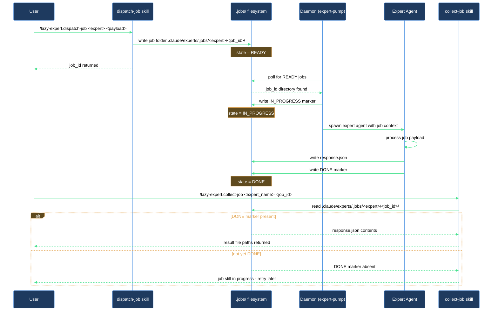

# I dispatched an expert job — how do I get the result?

This walkthrough covers the two-step pattern for offloading work to the expert runtime: submitting a job with `/lazy-expert.dispatch-job` and retrieving the result with `/lazy-expert.collect-job`. The runtime daemon (`expert-pump`) runs in the background, drains the queue, and writes the result to disk — you collect it whenever it is ready.

## What you need

- `lazycortex-core` installed in the repo (`/lazy-core.install` completed).
- The expert runtime enabled — `.claude/experts/` directory is present and `run.sh` exists. If not, re-run `/lazy-core.install` and answer yes to the expert runtime wizard phase.
- The daemon running: start it with `./run.sh` from the repo root.
- The expert name you want to target — check `experts.settings.json` for the list of configured experts.

## The flow

### Step 1 — Dispatch the job

Run `/lazy-expert.dispatch-job` and pass three required fields:

- `kind` — the job type the expert handles (e.g. `doc-review`).
- `role` — the expert persona to use (e.g. `designer`).
- `request` — a plain-text description of what you want done (e.g. `Review docs/api.md`).

Example invocation:

```
/lazy-expert.dispatch-job {"kind": "doc-review", "role": "designer", "request": "Review docs/api.md"}
```

The skill validates the payload and writes the job to `.claude/experts/.jobs/<expert_name>/<job_id>/`. It then prints:

```
job_id:     <job_id>
queue_path: .claude/experts/.jobs/<expert_name>/<job_id>/
```

Note both the `expert_name` and the `job_id` — you need them in Step 3.

If the skill aborts with "payload missing required field(s)", add the named field(s) and retry. If it aborts with "`.claude/experts/` not initialised", run `/lazy-core.install` first.

### Step 2 — Wait for the daemon to process it

The `expert-pump` routine in the running daemon picks up `READY` jobs, spawns the expert agent, and writes `response.json` plus a `DONE` marker when it finishes. You do not need to do anything — just wait.

How long depends on what the expert does. For a quick doc review this is usually under a minute; for heavier tasks it may take several minutes.

### Step 3 — Collect the result

Run `/lazy-expert.collect-job` with both the `expert_name` and the `job_id` from Step 1:

```
/lazy-expert.collect-job {"expert_name": "<expert_name>", "job_id": "<job_id>"}
```

The skill checks the job directory for the `DONE` marker and prints the outcome:

- `status: pending` — the daemon has not finished yet. Wait and retry.
- `status: done` — the job succeeded. The skill also prints the result file paths:

  ```
  result files (Read these to retrieve output):
    - <path>
    - <path>
  ```

- `status: failed` — the expert agent encountered an error. The skill prints the error message from `response.json`.
- `status: missing` — the job directory was not found. Verify both the `job_id` and `expert_name` are correct; if you need the expert name, check `.claude/experts/.jobs/` directly.

### Step 4 — Read the result files

Once the status is `done`, read each file path the skill printed. The expert writes its output to those paths — the exact files depend on the `kind` and `role` you specified.

## After you're done

The job directory remains in `.claude/experts/.jobs/` — it is not cleaned up automatically. If you have multiple jobs in flight, run `/lazy-expert.list-jobs` to see their statuses at a glance. To cancel a job you no longer need before the daemon picks it up, run `/lazy-expert.cancel-job <job_id>`.

## How the job moves through the queue


