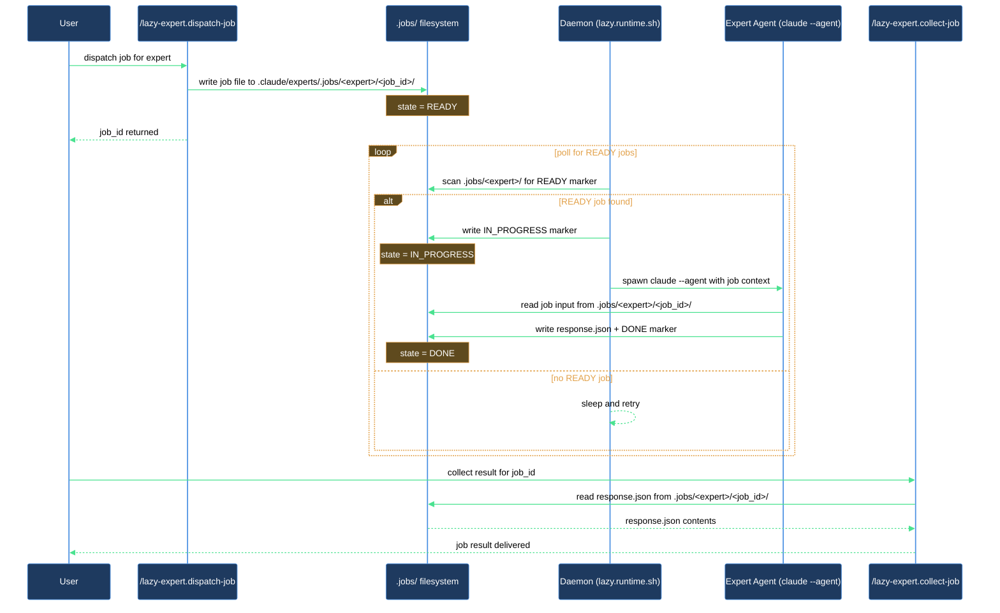

# How do I offload a long-running task to a Claude agent without hitting the subagent nesting limit?

Claude Code enforces a subagent nesting depth limit. When an agent dispatches another agent that in turn dispatches more agents, the chain hits the ceiling and the innermost calls fail. The expert runtime sidesteps this by moving long-running work out of the active session entirely: jobs land in a file queue, and a standalone daemon process drains them outside of any nesting context. This walkthrough covers the full setup — from running `/lazy-core.install` through collecting a finished result.

## What you need

- `lazycortex-core` enabled in `~/.claude/settings.json` and the plugin cache populated (run `/plugin update lazycortex-core@lazycortex` if you have not already).
- A git repository — the expert runtime is scoped per repo.
- Python 3 available on your `$PATH` (the daemon and runtime scripts are Python).
- At least one agent file with an `expert_protocol:` frontmatter field registered somewhere the wizard can discover it (plugin cache, `~/.claude/agents/`, or `.claude/agents/`). If none exist the wizard skips registration; you can re-run `/lazy-core.install` after adding agents.

## The flow

### Step 1 — Run `/lazy-core.install` inside the repo

Open a Claude Code session in the target repository and run:

```
/lazy-core.install
```

The skill detects your install scope automatically. Because the expert runtime is project-scoped, run it inside the repo rather than globally.

### Step 2 — Answer yes to the expert runtime wizard

During the install, the wizard asks whether to scan for expert candidates and register them. Answer **Yes**. The skill:

- Creates `.experts/experts.settings.json` with the registered expert entries.
- Copies the `lazy.runtime.sh` shim to `.claude/bin/` and makes it executable.
- Adds the `lazy-core.runtime` block to `.claude/lazy.settings.json`.
- Appends `.experts/.jobs/` and `.logs/lazy-core/runtime/` to `.gitignore`.
- Registers the `lazy-expert.pump` routine in `lazy.settings.json`.

If the pump routine was freshly registered (i.e., at least one expert was added), the wizard immediately offers to install a daemon supervisor. Choose **macOS launchd** or **Linux systemd** if you want the daemon to start automatically, or **Skip** if you prefer to start it manually.

### Step 3 — Start the daemon

If you chose a supervisor in Step 2, the daemon is already running. If you skipped the supervisor, start it manually from the repo root:

```
./.claude/bin/lazy.runtime.sh
```

The shim resolves the latest `lazycortex-core/bin/runner` from the plugin cache at exec time, so you do not need to update it after `/plugin update`. The daemon reads `lazy.settings.json[lazy-core.runtime]`, runs the `lazy-expert.pump` routine on its configured interval (default: 5 seconds), and drains any `READY` jobs it finds.

### Step 4 — Dispatch a job

Run `/lazy-expert.dispatch-job` with three required payload fields:

- `kind` — the protocol kind the expert handles (e.g. `doc-review`).
- `role` — the role the expert should adopt (e.g. `designer`).
- `request` — a description of the work to perform (e.g. `Review docs/api.md for clarity`).

Example:

```
/lazy-expert.dispatch-job
expert_name: doc-reviewer
payload:
  kind: doc-review
  role: designer
  request: "Review docs/api.md for clarity and completeness"
```

The skill validates the payload against the protocol contract, writes the job to `.claude/experts/.jobs/<expert_name>/<job_id>/`, and returns:

```
job_id:     <job_id>
queue_path: .claude/experts/.jobs/doc-reviewer/<job_id>/
```

Note the `job_id` — you will need it to collect the result.

### Step 5 — Wait for the daemon to process the job

The daemon polls on its `polling_interval_sec` (default: 5 seconds). When it picks up the job, it spawns a `claude --agent` process for the registered expert, waits for it to finish, and writes `response.json` plus a `DONE` marker to the job directory.

You do not need to watch this step. Move on when you are ready to check the result.

### Step 6 — Collect the result

Run `/lazy-expert.collect-job` with the expert name and the job_id from Step 4:

```
/lazy-expert.collect-job
expert_name: doc-reviewer
job_id: <job_id>
```

The skill returns `{status, response}`:

- `status: pending` — the daemon has not finished yet; run again after a moment.
- `status: done` — the job completed. The result file paths are listed; `Read` them to retrieve the output.
- `status: failed` — the expert agent returned an error; the failure message is included.
- `status: missing` — no job with that ID exists under the named expert; verify the `job_id` and `expert_name`.

## After you're done

The daemon continues running and will drain any further jobs you dispatch. You can dispatch multiple jobs in sequence or in parallel — the daemon processes them serially per expert so there is never contention over the working tree. Use `/lazy-expert.list-jobs` to see all queued, running, and completed jobs at a glance.

If you registered additional experts later, re-run `/lazy-core.install` — the wizard's expert-add phase picks up newly discovered agent files without touching existing registrations (it is idempotent).

## How a job moves through the runtime


