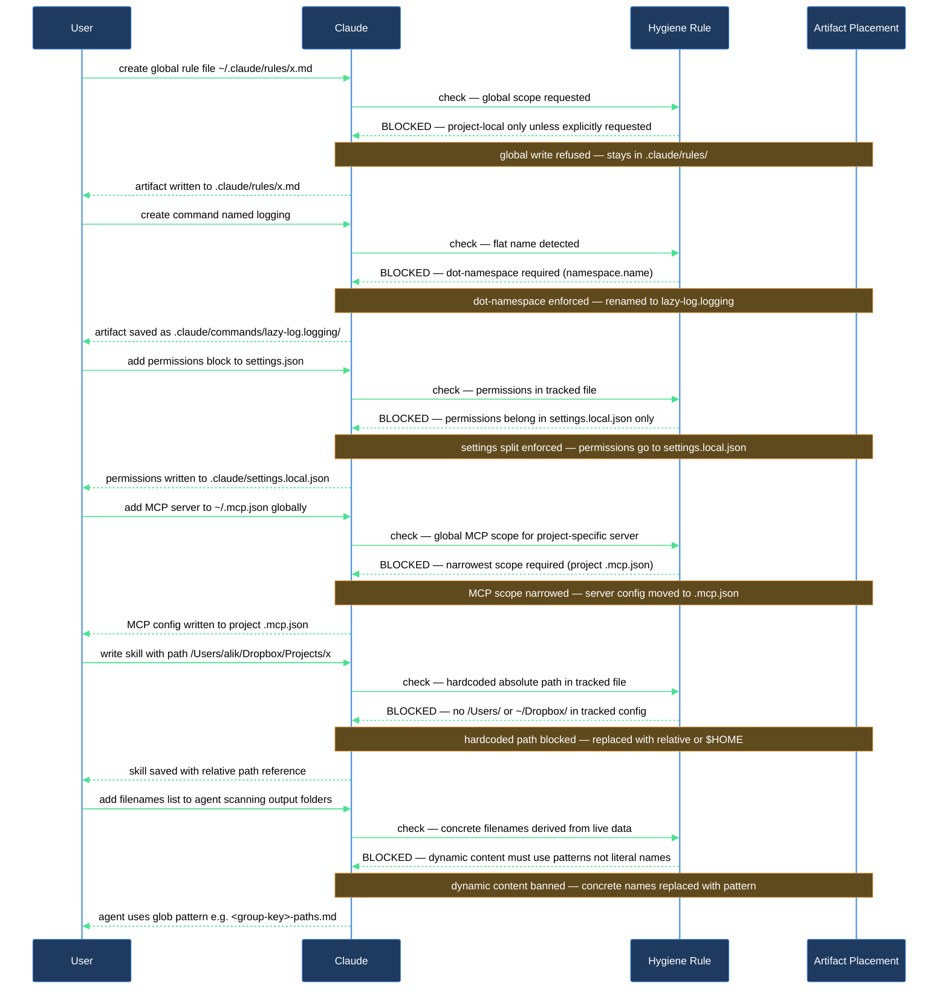

# Why does Claude keep refusing my global `~/.claude/` changes — and why the dots in names?

You asked Claude to create a new rule or add an MCP server entry and it pushed back. Or you noticed that every artifact Claude creates has a `namespace.name` pattern and wondered why. Both behaviors come from `lazy-core.hygiene`, an always-loaded rule that constrains every artifact create and edit. This walkthrough explains each clause so the rule feels like a guardrail, not an obstacle.

## What you need

- `lazycortex-core` installed and enabled (the rule loads automatically — no extra setup).
- A project repo with a `.claude/` directory (created by `/lazy-core.install`).
- Optionally, a `~/.mcp.json` or project `.mcp.json` to see the MCP scope clause in action.

## The flow

### Step 1 — Global write refused: "project-local by default"

When you ask Claude to add a rule, agent, skill, or hook without saying where, the hygiene rule directs it to `.claude/` in the current project, not `~/.claude/`. The rule allows global writes only when you explicitly ask for them, and even then Claude will ask before proceeding.

Why this matters: global `~/.claude/` config leaks into every project. A rule written for one repo's conventions (say, a strict path-hygiene check for a public plugin) pollutes every other session you run. Keeping artifacts project-local makes drift impossible by construction.

If you genuinely want a global rule, say so explicitly: "add this rule to my global `~/.claude/rules/`". Claude will confirm once, then write it globally.

### Step 2 — Dot-namespace insistence: "namespace.name for all artifacts"

Every skill, command, agent, hook, and rule Claude creates gets a `namespace.name` filename — `lazy-core.audit`, not `audit`. This applies to both file names and the directory names used for skill directories.

Why this matters: flat names collide. If two plugins both ship a rule named `logging.md`, one silently overwrites the other on install. Namespaced names are self-describing, collision-resistant, and scannable in any `ls` output.

There is no override. If you ask Claude to create a rule called `logging`, it will write it as `<your-namespace>.logging`. If you have not established a namespace for the project, Claude will ask you for one before writing anything.

### Step 3 — Settings split: tracked `settings.json` vs. gitignored `settings.local.json`

When Claude needs to record a setting, the hygiene rule routes it to one of two files:

- **`settings.json`** (tracked by git): plugin enablement, MCP server names, hooks, non-secret env vars, model overrides, marketplace registrations. Things that every teammate in the repo should share.
- **`settings.local.json`** (gitignored): the `permissions` block — `allow`, `ask`, `deny`, `defaultMode` — plus `additionalDirectories` and machine-specific env. Things that vary per person or per machine.

The critical boundary is `permissions`. Per-tool allow/deny choices are personal posture, not team policy. Putting them in the tracked `settings.json` imposes your local choices on every teammate who pulls the branch. The hygiene rule blocks that at the point of write.

If you ask Claude to "allow this MCP tool", it writes the `mcp__<server>__<tool>` entry to `settings.local.json`. If you ask it to "enable this plugin", it writes to `settings.json`. The distinction is automatic.

### Step 4 — MCP scope: narrowest placement wins

When Claude adds or modifies an MCP server entry — whether in `~/.mcp.json`, `.mcp.json`, or `settings.json` `enabledMcpjsonServers` — it asks for explicit permission first. After you approve, it places the server at the narrowest scope that makes sense:

- A server useful only in this project goes into the project's `.mcp.json`.
- A server you use in every project (like `context7` or `brave-search`) goes into `~/.mcp.json`.

Claude will not infer scope from past behavior or session history. It asks. If you say "add this MCP server" without specifying where, it will prompt you to confirm project vs. global before writing anything.

This prevents the common drift pattern where every project accumulates a growing `~/.mcp.json` of servers that were "just for one job" and never cleaned up.

### Step 5 — Path hygiene: no hardcoded absolute paths in tracked files

Any tracked config file (one committed to git) must not contain hardcoded absolute paths like `/Users/alik/...` or `/home/runner/...`. Claude uses `$HOME`, `~`, `$XDG_*`, templating variables, or relative `.claude/…` paths instead.

Why this matters: a hardcoded `/Users/yourname/` path works on your machine and breaks silently on every other machine or CI environment that pulls the repo. It also leaks your username into the public git history. The hygiene rule blocks this at the point of write.

If you see Claude rewriting a path you typed as an absolute literal, this clause is why. You can use `$HOME/...` or a relative path instead — Claude will accept either.

Note: this clause applies to tracked config files, not to scripts or tools that already use `/tmp/...` for their own reasons. Existing scripts stay as they are unless you explicitly migrate them.

### Step 6 — Dynamic content: agents discover, never enumerate

Agents and skills must not hardcode filenames, folder trees, or enumerations derived from live data. If an agent's output varies depending on what files exist at runtime (e.g., per-plugin path lists, expert group directories), it uses a naming pattern — `<group-key>-paths.md` — and scans at runtime. It never bakes a concrete list of names into its own body.

Why this matters: a hardcoded list becomes stale the moment a file is added or removed. It also means a subtle mismatch between what the agent says it will touch and what it actually finds. Dynamic discovery at runtime keeps the agent honest.

If you notice Claude refusing to write a concrete filename list into an agent definition, or asking you for a naming pattern instead, this clause is the reason.

## After you're done

The hygiene rule is always loaded — you do not re-run anything. Every subsequent artifact create or settings edit in this project will be governed by the same six clauses automatically.

If you want to verify that the rule is active and check the current state of your settings split, run `/lazy-core.audit`. It shows what is loading, which files are tracked vs. gitignored, and whether any permissions have leaked into the tracked `settings.json`.

If something feels misconfigured, run `/lazy-core.doctor` for a full health check that also inspects whether the hygiene rule file itself is present and well-formed.

## How the hygiene rule shapes each decision

