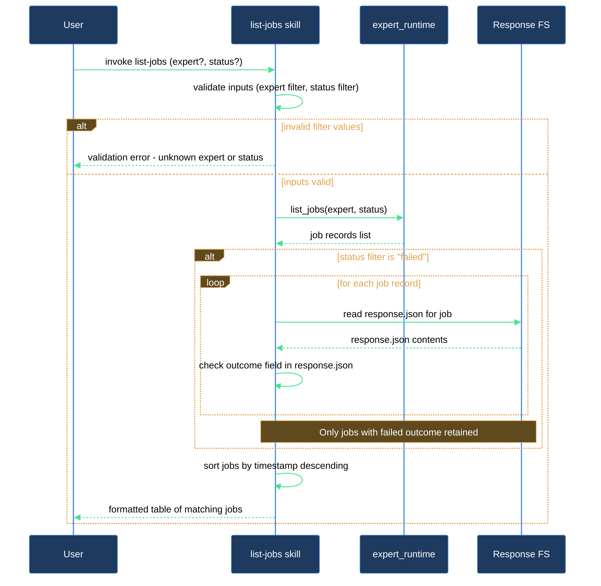

# How do I see what expert jobs are pending, running, or done?

When you have several expert jobs in flight, `/lazy-expert.list-jobs` gives you a sorted snapshot of the queue. You can call it with no arguments to see everything, or pass `expert=<name>` and `status=<value>` to narrow the view to exactly what you care about.

## What you need

- The expert runtime bootstrapped in this repo — run `/lazy-core.install` if `.claude/experts/.jobs/` does not yet exist.
- At least one job dispatched via `/lazy-expert.dispatch-job` (the list will be empty otherwise).

## The flow

### Step 1 — List all jobs

Run the skill with no filters to see the full queue:

```
/lazy-expert.list-jobs
```

The skill prints a table with four columns: `expert`, `job_id`, `status`, and `age_sec` (seconds since the job marker was last written), sorted oldest-first.

### Step 2 — Filter by expert

If you are only interested in jobs routed to one expert, pass its name:

```
/lazy-expert.list-jobs expert=designer
```

Only rows whose `expert` field matches `designer` are returned. The `expert` value corresponds to the `role` you passed when you dispatched the job.

### Step 3 — Filter by status

Pass one of the three recognised status values to see only jobs in that state:

| Value | What it shows |
|---|---|
| `pending` | Jobs queued but not yet completed by the daemon |
| `done` | Jobs that completed (regardless of outcome) |
| `failed` | Jobs whose `response.json` records `outcome: error` |

Example — see only failed jobs:

```
/lazy-expert.list-jobs status=failed
```

You can combine both filters:

```
/lazy-expert.list-jobs expert=designer status=pending
```

Any value other than `pending`, `done`, or `failed` causes the skill to abort with a clear error before touching the queue.

Note: filtering by `failed` adds one file-read per job because the skill reads each `response.json` to check the `outcome` field — there is no dedicated FAILED marker on disk.

### Step 4 — Act on what you see

Once you have a `job_id`:

- If a job is `done`, collect its result with `/lazy-expert.collect-job <job_id>`.
- If a `pending` job is no longer needed, cancel it with `/lazy-expert.cancel-job <job_id>`.
- If the daemon has stalled and a job is stuck, restarting the daemon (via `./run.sh`) lets it retry.

## After you're done

Re-run `/lazy-expert.list-jobs` at any point — it is read-only and safe to call as often as you like. Use it before calling `/lazy-expert.collect-job` when you are unsure whether the daemon has finished processing.

## How list-jobs reads the queue


