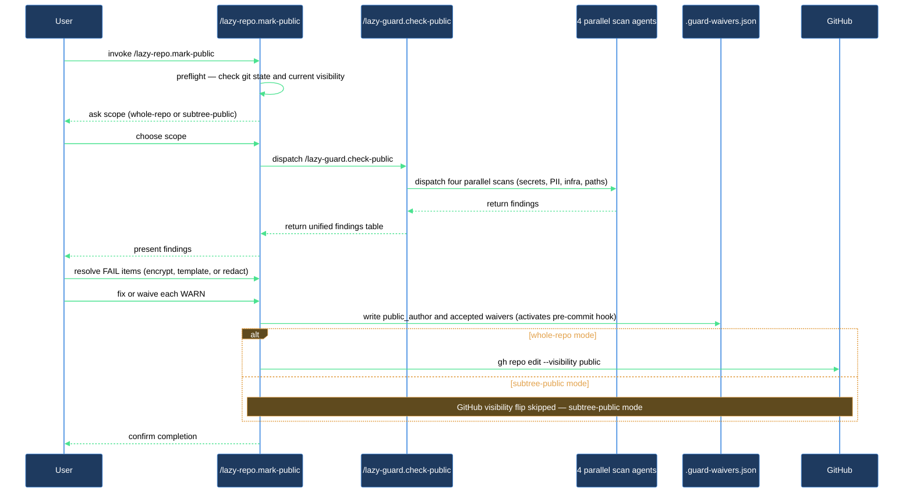

# Making a Repo Public

You are about to make a private repository public. Before flipping the visibility switch, you need to know what is in those files — API keys, internal hostnames, personal email addresses, hardcoded paths that only exist on your machine, and your own name buried in a manifest. `/lazy-repo.mark-public` walks you through all of it in one session: security audit, guided resolution, waiver file creation, and an optional GitHub visibility flip.

## What you need

- Claude Code with `lazycortex-core` enabled
- `git` — the repo must be a git repository
- `gh` (GitHub CLI) — optional; only needed if you want the skill to flip visibility for you; skip if you prefer to do it manually

## The flow

Run the skill with no arguments to put the entire repo through the flow:

```
/lazy-repo.mark-public
```

If you only want to declare a subtree as the public surface (the repo itself stays private on GitHub), pass the paths as glob arguments:

```
/lazy-repo.mark-public claude/** README.public.md .gitignore
```

The skill works through eight ordered steps.

### Step 1 — Preflight

The skill confirms you are in a git repo and reads the current GitHub visibility. If the repo is already public and you passed no scope arguments, it asks whether you want to re-audit with `/lazy-guard.check-public` instead of repeating the full flow.

### Step 1b — Determine scope

With no arguments you are in **whole-repo mode**: everything gets scanned and GitHub visibility can change at the end. With glob arguments you are in **subtree-public mode**: only the listed paths are the public surface; GitHub visibility is left alone. The skill confirms which mode it is running before doing anything else.

### Step 2 — Security audit

The skill invokes `/lazy-guard.check-public`, which dispatches four parallel scan agents — one each for secrets, PII, infrastructure details, and hardcoded local paths. The full findings table appears before any fix work begins.

Findings come back in three severities:

- **FAIL** (category A: secrets) — private keys, AWS access keys, API tokens, high-entropy base64, database connection strings with credentials, bearer tokens. These block going public and must be resolved.
- **WARN** (categories B–D: PII, infrastructure, local paths) — email addresses, internal hostnames, Tailscale IPs, hardcoded `/Users/…` paths, `~/Dropbox/`-style refs, author identity in manifests. You decide whether to fix or waive each one.
- **INFO** — lower-confidence signals such as personal names in git config inside dotfiles. You can auto-waive or skip these.

### Step 3 — Resolve findings

**For each FAIL finding** the skill offers three fix strategies:

- S1 Encrypt — move the secret to an encrypted store, reference it via a template variable
- S2 Template-ize — replace the literal with a config or template variable
- S3 Redact — remove the value entirely

You pick one and the skill applies it. Step 4 will not proceed until every FAIL is resolved.

**For each WARN finding** you choose: fix it, waive it, or skip it for now. Waiving adds an entry to `.guard-waivers.json` with your justification. Skipping leaves the finding unresolved but does not block Step 4.

**For author identity findings (check B4)**: if the same name appears in multiple manifests, you are better served by setting a `public_author` record once rather than writing one waiver per file. The skill can do this: when you confirm your intended public name, it records it in `.guard-waivers.json` as `public_author`. That single record auto-waives every B4 finding whose captured match equals your public name — including in files added later — without scattering individual waiver entries across the file.

### Step 4 — Create `.guard-waivers.json`

The skill writes the waiver file to the repo root with all accepted waivers from Step 3. The file may include:

- `public_author` — your chosen public name (and optionally email), if you set it in Step 3
- `public_scopes` — the glob list from Step 1b, in subtree-public mode
- `waivers` — individual accepted exceptions from Step 3
- `global_skip_paths` — vendored or third-party directories the audit identified as safe to skip

Creating this file also activates the pre-commit hook: from this point forward, every `git commit` in this repo automatically scans staged changes and blocks on new secrets. The waiver file is committed to the repo.

You manage waivers by re-running `/lazy-guard.check-public` and choosing the waiver option for any finding you want to accept — the skill appends the entry. Do not hand-edit `.guard-waivers.json` directly.

### Step 5 — Go public on GitHub (whole-repo mode only)

This step is skipped entirely in subtree-public mode. In whole-repo mode, after all FAIL findings are resolved, the skill asks for your confirmation and runs:

```bash
gh repo edit --visibility public
```

If you prefer to flip visibility yourself later, say no — the repo is audit-clean and ready whenever you are. The skill will tell you the exact command to run.

### Step 6 — Post-flight

The skill confirms the pre-commit hook is active (`.guard-waivers.json` present at root equals hook fires) and reminds you to run `/lazy-guard.check-public` periodically or after major configuration changes. In subtree-public mode it also confirms which `public_scopes` the hook is protecting.

## After you're done

The `.guard-waivers.json` file is the ongoing contract for this repo. Keep it tracked in git. When a new accepted exception appears — a new email address, a new author field in a manifest — re-run `/lazy-guard.check-public` and add the waiver through the skill. To disable pre-commit scanning entirely, remove the file.

Run `/lazy-guard.check-public` again after any major configuration change, after adding a new plugin, or after pulling in a third-party subtree that might bring new paths or credentials.

## How the flow works


