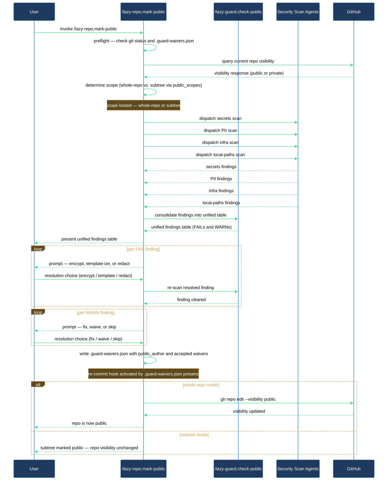

# Making a Repo Public Safely

You are about to make a private repository public. Before flipping the visibility switch you need to know what is hiding in those files — API keys, internal hostnames, personal email addresses, hardcoded paths that only exist on your machine, and your real name buried in a manifest. `/lazy-repo.mark-public` walks you through all of it in one session: security audit, guided resolution, waiver file creation, and an optional GitHub visibility flip. After the session, `/lazy-guard.check-public` fires automatically on every subsequent commit so new secrets never sneak in.

## Outcome

After completing this walkthrough you have a `.guard-waivers.json` committed at the repo root, every secret resolved (encrypted, templated, or redacted), your public author identity recorded so it auto-waives future author-field findings, and — in whole-repo mode — the repository flipped to public on GitHub. The pre-commit hook is active from the moment `.guard-waivers.json` lands: every subsequent `git commit` scans staged changes automatically and blocks on new secrets.

## What you need

- Claude Code with `lazycortex-core` enabled
- `git` — the repo must be a git repository
- `gh` (GitHub CLI) — optional; only needed if you want the skill to flip visibility for you; skip if you prefer to flip visibility manually when you are ready

## The journey

### 1 — Invoke the skill

Run the skill with no arguments to put the entire repo through the flow:

```
/lazy-repo.mark-public
```

If you only want to declare a subtree as the public surface — for example, a `claude/**` plugin directory you publish separately while the repo itself stays private on GitHub — pass the paths as glob arguments:

```
/lazy-repo.mark-public claude/** README.public.md .gitignore
```

### 2 — Preflight and scope confirmation

The skill confirms you are in a git repo, reads the current GitHub visibility, and asks which mode it will run in:

- **Whole-repo mode** (no arguments): the entire repo goes through the audit, and GitHub visibility can change at the end.
- **Subtree-public mode** (glob arguments): only the listed paths are treated as the public surface. The repo stays private on GitHub; the visibility flip in a later step is skipped.

If the repo is already public and you passed no scope arguments, the skill asks whether you want to re-audit with `/lazy-guard.check-public` instead of repeating the full setup flow.

### 3 — Security audit

The skill invokes `/lazy-guard.check-public`, which dispatches four parallel scan agents — one each for secrets, PII, infrastructure details, and hardcoded local paths. The full findings table appears before any fix work begins.

Findings come back in three severities:

- **FAIL** (secrets) — private keys, AWS access keys, API tokens, high-entropy base64 on secret-context lines, connection strings with credentials, bearer token literals. These block going public and must be resolved.
- **WARN** (PII, infrastructure, local paths) — email addresses, internal hostnames, Tailscale or public IPs, hardcoded `/Users/…` paths, `~/Dropbox/`-style refs, author identity in manifests. You decide whether to fix or waive each one.
- **INFO** — lower-confidence signals such as personal names in git config inside dotfiles. You can auto-waive or skip these.

Verification gate: review the findings table before moving on. If a finding looks like a false positive, flag it — the skill can waive it in the next step.

### 4 — Resolve findings

**For each FAIL finding** the skill offers three fix strategies:

- S1 Encrypt — move the secret to an encrypted store and reference it via a template variable
- S2 Template-ize — replace the literal with a config or template variable
- S3 Redact — remove the value entirely

You pick one and the skill applies it. The next step will not proceed until every FAIL is resolved.

**For each WARN finding** you choose: fix it, waive it, or skip it for now. Waiving adds an entry to `.guard-waivers.json` with your justification. Skipping leaves the finding unresolved but does not block the next step.

**Author identity findings (check B4)**: if the same name appears in multiple manifests, setting a `public_author` record once is better than writing one waiver per file. When you confirm your intended public name, the skill records it in `.guard-waivers.json` as `public_author`. That single record auto-waives every B4 finding whose captured match equals your public name — including in files added later — without scattering individual waiver entries across the file.

### 5 — Create `.guard-waivers.json`

The skill writes the waiver file to the repo root with all accepted waivers from the previous step and commits it. The file may contain:

- `public_author` — your chosen public name (and optionally email), if you confirmed one
- `public_scopes` — the glob list in subtree-public mode
- `waivers` — individual accepted exceptions
- `global_skip_paths` — vendored or third-party directories the audit identified as safe to skip

Creating this file also activates the pre-commit hook: from this point forward, every `git commit` in this repo automatically scans staged changes and blocks on new secrets. To disable pre-commit scanning entirely later, remove `.guard-waivers.json`. To add new accepted exceptions, re-run `/lazy-guard.check-public` and choose the waiver option for any finding you want to accept — the skill appends the entry.

Verification gate: confirm `.guard-waivers.json` is committed and the hook is active before continuing.

### 6 — Go public on GitHub (whole-repo mode only)

This step is skipped entirely in subtree-public mode — the skill prints the active `public_scopes` and you are done.

In whole-repo mode, after all FAIL findings are resolved, the skill asks for your confirmation and runs:

```bash
gh repo edit --visibility public
```

If you prefer to flip visibility yourself later, say no — the repo is audit-clean and ready whenever you are. The skill will print the exact command to run.

If `gh` is not on PATH or is unauthenticated, install the GitHub CLI and run `gh auth login`, then execute the command manually.

### 7 — Post-flight

The skill confirms the pre-commit hook is active, reminds you to run `/lazy-guard.check-public` periodically or after major configuration changes, and in subtree-public mode confirms which `public_scopes` the hook is protecting on every commit.

## After you're done

The `.guard-waivers.json` file is the ongoing contract for this repo — keep it tracked in git. When a new accepted exception appears after a config change (a new email address, a new author field in a manifest), re-run `/lazy-guard.check-public` and add the waiver through the skill.

Run `/lazy-guard.check-public` again after any major configuration change, after adding a new plugin, or after pulling in a third-party subtree that might bring in new paths or credentials.

## How the flow works


