# Has anything leaked into my public repo recently?

`lazy-guard.check-public` protects you in two modes. The first is a slash command you run whenever you want a full audit of all tracked files. The second runs without being asked: a pre-commit hook that intercepts every `git commit` — including commits Claude Code makes via `mcp__git__git_commit` — and scans the staged diff before it lands. Both modes read the same `.guard-waivers.json` file for accepted exceptions, so a waiver you record once applies everywhere.

## What you need

- `lazycortex-core` installed and enabled in `~/.claude/settings.json`.
- A git repository. The repo does not need to be public yet for scanning to work.
- Python 3 on `$PATH` — the hook script is Python.
- `.guard-waivers.json` at the repo root. This file is the opt-in signal for the hook. Without it the hook stays silent even if the plugin is installed.

## The flow

### Step 1 — Opt the repo into pre-commit scanning

Run `/lazy-repo.mark-public`. The skill performs a full audit, walks you through any findings, and writes `.guard-waivers.json` at the repo root with the correct schema. If you only want a subtree of the repo to count as the public surface, pass glob arguments — for example, `/lazy-repo.mark-public claude/** README.public.md .gitignore` — and the skill writes those globs into a `public_scopes` array instead of treating the whole repo as public (subtree-public mode; no GitHub visibility change is made).

Once `.guard-waivers.json` exists, every subsequent `git commit` in the repo triggers the scan automatically. Commit the waivers file to persist the opt-in.

### Step 2 — Run a baseline ad-hoc audit

Before relying solely on the hook, audit the current state of all tracked files:

```
/lazy-guard.check-public
```

This dispatches four parallel scans — secrets (A), PII (B), infrastructure IPs and hostnames (C), and hardcoded local paths (D) — merges the findings, applies any existing waivers, and presents a unified report. Severity vocabulary: `FAIL` for secrets (must be resolved), `WARN` for PII and paths (fix or waive), `WAIVED` for findings covered by `.guard-waivers.json`.

Work through the full report before your next push. The skill walks you through both `FAIL` and `WARN` findings in its Phase 5 fix flow.

### Step 3 — Understand what the hook scans

The hook scans only the staged diff on each commit, not the full repo, so it is fast. The checks it enforces:

- **Secrets (FAIL — blocks commit):** private key markers, AWS access keys, API key/token/password literals, high-entropy base64 on secret-context lines, connection strings with embedded credentials, bearer token literals.
- **PII (WARN — passes with report):** email addresses, service user IDs, author identity in manifests.
- **Infrastructure (WARN — passes with report):** Tailscale/CGNAT IPs, public routable IPs, internal hostnames in SSH or deploy context.
- **Local paths (WARN — passes with report):** hardcoded absolute user paths (`/Users/<name>/`), personal home-subdirectory refs (`~/Dropbox/`, `~/Documents/`).

A commit that triggers a `FAIL` finding is stopped. The hook prints the finding details and the available fix strategies before you retry. A commit with only `WARN` findings goes through, but the hook prints the warnings so you can decide whether to add a waiver.

### Step 4 — Fix a blocked commit

When the hook blocks a commit, it identifies which check fired and which line triggered it. Fix strategies:

- **Move the secret out:** put it in your secrets pipeline and reference it via a template variable. Run `/lazy-guard.check-public` afterward — its Phase 5 guides you through this interactively.
- **Redact or template-ize:** for infrastructure details and local paths, replace the literal with a config variable or a chezmoi template expression (`{{ .chezmoi.homeDir }}/`).
- **Add a waiver:** if the finding is intentional and safe, re-run `/lazy-guard.check-public` and pick the S4 fix strategy for the finding. The skill prompts for a justification and appends a properly-formed entry to `.guard-waivers.json`. The next commit sees the finding as `WAIVED` and passes.

### Step 5 — Add a waiver for an ongoing finding

Re-run `/lazy-guard.check-public` at any time. In Phase 5 the skill walks each unresolved finding and offers fix strategies S1–S5. Pick **S4 (Accept with waiver)** for findings you want to keep; the skill prompts for the justification, then appends a properly-formed entry to `.guard-waivers.json` with `pattern`, `check`, `scope`, `added`, and `reason` fields.

For author identity findings specifically, the skill prefers writing the approved identity to a top-level `public_author` block in `.guard-waivers.json` rather than scattering per-match waivers. One `public_author` record governs every author field across the scanned scope and survives future scope changes. The skill handles this automatically when it recognises a B4 finding as your chosen public handle — no separate prompt.

### Step 6 — Narrow the scan to a public subtree

If only part of your repo is public, run `/lazy-repo.mark-public` with glob arguments (as described in Step 1). Subsequent ad-hoc audits and pre-commit hook runs both respect the `public_scopes` list: files outside the globs are not scanned, so personal config sitting alongside the public subtree never triggers warnings.

If you already have `.guard-waivers.json` and want to add or change the public scopes, re-run `/lazy-repo.mark-public` with the updated glob arguments — it writes the new `public_scopes` array into `.guard-waivers.json` for you.

## After you're done

The pre-commit hook now runs on every commit without further configuration. Re-run `/lazy-guard.check-public` at any time for a full-repo baseline — useful after pulling a large change, adding a new config file, or onboarding a collaborator. If you are preparing to flip a repo's GitHub visibility for the first time, `/lazy-repo.mark-public` calls `lazy-guard.check-public` as its first step and handles the complete end-to-end flow.

## The commit-time flow

```mermaid
%%{init: {'themeVariables':{'background':'transparent','lineColor':'#000','textColor':'#000','edgeLabelBackground':'#fff'},'themeCSS':'.edgeLabel{background-color:transparent!important}.edgeLabel p{background-color:transparent!important}','flowchart':{'diagramPadding':5,'useMaxWidth':true}}}%%
%% intent: pre-commit hook lifecycle for lazy-guard.check-public scanning a staged commit
flowchart LR
  devRunsCommit[Developer runs git commit]
  hookInstalled{.guard-waivers.json present?}
  proceedNoHook[Proceed without scan]
  proceededWithoutScan([proceededWithoutScan])
  scanStagedDiff[Hook scans staged diff]
  failFindings{Any FAIL findings — secrets?}
  blockCommit[Block commit — print fix strategies: encrypt, template, redact]
  blockedWithFixGuide([blockedWithFixGuide])
  warnFindings{Any WARN findings — PII, infra, local paths?}
  printWarnReport[Print warning report]
  proceededWithWarning([proceededWithWarning])
  proceedClean[Proceed — no findings]
  proceededClean([proceededClean])

  devRunsCommit -->|trigger| hookInstalled
  hookInstalled -->|no — hook not installed| proceedNoHook
  hookInstalled -->|yes — hook active| scanStagedDiff
  proceedNoHook -->|bypass| proceededWithoutScan
  scanStagedDiff -->|evaluate| failFindings
  failFindings -->|yes — FAIL: secrets found| blockCommit
  blockCommit -->|blocked| blockedWithFixGuide
  failFindings -->|no — FAIL clear| warnFindings
  warnFindings -->|yes — WARN: PII, infra, or local paths| printWarnReport
  printWarnReport -->|warned| proceededWithWarning
  warnFindings -->|no — WARN clear| proceedClean
  proceedClean -->|clean| proceededClean

  classDef entry fill:#1e3a5f,stroke:#4a90e2,color:#fff
  classDef guard fill:#5f4a1e,stroke:#e2a14a,color:#fff
  classDef action fill:#1e5f3a,stroke:#4ae290,color:#fff
  classDef success fill:#0d4d2a,stroke:#4ae290,color:#fff,stroke-width:2px
  classDef error fill:#5f1e1e,stroke:#e24a4a,color:#fff,stroke-width:2px

  class devRunsCommit entry
  class hookInstalled guard
  class failFindings guard
  class warnFindings guard
  class scanStagedDiff action
  class blockCommit error
  class printWarnReport action
  class proceedNoHook action
  class proceedClean action
  class proceededWithoutScan success
  class blockedWithFixGuide error
  class proceededWithWarning success
  class proceededClean success
```


