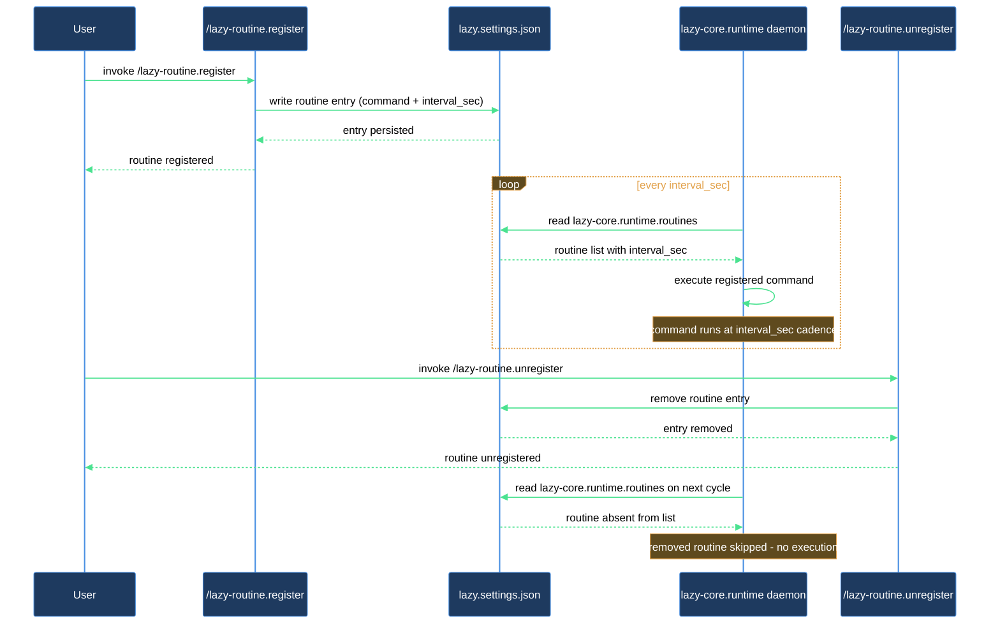

# How do I make my plugin run a periodic check via the runtime daemon?

This walkthrough is for plugin authors who want a named routine — such as a lint tick, a sync check, or any scheduled command — to run on a fixed cadence inside the runtime daemon. `/lazy-routine.register` writes the routine into `lazy-core.runtime` in `lazy.settings.json`; the daemon picks it up on its next cycle without a restart. When the routine is no longer needed, `/lazy-routine.unregister` removes it cleanly.

## What you need

- The `lazycortex-core` plugin installed and the runtime daemon enabled for the repo (run `/lazy-core.install` and answer yes to the expert runtime wizard if you have not done this yet).
- The daemon running (`./run.sh` from the repo root, or the launchd/systemd service if you set that up).
- A dot-namespaced routine name following `<plugin>.<verb>` format, for example `acme-lint.tick`.
- The command you want the daemon to invoke, expressed as a list of strings (e.g. `["python3", "bin/lint_tick.py"]`).
- The polling interval in seconds (e.g. `300` for every five minutes).

## The flow

### Step 1 — Choose a name

Pick a routine name in `<plugin>.<verb>` format. Both the plugin segment and the verb segment must be non-empty, and the name must contain exactly one dot. Examples: `acme-lint.tick`, `lazy-review.tick`, `my-plugin.sync`.

If you pass a name that does not match this pattern, the skill aborts immediately with a message explaining the format. Rename and retry.

### Step 2 — Register the routine

Run:

```
/lazy-routine.register
```

When prompted, provide:

- `name` — the dot-namespaced name from Step 1 (e.g. `acme-lint.tick`).
- `command` — the command the daemon should run, as a list of strings (e.g. `["python3", "bin/lint_tick.py"]`).
- `interval_sec` — how often the daemon should run it, in seconds (e.g. `300`).
- `timeout_sec` — optional per-run timeout; omit to use the daemon default.

The skill writes the routine entry into the `lazy-core.runtime.routines` map in `.claude/lazy.settings.json`. It refuses to overwrite an existing registration unless you pass `--force`. If you need to update an already-registered routine, run `/lazy-routine.unregister acme-lint.tick` first, then re-register.

### Step 3 — Verify the registration

After the skill reports "registered routine `<name>`", you can confirm by checking that the entry appears in `lazy.settings.json` under `lazy-core.runtime.routines`. The daemon does not need to be restarted — it reads settings on every cycle.

### Step 4 — Unregister when done

To remove the routine:

```
/lazy-routine.unregister acme-lint.tick
```

The skill removes the entry from `lazy-core.runtime.routines`. If the name is not present, the skill treats that as a no-op (INFO, not an error). The daemon's next cycle will skip the removed routine.

Note: the built-in `lazy-expert.pump` routine is protected. Attempting to unregister it without `--force` aborts with a warning. Only pass `--force` if you intend to stop expert job processing — expert jobs will not be processed until `lazy-expert.pump` is re-registered or you re-run `/lazy-core.install`.

## After you're done

Your routine is running. The daemon logs each cycle, so you can inspect `.logs/` for execution records. If you want to adjust `interval_sec` or the `command`, unregister the old entry with `/lazy-routine.unregister` and re-register with the new values. Plugin install skills (e.g. in your own plugin's `<plugin>.install` skill) can call `/lazy-routine.register` programmatically so the routine is set up automatically whenever someone installs your plugin.

## How the daemon picks up the routine


