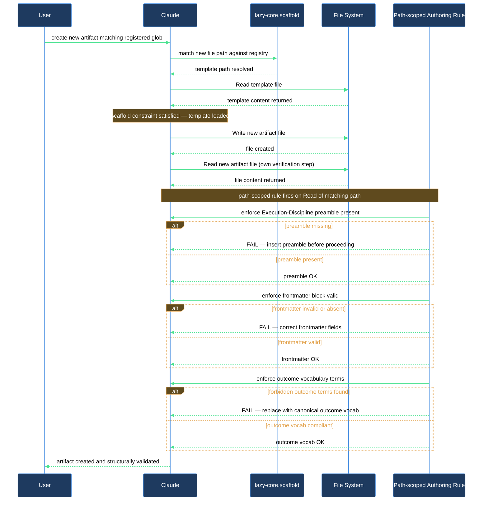

# Claude started from a template when I asked it to create a new artifact

When you ask Claude to create a new skill, rule, or agent, you might notice it reads a template file before writing anything. That is not a coincidence. The `lazy-core.scaffold` rule is always loaded into every session and instructs Claude to read the matching template before composing any new file whose path fits one of the registered globs. Once Claude reads the new file path, a second set of path-scoped rules (`lazy-core.skill-writing`, `lazy-core.rule-writing`, `lazy-core.agent-writing`) load and enforce the structural constraints that make each artifact type reliable: the Execution-Discipline preamble, mandatory frontmatter, and per-step outcome vocabulary.

## What you need

- `lazycortex-core` installed in the project (run `/lazy-core.install` once if you haven't).
- A task that involves creating a new `.claude/skills/*/SKILL.md`, `.claude/rules/*.md`, `.claude/agents/*.md`, or `.claude/commands/*.md` — the rules only fire on those path patterns.
- No configuration required beyond installation. Both `lazy-core.scaffold` and the authoring rules are distributed with the plugin; `lazy-core.install` copies them into `.claude/rules/`.

## The flow

### Step 1 — Ask Claude to create the artifact

Tell Claude what you need: for example, "create a new skill called `myns.sync`" or "add a rule that enforces our API key naming convention". Claude identifies the target path from the context of your request.

### Step 2 — `lazy-core.scaffold` fires and reads the template

Because `lazy-core.scaffold` is always loaded (`always_loaded: fires at create-time`), it is in context before any tool call. The rule's registry maps each target glob to a template:

| Target glob | Template read |
|---|---|
| `.claude/skills/*/SKILL.md` | `.claude/templates/core/skill-template.md` |
| `.claude/rules/*.md` | `.claude/templates/core/rule-template.md` |
| `.claude/agents/*.md` | `.claude/templates/core/agent-template.md` |
| `.claude/commands/*.md` | `.claude/templates/core/command-template.md` |

Claude reads the matching template first. The contract is explicit: "never compose from memory". If the template does not exist on disk (e.g. `/lazy-core.install` has not been run), Claude will surface an error rather than silently writing a blank-slate file.

### Step 3 — Claude authors the artifact from the template

The template body carries the structural scaffolding pre-filled:

- **Skill/command templates** — the `## Execution discipline (MANDATORY)` preamble, a `TaskCreate` checklist contract, phase/step skeleton with one-word outcome slots, and a `## Report` section. Claude fills in the phase names and logic; the skeleton makes structural skips visible.
- **Rule templates** — canonical frontmatter with a `paths:` block-list (the inline-array form `paths: ["..."]` is silently ignored by the Claude Code loader and is therefore a FAIL-severity finding), a `description:` line, and numbered invariant sections.
- **Agent templates** — frontmatter with `name:`, `description:`, `tools:`, and `model: inherit`; the structured-report block contract; a note that `AskUserQuestion` is forbidden inside agents.

Claude copies the template body, fills the `<…>` placeholders, and deletes the trailing authoring-notes comments before writing the file.

### Step 4 — Path-scoped authoring rules load and enforce constraints

When Claude reads or writes the newly created file, the path-scoped authoring rules fire:

- **`lazy-core.skill-writing`** (paths: `.claude/skills/**`, `.claude/commands/**`) enforces the Execution-Discipline preamble (§ 1), no "Optional" in phase headings (§ 2), one-word outcome vocabulary per step (§ 3), and a narrative-padding ban on incident stories and version numbers (§ 4).
- **`lazy-core.rule-writing`** (paths: `.claude/rules/**`) enforces the frontmatter shape, size budgets (`always_loaded:` rules capped at 3 KB; `paths:`-scoped rules warn at 10 KB), no code block over 10 lines, and dot-namespace filenames.
- **`lazy-core.agent-writing`** (paths: `.claude/agents/**`) enforces the four required frontmatter keys (`name:`, `description:`, `tools:`, `model: inherit`), the no-`AskUserQuestion` contract, and model-tier registration in `lazy.settings.json` when that file exists.

These rules do not execute any tool — they describe invariants that Claude must satisfy as it writes. Violations are surfaced later by `lazy-core.audit` and fixed via `lazy-core.doctor`.

### Step 5 — Verify the result with `lazy-core.audit`

After the new artifact is written, run `/lazy-core.audit` to confirm it is structurally sound. The audit's Agent B checks preamble presence, Optional headings, narrative padding, frontmatter completeness, and code-block lengths. Findings come back as `PASS`, `WARN`, or `FAIL`. Run `/lazy-core.doctor` to fix any `FAIL`-severity findings in one guided pass.

The audit also validates the scaffold registry itself: it checks that exactly one fenced YAML block exists under `## Registry`, that every template path resolves on disk, and that plugin top-level keys correspond to installed plugins. Orphan keys (from uninstalled plugins) surface as `WARN` for cleanup.

## After you're done

The new artifact is structurally complete and audit-clean. It will behave predictably when dispatched: the `TaskCreate` checklist makes skipped steps visible, the one-word outcome vocabulary keeps reports scannable, and the frontmatter ensures the Claude Code loader actually picks the rule up. You can iterate on the logic inside each phase freely — the template-enforced skeleton stays in place.

If you want Claude to apply the same template-first discipline to your own project-specific file types (for example, a prompt recipe or a runbook format you maintain), add a `_local` entry to the registry in `.claude/rules/lazy-core.scaffold.md`:

```yaml
_local:
  .claude/templates/recipes/recipe-template.md:
    - prompts/recipes/*.md
```

The `_local` key is reserved for customer-authored entries. Plugin install skills never touch it, so your entries survive plugin updates.

## How the rules fire


