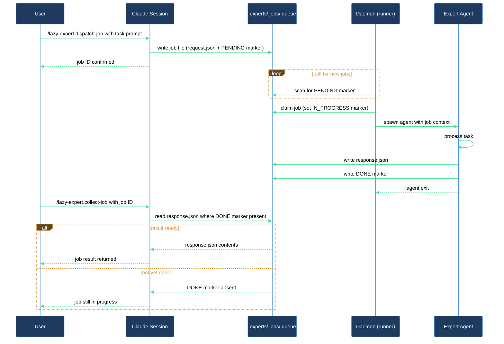

# Add a named expert and dispatch your first async job

Think of experts as named coworkers on your async team. You hand one a task, it works in the background, and you carry on with something else. When the daemon finishes the job you pick up the result. This walkthrough takes you through the full loop: enable the expert runtime during `/lazy-core.install`, dispatch a first job to a named expert role, watch its status while it runs, and collect the finished result.

## Outcome

After this walkthrough you have:

- The expert runtime bootstrapped in your repo (`.experts/`, `experts.settings.json`, the `lazy-core.runtime` block in `.claude/lazy.settings.json`, and the `.claude/bin/lazy.runtime.sh` shim).
- At least one named expert registered and the `lazy-expert.pump` routine wired into the daemon's rotation.
- At least one dispatched job with a collected result you can read.

## What you need

- `lazycortex-core` installed and restarted in Claude Code.
- A git repo to run async jobs in.
- Python 3 available in the shell where you start the daemon.
- `CLAUDE_PLUGIN_ROOT` set correctly — `/lazy-core.install` writes this into `.claude/bin/lazy.runtime.sh` automatically.

## The journey

### Step 1 — Enable the expert runtime

Run `/lazy-core.install` inside the repo. The install wizard walks through several phases; when it reaches the runtime phase (Step 7), answer **Yes**. The skill:

- Creates `.experts/` and seeds `.experts/experts.settings.json`.
- Writes the `.claude/bin/lazy.runtime.sh` shim, which resolves the latest plugin runner at exec time — supervisor units don't need re-rendering after `/plugin update`.
- Adds the `lazy-core.runtime` block to `.claude/lazy.settings.json` with the daemon's polling interval and cleanup schedule.
- Adds `.experts/.jobs/` to `.gitignore`.

When the wizard reaches the expert-add phase (Step 9), answer **Yes** to scan installed plugins for expert candidates. For each candidate you accept, the wizard asks for a local name (e.g. `designer`, `developer`, `reviewer`), a git author name, and a git author email for commits the expert makes. These are written into `experts.settings.json` via the wizard — do not edit the file by hand.

Once at least one expert is registered, the skill bootstraps the `lazy-expert.pump` routine (Step 10) in `lazy.settings.json` and offers to install a daemon supervisor (Step 11) via macOS launchd or Linux systemd. Choose the option that matches your machine, or skip and start the daemon manually in the next step.

If you already ran `/lazy-core.install` and skipped the runtime phase, re-run the skill — it is idempotent and detects what is already present.

**Verification gate**: `.experts/experts.settings.json` exists and contains at least one expert key besides `_version`. `.claude/lazy.settings.json` has a `lazy-core.runtime` block with `lazy-expert.pump` listed under `routines`.

### Step 2 — Start the daemon

If you installed a supervisor in Step 1, the daemon is already running — skip to Step 3.

Otherwise, in a terminal outside Claude Code run the shim:

```
.claude/bin/lazy.runtime.sh
```

The shim resolves the runner from the plugin cache and starts it. The daemon logs to stdout; it wakes on each polling cycle, drains any `READY` jobs, and runs registered routines. Leave it running in a `tmux` or `screen` pane — you do not need to restart it for each job.

**Verification gate**: the daemon prints its startup message and enters its polling loop without errors.

### Step 3 — Dispatch a job

Run `/lazy-expert.dispatch-job` and supply two required inputs:

- `expert_name` — the local key you defined in `experts.settings.json` (e.g. `designer`).
- `payload` — a dict with three required fields:
  - `kind` — the protocol kind string defined by the expert's contract (e.g. `doc-review`).
  - `role` — a role label for this job (often matches the expert name or describes the task type).
  - `request` — the human-readable task description (e.g. `Review docs/api.md for clarity and completeness`).

Example:

```
/lazy-expert.dispatch-job expert_name=designer payload={"kind":"doc-review","role":"designer","request":"Review docs/api.md for clarity and completeness"}
```

The skill validates the payload against the protocol contract, writes the job directory under `.experts/.jobs/<expert_name>/<job_id>/` with a `request.json` and a `READY` marker, then prints:

```
job_id:     <job_id>
queue_path: .experts/.jobs/designer/<job_id>
```

Note the `job_id` — you need it to collect the result.

**Verification gate**: the `queue_path` directory exists and contains `request.json` and a `READY` marker.

### Step 4 — Check the queue while you wait

The daemon picks up `READY` jobs on its next polling cycle. While it runs you can check progress at any time with `/lazy-expert.list-jobs`:

```
/lazy-expert.list-jobs
```

To narrow to a specific expert or status:

```
/lazy-expert.list-jobs expert=designer
/lazy-expert.list-jobs status=pending
/lazy-expert.list-jobs status=done
/lazy-expert.list-jobs status=failed
```

The output is a table with `expert`, `job_id`, `status`, and `age_sec` columns. A status of `pending` means the daemon has not yet written the `DONE` marker; `done` means the result is ready; `failed` means the expert wrote a `DONE` marker with `outcome == "error"`.

You can dispatch additional jobs, continue working on the codebase, or run other skills — the daemon drains the queue in the background regardless.

### Step 5 — Collect the result

Once `/lazy-expert.list-jobs` shows `status=done` for your job, run:

```
/lazy-expert.collect-job expert_name=designer job_id=<job_id>
```

The skill prints:

```
status: done
result files (Read these to retrieve output):
  - .experts/.jobs/designer/<job_id>/result/<file>
```

Open the listed result files to read the expert's output. If status comes back as `pending`, the daemon has not finished yet — wait a polling cycle and re-run `/lazy-expert.collect-job`. If it comes back as `failed`, the skill prints the error message from `response.json`. If status is `missing`, the `job_id` or `expert_name` is wrong — verify against the output from Step 3.

## After you're done

- **Dispatch more jobs any time** — the daemon keeps running. Any job you send with `/lazy-expert.dispatch-job` goes into the queue and is picked up on the next polling cycle.
- **Check the full queue** — `/lazy-expert.list-jobs` shows all jobs across all experts. Pass `status=done` to review completed work or `status=failed` to find errors.
- **Register more experts** — add roles to `experts.settings.json` by re-running `/lazy-core.install` and accepting new candidates in the expert-add wizard. Each role corresponds to a named agent the daemon dispatches to.
- **Cancel a job you no longer need** — run `/lazy-expert.cancel-job job_id=<job_id>` for any job that is still `READY` or in progress.
- **Register plugin routines** — if a plugin also needs periodic background work, run `/lazy-routine.register` to add it to the daemon's rotation alongside `lazy-expert.pump`.
- **Daemon stopped?** — if you didn't install a supervisor, re-run `.claude/bin/lazy.runtime.sh`. The daemon is stateless between restarts; jobs that were `READY` when it stopped will be picked up on the next cycle. If the daemon halted on a dirty working tree, run `/lazy-runtime.recover` first.

## How the pieces fit



