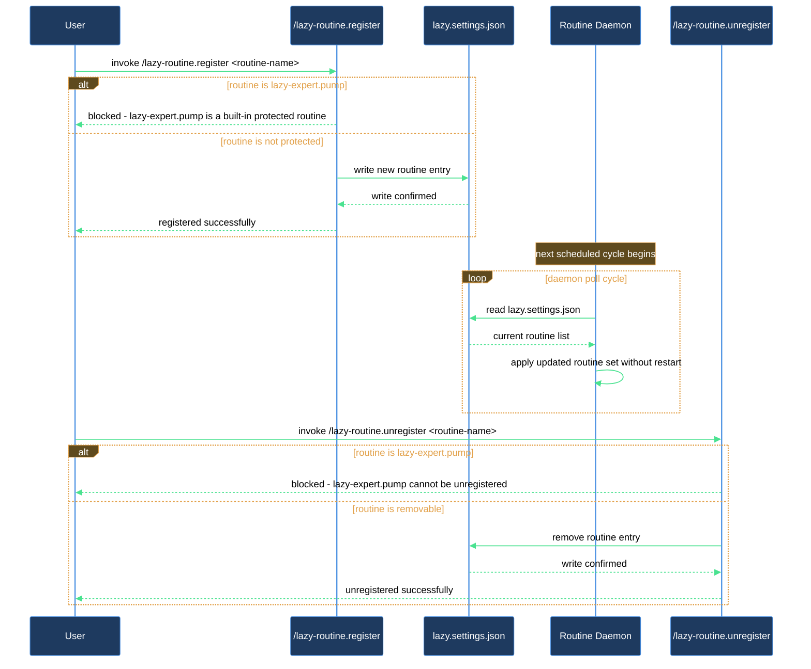

# Register a periodic routine with the runtime daemon

The runtime daemon runs registered plugin routines in serial order on a schedule you control — no two routines ever contend over the working tree or git state. This walkthrough shows you how to add a routine for your plugin, verify the daemon has picked it up, and remove it cleanly when you no longer need it. The two skills involved are `/lazy-routine.register` (a type-aware wizard that validates and writes to `lazy.settings.json`) and `/lazy-routine.unregister` (an idempotent removal that protects the built-in `lazy-expert.pump`).

## Outcome

After this walkthrough your routine is running on its configured cadence inside the daemon. The routine's name appears in `routines` in `.claude/lazy.settings.json`, the daemon picks it up on its next cycle without a restart, and you know exactly how to remove it cleanly when it is no longer needed.

## What you need

- `lazycortex-core` installed in the project with the expert runtime enabled (`/lazy-core.install` with daemon opt-in complete, `run.sh` present).
- `.claude/lazy.settings.json` already bootstrapped and writable — re-run `/lazy-core.install` if it is absent.
- A dot-namespaced routine name in `<plugin>.<verb>` form (e.g. `lazy-review.tick`, `acme-lint.sweep`).
- For `inbox`-type routines: the inbox directory must be gitignored (the wizard will offer to add it if it is not).

## The journey

### Step 1 — Pick the routine type

Before running the wizard, decide which of the five types fits what your routine does. The daemon runs all routines serially — one at a time — so every type shares the same no-contention guarantee.

- **subprocess** — run a CLI command on a fixed interval (e.g. every 300 seconds). Use this for lint sweeps, data refreshes, or any periodic shell invocation. Required fields: `command` (list), `interval_sec`.
- **inbox** — watch a directory, dispatch one expert job per file found, and move processed files out. Use for async fan-out patterns where files arrive asynchronously. Required fields: `inbox_dir`, `expert`, `request`, `interval_sec`.
- **schedule** — fire once per cron boundary (5-field cron expression). Use when wall-clock timing matters more than a fixed cadence. Required fields: `cron`, and either `command` or `expert` + `request` (exactly one).
- **git** — watch a branch for new commits, new files, changed files, deleted files, or renamed files and dispatch a job per item. Use for post-commit automation scoped to a remote branch. Required fields: `branch`, `watch`, `expert`, `request`, `interval_sec`.
- **md-scan** — scan markdown files matching vault-relative globs, filter by frontmatter values, and dispatch one agent job per match. Files are edited in place — no file move. Use for frontmatter-driven automation where a flag in the file drives processing (e.g. `request_status: draft` triggers a review pass). Required fields: `paths` (list of globs), `frontmatter_filter` (dict), `agent`, `interval_sec`.

### Step 2 — Run the register wizard

Run `/lazy-routine.register`. The wizard asks for a name, then the type, then the type-specific fields in sequence.

For a `subprocess` routine the minimal exchange looks like:

```
Name:         lazy-review.tick
Type:         subprocess
Command:      ["python3", "bin/review_tick.py"]
interval_sec: 300
```

For an `inbox` routine, the wizard additionally checks whether `inbox_dir` is gitignored. If it is not, it offers to append the path to `.gitignore` — accept this. Inbox routines move files between iterations; a tracked inbox directory dirties the working tree and triggers the daemon's halt protection.

For an `md-scan` routine, the wizard asks for the glob list, the frontmatter filter dict, and the agent to dispatch. A `null` filter value matches files where the key is absent — useful for picking up files that have never been processed.

The skill validates the `<plugin>.<verb>` naming pattern and the per-type schema before writing anything. If validation fails it aborts with a clear message — fix the reported field and re-run.

### Step 3 — Confirm the routine is registered

After the wizard completes it prints:

```
registered routine `<name>` (type=<type>, <key params>)
```

To double-check, read the `routines` key via `/lazy-core.doctor`, or re-run `/lazy-routine.register` with the same name — it will refuse with "already registered", which confirms the entry exists.

### Step 4 — Let the daemon pick it up

No restart is needed. The daemon re-reads `lazy.settings.json` at the start of every sleep cycle. On the next cycle after registration it begins scheduling the new routine according to its `interval_sec` or `cron` expression.

If the daemon is not yet running, start it with:

```
./run.sh
```

If the daemon has halted on a dirty working tree, run `/lazy-runtime.recover` to walk through cleanup and clear the halt block before starting.

### Step 5 — Verify the routine runs

For `subprocess` routines, watch for the command's output in the daemon's log (standard output of `./run.sh`). For `inbox`, `git`, and `md-scan` routines, the daemon dispatches agent jobs — use `/lazy-expert.list-jobs` to confirm jobs are appearing after the first cycle fires.

### Step 6 — Remove the routine when no longer needed

Run `/lazy-routine.unregister <name>` (e.g. `/lazy-routine.unregister lazy-review.tick`).

The skill checks the settings file, prints a confirmation, and removes the entry. Unregistering a routine that does not exist is a no-op — the skill prints an INFO message and exits cleanly without an error.

The built-in `lazy-expert.pump` routine is protected from accidental removal. Attempting to unregister it without `--force` aborts with a warning. Only pass `--force` if you intentionally want to stop expert-job processing; re-run `/lazy-core.install` to restore it.

The daemon picks up the removal on its next cycle — no restart needed.

## After you're done

Your routine is no longer in `routines` and the daemon will skip it from the next cycle forward. The plugin that owned the routine should re-register it during its next install (via `/lazy-core.install` or `/lazy-core.setup`) if you want it back. Run `/lazy-core.doctor` at any time to verify the current routine registry and daemon state are consistent.

## How registration and pickup flow


