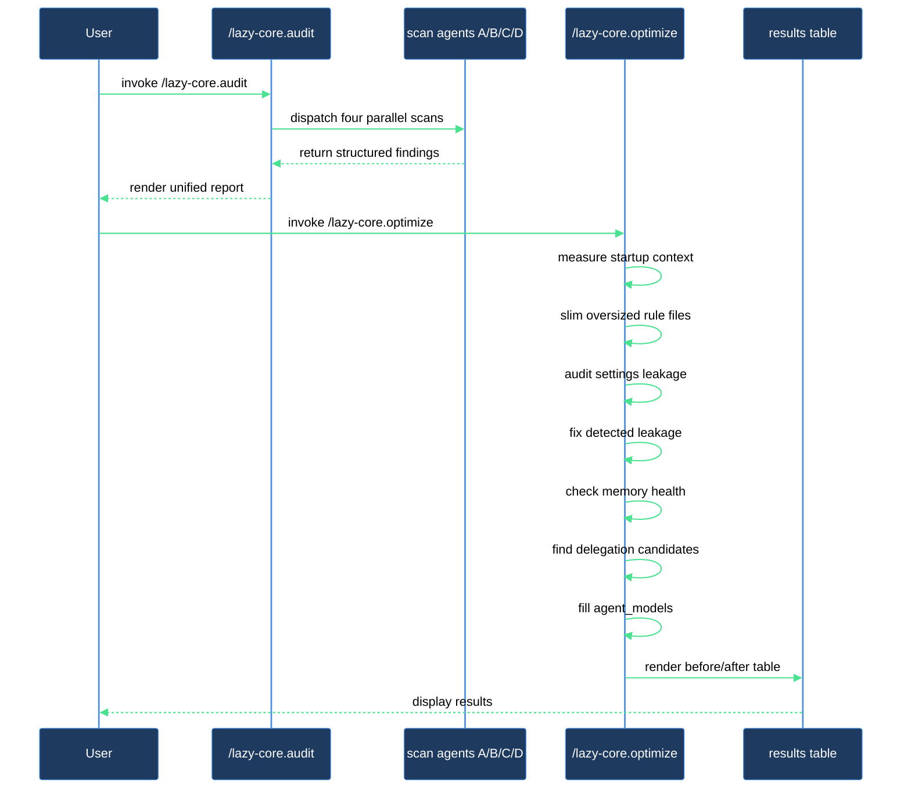

# Slim your startup context

Claude Code loads certain files into every conversation the moment it starts: your global and project `CLAUDE.md`, always-loaded rule files (those without a `paths:` scope), and your memory index. If that pile grows large enough — through rule files that crept past 3 KB, global settings that accumulated project-specific permissions, or a memory index that was never trimmed — every turn pays the token cost. The result is a session that feels slower and less precise.

The fix is a two-command sequence: measure first with `/lazy-core.audit`, then act with `/lazy-core.optimize`.

## What you need

- `lazycortex-core` installed and enabled in `~/.claude/settings.json`.
- Claude Code restarted at least once after installation.
- A git repo as the working directory (the skills read project-local config from `.claude/`).
- Python 3.8 or later in your PATH — the audit checks this for you and flags it if missing.

## The flow

### Step 1 — Run the audit

Type `/lazy-core.audit` and wait for the report. The skill dispatches four parallel scan agents and then renders the results in one pass without making any changes.

The report has two cost-facing tables:

- **Always loaded** — everything that enters context on every turn, sorted by size. A rule file appearing here without a `paths:` key in its frontmatter loads unconditionally.
- **On-demand** — agents, skills, commands, and scoped rules. These load only when referenced, so they do not add per-turn cost.

Below those tables you will see findings for path hygiene, naming hygiene, skill- and rule-writing compliance, MCP enablement, model routing gaps, help-doc staleness, and expert runtime health. `[FAIL]` findings are structural violations; `[WARN]` findings are recommendations.

Look at the **Recommendations** section at the bottom. Any rule file flagged as over 3 KB, any `python3` version warning, and any settings-leakage note are the inputs to the next step.

### Step 2 — Run the optimizer

Type `/lazy-core.optimize`. The skill works through ten ordered phases and asks for your confirmation before writing anything.

The phases you will interact with most:

**Phase 2 — Fix oversized rules files.** For each rule file over 3 KB, the skill classifies every section as either a *constraint* (a prohibition or invariant every session needs) or *reference* material (tables, examples, procedures). It shows you the classification before touching anything. On confirmation, it rewrites the rule file down to a bullet-list of constraints targeting under 2 KB, and moves the reference sections into the corresponding agent definition under `## Reference:` headings. The before/after size comparison appears immediately after.

**Phase 2.5 — LLM-readability audit.** Scans the same files for constructs that look clear on a page but hurt LLM comprehension: decision-logic tables, abstract-header tables, narrative preamble, restated cross-references without anchors, decorative markers, and long explanatory paragraphs. For each finding you choose: apply the suggested rewrite, skip it for now, or waive it permanently.

**Phases 3 and 4 — Settings leakage.** The skill reads your global `~/.claude/settings.json` and classifies every entry as either genuinely global (universal allow/deny rules, model config, plugin enablement) or project-specific (service permissions, `additionalDirectories` entries, domain-specific tool access). Project-specific entries found in the global file get moved into your project's `.claude/settings.local.json` and removed from the global file. Both files are validated as valid JSON after each edit.

**Phase 5 — Memory index health.** Checks whether your memory index is over 5 KB, finds orphaned files (present on disk but not indexed), and finds broken links (indexed but missing on disk). Orphans and broken links are fixed automatically; oversized or stale entries are flagged for your review.

**Phase 6 — Heavy-scan delegation audit.** Inspects your skills for ones that do multiple independent file-tree scans before any user interaction. These are candidates to refactor into a coordinator-plus-parallel-agents pattern. This phase reports findings only — it never rewrites skills. The count appears in the results table so you can decide which to tackle separately.

**Phase 7 — Fill agent_models.** Delegates to `/lazy-core.agent-models`, which walks you through assigning a model tier (haiku, sonnet, opus, or default) to every dispatchable subagent that does not yet have an entry in `lazy.settings.json`. This is the last interactive phase, so by the time you finish it the optimization pipeline is complete.

### Step 3 — Review the results table

At the end, `/lazy-core.optimize` prints an Optimization Results table with before/after sizes for always-loaded context, a count of settings entries moved, memory issues resolved, LLM-readability rewrites applied, delegation candidates surfaced, and agent model entries added. This is the record of what changed.

## After you're done

Re-run `/lazy-core.audit` to confirm the always-loaded total dropped. The two tables should now show rule files well under 3 KB and no settings-leakage warnings. If anything looks off — a rule file that should be scoped is still appearing in the always-loaded table, or `python3` is still flagged — run `/lazy-core.doctor` for a deeper health check that also verifies hook wiring and plugin version currency.

The settings moves and rule rewrites are file changes. Review them with `git diff` before committing so you can verify the classifier made the right calls on each section.

## How audit and optimize work together

