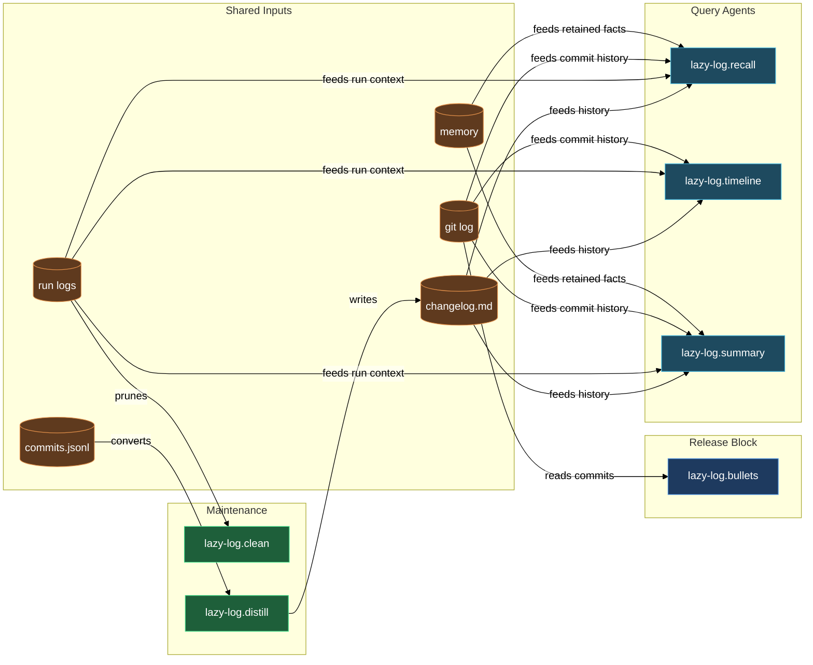

# Change history and run-log housekeeping

Every skill run, commit, and changelog entry your project accumulates is a
potential source of truth — but only if the logs stay tidy and you can query
them. The change-history block covers both sides of that equation. On the
housekeeping side, `/lazy-log.clean` classifies and prunes the `.logs/claude/`
tree so orphaned directories from renamed or retired skills do not pile up.
On the query side, `lazy-log.distill` rolls raw commit entries into themed
prose; `lazy-log.recall`, `lazy-log.timeline`, and `lazy-log.summary` answer
"why was X changed?" and "what happened last week?" by searching changelog,
run logs, git history, and memory in one pass; and `lazy-log.bullets` converts
a commit range into user-facing release notes ready to prepend to
`CHANGELOG.public.md`.

## When you'd use this

- Your `.logs/claude/` directory has grown folders whose names no longer match
  any skill or agent in the vault (renamed, merged, or retired artifacts leave
  orphaned directories behind).
- After a series of commits you want the internal changelog to catch up —
  readable summaries grouped by theme, not raw commit subjects.
- You need to answer "why did we change the auth middleware?" or "when did the
  logging rule land?" without manually grepping git log, the changelog, and run
  logs in sequence.
- You want a day-by-day timeline of everything that touched a particular area
  of the codebase last week.
- You want to understand the full arc of a feature or refactor across all
  sources, not just the chronology.
- You are drafting a plugin release and need the commit range translated into
  user-facing bullets, with internal chore/refactor commits automatically
  filtered out.

## How it fits together

`/lazy-log.clean` is the starting point for log hygiene. It reads every
immediate subdirectory of `.logs/claude/`, resolves the live canonical name set
from your vault, and classifies each directory into one of five buckets:
canonical (still active), rename-candidate (close match to a current name),
pattern-clustered orphan (anonymous task-N or subagent-task-N folders),
waivered (a skill that still exists but now carries a logging waiver and left
residual logs behind), or other orphan. For canonical folders whose newest log
is more than 30 days old, it also flags them as stale and asks what to do with
them. For each non-canonical or stale directory it prompts you — one question
at a time — whether to merge, distill to memory before deleting, delete
outright, or leave alone. Substantive logs can be pushed into Hindsight project
memory before the folder disappears, so the record survives the cleanup.
Nothing on disk changes until you have answered every prompt.

`lazy-log.distill` is the engine behind the internal changelog. It runs
automatically after meaningful commits per the `lazy-log.logging` rule, or you
can invoke it on demand. The agent reads pending entries from
`.logs/commits.jsonl` (written by the `lazy-log.commit-recorder` hook on every
successful commit), groups them by Conventional-commits scope or keyword
cluster, and writes functional 1-3 sentence paragraphs into
`.logs/changelog.md` using a theme-first layout. Each theme block is bumped to
the top of the file when touched, so the most recently active areas stay
visible. A 4-hour throttle prevents noisy same-session re-runs; pass `force`
to bypass it.

`lazy-log.recall` answers point-in-time questions: "why was X changed?" or
"when did we touch Y?". You give it a natural-language query; it decomposes
the query into keywords, searches the changelog, run logs,
`.logs/commits.jsonl`, git log (both message and diff-content search), and
project memory files, ranks matches by source quality, deduplicates by SHA,
and returns a table of top matches with the git SHAs you need to
`git show <sha>` for the full context.

`lazy-log.timeline` takes a date range or topic and produces a chronological
(newest-first by default) day-by-day listing of everything that matches, drawn
from the same four sources. It is the right tool when you want a "what happened
when" overview — a sprint retrospective view rather than a per-question lookup.

`lazy-log.summary` aggregates every match for a topic and synthesizes a
multi-paragraph narrative: why the work started, what was done, what issues
came up, and where it ended up. Unlike `recall` (point-in-time) and `timeline`
(chronological), `summary` clusters by sub-theme and writes prose for a reader
who was not there. Supporting references with SHAs back every claim.

`lazy-log.bullets` is the release-time tool. You dispatch it with a plugin
name, the commit range since the last release, the new version, and the date.
It reads the commits, drops anything that is purely internal (chore, style,
test, docs-sync, dev-tooling), rewrites the survivors as outcome-led bullets
grouped by scope, and returns a formatted `### <version> — <date> UTC` block
ready to prepend to `CHANGELOG.public.md`. The coordinator that dispatches it
handles prepending; `lazy-log.bullets` only generates the block.

## Common adjustments

- To bypass the distill throttle after a burst of commits, invoke `lazy-log.distill` with `force` in the prompt, or ask Claude to distill manually.
- `lazy-log.clean` holds deletions in memory until you have answered every prompt; if you change your mind, the cleanest path is to abort and re-run — no changes land until the final apply step.
- `lazy-log.recall` broadens automatically by including plural/singular variants and obvious synonyms; if the result set is too wide, add a more specific keyword in a follow-up.
- `lazy-log.bullets` expects the coordinate-style input (plugin, plugin_dir, range, new_version, date) and is typically dispatched by the `/pub.pre-commit` or publish pipeline rather than invoked directly.

## How the members fit together

## See also

- [runtime](../runtime.md) — the daemon and routine system that drives `lazy-log.distill` on a cadence.
- [memory](../memory.md) — `lazy-log.clean`'s distill-to-memory path calls into the same Hindsight memory that persona-marked experts use.
