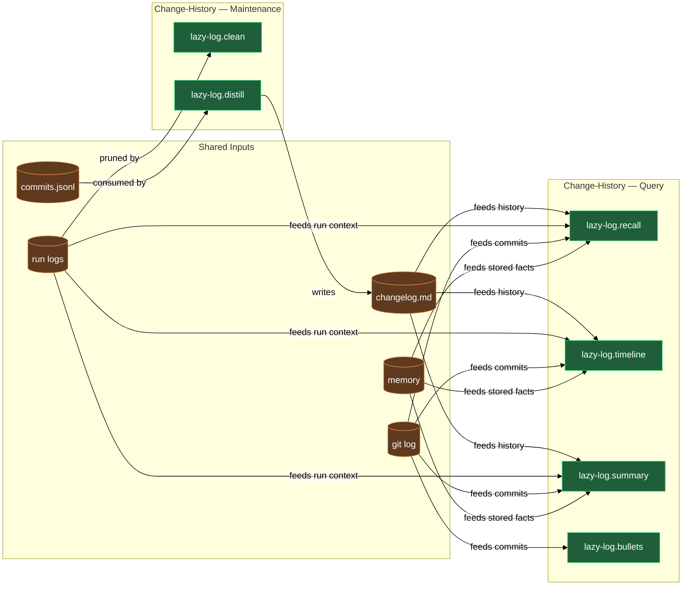

# Change history and run-log housekeeping

Every skill run, commit, and changelog entry your project accumulates is a potential source of truth — but only when the logs stay tidy and you can query them. This block covers both sides: `/lazy-log.clean` keeps the `.logs/claude/` tree free of orphaned directories left behind by renamed, retired, or now-waivered skills; `lazy-log.distill` turns raw commit entries into themed prose in `.logs/changelog.md`; and three search agents (`lazy-log.recall`, `lazy-log.timeline`, `lazy-log.summary`) answer "why was X changed?" or "what happened last week?" by searching the changelog, run logs, git history, and memory in one pass. A sixth member, `lazy-log.bullets`, steps outside the query flow entirely: at release time it converts a commit range into ready-to-paste user-facing release notes.

## What's in this block

**`lazy-log.clean`** is the interactive log-tree janitor. It resolves the live set of canonical skill, agent, and command names from your vault, then classifies every subdirectory of `.logs/claude/` into five buckets: canonical, rename-candidate (fuzzy-matched against a known name), pattern-clustered orphan (anonymous `task-N` or `subagent-task-N` folders), waivered (a skill that still exists but now carries a `logging-waiver`), or other orphan. For each non-canonical or stale folder it asks — one question at a time — whether to merge into the canonical folder, distill substantive logs into Hindsight project memory before deletion, delete outright, or leave alone. Nothing on disk changes until you have answered every prompt.

**`lazy-log.distill`** is the engine behind `.logs/changelog.md`. After meaningful commits it runs automatically per the `lazy-log.logging` rule, or you can invoke it on demand. It reads pending entries from `.logs/commits.jsonl` (written by the `lazy-log.commit-recorder` hook on every successful commit), groups them by Conventional-commits scope or keyword cluster, and writes functional 1–3 sentence paragraphs into the changelog using a theme-first layout. Each theme block bumps to the top of the file when touched, so the most recently active areas stay visible. A 4-hour throttle prevents noisy same-session re-runs.

**`lazy-log.recall`** answers point-in-time questions: "why was X changed?" or "when did we touch Y?". You give it a natural-language query; it decomposes the query into keywords (including plural and singular variants and obvious synonyms), searches the changelog, run logs, `.logs/commits.jsonl`, git log (both message and diff-content search), and project memory, ranks matches by source quality, deduplicates by SHA, and returns a table of top matches with the git SHAs you need to `git show <sha>` for full context.

**`lazy-log.timeline`** takes a date range or topic — or both combined — and produces a chronological, newest-first, day-by-day listing of everything that matches, drawn from the same sources. It is the right tool when you want a "what happened when" overview rather than a specific answer. If no date range is given it defaults to the last 7 days.

**`lazy-log.summary`** aggregates every match for a topic and synthesizes a multi-paragraph narrative: why the work started, what was done, what issues came up, and where it ended up. Unlike `recall` (point-in-time) and `timeline` (chronological), `summary` clusters by sub-theme — design decisions, implementation phases, issues encountered, follow-up work — and writes prose for a reader who was not present. Every claim is backed by a supporting SHA reference, and gaps in the historical record are called out explicitly.

**`lazy-log.bullets`** is the release-time tool. You dispatch it with a plugin name, the commit range since the last release, the new version, and the date. It reads the commits, drops anything purely internal (chore, style, test, docs-sync), rewrites the survivors as outcome-led bullets grouped by scope, and returns a formatted `### <version> — <date> UTC` block ready to prepend to `CHANGELOG.public.md`. The coordinator that dispatches it handles the actual file prepend; `lazy-log.bullets` only generates the block.

## How they work together

The block divides into two groups: **maintenance** and **querying**.

On the maintenance side, `/lazy-log.clean` and `lazy-log.distill` are the keepers of record quality. Run `/lazy-log.clean` when `.logs/claude/` has accumulated folders from renamed, retired, or now-waivered skills — it removes the noise without destroying historical value, offering a distill-to-memory path for any logs worth keeping. Run `lazy-log.distill` on demand (or let it run automatically after commits) to keep the internal changelog current; without recent distillation the query agents fall back to raw `.logs/commits.jsonl` entries and miss the functional prose that makes recall searches fast and accurate.

On the query side, the three search agents draw from the same four sources — changelog, run logs, raw commits, git log — and differ only in their output shape:

| Agent | Best for |
|---|---|
| `lazy-log.recall` | A specific question: "who changed the auth middleware?" |
| `lazy-log.timeline` | A window in time: "what happened last week?" |
| `lazy-log.summary` | The full arc: "tell me the whole story of the logging refactor" |

All three return git SHAs so you can `git show <sha>` to inspect the exact change. `lazy-log.recall` broadens its search automatically by including plural and singular variants and obvious synonyms; narrow it by passing more specific keywords in a follow-up prompt.

`lazy-log.bullets` sits outside the normal query flow. It is dispatched by the publish pipeline when drafting a release and needs the git commit range for one plugin translated into what a user installing the plugin would actually care about. Internal chore commits are filtered out automatically; what surfaces is a ready-to-paste release block.

## Common adjustments

- To bypass the distill throttle after a burst of commits, include `force` or `manual catch-up` (case-insensitive) in your prompt to `lazy-log.distill`.
- `/lazy-log.clean` holds all deletions in memory until you have answered every prompt; if you change your mind mid-run, abort and re-run — no changes land until the final apply step.
- `lazy-log.bullets` expects coordinate-style input (`plugin`, `plugin_dir`, `range`, `new_version`, `date`) and is typically dispatched by the publish pipeline rather than invoked directly.

## Where this fits

- [runtime](runtime.md) — the daemon and routine system that drives `lazy-log.distill` on a cadence.
- [memory](memory.md) — `/lazy-log.clean`'s distill-to-memory path writes into the same Hindsight memory that persona-marked experts use.

## How the members fit together

