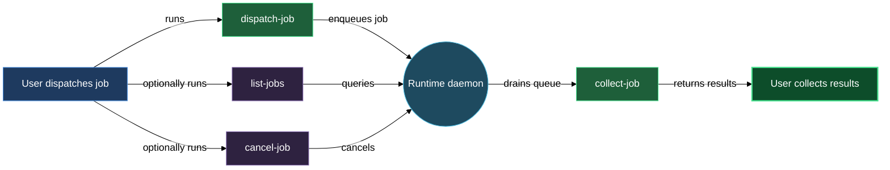

# Expert workers — dispatch, keep working, collect later

The experts block lets you hand a long-running task to a named specialist worker and come back for the result when it is ready. You run `/lazy-expert.dispatch-job`, receive a `job_id` and `queue_path` in seconds, and carry on with whatever else you are doing. The runtime daemon — a persistent process you start once with `./run.sh` — drains the queue on its own: it picks up each queued job, spawns the configured expert agent, waits for it to finish, and writes the result. When you want the output, you run `/lazy-expert.collect-job` with the `job_id`. The main session is never blocked waiting for expert work.

Each expert is a named role defined in `lazy.settings.json[experts]` at install time. The role carries its own system prompt and tool allowlist, so a `designer` expert and a `reviewer` expert behave differently even though the same daemon runs both. The daemon runs one job at a time per repo, which means no two experts ever contend over the working tree or git state.

## When you'd use this

- You want to run a lengthy review, doc-generation, or analysis task without holding the main session open the whole time.
- You have multiple jobs in flight and want a status snapshot before deciding which result to retrieve first.
- You dispatched a job but your requirements changed — you want to cancel it before the daemon starts it.
- You need to filter the queue by expert name or status to locate a specific job.
- The daemon marked a job `dead` (an unrecoverable error during launch) and you need to identify which job failed before re-dispatching.
- You want to check whether a job is still `queued`, already `active`, or has reached `done` or `failed` without attempting to collect it yet.

## What's in this block

**`/lazy-expert.dispatch-job`** is the entry point into the async team. You supply the expert name, the job payload (kind, role, and request are required; source, context, and result arrays are optional file references), and an optional list of protocol refs. The skill validates the payload, writes the job directory under `.experts/.jobs/<expert_name>/`, and returns `{job_id, queue_path}` immediately. From that point the main session is free.

**`/lazy-expert.list-jobs`** gives you a live snapshot of every job in the queue, sorted oldest-first. Each row shows expert, job_id, status, and age. The five statuses map directly to what the daemon writes to disk: `queued` (READY marker present, no PID — waiting to be picked up), `active` (READY + PID — daemon is running it now), `dead` (DEAD marker present — unrecoverable launch error), `done` (DONE marker + successful response.json), and `failed` (DONE marker + error outcome in response.json). Pass `expert=<name>` or `status=<value>` to narrow the listing. Use this before collecting to confirm a job has finished, or to locate a `job_id` you have lost track of.

**`/lazy-expert.collect-job`** retrieves the result for a specific job. You supply the expert name and job_id; the skill returns `{status, response}`. When status is `done` it lists the result file paths from `response.json` so you can read them directly. When status is `pending` the daemon has not finished yet — run the skill again later. When status is `failed` it prints the error from `response.json`. When status is `missing` the job directory does not exist — verify the job_id and expert_name, or re-dispatch.

**`/lazy-expert.cancel-job`** removes a job directory. For any job that has not yet completed it warns that the daemon may already be processing the job (the skill cannot yet distinguish queued-not-started from actively-running) and asks for confirmation before deleting. For jobs that are already done it asks whether you want to discard the result. Nothing is deleted until you confirm.

## How it fits together

You start every interaction with `/lazy-expert.dispatch-job`. The skill validates inputs, checks that `.experts/` is bootstrapped, and hands the job to the runtime daemon's queue. Because dispatch returns in seconds with a `job_id`, you can dispatch several jobs in a row — each goes to its respective expert queue and the daemon processes them in order.

While jobs run, `/lazy-expert.list-jobs` is your view into the pipeline. Check it at any point — immediately after dispatching to confirm the job is `queued`, or later to see whether the daemon has moved it to `active` and then to `done`. Narrow to one expert with `expert=<name>` when you have several workers configured, or filter to `status=active` if you want to know whether the daemon is currently busy. Note that `/lazy-expert.collect-job` reports `pending` for any job the daemon has not yet finished (whether `queued` or `active`); use `list-jobs status=active` to distinguish the two.

When you see a job reach `done` status in the list, run `/lazy-expert.collect-job` to retrieve the output. If the result status is `pending`, the daemon is still working — call again in a moment. If it comes back `failed`, read the error and check `transcript.jsonl` in the job directory for the full subprocess output.

`/lazy-expert.cancel-job` fits in before collection: if you dispatched a job and then changed your mind — the requirements shifted, a source file moved, or you noticed the wrong expert was targeted — cancel it, fix the issue, and dispatch a fresh job. The skill asks for confirmation in all non-trivial cases so you do not accidentally discard completed work.

## Common adjustments

- **Add file references to the dispatch payload.** Pass `source` for files the expert should read as primary input, `context` for background material, and `result` for paths where the expert should write its output. These arrays flow through to the expert agent via the protocol contract.
- **Verify the expert name before dispatching.** If you mistype the expert key, `/lazy-expert.dispatch-job` aborts with "`<expert_name>` is not registered in `lazy.settings.json[experts]`." Confirm the name with `/lazy-expert.list-jobs` (all known experts appear in the table) or check `lazy.settings.json` directly.
- **Filter the job list by expert.** `/lazy-expert.list-jobs expert=<name>` is the fastest way to check the queue for one worker when you have several experts configured.
- **Filter by status.** Pass `status=queued` to see jobs waiting to be picked up, `status=active` to confirm the daemon is currently working, `status=dead` to surface jobs the daemon could not launch, or `status=failed` to find jobs with error outcomes.
- **Re-dispatch a failed job.** If `/lazy-expert.collect-job` returns `status: failed`, read the error from `response.json` and check `transcript.jsonl` in the same job directory for the full expert subprocess output. Fix the underlying issue (e.g. a missing source file), cancel the failed job with `/lazy-expert.cancel-job`, and dispatch a new one.
- **Give an expert persistent aspects or fixed arguments.** Each expert in `lazy.settings.json[experts]` can carry an `aspects[]` list of behavior layers (for example, `lazycortex-core:lazy-memory.persona-aspect` to give an expert private long-term memory) and an `arguments` dict of named values that are injected into every job automatically. To modify them, run `/lazy-core.install` to re-run the expert wizard, or run `/lazy-memory.mark-persona <expert>` to opt into the memory aspect specifically.
- **Add or reconfigure expert roles.** Each expert's prompt and tools are set in `lazy.settings.json[experts]`. Run `/lazy-core.install` to re-run the expert wizard and update that file.

## See also

- [runtime](runtime.md) — the per-repo serial daemon that drives the expert queue; start here if the daemon is not running or the working tree is halted.
- [memory](memory.md) — per-expert long-term memory; opt an expert in with `/lazy-memory.mark-persona` and let it grow over runs.
- [setup-expert](walkthroughs/setup-expert.md) — end-to-end walkthrough: add a named expert, dispatch your first job, list the queue, and collect the result.
- [add-memory-to-expert](walkthroughs/add-memory-to-expert.md) — opt an existing expert into the memory subsystem and run the first reflect pass.

## How the pieces fit together

</content>
