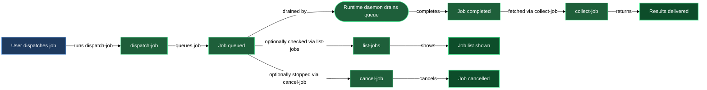

# Expert workers — dispatch, keep working, collect later

The experts block lets you hand a long-running task to a named specialist worker and come back for the result when it is ready. You run `/lazy-expert.dispatch-job`, receive a `job_id` and `queue_path` in seconds, and carry on with whatever else you are doing. The runtime daemon — a persistent process you start once with `./run.sh` — drains the queue on its own: it picks up each queued job, spawns the configured expert agent, waits for it to finish, and writes the result. When you want the output, you run `/lazy-expert.collect-job` with the `job_id`. The main session is never blocked waiting for expert work.

Each expert is a named role defined in `lazy.settings.json[experts]` at install time. The role carries its own system prompt and tool allowlist, so a `designer` expert and a `reviewer` expert behave differently even though the same daemon runs both. The daemon runs one job at a time per repo, which means no two experts ever contend over the working tree or git state.

Collection is **fail-closed**: an expert's response is only ever read as a success when its `response.json` explicitly says so. A response that is missing, malformed, or simply omits the `outcome` field is reported as `failed`, not `done` — the runtime never infers success from silence. A third outcome, `deferred`, exists for work an expert deliberately postponed: it leaves every input untouched and expects to be asked again later. `/lazy-expert.collect-job` and `/lazy-expert.list-jobs` both surface `deferred` as its own status, distinct from both `done` and `failed`.

## When you'd use this

- You want to run a lengthy review, doc-generation, or analysis task without holding the main session open the whole time.
- You have multiple jobs in flight and want a status snapshot before deciding which result to retrieve first.
- You dispatched a job but your requirements changed — you want to cancel it, whether it is still queued or already running.
- You need to filter the queue by expert name or status to locate a specific job.
- The daemon marked a job `dead` (an unrecoverable error during launch) and you need to identify which job failed before re-dispatching.
- You want to check whether a job is still `queued`, already `active`, or has reached a terminal status (`done`, `deferred`, or `failed`) without attempting to collect it yet.

## What's in this block

**`/lazy-expert.dispatch-job`** is the entry point into the async team. You supply the expert name, the job payload (kind, role, and request are required; source, context, and result arrays are optional file references), and an optional list of protocol refs. The skill validates the payload, writes the job directory under `.experts/.jobs/<expert_name>/`, and returns `{job_id, queue_path}` immediately. From that point the main session is free.

**`/lazy-expert.list-jobs`** gives you a live snapshot of every job in the queue, sorted oldest-first. Each row shows expert, job_id, status, and age. The statuses map directly to what the daemon writes to disk: `queued` (READY marker present, no PID — waiting to be picked up), `active` (READY + PID — daemon is running it now), `cancelled` (a CANCELLED marker was written — outranks every other marker), `dead` (DEAD marker present — unrecoverable launch error), `done` (DONE marker + a response that explicitly reports a finished outcome), `deferred` (DONE marker + the expert's reserved `outcome: deferred` — work postponed, its input left untouched), and `failed` (DONE marker + everything else: an explicit error outcome, or a response missing/malformed/without an `outcome` field). Pass `expert=<name>` or `status=<value>` to narrow the listing. Use this before collecting to confirm a job has finished, or to locate a `job_id` you have lost track of.

**`/lazy-expert.collect-job`** retrieves the result for a specific job. You supply the expert name and job_id; the skill returns `{status, response}`. When status is `done` it lists the result file paths from `response.json` so you can read them directly. When status is `pending` the daemon has not finished yet — run the skill again later. When status is `deferred` the expert postponed the work on purpose and left its input untouched; nothing was consumed, so you can safely leave it queued and check again later, or investigate why it deferred. When status is `failed` it prints the error from `response.json` — this covers both an explicit `outcome: error` and a response that skipped the `outcome` field entirely. When status is `missing` the job directory does not exist — verify the job_id and expert_name, or re-dispatch.

**`/lazy-expert.cancel-job`** stops a job without losing the record. For a job that is still queued or already running, it confirms, then stops the executor (SIGTERM, a grace period, then SIGKILL if needed) and marks the bundle `CANCELLED`. For a job that already finished, it confirms and marks it cancelled without touching the result. Either way the job directory — request, response, transcript — stays on disk for forensics; nothing is ever deleted, and the dedup key is released so a fresh dispatch with the same key starts a clean job.

## How it fits together

You start every interaction with `/lazy-expert.dispatch-job`. The skill validates inputs, checks that `.experts/` is bootstrapped, and hands the job to the runtime daemon's queue. Because dispatch returns in seconds with a `job_id`, you can dispatch several jobs in a row — each goes to its respective expert queue and the daemon processes them in order.

While jobs run, `/lazy-expert.list-jobs` is your view into the pipeline. Check it at any point — immediately after dispatching to confirm the job is `queued`, or later to see whether the daemon has moved it to `active` and then to a terminal status. Narrow to one expert with `expert=<name>` when you have several workers configured, or filter to `status=active` if you want to know whether the daemon is currently busy. Note that `/lazy-expert.collect-job` reports `pending` for any job the daemon has not yet finished (whether `queued` or `active`); use `list-jobs status=active` to distinguish the two.

When you see a job reach `done` status in the list, run `/lazy-expert.collect-job` to retrieve the output. If the result status is `pending`, the daemon is still working — call again in a moment. If it comes back `deferred`, the expert chose not to act this time and left its input exactly where it was; nothing needs cleanup on your side. If it comes back `failed`, read the error and check `transcript.jsonl` in the job directory for the full subprocess output — remember that `failed` also covers a response that simply forgot to report an `outcome`, so a blank-looking error can mean the expert's response was malformed rather than that it hit a real failure.

`/lazy-expert.cancel-job` fits in whenever you change your mind — the requirements shifted, a source file moved, or you noticed the wrong expert was targeted. It works even on a job the daemon is actively running: it stops the executor, marks the bundle cancelled, and releases the dedup key so you can dispatch a fresh job with the same identity right away. Nothing is deleted, so the original request and any partial response stay available if you need to see what happened. The skill asks for confirmation in every non-trivial case so you do not cancel by accident.

## Common adjustments

- **Add file references to the dispatch payload.** Pass `source` for files the expert should read as primary input, `context` for background material, and `result` for paths where the expert should write its output. These arrays flow through to the expert agent via the protocol contract.
- **Verify the expert name before dispatching.** If you mistype the expert key, `/lazy-expert.dispatch-job` aborts with "`<expert_name>` is not registered in `lazy.settings.json[experts]`." Confirm the name with `/lazy-expert.list-jobs` (all known experts appear in the table) or check `lazy.settings.json` directly.
- **Filter the job list by expert.** `/lazy-expert.list-jobs expert=<name>` is the fastest way to check the queue for one worker when you have several experts configured.
- **Filter by status.** Pass `status=queued` to see jobs waiting to be picked up, `status=active` to confirm the daemon is currently working, `status=cancelled` to review jobs you stopped, `status=dead` to surface jobs the daemon could not launch, `status=deferred` to find work an expert postponed on purpose, or `status=failed` to find jobs with error or malformed outcomes.
- **Re-dispatch a failed job.** If `/lazy-expert.collect-job` returns `status: failed`, read the error from `response.json` and check `transcript.jsonl` in the same job directory for the full expert subprocess output. Fix the underlying issue (e.g. a missing source file), cancel the failed job with `/lazy-expert.cancel-job`, and dispatch a new one.
- **Leave a deferred job alone unless you need the work done now.** A `status: deferred` job left its input untouched on purpose — it is not stuck and it is not an error. If the underlying condition the expert was waiting on has changed, re-dispatch; otherwise it is safe to leave queued.
- **Give an expert persistent aspects or fixed arguments.** Each expert in `lazy.settings.json[experts]` can carry an `aspects[]` list of behavior layers (for example, `lazycortex-core:lazy-memory.persona-aspect` to give an expert private long-term memory) and an `arguments` dict of named values that are injected into every job automatically. To modify them, run `/lazy-core.install` to re-run the expert wizard, or run `/lazy-memory.mark-persona <expert>` to opt into the memory aspect specifically.
- **Add or reconfigure expert roles.** Each expert's prompt and tools are set in `lazy.settings.json[experts]`. Run `/lazy-core.install` to re-run the expert wizard and update that file.

## See also

- [runtime](runtime.md) — the per-repo serial daemon that drives the expert queue; start here if the daemon is not running or the working tree is halted.
- [memory](memory.md) — per-expert long-term memory; opt an expert in with `/lazy-memory.mark-persona` and let it grow over runs.
- [setup-expert](walkthroughs/setup-expert.md) — end-to-end walkthrough: add a named expert, dispatch your first job, list the queue, and collect the result.
- [add-memory-to-expert](walkthroughs/add-memory-to-expert.md) — opt an existing expert into the memory subsystem and run the first reflect pass.

## How the pieces fit together

```mermaid
%%{init: {'themeVariables':{'background':'transparent','lineColor':'#000','textColor':'#000','edgeLabelBackground':'#fff'},'themeCSS':'.edgeLabel{background-color:transparent!important}.edgeLabel p{background-color:transparent!important}','flowchart':{'diagramPadding':5,'useMaxWidth':true}}}%%
flowchart LR
  userDispatchesJob[User dispatches job]
  dispatchJob[dispatch-job]
  jobQueued[Job queued]
  runtimeDaemon([Runtime daemon drains queue])
  jobCompleted[Job completed]
  collectJob[collect-job]
  resultsDelivered[Results delivered]
  listJobs[list-jobs]
  jobListShown[Job list shown]
  cancelJob[cancel-job]
  jobCancelled[Job cancelled]

  userDispatchesJob -->|runs dispatch-job| dispatchJob
  dispatchJob -->|queues job| jobQueued
  jobQueued -->|drained by| runtimeDaemon
  runtimeDaemon -->|completes| jobCompleted
  jobCompleted -->|fetched via collect-job| collectJob
  collectJob -->|returns| resultsDelivered
  jobQueued -->|optionally checked via list-jobs| listJobs
  listJobs -->|shows| jobListShown
  jobQueued -->|optionally stopped via cancel-job| cancelJob
  cancelJob -->|cancels| jobCancelled

  classDef entry fill:#1e3a5f,stroke:#4a90e2,color:#fff
  classDef action fill:#1e5f3a,stroke:#4ae290,color:#fff
  classDef success fill:#0d4d2a,stroke:#4ae290,color:#fff,stroke-width:2px

  class userDispatchesJob entry
  class dispatchJob action
  class jobQueued action
  class runtimeDaemon action
  class jobCompleted action
  class collectJob action
  class resultsDelivered success
  class listJobs action
  class jobListShown success
  class cancelJob action
  class jobCancelled success
```
