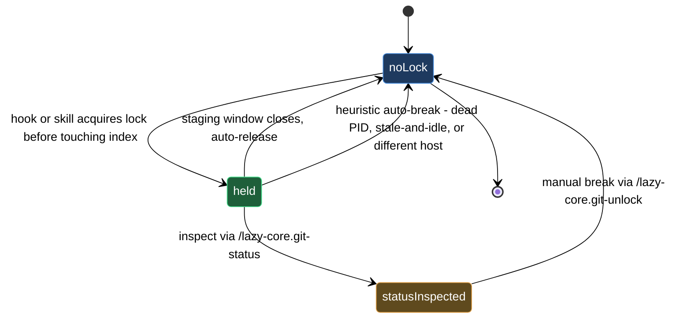

# git staging coordination

When multiple lazycortex hooks and skills are active in the same repo, they can all reach for the git index at the same moment — a pre-commit scan, a model-router dispatch, and a pre-commit pipeline step may all try to stage or read index state concurrently. Without coordination those overlapping writes corrupt the index or cause one operation to silently overwrite another's staged changes.

The staging lock prevents that. Before any hook or skill modifies the index it acquires `.git/lazy-git.lock`, does its work, then releases it. Anything that arrives while the lock is held waits or yields rather than ploughing ahead. The automatic heuristics — dead PID, idle index for too long, session on a different host — handle most stuck-lock situations without intervention. This block covers the two moments you reach for directly: reading the current lock state with `/lazy-core.git-status`, and breaking a stuck lock by hand with `/lazy-core.git-unlock` when the heuristics don't apply.

## When you'd use this

- A commit or hook appears to hang and you want to confirm whether the staging lock is the cause before reaching for a heavier tool.
- `/lazy-core.doctor` surfaces a stale-lock warning and you want to inspect the holder before deciding whether to act.
- A Claude Code session was interrupted mid-staging-window — crash, forced kill, IDE restart — and you want to verify the PID is dead before breaking the lock yourself.
- You want to confirm the lock has already cleared before re-triggering a blocked operation.

## What's in this block

**`/lazy-core.git-status`** is a pure read-only inspector. It reads `.git/lazy-git.lock` and reports everything relevant about the current holder: session ID and PID, how long the lock has been held, when the index was last touched, whether the holder process is still alive on this host, and whether the automatic break-the-lock heuristics would fire right now. It also tells you whether the lock belongs to the current session or a peer. Running it is always safe — it never writes, never deletes, and never modifies any state.

**`/lazy-core.git-unlock`** is the manual break-glass. It runs the same inspection internally, presents the holder details — session ID, PID, age, host, branch, liveness — in a confirmation prompt, and force-deletes `.git/lazy-git.lock` on your approval. The lock file lives under `.git/` and is never tracked by git, so this operation has no effect on your working tree or staged changes. It is the only blessed way to clear the lock manually; do not delete the lock file directly. The skill's confirmation step means you can invoke it without having run `/lazy-core.git-status` first — all the same facts surface in the prompt.

## How they work together

Start with `/lazy-core.git-status`. Three outcomes are possible:

- **"Lock: NONE"** — nothing is held. Whatever stall you were seeing has already resolved; no action needed.
- **"Breakable: YES"** — the heuristics already qualify this lock for removal (dead PID, stale-and-idle, or different host). The next hook invocation will auto-break it; you do not need to act, but you can run `/lazy-core.git-unlock` immediately if you would rather not wait.
- **"Breakable: NO (within thresholds)"** — the holder process appears alive and the lock is not yet stale. If you have independent knowledge that the holder has genuinely abandoned the staging window — the session crashed, the Claude Code instance that held it is no longer running — reach for `/lazy-core.git-unlock`.

When you run `/lazy-core.git-unlock`, confirm at the prompt, and the lock is gone. Any queued operation resumes on its next attempt. Cancel, and nothing changes.

If you are uncertain whether the holder is truly stuck, run `/lazy-core.git-status` again after a few seconds. The "Held for" counter will increment; if the index-touch timestamp is also advancing, the holder is still active and you should not interrupt it.

## Common adjustments

The automatic break-the-lock thresholds — how long before "stale-and-idle" fires and the idle-index grace period — are controlled by `lazy.settings.json` under the `git` key. If you want to disable the lock entirely for a single-session repo where concurrent sessions never occur, add `{"git": {"enabled": false}}` to `<repo>/.claude/lazy.settings.json`. With that flag present the hook short-circuits on every call and the lock becomes a no-op. Re-enable by removing the key or setting it to `true`.

## Where this fits

The staging lock is an infrastructure layer that the rest of the lazycortex-core block set depends on silently — the pre-commit pipeline, the install-and-audit lifecycle, the runtime daemon, and the expert job queue all pass through it. On a healthy day the lock appears for a fraction of a second and disappears without you noticing. It becomes relevant when a commit or hook appears to hang, when `/lazy-core.doctor` surfaces a stale-lock warning, or when `/lazy-runtime.recover` notes a staging-lock conflict as part of a daemon halt.

## Lock lifecycle

</content>
