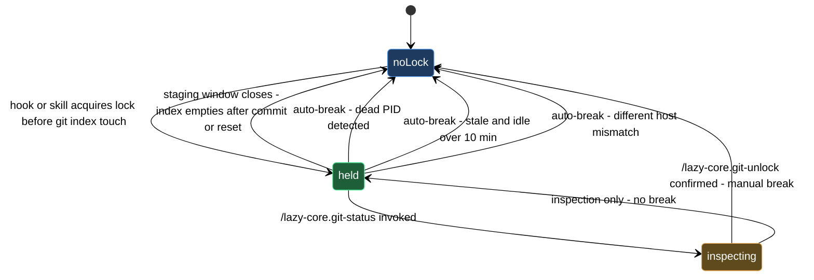

# git staging coordination

When multiple lazycortex hooks and skills are active in the same repo they can all reach for the git index at the same moment — a `lazy-guard.check-public` pre-commit scan, a model-router dispatch, a pre-commit pipeline step. Without coordination those concurrent writes corrupt the index or cause one operation to silently overwrite another's staged changes.

The staging lock prevents that. Before any hook or skill modifies the index it acquires `.git/lazy-git.lock`, does its work, then releases it. Anything that arrives while the lock is held waits or yields rather than ploughing ahead. On a healthy day the lock appears for a fraction of a second and disappears without you noticing. This block covers the two moments when you need to interact with it directly: reading the current lock state with `/lazy-core.git-status`, and breaking a stuck lock by hand with `/lazy-core.git-unlock` when the automatic heuristics don't apply.

## When you'd use this

- A commit or hook appears to hang and you want to know whether the staging lock is the cause before reaching for a heavier tool.
- `/lazy-core.doctor` surfaces a stale-lock warning and you want to inspect the holder before deciding whether to act.
- A session was interrupted mid-staging-window — crash, forced kill, IDE restart — and you want to confirm the PID is dead before breaking the lock.
- You want to verify the lock has already cleared before re-triggering a blocked operation.

## How it fits together

Start with `/lazy-core.git-status`. It reads `.git/lazy-git.lock` and prints everything relevant about the current holder: session ID and PID, how long the lock has been held, when the index was last touched, whether the holder process is still alive on the same host, and whether the automatic break-the-lock heuristics would fire if another operation arrived right now. It also tells you whether the current session owns the lock or whether it belongs to a peer. It never writes, never deletes, and never modifies anything — running it is always safe.

Three outcomes are possible:

- **"Lock: NONE"** — nothing is held. Whatever stall you were seeing has already resolved; no action needed.
- **"Breakable: YES"** — the heuristics already qualify this lock for removal (dead PID, stale-and-idle, or different host). The next hook invocation will auto-break it; you don't need to act, but you can run `/lazy-core.git-unlock` immediately if you'd rather not wait.
- **"Breakable: NO (within thresholds)"** — the holder process appears alive and the lock is not yet stale. If you have independent knowledge that the holder has genuinely abandoned the staging window — the session was interrupted, the Claude Code instance that held it is no longer running — reach for `/lazy-core.git-unlock`.

When you run `/lazy-core.git-unlock`, it runs the same inspection internally and presents the holder details — session ID, PID, age, host, branch, liveness — in a confirmation prompt. You do not need to cross-reference the status output separately. Confirm, and the lock is gone and any queued operation resumes on its next attempt. Cancel, and nothing changes.

If you are uncertain whether the holder is truly stuck, run `/lazy-core.git-status` again after a few seconds. The "Held for" counter will increment; if the index-touch timestamp is also advancing, the holder is still active and you should not interrupt it.

## Common adjustments

The automatic break-the-lock thresholds — how long before "stale-and-idle" fires, and the idle-index grace period — are configurable in `lazy.settings.json`. If you find the defaults too aggressive or too conservative for your workflow, run `/lazy-core.install` and navigate to the git-guard configuration section. The skill writes the threshold fields; do not edit `lazy.settings.json` directly for this.

If you work in a single-session repo where the lock is only ever held by one session at a time, you can disable the lock entirely by running `/lazy-core.install` and toggling off the git-guard option. The lock becomes a no-op and the hook short-circuits on every call.

## Where this fits

The staging lock is an infrastructure layer that the rest of the lazycortex-core block set depends on silently — the pre-commit pipeline, the install-and-audit lifecycle, and the expert runtime daemon all pass through it. You will not interact with this block on a healthy day. It becomes relevant when a commit or hook appears to hang, when `/lazy-core.doctor` surfaces a stale-lock warning, or when `/lazy-runtime.recover` notes a staging-lock conflict as part of a daemon halt.

## Lock lifecycle

