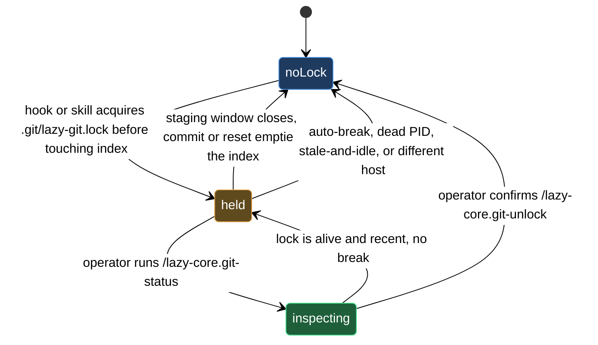

# git staging coordination

Your git index is not Claude Code's to sweep up. When you have files staged for something else — a manual commit-in-progress, a partial `git add` you're still curating — a careless agent commit could snapshot all of it in one bare `git commit`. `lazy-core.git-guard` is the hook that stops that from happening, and it runs one of two independent behaviours per repo: **pathspec discipline**, on by default, which requires every Claude Code commit to name its files explicitly and leaves everything else in the index alone; or the **staging-window mutex**, an opt-in per-repo lock that instead serializes concurrent Claude Code sessions racing to stage at the same time. This block covers what each row means for you, and the two skills — `/lazy-core.git-status` and `/lazy-core.git-unlock` — you reach for when the mutex row is active and a lock looks stuck.

## When you'd use this

- You notice Claude Code always commits with explicit file paths and never runs `git commit -am` or `git add .`, and you want to understand why — this is the default pathspec discipline protecting whatever you already have staged.
- You want to go back to the older lock-based behavior (or turn coordination off entirely) for a repo where you know only one Claude Code session ever touches it.
- In a repo running the mutex row: a commit or hook appears to hang and you want to confirm whether the staging lock is the cause before reaching for a heavier tool.
- `/lazy-core.doctor` surfaces a stale-lock warning and you want to inspect the holder before deciding whether to act.
- A Claude Code session was interrupted mid-staging-window — crash, forced kill, IDE restart — and you want to verify the PID is dead before breaking the lock yourself.
- You want to confirm a lock has already cleared before re-triggering a blocked operation.

## What's in this block

**Pathspec discipline** is not a skill you invoke — it's the default behavior of every Claude Code git action in your repo. A new file gets registered with `git add -N <path>` (no content staged) rather than a plain `git add`; a rename or delete happens as a plain filesystem `mv`/`rm` rather than `git mv`/`git rm`, both of which auto-stage; and every commit names its paths explicitly (`git commit -m "..." -- <path> <path>`) rather than going bare, `-a`, or against a directory. The two exceptions are a commit mid-merge/rebase/cherry-pick (git itself refuses a partial commit there) and `--amend` against a clean index or with its own pathspec. Anything that would snapshot content you didn't ask Claude Code to touch is refused outright, with a message telling the agent to rephrase — never to bypass with `--no-verify` or a raw wrapper. The guard also only judges commands against the repo they actually target — a command that points at a different checkout (its own `-C <dir>` resolving elsewhere) is left alone, so it stays out of the way of tooling that manages other repos alongside yours.

**The staging-window mutex** is the older, opt-in behavior: a per-repo lock at `.git/lazy-git.lock` that serializes the interval from the first staging action to the commit that empties the index, so two concurrent Claude Code sessions never corrupt each other's staged changes. It only takes effect once you've turned pathspec discipline off for that repo (see Common adjustments) — the two rows don't run at the same time.

**`/lazy-core.git-status`** is a pure read-only inspector, useful only on the mutex row. It reads `.git/lazy-git.lock` and reports the current holder's session ID and PID, how long the lock has been held, when the index was last touched, whether the holder process is still alive on this host, and whether the automatic break-the-lock heuristics would fire right now. On the default pathspec row it reports "Lock: N/A" and explains no staging window is ever opened. Running it is always safe — it never writes, deletes, or modifies any state.

**`/lazy-core.git-unlock`** is the manual break-glass for the mutex row. It runs the same inspection internally, presents the holder details in a confirmation prompt, and force-deletes `.git/lazy-git.lock` on your approval. The lock file lives under `.git/` and is never tracked by git, so this has no effect on your working tree or staged changes. On the pathspec row it reports the same "no staging window" state and stops without asking anything.

## How they work together

Which row is active for a repo comes down to one setting your Claude Code session doesn't decide for itself — `/lazy-core.install` seeds it. By default `git.pathspec_enabled` is `true`, so pathspec discipline runs and the two lock skills are dormant. If you (or an older install) have `git.pathspec_enabled` set to `false`, the mutex takes over instead, and that's when `/lazy-core.git-status` and `/lazy-core.git-unlock` do real work.

On the mutex row, start with `/lazy-core.git-status`. Three outcomes are possible:

- **"Lock: NONE"** — nothing is held. Whatever stall you were seeing has already resolved; no action needed.
- **"Breakable: YES"** — the heuristics already qualify this lock for removal (dead PID, stale-and-idle, or different host). The next hook invocation will auto-break it; you don't need to act, but you can run `/lazy-core.git-unlock` immediately if you'd rather not wait.
- **"Breakable: NO (within thresholds)"** — the holder process appears alive and the lock isn't yet stale. If you have independent knowledge that the holder has genuinely abandoned the staging window — the session crashed, the Claude Code instance that held it is no longer running — reach for `/lazy-core.git-unlock`.

Run `/lazy-core.git-unlock`, confirm at the prompt, and the lock is gone; any queued operation resumes on its next attempt. Cancel, and nothing changes. On the mutex row, a session also can't end its own turn with staged changes still sitting in the index from its own work — it gets nagged to commit or unstage first, so a stray lock left behind by an abrupt session end is rare.

## Common adjustments

`/lazy-core.install` writes the `git` section of `<repo>/.claude/lazy.settings.json` with three keys the first time it runs, and only fills in whichever of them are still absent on a re-run — `enabled` (master kill-switch, default `true`), `pathspec_enabled` (default `true`), and `mutex_enabled` (default `true`, but dormant while `pathspec_enabled` is `true`). Because they're plain tunables rather than a skill-managed schema, you edit them directly:

- **Go back to the older lock-based behavior** — set `"pathspec_enabled": false` in the `git` section. `mutex_enabled` is already `true` by default, so the mutex row activates immediately.
- **Turn coordination off entirely for a single-session repo** — set `"enabled": false`. The hook short-circuits on every call; both rows become a no-op.
- **Tune how quickly a stuck mutex lock is treated as stale** — `max_hold_seconds` and `max_idle_seconds` in the same section, relevant only once you're on the mutex row.

## Where this fits

Pathspec discipline is silent infrastructure — it applies to every git action Claude Code takes in your repo, whether you notice it or not, and its only visible effect is that agent commits always name their files. The staging mutex, when a repo opts into it, is what the rest of the lazycortex-core surface leans on for concurrent-session safety — the pre-commit pipeline, the install-and-audit lifecycle, the runtime daemon, and the expert job queue all pass through it. It becomes relevant when a commit or hook appears to hang, when `/lazy-core.doctor` surfaces a stale-lock warning, or when `/lazy-runtime.recover` notes a staging-lock conflict as part of a daemon halt.

## Lock lifecycle

```mermaid
%%{init: {'themeVariables':{'background':'transparent','transitionColor':'#000','transitionLabelColor':'#000','labelBackgroundColor':'#fff','edgeLabelBackground':'#fff','stateLabelColor':'#fff'},'themeCSS':'.edgeLabel{background-color:transparent!important}.edgeLabel p{background-color:transparent!important}','state':{'diagramPadding':5,'useMaxWidth':true}}}%%
stateDiagram-v2
  [*] --> noLock
  noLock --> held : hook or skill acquires .git/lazy-git.lock before touching index
  held --> noLock : staging window closes, commit or reset empties the index
  held --> noLock : auto-break, dead PID, stale-and-idle, or different host
  held --> inspecting : operator runs /lazy-core.git-status
  inspecting --> held : lock is alive and recent, no break
  inspecting --> noLock : operator confirms /lazy-core.git-unlock
  style noLock fill:#1e3a5f,stroke:#4a90e2,color:#fff
  style held fill:#5f4a1e,stroke:#e2a14a,color:#fff
  style inspecting fill:#1e5f3a,stroke:#4ae290,color:#fff
```
