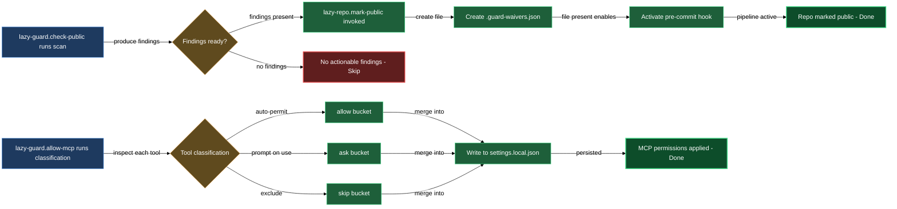

# Public-repo guardrails and MCP permission management

Two problems come up whenever you expand what Claude Code can see or share. First, making a repo public without a prior scan can silently ship secrets, personal email addresses, internal hostnames, or hardcoded local paths — things that are easy to miss in a normal diff review. Second, every new MCP server floods you with per-tool allow prompts until you've classified each one.

The guardian block addresses both. `/lazy-guard.check-public` is a parallel, four-category scanner that catches leaks before they land in a commit. `/lazy-repo.mark-public` wraps that scanner in a guided workflow that resolves every finding, writes the waiver file, and optionally flips GitHub visibility. `/lazy-guard.allow-mcp` classifies each MCP server's tools into three buckets — no-prompt, always-prompt, and default — so you stop deciding the same question on every call. All three skills write to the files they own (`.guard-waivers.json`, `settings.local.json`), so you never hand-edit config to use them.

## When you'd use this

- You're about to make a repo — or a subtree like `claude/**` — public and want to be sure nothing sensitive is tracked.
- You've added a config file, secret-adjacent script, or deploy artifact and want a one-off scan before committing.
- You want the scan to run automatically on every future commit, blocking secrets from landing without review.
- You just added a new MCP server and are getting a prompt on every tool call.
- You want Claude Code to prefer MCP tools over Bash equivalents without the deferred-schema round-trip that causes drift.

## What's in this block

**`/lazy-guard.check-public`** is the scanner. You run it and it dispatches four parallel agents — one for secrets (FAIL severity), one for PII (WARN), one for infrastructure literals (WARN), and one for hardcoded local paths (WARN). It merges their results, deduplicates, applies any waivers recorded in `.guard-waivers.json`, and presents a unified findings report with fix strategies. You can run it standalone at any time for an ad-hoc audit. Once `.guard-waivers.json` exists at the repo root, a pre-commit hook runs the same scan on every staged diff automatically, blocking any commit that contains an unresolved FAIL finding.

**`/lazy-repo.mark-public`** is the guided end-to-end workflow for taking a repo or subtree public. It calls `/lazy-guard.check-public` internally, then walks you through resolving every finding before it proceeds. Once all secrets are cleared it writes `.guard-waivers.json` — which records your waiver decisions and simultaneously activates the pre-commit hook for all future commits — and in whole-repo mode it optionally flips GitHub visibility via `gh`. If you only want a subtree to be public (e.g. `claude/**` ships to the marketplace while the rest of the repo stays private), pass the scope glob: the hook then scans only those paths on every commit, and the GitHub visibility step is skipped entirely.

**`/lazy-guard.allow-mcp`** works independently of the other two. It enumerates every tool the target MCP server exposes in your current session and classifies each one into three buckets: safe or reversible reads and low-risk writes go into `permissions.allow` (no prompt), truly destructive operations go into `permissions.ask` (always prompt), and medium-risk tools are left out of both so Claude Code's default per-call prompt applies when you actually invoke them. Results land in `settings.local.json` — gitignored by default — so your personal permission choices never appear in commits your teammates inherit. For globally defined servers the skill checks existing state and infers the target scope before asking; it only prompts when scope is genuinely undetermined.

## How it fits together

Run `/lazy-repo.mark-public` when you're ready to publish. It calls `/lazy-guard.check-public` internally, surfaces all findings, and guides you through them one by one. FAIL findings (secrets) must be resolved — encrypted, template-ized, or redacted — before the workflow continues. WARN findings (PII, infrastructure literals, local paths) can be fixed or formally waived with a justification. At the end of that process `/lazy-repo.mark-public` writes `.guard-waivers.json`, which immediately arms the pre-commit hook. From that point forward every staged commit is scanned automatically, and you only return to `/lazy-repo.mark-public` if you want to re-examine scope or add waivers interactively.

For day-to-day auditing, run `/lazy-guard.check-public` directly. Run it after adding a config file, after pulling in new dependencies, or on any cadence that fits your workflow. It reads the existing `.guard-waivers.json` — including your accepted waivers — and skips everything already resolved.

Run `/lazy-guard.allow-mcp` once per MCP server, immediately after adding the server to your session. The skill reads the server name from your input, enumerates its live tools, shows you the planned diff (what goes to `allow`, what goes to `ask`, what gets skipped, and any cross-scope cleanup), and writes to the gitignored `settings.local.json`. If you need to revisit a prior classification — for example to promote a tool you previously allowed into the always-prompt bucket — re-run `/lazy-guard.allow-mcp` for that server; any reversal of a prior trust choice requires a per-tool explicit confirmation before it lands.

The three-bucket classifier in `/lazy-guard.allow-mcp` applies at tool granularity, not server granularity: a read-shaped tool on a "dangerous" server still goes to `allow`; a destructive tool on a "safe" server still goes to `ask`. When a tool's risk is ambiguous the classifier skips it, leaving Claude Code's per-call prompt intact. Optionally, the skill also installs a SessionStart preload hook that resolves MCP tool schemas once at session start — roughly 1.1k tokens per session — which stops Claude Code from drifting to Bash equivalents when MCP schemas feel expensive to fetch mid-session. (The alternative, loading all tool schemas upfront without the preload hook, costs roughly 13–16k tokens per session instead.)

## Common adjustments

**Subtree-only publish.** Pass a glob to `/lazy-repo.mark-public` — for example `claude/**` — and it runs in subtree-public mode: it audits only those paths, writes `public_scopes` into `.guard-waivers.json`, and skips the GitHub visibility step. The pre-commit hook then limits its checks to files under those globs on every future commit.

**Re-auditing an already-public repo.** Run `/lazy-guard.check-public` directly. It reads the existing waiver file and scans only the paths in scope. Run it after adding configs, after pulling in new dependencies, or before any release.

**Public author identity.** When the scanner finds your real name in a manifest (B4 check), run `/lazy-repo.mark-public` and confirm the public identity you want to use. It records that as `public_author` in `.guard-waivers.json`; every future B4 match equal to that name auto-waives without a per-file decision.

**Previewing MCP registrations before writing.** Pass `--dry-run` to `/lazy-guard.allow-mcp` and it prints the full planned diff — what goes to `allow`, what goes to `ask`, what gets skipped, and what cross-scope leaks would be cleaned up — without touching any file.

**Reversing a prior allow decision.** Re-run `/lazy-guard.allow-mcp` for the server. If any tool the classifier considers destructive is still sitting in `allow` from a past run, the skill asks you per-tool whether to promote it to `ask`. Your prior `allow` entry is never silently removed — each reversal requires an explicit confirmation.

## See also

- [install-and-audit](install-and-audit.md) — bootstrap the plugin that ships this block; the pre-commit hook is a Python script installed by `/lazy-core.install`.
- [make-repo-public](walkthroughs/make-repo-public.md) — step-by-step walkthrough that exercises the full `/lazy-repo.mark-public` → `/lazy-guard.check-public` → ongoing hook flow end-to-end.

## How the three skills fit together

