# Install, audit, and maintain lazycortex-core

Every lazycortex plugin ships lifecycle skills — install, audit, doctor, optimize, and setup. For most plugins those skills are scoped to their own rules and config. For `lazycortex-core` the stakes are higher: core ships the shared scaffolding every other plugin assumes is already in place — the rule authoring templates, the `lazy.settings.json` runtime structure, the agent-model routing layer, and the expert runtime daemon. Bootstrapping core is bootstrapping the whole lazycortex baseline.

This block covers all five of core's interactive lifecycle skills, plus two non-interactive maintenance agents — `lazy-core.autosetup` and `lazy-core.autocheckup` — for driving the same install and checkup logic across many repos without stopping for questions. The order the interactive skills run in and the way they build on each other is what matters; the two agents are a separate, unattended path for repos that already have their first-run decisions on record.

**Prerequisite:** all lazycortex plugins require Python 3.12 or later. `/lazy-core.install` verifies this at Step 0 and aborts with install instructions if the floor is not met — nothing else in this block runs until Python 3.12+ is available.

## What's in this block

**`/lazy-core.install`** is the foundation step. Run it once per project (or globally) right after enabling the plugin and restarting Claude Code. It syncs every rule template the plugin ships into the correct rules directory, copies authoring templates into `.claude/templates/core/`, and bootstraps the scaffold registry. It then seeds `lazy.settings.json` with the three built-in agent-model routing defaults and adds `.logs/`, `.runtime/`, and `.lazyignore` to the repo. It also seeds two `lazy-core.git-guard` behaviour flags into the same tracked settings file, project scope only — `pathspec_enabled` (commits must name their paths, so the shared git index stays the operator's rather than snapshotting whatever else was parked there) and `mutex_enabled` (the staging-window mutex, dormant while pathspec mode is on) — both defaulting to `true`. An operator value already on record is left untouched; on a repo upgrading from an older install, newly writing `pathspec_enabled: true` is a real behaviour change — bare `git commit`, `git add` with content, `git rm`, and `git mv` stop working for agents — so the skill calls this out in its report along with the rollback (set the flag to `false`) rather than asking about it. After the rules and settings groundwork is in place, it registers expert candidates: any agent file in an enabled plugin that carries `expert_protocol:` frontmatter is added to `lazy.settings.json[experts]` — this happens regardless of whether you use the background daemon, because experts are also dispatched interactively. Alongside that, it fills in Claude model tiers for every agent lazycortex-core itself ships — including the runtime doctor, which carries no `expert_protocol:` frontmatter and would otherwise be invisible to the scan — so those tiers are on record without waiting for the interactive agent-models wizard, and any tier you've already set by hand is left untouched. Step 10.5 bootstraps `.memory/` for the same reason. Step 11.5 optionally seeds LLM-provider entries for expert jobs — skipped silently when a `providers` block already exists anywhere (tracked settings or the gitignored local overlay), otherwise asked once whether to connect an alternative endpoint (a base URL, a token environment variable, and a four-tier model map) for experts whose `provider` field should route away from the Anthropic default; declining writes nothing, and the same wizard is available later via `/lazy-core.providers add`. The runtime layer that follows — built-in routines (the expert pump, an hourly `lazy-runtime.doctor` tick, a five-minute `lazy-core.index-guard` heal, and — once at least one expert is registered — a weekly `lazy-core.autocheckup` pass), `.experts/`, the expert registry, and the spawn sandbox — installs and runs the same way whether or not a background daemon supervises the project: `/lazy-runtime.tick` drives all of it by hand on a checkout that never starts one. Only two things are actually gated on the daemon: the supervisor unit itself (Step 13) and the metrics endpoint it serves in-process (Step 13.6). Two tracked `lazy.settings.json` values decide those two things, and neither is ever asked as a question at install time — `daemon.enabled` (is this project supervised by a background daemon at all, or ticked by hand? — seeded `false` silently the first time it's read, so a project opts in only by someone writing the flag to `true`) and `daemon.run_here` (which machine drives it, and from which checkout on that machine? — recorded as a `{hostname: checkout-path}` map in the same tracked file, never a boolean and never a bare host list, so it travels with the project to every clone; reached only once `daemon.enabled` is true. Neither half decides alone: a boolean can't say which machine answered, and a bare hostname can't say which of that machine's several checkouts of the project should run it. A machine or checkout the map doesn't name gets no supervisor, and the daemon itself refuses to start there even though the project stays `daemon.enabled: true`; re-running install on a host the map excludes tears down any supervisor unit that checkout already has there). When the supervisor does install, it's a launchd or systemd unit named per checkout, keyed by a hash of the checkout's path, so two same-named checkouts don't collide. As part of that same step, when the daemon is enabled it also derives and writes the `daemon.git` block — `base_branch` from the checkout's current branch, plus `remote_sync: pull_push` when an `origin` remote exists — so a daemon-enabled repo actually publishes its routine commits instead of piling them up unpushed in one checkout; it only fills the block when absent, so a hand-tuned value is never overwritten, and `post_push_hook` is left alone as operator territory. Immediately before installing that supervisor, the skill restores any externally-sourced working directories the repo declares in tracked `external_dirs.paths` — bulk data, an inbox, secrets it doesn't carry in git. A fresh clone has the declaration but not the directories; the first time it hits this step on a checkout, it asks once where they live on this machine and records the answer (`external_dirs.root`) in that checkout's gitignored local overlay before linking them into place — on every re-run it reads the record and applies silently. The same step then checks whether this checkout's inbox is already driven by another checkout on the same host — skipping the check entirely on a checkout that could never run a daemon in the first place (`daemon.enabled` false, or `daemon.run_here` not mapping this host to this checkout), since a daemon can't collide with anything where the runtime's own gate already refuses to start one: a collision refuses to install the supervisor here at all, and you decide which checkout keeps it. Step 13.5 offers to write the recommended expert-spawn sandbox allowlist into `.runtime/sandbox.settings.json` and union the matching permissions into `.claude/settings.local.json` — this step is no longer gated on the daemon at all, since the expert pump spawns confined subprocesses under a manual `/lazy-runtime.tick` exactly as it does under a supervised daemon. Step 13.6 stays gated — only for the checkout actually running the daemon (the pair named in `daemon.run_here`) — and offers to provision Prometheus-style metrics: a free loopback port is allocated automatically and reused on re-run, the enablement flag and repo label are written to tracked `lazy.settings.json` (shared across every clone), the allocated port itself goes only into this checkout's gitignored local overlay (a port free on one machine may be taken on another), and a host-wide scrape-targets file is regenerated so an external Prometheus with `file_sd_configs` picks up every enabled checkout on the machine with zero manual edits. The skill is idempotent — re-running after a plugin update picks up new rule templates without clobbering rules you chose to keep local.

**`/lazy-core.audit`** is the read-only context-weight and compliance measurement. It first runs a set of inline logging-compliance checks — confirming the logging rule is installed, `.logs/` and `.runtime/` exist and are gitignored, and any `logging-waiver:` frontmatter carries a concrete reason rather than a placeholder — then dispatches four parallel scan agents. Agent A measures everything that loads at conversation start — CLAUDE.md files, always-loaded rules, and the memory index — sorted by size. Agent B covers on-demand assets, MCP server enablement, Python runtime availability, path hygiene, naming hygiene, and skill/agent/command/rule-writing compliance checks (missing Execution-Discipline preambles, "Optional" headings, narrative padding, broken artifact references, oversize files, non-canonical `paths:` shapes, and a missing `description:` on any skill, agent, or command; it also flags a skill shaped like a bounded search — one that returns a slice of a map, tree, or index rather than the whole document — that's missing the `research:` marker its own shape implies, and any `AskUserQuestion` site in a skill or command whose call isn't preceded by a `Context (print before asking):` block naming where the question comes from, what was found, why it's asking, and what each answer does). Agent C checks help-doc coverage and staleness against each plugin's README scenario list. Agent D audits the expert runtime across sixteen sub-checks: `lazy.settings.json[experts]` schema (D1), agent reference resolution (D2), aspect reference resolution (D8), arguments key and size validation (D9), `.memory/` directory hygiene (D10), flat `daemon`/`routines` section schema (D3) — including whether the repo's `daemon.git` block actually carries a `base_branch`, whatever `daemon.enabled` says — routine command resolvability (D4), orphan job directories (D5), stale completed jobs (D6), daemon liveness (D7), whether the repo's declared external working directories actually resolve on this checkout (D11), whether two checkouts are contesting the same physical inbox (D12), whether the expert-spawn sandbox allowlist in `.runtime/sandbox.settings.json` actually covers every path its own entries resolve to — including a path only reachable through a symlink (D13), whether any `*-protocol.md` reference file declares a response envelope of its own instead of leaving `outcome` to the runtime contract (D14), whether every executable hook in your operator git hooks directory is either named in `daemon.git.allowed_hooks` or deliberately left out (D15), and whether a review class is validated by its own main writer (D16). A protocol that overrides the envelope disarms the runtime silently: the dispatched expert follows the protocol's own status key instead of the runtime's, the response carries no discriminator the pump understands, and every failure the expert reports reads back as success — D14 names the offending file before that first silently-misclassified job ever runs. D15 exists for the same reason from the other direction: the runtime — daemon-supervised or manually ticked via `/lazy-runtime.tick` — runs only the hooks it's told to, so an operator hook written for interactive commits fires for you but never for the runtime's autonomous ones if it's simply unlisted — nothing breaks, but nothing tells you the hook didn't run either. D16 catches a review class whose validation slot names the same expert as its main writer — the same persona checking its own work proves nothing, so the class needs a different validator, or none at all. No changes are made.

**`/lazy-core.doctor`** is the deeper, interactive health check. It dispatches three parallel scan agents to check artifact integrity, config and memory health, and path hygiene across all config files. Artifact integrity also validates any configured LLM-provider entries — an expert's `provider` field naming an entry that doesn't exist, an entry missing its base URL or token variable, a tier map that skips a required tier, or a raw `claude-*` model literal all fail outright, while a token variable that doesn't resolve on this machine warns — so a provider misconfiguration surfaces before an expert job ever tries to spawn against it. After collecting findings it checks plugin version currency against the live marketplace manifest, then scans your settings for naming-canon drift — a routine or expert key left in a pre-canon shape, a hook short name outside the shipped set, a dead key left behind by a retired feature, a bot git-identity off the `@bot.invalid` domain, or a repo missing a sanitizer routine (`lazy-core.autocheckup`, plus review's or wiki's own sanitizer routine when those plugins are configured) — offering an in-place rename, a key deletion, or a re-run of the owning plugin's install per finding. It then applies release-mode suppression — if an installed plugin is outdated, content-level findings on its synced rule files are suppressed until you upgrade, so the version-outdated warning is the only thing you see — and reconciles the rest against your stored per-warning waivers before delegating to sibling audit skills (`lazy-guard.check-public`, `lazy-log.audit`, and plugin-specific audits when those plugins are enabled). It re-runs the full D1–D16 expert runtime sweep inline — including whether declared external directories resolve on this checkout, whether two checkouts are contesting one inbox, whether the expert-spawn sandbox allowlist covers every resolved path, whether a protocol file has disarmed the runtime's response envelope (D14), whether every operator git hook is accounted for under the runtime (D15), and whether a review class is validated by its own main writer (D16). D14, D15, and D16 all surface here now, same as in `/lazy-core.audit` — but none gets an automated fix; edit the flagged protocol file, `daemon.git.allowed_hooks` entry, or the review class's validator list by hand, then re-run either skill to confirm. Then it offers targeted fixes — applying them only after your explicit confirmation — and a per-warning waive loop where each remaining warning can be permanently suppressed with a waiver file. A missing `description:` is reported, never written for you — only you know what the artifact is for. Two of the fix offers are specific to the external-directory feature: one re-links a declared directory that's gone missing, dangling, or points at the wrong target; the other only reports a shared-inbox collision between two checkouts — it never resolves it for you, since deciding which checkout drives it is your call. A further fix offer covers a repo whose `daemon.git` block is still null or missing `base_branch` (a state older installs could leave behind) — confirm once and doctor derives it from the checkout the same way install does. Another re-syncs the expert-spawn sandbox allowlist when D13 finds a resolved path it doesn't cover — the same sync `/lazy-core.install` Step 13.5 offers on a fresh install.

**`/lazy-core.slim-context`** addresses the two most common sources of bloat. For each rule file over 3 KB it classifies every section as a constraint (a prohibition or one-liner fact needed every turn) or reference material (layouts, tables, procedures, API details), shows the classification, and on confirmation rewrites the rule to constraints only and moves reference material into the agent definition. Phase 2.5 runs an LLM-readability audit across all rules, skills, agents, and commands — flagging decision-logic tables, abstract-header tables, narrative preambles, restated cross-references, decorative markers, and long explanatory paragraphs — and offers rewrites with a diff preview per finding. Phase 5.5 adds expert memory hygiene: orphan notes and near-duplicate note pairs within the same expert's `.memory/` directory are surfaced for interactive resolution. On the settings side it audits global `~/.claude/settings.json` for project-specific entries and migrates them to `settings.local.json`. It closes by running `/lazy-core.agent-models` to fill any missing model-routing entries and prune tiers left behind by agents that have since been deleted.

**`/lazy-core.setup`** is the shortcut for a fresh project bootstrap when you have multiple lazycortex plugins enabled. Step 0 migrates `.claude/lazy.settings.json` through the current per-section version ladder before any installer reads or writes it — if migration fails, the run aborts immediately. Then it scans every enabled plugin for `<namespace>.install` skills and any skill opting in via `lazy_setup_phase:` frontmatter, builds a dependency-ordered execution plan with `lazy-core.install` always first, shows a preview, and runs each child in sequence without a top-level confirmation prompt. Children that fail are logged but don't abort the loop; you get one coherent summary at the end. Pass `--dry-run` to see the plan without executing.

**`lazy-core.autosetup`** is the non-interactive twin of `/lazy-core.setup`, built for rolling an install-chain update out across many repos at once instead of running the wizard in each one by hand. You dispatch it (directly, or from your own cross-project rollout loop) with a `repo=<absolute path>` argument; it never asks a question. It refuses to touch a repo with a dirty working tree or an unusable git identity, then walks every applicable `<namespace>.install` skill against the target repo the same way `/lazy-core.setup` would — "applicable" is resolved from the target repo's own enabled plugins (its `settings.json` / `settings.local.json`), never the machine-wide plugin cache, so a repo that enables only two plugins never receives the install chains of plugins enabled elsewhere on the host. A candidate install skill that declares itself `requires_live_session` (it needs loaded MCP tools or another resource only an interactive session has) is skipped and reported as `skipped: live-session-only` rather than executed or failed — a headless agent has no live session to borrow. Any remaining step that skill would normally resolve via `AskUserQuestion` is skipped and reported as `needs-interactive` instead of guessed — that includes `/lazy-core.install`'s Step 12.5 external-directory question the first time a checkout hits it (nothing on record yet). Steps that are derivable or already on record (a persisted `daemon.enabled` gate, an already-configured `external_dirs.root`, an install-managed file mirror, a registry upsert) apply exactly as the skill prescribes — and a plugin-shipped defaults table counts as a recorded decision too: when a step's own skill declares a non-interactive resolution for it, autosetup follows that resolution instead of skipping the step. `/lazy-core.agent-models`, for instance, auto-accepts curated tiers from its `default-tiers.json` table for newly discovered agents — autosetup applies those tiers silently rather than reporting them as `needs-interactive`. Only genuine first-time or preference decisions (a daemon gate never answered, a model tier that isn't in the curated table) still come back `needs-interactive`. It commits its own changes in the target repo under that repo's local identity, with no push. Because it only ever executes decisions that are already recorded or resolvable from a plugin-shipped defaults table, it is not a substitute for the first-time `/lazy-core.install` or `/lazy-core.setup` run — a repo with nothing on record mostly comes back reporting `needs-interactive`.

**`lazy-core.autocheckup`** is the non-interactive twin of the checks `/lazy-core.checkup` orchestrates. Dispatched the same way, with `repo=<absolute path>`, it runs the full read-only audit/doctor sweep against the target repo and collects findings in the usual `PASS` / `WARN` / `FAIL` vocabulary — scoped, like autosetup, to whichever plugins that repo itself has enabled, not every plugin present anywhere on the host machine. It then applies a fix only when the fix is mechanically derivable with no operator preference involved — regenerating an install-managed mirror from its plugin source, creating a directory or registry entry an install skill would create silently, resyncing a derived file from its source of truth, pinning an unpinned agent model whose dispatch string already has a tier in the default-tiers table, pruning an `agent_models` entry whose plugin-namespaced agent file has provably been deleted (a config key for an agent that no longer exists is dead config, not a preference — the one deliberate exception to its usual never-fix-by-deletion boundary), re-linking a declared external working directory that's gone missing, dangling, or points at the wrong target (it never removes real content it finds sitting in a declared path), resyncing the expert-spawn sandbox allowlist when D13 finds a resolved path it doesn't cover, or deriving a repo's missing `daemon.git` block the same way install and doctor's Fix L6 do. If a pruned dispatch is still referenced by an expert's `agent` field, that comes back as a WARN finding instead of being edited. An external directory holding real (non-symlink) content, one whose source no longer exists, one still unconfigured on this checkout, a protocol file flagged by D14, an operator hook flagged by D15, and any inbox collision between two checkouts are all left as reported findings — never applied, since each needs an operator decision. Anything else content-shaped, destructive, preference-shaped, or normally resolved via `AskUserQuestion` is left as a reported finding, never applied. Like autosetup, it refuses a dirty tree, commits only the files it touched under the repo's local identity, and never pushes. Because it's registered as a weekly routine once you have at least one expert (Step 12 of install), a daemon-enabled repo also runs this sweep unattended on a schedule — the same checks and the same conservative fix boundary, just without you having to dispatch it by hand.

## How they work together

The five interactive skills form a directed pipeline. `/lazy-core.install` (or `/lazy-core.setup`) lands first and lays the foundation every other skill assumes: rules in the right directory, `lazy.settings.json` seeded, `.logs/` and `.runtime/` bootstrapped, experts registered. If any rules were created or updated, restart Claude Code before proceeding — rules load only at session start.

Once the installation is complete, `/lazy-core.audit` gives you a read-only snapshot of what is actually loaded. Run it right after install to confirm the rules landed, measure your startup context weight, and see the merged model-routing view. The audit's Agent D sub-checks are the first indication of whether your expert runtime config is structurally sound — including whether declared external directories resolve, whether an inbox is contested, whether the repo's `daemon.git` block is actually complete, whether the expert-spawn sandbox allowlist covers every resolved path, whether a protocol reference file has quietly disarmed the runtime with an envelope of its own, and whether every operator git hook is either wired to run under the runtime or deliberately left out, and whether a review class validates its own main writer; its Agent C sub-checks tell you whether help-doc coverage is current for all your plugins.  Because audit makes no changes, you can run it at any time — after adding a rule, after enabling a new MCP server, before a release.

`/lazy-core.doctor` goes deeper when something feels off. It reads everything the audit reads and more — config consistency across all four settings files, always-loaded context budget (WARN at 20 KB, FAIL at 40 KB), hook registration hygiene, MCP permission wildcard detection, cross-reference integrity, naming-canon drift in your settings (a stale routine or expert key, an out-of-canon hook name, a dead key from a retired feature, a bot identity off the `@bot.invalid` domain, or a missing sanitizer routine), provider-configuration validation, and the full D1–D16 expert runtime sweep. It also checks whether your installed plugins are current against the marketplace manifest and applies release-mode suppression so stale plugin findings don't crowd out the root cause. It offers to restart a stalled daemon, delete orphan job directories, re-link a broken external directory, re-sync the expert-spawn sandbox allowlist, derive a missing `daemon.git` block, unregister routines whose plugin bin path has gone missing, or rename a drifted settings key. Run doctor periodically or whenever the audit surfaces a pattern you want to investigate interactively.

`/lazy-core.slim-context` acts on the cost side. When audit or doctor reports oversized rules or settings leakage, optimize is the remediation path: it slims the rules, moves reference material to the right place, patches settings hygiene, and ensures every agent in your vault has a model-routing tier — pruning any tier left behind for an agent that's since been deleted along the way. Because it rewrites files, always run it after — not before — an audit or doctor pass so you know what you're trimming.

The full journey for a new project: install → restart → audit → doctor if anything looks off → optimize if context is heavy. For an existing project after `/plugin update`: re-run install (or setup) to pick up new rule templates, restart, then audit to confirm the new rules landed cleanly.

`lazy-core.autosetup` and `lazy-core.autocheckup` sit outside that per-project pipeline — they exist for the moment you have many repos that already went through the interactive path once and just need the same update or checkup applied everywhere without repeating the wizard in each one. Point a cross-project rollout loop at each repo path and dispatch the matching agent per repo; each repo's own enabled-plugin set decides what runs there, so repos with different plugin combinations on the same machine never cross-contaminate each other's install chains. Anything that would require a first-time decision comes back as `needs-interactive` for you to resolve the normal way, in that one repo, with the interactive skill.

## Common adjustments

**Project scope vs user scope** — `/lazy-core.install` detects whether the plugin is enabled at user or project scope and installs rules and templates to the matching directory. If you have both scopes, it asks which to target. For most workflows the project scope (`<repo-root>/.claude/`) is correct; user scope (`~/.claude/`) installs the hygiene and security rules into every project without re-running per-repo.

**Running without a daemon at all** — `daemon.enabled` is seeded `false` silently; install never asks about it as a question. With the flag false (or absent), everything installs and runs except the supervisor unit and the metrics endpoint — routines, `.experts/`, the expert registry, the spawn sandbox, and `.memory/` are all in place, driven by `/lazy-runtime.tick` on demand instead of a background process. To turn a project into a daemon-supervised one, set `daemon.enabled: true` in the tracked `lazy.settings.json` and re-run `/lazy-core.install` — it then asks Gate 2 (`daemon.run_here`) to record which machine and checkout should actually run it.

**Running the daemon on only one machine for a file-synced checkout** — `daemon.run_here` is a `{hostname: checkout-path}` map, not a boolean or a host list, so a project synced across machines (Dropbox, iCloud, Syncthing) never risks two daemons: only the one `(hostname, path)` pair named in the map drives it, and the daemon itself refuses to start anywhere else — including a second checkout of the project on the same machine. Re-run `/lazy-core.install` on a host the map doesn't name and it tears down any supervisor unit that checkout already has there, instead of leaving a stray one running.

**Skipping the daemon supervisor while keeping the daemon enabled** — if a project has `daemon.enabled: true` but you'd rather tick this checkout by hand instead of running a supervisor (`bash .claude/bin/lazy.runtime.sh` or `/lazy-runtime.tick`), answer "No — no checkout yet" when `/lazy-core.install` asks Gate 2 (`daemon.run_here`) on this checkout. The runtime layer — routines, `.experts/`, the sandbox — is already fully installed either way; only the supervisor unit and the metrics endpoint are withheld here.

**Adding experts after initial install** — re-run `/lazy-core.install` to pick up newly discovered expert candidates. It filters out already-registered experts so only new candidates are added.

**Connecting an alternative LLM provider for expert jobs** — every expert works against the Anthropic default with no `providers` entry at all. `/lazy-core.install` Step 11.5 asks once, the first time no `providers` block exists anywhere (tracked settings or the gitignored local overlay); declining writes nothing, and `/lazy-core.providers add` runs the same wizard any time later. An entry needs a base URL, a token environment variable, and a four-tier model map, and lives only in the gitignored `.claude/lazy.settings.local.json` — never in tracked settings. `/lazy-core.doctor` validates every configured entry and flags an expert's `provider` field pointing at an unknown name, a missing base URL or token variable, a tier map missing a required tier, or a raw `claude-*` model literal, plus a token variable that fails to resolve on this machine. When a provider-bound job actually spawns, the runtime strips the operator's own `ANTHROPIC_API_KEY` and OAuth token from its environment first, so neither credential can reach a foreign endpoint.

**Configuring the expert-spawn sandbox** — re-run `/lazy-core.install` and confirm Step 13.5 to have the skill write the recommended sandbox block into `.runtime/sandbox.settings.json` (the runtime-owned file passed via `--settings` to every spawned expert subprocess) and union the permissions and `additionalDirectories` scope into `.claude/settings.local.json`. The sandbox and permission files are separate because the sandbox settings apply only to expert-pump spawns — daemon-driven or manually ticked via `/lazy-runtime.tick` — never to your interactive session. If you previously had a `sandbox` key directly in `settings.local.json` (written by an older install), Step 13.5 removes it automatically and moves the block to the correct runtime file.

**Sandbox allowlist missing a resolved path** — `/lazy-core.audit` D13 (and `/lazy-core.doctor`'s inline re-run of the same check) flags when `.runtime/sandbox.settings.json` doesn't cover a path its own entries resolve to — this happens most often when an entry names a directory reached through a symlink, so the allowlist reads correctly while every write through the real path still fails with "Operation not permitted". Accept `/lazy-core.doctor`'s matching fix offer, or re-run `/lazy-core.install` Step 13.5, to resync the allowlist — the sync only appends what's missing and never drops an existing entry.

**A protocol file disarms the runtime** — if `/lazy-core.audit` D14 (or `/lazy-core.doctor`'s Loop runtime section, which folds in the same check) reports `protocol <name> overrides the response envelope`, that `*-protocol.md` reference file declares a status key of its own instead of leaving `outcome` to `lazy-core.expert-runtime-contract.md`. A dispatched expert then follows the protocol's status key over the runtime's, the response carries no discriminator the pump understands, and every failure the expert reports reads back as success. Open the named file and delete the envelope block, keeping only the outcome values it declares under `## Outcome by kind` — the envelope itself always comes from the runtime contract, never from an individual protocol. Neither skill offers an automated fix for this one; re-run either after editing to confirm D14 is clean.

**An operator git hook is silently skipped under the runtime** — `/lazy-core.audit` D15 (and `/lazy-core.doctor`'s Loop runtime section) flags any executable hook in your git hooks directory that isn't named in `daemon.git.allowed_hooks`. This applies to a manually ticked checkout exactly as to a daemon-supervised one — the check runs regardless of `daemon.enabled`. The runtime runs only listed hooks, so an unlisted one keeps firing on your own interactive commits but never on the runtime's autonomous ones — nothing errors, it just silently never runs. Add the hook's filename to `daemon.git.allowed_hooks` if it should gate the runtime's commits too, or leave it out deliberately if it shouldn't (a hook that expects a human at the keyboard, or one that rewrites files after the commit is assembled and would leave the tree dirty).

**A review class is validated by its own main writer** — `/lazy-core.audit` D16 (and `/lazy-core.doctor`'s inline re-run of the same check) flags a `lazy.settings.json[review].classes` entry whose validation slot names the same expert key as its own main writer. The same persona checking its own work proves nothing, so the finding surfaces before a review cycle ever runs on that class. Point the validation slot at a different expert, or drop the slot entirely — a class with no validators is legal. Neither skill rewrites the class for you; expert composition is your call, so fix it in `lazy.settings.json[review.classes]` and re-run either skill to confirm.

**Settings carry a stale key shape after a naming-canon change** — `/lazy-core.doctor` scans `lazy.settings.json` for routine or expert keys left in a pre-canon shape, hook short names outside the shipped set, dead keys left behind by a retired feature, and bot git-identities off the `@bot.invalid` domain, and offers an in-place rename or deletion per finding — nothing is renamed without your confirmation. A repo missing a sanitizer routine (`lazy-core.autocheckup`, plus review's or wiki's own sanitizer routine when those plugins are configured) is reported the same way regardless of whether a daemon supervises it; the fix there is a re-run of that plugin's own install.

**A skill, agent, or command's `description:` won't get it selected** — the audits only verify the field exists (`/lazy-core.audit` flags a missing `description:` as `[FAIL]`); its *content* is an authoring-time concern. Write the line against the three trigger shapes in the plugin's description-trigger reference (`lazy-core.description-triggers.md`): a mechanism-only description — one that states what the artifact does but never when to reach for it — is invisible to the router, so open with the invocation condition and move the mechanism into the body.

**A custom skill or command raises a question with no context block** — if `/lazy-core.audit` flags `AskUserQuestion site without a context block` against a skill or command you authored yourself (not one shipped by a plugin), the call site is missing the short "where / found / why asking / answers" block that should precede any question your own artifact raises. This keeps the person answering from having to reconstruct why they're being asked; add the block immediately before the `AskUserQuestion` call, or — for a paragraph describing a whole class of question rather than one call site — make sure the paragraph itself names all four items.

**Enabling the metrics endpoint** — Step 13.6 only asks once, and only on a checkout where the daemon is actually running (this host and this checkout are the pair named in `daemon.run_here`). If you declined at install time, re-run `/lazy-core.install`: it reads the recorded `daemon.metrics.enabled` flag silently on re-run and never re-asks. To revisit the decision, edit the flag in `lazy.settings.json` and re-run `/lazy-core.install`: it will allocate a port, write the repo label, and regenerate the scrape-targets file. Because the allocated port lives only in this checkout's gitignored local overlay, cloning the repo onto a second machine re-runs port allocation independently rather than inheriting a possibly-taken port.

**Previewing the setup chain** — run `/lazy-core.setup --dry-run` to see the ordered list of install skills that would run, grouped by phase, with no changes applied.

**Filling missing model-routing entries and pruning stale ones** — run `/lazy-core.agent-models` directly (or let `/lazy-core.slim-context` Phase 7 do it) to assign haiku/sonnet/opus tiers to newly discovered agents and remove tiers whose plugin-namespaced agent file has since been deleted, without running the full optimize pipeline. If a deleted agent's dispatch is still referenced by an expert's `agent` field, the wizard reports it as a warning rather than pruning it silently.

**Checking aspect and arguments health** — run `/lazy-core.audit` and look at the Expert runtime section. D8 reports any unresolvable aspect references; D9 flags argument keys that don't match `^[a-z][a-z0-9_]*$` or payloads over 4 KB. D10 reports `.memory/` orphans, persona-mark mismatches, and tag-file drift.

**A declared external directory stays absent after install** — if this repo declares working directories it doesn't carry in git (a `## What's in this block` note above covers what this looks like) and you answered "Leave as is" when asked where they live, the checkout records that decision and never asks again. To revisit it, edit the local `external_dirs.declined` flag in `lazy.settings.local.json` and re-run `/lazy-core.install` — it will ask once more for the absolute source path and link the directories into place.

**Two checkouts want the same inbox** — `/lazy-core.install` refuses to install a supervisor on a checkout whose inbox is already driven by another checkout on the same host (`inbox-conflict`), and `/lazy-core.audit` D12 keeps reporting the collision every run until it's resolved. Neither check fires on a checkout that could never run a daemon anyway — `daemon.enabled` false, or `daemon.run_here` not mapping this host to this checkout (install states `not-this-checkout` and continues to Step 13, whose own gate declines on its own terms) — since the runtime's own start-gate already refuses a daemon there, so there is nothing to contest. Decide which checkout should drive the inbox, then in the project that should back off — since `daemon.run_here` is a `{hostname: checkout-path}` map — either point that host's entry at the other checkout's path or drop the host's key entirely, then run `/lazy-runtime.recover` on the checkout that should keep going — the halt persists across restarts and only clears once the conflicting checkout has backed off.

**Routine commits never get pushed** — this means `daemon.git` is null or missing `base_branch`, a state older installs (before this field was derived automatically) can leave behind; the check applies to a manually ticked checkout exactly as to a daemon-supervised one, since `/lazy-runtime.tick` commits through the same block. Re-run `/lazy-core.install` — Step 9c derives `base_branch` from the checkout's current branch and sets `remote_sync: pull_push` when an `origin` remote exists — or accept the equivalent fix the next time `/lazy-core.doctor` offers it. `/lazy-core.audit` D3 keeps flagging the gap until the block is filled.

**Settings migration failed during setup** — if `/lazy-core.setup` aborts at Step 0, read the captured stderr in the Step 6 report. A non-zero exit typically means a malformed migration callable in the `lazy_settings_migrations/` ladder. Fix the root cause, then re-run `/lazy-core.setup`.

**Stale hook registrations from retired plugins** — if you see references to a `lazycortex-log` plugin path in your hook pipeline, re-run `/lazy-core.install`. Step 8 automatically strips those stale entries from all four standard settings paths.

**Re-running after `git clone`** — rules, templates, `lazy.settings.json`, and `lazy.runtime.sh` are committed into the repo, so both `daemon.enabled` and the `daemon.run_here` map travel with the clone. Only the supervisor units (launchd plist / systemd service) and the allocated metrics port are per-checkout and live outside the tracked file — the units on disk, the port in this checkout's gitignored local overlay. Re-run `/lazy-core.install` after cloning: a clone the map doesn't name reads both gates silently, installs nothing, and tears down any stray unit it finds; only a clone that should take over the daemon edits the map, and install asks once, the first time no host in the map matches this machine.

**Install never re-asks once a decision is on record** — `daemon.enabled` needs no question at all (seeded `false` silently); `daemon.run_here`, once it carries an entry for this host, is read and honoured silently on every re-run. To revisit either, edit or delete the relevant key in the tracked `lazy.settings.json` and re-run `/lazy-core.install`.

**Dev-mode supervisor** — if this repo is a plugin-authoring vault, re-run `/lazy-core.install` and the dev-mode flag is derived automatically (detected by the presence of `plugin.json` files under `claude/`). The supervisor passes `--dev-mode` to `lazy.runtime.sh`, which prefers in-repo plugin sources over the plugin cache — a stale cached copy of the runner is never re-executed once the in-repo one is available. For all other repos the flag is False.

**Settings file auto-migration** — if `/lazy-core.doctor` or `/lazy-core.audit` warns that `lazy.settings.json` has a root `version` key, run any lazy-core skill (such as `/lazy-core.audit`) to trigger the one-time automatic migration: the settings loader rewrites the file to the current per-section `_version` format on its first read and removes the legacy root key.

**Tuning git-guard's pathspec discipline** — `/lazy-core.install` seeds `git.pathspec_enabled` and `git.mutex_enabled` (both default `true`) into tracked `lazy.settings.json`, project scope only, at Step 6.5. Pathspec mode requires every commit to name its paths and blocks bare `git commit`, `git add` with content, `git rm`, and `git mv` for agents working in the repo. If you'd rather fall back to the older mutex-only staging coordination, set `git.pathspec_enabled` to `false` and re-run `/lazy-core.install` — it leaves an operator-set value untouched on every subsequent re-run. `git.enabled` is the master kill-switch for the whole `lazy-core.git-guard` hook.

**A cloud-synced `.git/index` heals itself** — a sync client (Dropbox, iCloud, Syncthing) racing git's write to `.git/index` sometimes resolves the conflict by keeping a stale index under the real name and stashing git's own newer write beside it as `index (<owner>'s conflicted copy <date>)`; the symptom is `git status` showing phantom staged content nobody staged. `/lazy-core.install` Step 12 registers the built-in `lazy-core.index-guard` routine (five-minute interval, runs on a manually ticked checkout exactly as on a supervised daemon, and even during a halt), and the `lazy-core.git-guard` hook also runs the same heal as a pre-flight before every git-touching tool call. Both restore the newest conflicted copy — the version git actually wrote last, any parked operator staging included — back onto `.git/index` and remove the copy litter; nothing is asked and nothing needs configuring. The daemon and `/lazy-runtime.tick` also run every git invocation with `GIT_OPTIONAL_LOCKS=0`, so a background `git status` no longer rewrites the shared index and re-creates the same race. Re-run `/lazy-core.install` on a repo installed before this routine existed to pick it up — Step 12 backfills it into an existing routine set without touching any other routine's configured values.

**Rolling an update out across many repos** — dispatch `lazy-core.autosetup` once per repo path from a cross-project rollout loop rather than running `/lazy-core.setup` interactively in each checkout. It is meant for repos that have already been through a first-time install — it will not make the first-time decisions for you. Each dispatch reads the target repo's own enabled-plugin set, so a rollout loop touching repos with different plugin combinations installs the right chain in each one rather than the union of everything on the machine.

**A repo comes back `needs-interactive` from autosetup or autocheckup** — this means the step it hit is genuinely a first-time or preference decision (a daemon gate never answered, a contradiction in consumer-owned config, a model tier not in the default-tiers table, an unconfigured external directory). Rule and template drift is never one of them — those mirrors are resynced from the shipped source without asking. Open that repo and run the equivalent interactive skill (`/lazy-core.install`, `/lazy-core.setup`, or `/lazy-core.doctor`) once to put the decision on record; subsequent autosetup/autocheckup passes on that repo will apply it silently from then on.

**Autosetup or autocheckup reports `skipped-dirty` or `skipped-identity`** — the target repo had uncommitted changes, or the recorded git identity looked wrong for the repo's remote (e.g. a private-persona email against a public GitHub remote). Neither agent will touch a repo in that state. Commit or stash the working tree, or fix `git config user.email` in that repo, then re-dispatch.

**A plugin enabled in the repo but missing from the machine's plugin cache** — autosetup and autocheckup report that plugin's step as `skipped: plugin not installed on this machine` rather than failing the whole run. Install the plugin through the marketplace on that machine (or run its install chain interactively there), then re-dispatch to pick it up.

## Where this fits

Every other lazycortex plugin assumes that `lazy.settings.json` exists and carries the `agent_models` structure, that the scaffold registry in `.claude/templates/core/` is populated, and that the always-loaded hygiene and security rules are in place. Those are all artifacts of `/lazy-core.install`. Other plugins' own install-and-audit documentation covers their plugin-specific bootstrap, but each starts from a foundation that core has already laid.

The audit and doctor can run at any time without side effects and do not require install to have completed first — though their findings are more meaningful once the plugin is properly bootstrapped.

For public-repo safety, see the **guardian** block: `/lazy-repo.mark-public` creates `.guard-public.json`, which also activates the pre-commit hook for every subsequent commit. For the async expert team, see the **runtime**, **experts**, and **memory** blocks — their setup walkthroughs pick up where this block's install step leaves off. For details on the staging mutex and the pathspec commit discipline `/lazy-core.install` seeds here, see the **git-coordination** block.

## Bootstrap order

```mermaid
%%{init: {'themeVariables':{'background':'transparent','lineColor':'#000','textColor':'#000','edgeLabelBackground':'#fff'},'themeCSS':'.edgeLabel{background-color:transparent!important}.edgeLabel p{background-color:transparent!important}','flowchart':{'diagramPadding':5,'useMaxWidth':true}}}%%
flowchart LR
  bootstrapStart[Start bootstrap]
  pluginCountCheck{Single plugin or multi-plugin?}
  installSetupSingle[Install and setup single plugin]
  installSetupMulti[Install and setup multiple plugins]
  restartNeeded{Restart required?}
  restartClaudeCode[Restart Claude Code]
  runAudit[Run audit]
  optimizeRequested{Optimize requested?}
  runOptimize[Run optimize]
  runDoctor[Run doctor]
  bootstrapComplete[Bootstrap complete]

  bootstrapStart -->|choose path| pluginCountCheck
  pluginCountCheck -->|single plugin| installSetupSingle
  pluginCountCheck -->|multi plugin| installSetupMulti
  installSetupSingle -->|next| restartNeeded
  installSetupMulti -->|next| restartNeeded
  restartNeeded -->|yes| restartClaudeCode
  restartNeeded -->|no| runAudit
  restartClaudeCode -->|resume| runAudit
  runAudit -->|check| optimizeRequested
  optimizeRequested -->|yes| runOptimize
  optimizeRequested -->|no| bootstrapComplete
  runOptimize -->|then| runDoctor
  runDoctor -->|done| bootstrapComplete

  classDef entry fill:#1e3a5f,stroke:#4a90e2,color:#fff
  classDef guard fill:#5f4a1e,stroke:#e2a14a,color:#fff
  classDef action fill:#1e5f3a,stroke:#4ae290,color:#fff
  classDef success fill:#0d4d2a,stroke:#4ae290,color:#fff,stroke-width:2px

  class bootstrapStart entry
  class pluginCountCheck guard
  class installSetupSingle action
  class installSetupMulti action
  class restartNeeded guard
  class restartClaudeCode action
  class runAudit action
  class optimizeRequested guard
  class runOptimize action
  class runDoctor action
  class bootstrapComplete success
```

