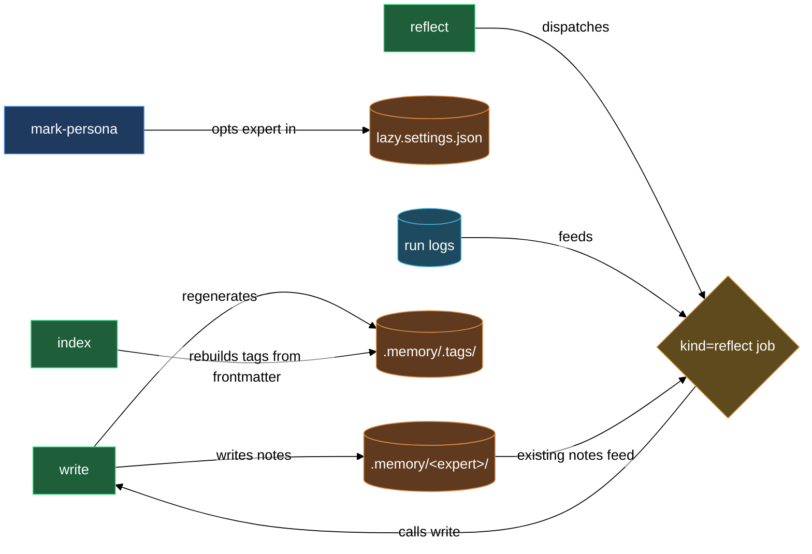

# Expert memory — notes that survive runs

Most experts are stateless: each dispatch starts from a clean context, and patterns discovered in one job vanish before the next. The memory block changes that. An expert opted into the memory subsystem carries a private notebook at `.memory/<expert>/` that travels with the repo in git. Before every job the expert consults its notebook. During a job it may add to it as a side-effect of ordinary work. On a dedicated reflect pass it reviews recent run logs, finds patterns worth keeping, and consolidates them into durable notes. Any teammate can discover what an expert knows by reading the shared global tag index.

Four skills make this possible: one to opt an expert in, one to write notes atomically, one to trigger consolidation, and one to recover if the tag index drifts.

## What's in this block

**`lazy-memory.mark-persona`** is the gate. Until an expert carries the persona aspect, none of the other memory skills will touch it. The skill reads the expert's current entry in `lazy.settings.json`, appends `lazycortex-core:lazy-memory.persona-aspect` to its `aspects[]`, and saves. From the next dispatch onward the expert's runtime context includes the aspect's obligations — consult `.memory/<self>/.tags/*.md` before primary work, write notes only through `/lazy-memory.write`, handle `kind=reflect` jobs when dispatched. The skill is idempotent: re-running on an already-marked expert reports the current state and stops.

**`lazy-memory.write`** is the only path for creating or updating notes. It validates the note's frontmatter (`title`, `tags`, `type`, `summary`), picks a non-colliding slug from the title, writes the file under `.memory/<expert>/`, regenerates the local `.memory/<expert>/.tags/<topic>.md` and global `.memory/.tags/<topic>.md` tag files for every topic the note touches, then commits the entire change set atomically under a `memory.<expert>` bot identity. The caller — whether the expert itself during a job or the operator running a manual reflect — never needs to commit memory paths. The skill owns that git visibility completely. Optionally, a `--consolidate` list of paths under `.logs/` or `.memory/` can be dropped atomically with the write, so superseded log entries disappear in the same commit that creates the consolidated note.

**`lazy-memory.reflect`** converts accumulated experience into durable knowledge. It dispatches a `kind=reflect` job to one persona-marked expert, bundling recent run logs (last 30 days by default) and every current note under `.memory/<expert>/` as the job's source. The daemon picks up the job and the expert reads the material, identifies patterns worth retaining, and calls `/lazy-memory.write` one or more times with consolidated insights. The job returns `outcome=edited` when notes changed, or `outcome=empty` when nothing new emerged. You collect the job with `/lazy-expert.collect-job` and the new notes are already committed.

**`lazy-memory.index`** is the recovery tool. Under normal operation you will never need it — `/lazy-memory.write` keeps the tag tree in sync atomically. When a note has been hand-edited outside the subsystem, the tag files can drift from the actual frontmatter. Running `/lazy-memory.index` walks every expert under `.memory/`, recomputes the topic set from live frontmatter, regenerates both the local and global `.tags/` trees, and removes stale tag files that no longer have a backing note.

## How they work together

**Start with opt-in.** Run `/lazy-memory.mark-persona <expert>`. The skill modifies `lazy.settings.json` to attach the persona aspect — from this point on the expert is memory-capable. You run this once per expert; it is safe to re-run on an expert that is already opted in.

**Let notes accumulate naturally.** As the expert runs ordinary jobs it calls `/lazy-memory.write` whenever it identifies a pattern worth retaining — a code-style rule derived from reviewing diffs, a project-specific convention discovered in a failing test, a warning about a dependency that breaks silently. You do not need to prompt the expert to write notes; the persona aspect includes that obligation in the expert's runtime context. Each write lands a committed note and updated tag files without any extra git step from you.

**Discover what peers know.** Every write regenerates two tag files: the expert-local `.memory/<expert>/.tags/<topic>.md` pointing to that expert's notes on the topic, and the global `.memory/.tags/<topic>.md` aggregating pointers across every expert that has notes there. When one expert wants to know what a peer has learned about a subject, it reads the global tag file to find who has relevant notes, reads the peer's local tag file to find the specific note paths, then reads those notes directly. No expert can write to a peer's notebook — the write skill enforces single-expert ownership.

**Consolidate with reflect.** After a burst of work the notebook may be sparse relative to the experience the expert logged. Run `/lazy-memory.reflect <expert>`. The skill dispatches a `kind=reflect` job with the last 30 days of run logs and all current notes as input. The expert reads the full picture, finds themes that recur across runs but are not yet in a note, and writes consolidated notes — optionally with `--consolidate` to drop the run logs whose content has been absorbed. When you collect the job, the new notes are already in git.

**Recover with index.** If you need to hand-edit a note's frontmatter (to fix a tag prefix or rename a topic), do so and then run `/lazy-memory.index` immediately afterward. The skill rebuilds the full tag tree from current frontmatter so the index matches reality again. For all other note management — creating, updating, merging — route through `/lazy-memory.write`.

## Common adjustments

- **Reflect window.** Pass `--days <N>` to `/lazy-memory.reflect` to widen or narrow the log window — a longer window after a period of inactivity, a shorter one for a high-frequency expert running many jobs per day. The default is 30 days.

- **Periodic reflect.** Register a subprocess routine via `/lazy-routine.register` that dispatches a reflect job for every persona-marked expert on a cycle. The daemon drains the queue and notes accumulate automatically without manual invocation.

- **Consolidating log files in the same commit.** Pass `--consolidate <path>…` to `/lazy-memory.write` when a note supersedes specific log entries. The skill deletes those paths atomically with the note write; only paths under `.logs/` or `.memory/` are accepted — paths outside that scope reject the entire operation.

- **Hierarchical tags.** Tags follow `memory/<topic>` and may nest — `memory/auth/oauth`, `memory/release-process`, and so on. Keep tag names consistent across an expert's notes so the index stays meaningful and cross-expert discovery surfaces the right files.

- **Updating a note's tags.** Edit the note's `tags:` frontmatter by hand, then run `/lazy-memory.index` to reconcile the tag tree. If you want to keep the atomic-commit guarantee, re-run `/lazy-memory.write` with the same `--slug` override instead — the writer regenerates `.tags/` and the now-orphaned entry disappears from both the local and global tag files.

- **Slug overrides.** By default `/lazy-memory.write` derives a slug from the note title and appends a counter to avoid collisions. Pass `--slug <name>` to pin the file name — useful when you want a reflect pass to overwrite a specific existing note rather than create a new one.

## How the four skills compose

## Where this fits

- [experts](experts.md) — dispatch jobs to named expert workers; the memory subsystem attaches to the same expert entries the experts block configures. Opt an expert into memory after setting it up via the experts block.
- [runtime](runtime.md) — register a periodic routine that triggers reflect passes automatically between jobs, keeping notebooks current without manual intervention.
- [add-memory-to-expert](walkthroughs/add-memory-to-expert.md) — end-to-end walkthrough: opt an existing expert into memory, dispatch jobs to accumulate run logs, then run the first reflect pass and verify the first durable notes land in `.memory/`.
