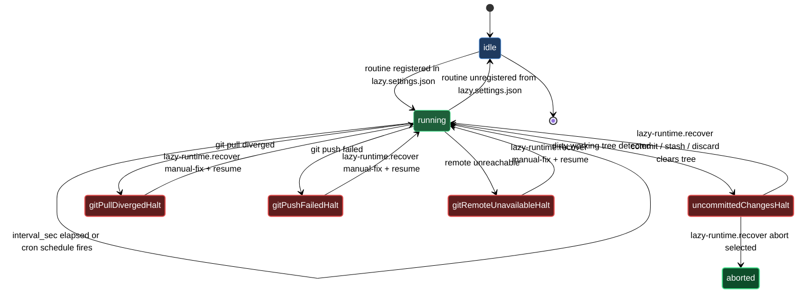

# Runtime daemon — routine management and recovery

The lazycortex-core runtime daemon is a per-repo serial loop. It reads the routine registry from `.claude/lazy.settings.json`, runs each entry in order according to its `interval_sec` or cron schedule, and repeats. Because routines execute one at a time, no two ever contend over the working tree or git state — the daemon is the single serializing authority for all background work in the repo.

Three skills manage that loop from the outside. `/lazy-routine.register` is a type-aware wizard that adds a named periodic job to the registry. It supports five routine types: `subprocess` (a periodic CLI command), `inbox` (scan a directory and dispatch one expert job per file), `schedule` (cron-driven, one fire per boundary), `git` (watch a remote branch for changes and dispatch jobs on new commits or file changes), and `md-scan` (scan markdown files matching glob patterns, filter by frontmatter values, and dispatch an agent job per match in place). `/lazy-routine.unregister` removes a named routine cleanly and is idempotent — calling it on a name that does not exist is an INFO, not an error. `/lazy-runtime.recover` is the escape hatch for a halted daemon: the daemon halts in two distinct situations — a dirty working tree (a routine or expert left uncommitted changes) and a failed remote sync (the daemon's pre- or post-tick git pull or push hit an unrecoverable state). The skill reads the halt context, branches on the reason, walks you through the appropriate fix, and clears the halt once the precondition holds so the daemon resumes on its next iteration.

## When you'd use this

- Add a periodic background command to the daemon — a linting pass, a sync script, a cache refresh — that runs on a fixed interval without holding up the main session.
- Wire an `inbox` directory so the daemon automatically dispatches one expert job per file that lands there, consuming the queue as files arrive.
- Set up a `schedule` routine that fires on a cron boundary (daily backup, weekly audit) rather than a polling interval.
- Watch a remote branch for new commits or file changes and trigger expert jobs automatically when the upstream moves.
- Scan markdown files by frontmatter fields (e.g. `request_status: draft`) and dispatch an agent to process each match without moving the files.
- Remove a routine you no longer need, or overwrite an existing one with updated parameters.
- Unblock the daemon after a dirty-tree halt — get back to a clean working tree without losing changes you want to keep, or leave the daemon halted intentionally while you investigate.
- Unblock the daemon after a remote-sync halt — repair the diverged branch or network issue and confirm so the daemon can re-evaluate on its next tick.

## How it fits together

Routine management has a natural lifecycle. You run `/lazy-routine.register` once — typically as part of your plugin's install step — and the daemon picks up the new entry on its very next cycle without a restart. The wizard collects only the fields the chosen type needs, validates against the per-type schema, and enforces `<plugin>.<verb>` dot-namespace naming (e.g. `lazy-review.tick`). If you attempt to register a name that already exists, the skill refuses unless you pass `--force` to overwrite in one step.

The five types cover the common shapes of background work. `subprocess` runs any shell command on a fixed interval — use it for scripts, CLI tools, or any periodic task that does not need expert routing. `inbox` watches a directory and dispatches one expert job per file, moving each file into job staging so it is not processed twice — use it for queues where new files arrive from outside the daemon. `schedule` takes a standard five-field cron expression and fires once per boundary, dispatching either a command or an expert job — use it for calendar-driven tasks like nightly backups or weekly audits. `git` polls a remote branch for new commits, new files, changed files, deleted files, or renamed files, then dispatches an expert job per match — use it for CI-like reactions to upstream changes. `md-scan` scans vault-relative glob patterns, filters the matching markdown files by frontmatter key-value pairs, and dispatches a plugin-namespaced agent job for each match without moving the files — use it for processing in-place request queues tracked in git, such as design-request or review-request notes.

When a routine is no longer needed, you run `/lazy-routine.unregister <name>` and the daemon drops it from the schedule immediately. One routine is protected: `lazy-expert.pump`, the built-in job that drains the expert queue. Removing it requires `--force` and surfaces a warning that expert jobs will stop processing until the routine is re-registered or `/lazy-core.install` is re-run.

The halt-and-recover path is a separate concern that does not require registration or unregistration. When the daemon halts, `/lazy-runtime.recover` reads `.logs/lazy-core/runtime/state.json` to surface the halt context — which routine triggered the halt (`triggered_by`), which expert and job were involved if applicable, the halt reason, and (for dirty-tree halts) the list of dirty paths.

The skill branches on the halt reason. For `uncommitted_changes` halts — the most common case, where a routine or expert left the working tree dirty — you have four cleanup options: `commit` keeps the dirty changes permanently (you supply the message); `stash` tucks them into a git stash you can restore later with `git stash pop`; `discard` throws them away irreversibly; and `abort` leaves everything as-is and exits, keeping the daemon halted so you can investigate on your own schedule. Once the cleanup produces a clean tree the skill clears the `daemon_halted` block and the daemon resumes. If the tree is still dirty after cleanup (for example, a submodule left behind uncommitted state), the skill reports `still-dirty` without clearing the halt — run `git status` manually, resolve, and re-invoke `/lazy-runtime.recover`.

For remote-sync halts (`git_pull_diverged`, `git_push_failed`, `git_remote_unavailable`) the daemon cannot safely resolve the situation automatically — automatic resolution could silently drop your commits. Instead, the skill surfaces reason-specific guidance describing what happened and how to repair it by hand: for a diverged branch you inspect with `git log` and choose whether to rebase, merge, or reset; for a failed push you try the push by hand and read the error; for an unreachable remote you check network and VPN. After you have repaired the situation, you confirm in the wizard and the skill clears the halt block. Confirming runs no git commands itself — the next daemon tick re-evaluates the actual git state; if the underlying issue was not resolved, the daemon will halt again with the same reason.

For `inbox` routines there is one extra consideration: the inbox directory must be gitignored. Inbox routines move files between iterations, and an unignored path dirties the working tree on every cycle, triggering repeated halts. The register wizard detects this automatically and offers to add the path to `.gitignore` on the spot.

## Common adjustments

- **Change a routine's configuration** — run `/lazy-routine.register <name> --force` to overwrite in one step, or run `/lazy-routine.unregister <name>` first and then re-register with the new parameters.
- **Remove `lazy-expert.pump`** — only do this if you are intentionally disabling expert job processing. Pass `--force` to `/lazy-routine.unregister lazy-expert.pump`. Run `/lazy-core.install` to restore it.
- **Recover without losing changes** — pick `stash` in the `/lazy-runtime.recover` wizard. Your dirty changes land in a git stash you can restore later with `git stash pop`. Pick `commit` if you want to keep them permanently.
- **Investigate before cleaning up** — pick `abort` in the `/lazy-runtime.recover` wizard. The daemon stays halted and no changes are made; run `git status` to inspect the dirty paths, then re-invoke `/lazy-runtime.recover` when you are ready.
- **Check daemon halt status before recovering** — inspect `.logs/lazy-core/runtime/state.json` directly to confirm halt state, read the halt reason and `dirty_paths`, and identify which routine or expert triggered the halt (`triggered_by`, `expert`, `job_id`).
- **Recover from a remote-sync halt** — read the reason-specific guidance the skill surfaces, repair the git state by hand (rebase, merge, reset, re-push, fix network), then confirm in the wizard. If the halt re-fires on the next daemon tick, the underlying issue was not fully resolved — reinspect with `git fetch origin <branch>; git log --oneline HEAD origin/<branch>` and address the actual cause.
- **Narrow an `md-scan` to specific frontmatter states** — the `frontmatter_filter` field accepts a dict of key-to-value mappings; `null` matches files where the key is absent entirely, so `{"request_status": [null, "draft"]}` catches both new files and in-progress ones.

## Runtime lifecycle

## See also

- [install-and-audit](install-and-audit.md) — Bootstrap the daemon via `/lazy-core.install`, which writes the `lazy-core.runtime` block and optionally sets up a launchd/systemd supervisor.
- [experts](experts.md) — The async expert team whose jobs are drained by the `lazy-expert.pump` routine this block manages.
- [setup-runtime](walkthroughs/setup-runtime.md) — Bootstrap the per-repo serial daemon so the async expert team has an executor.
- [setup-routine](walkthroughs/setup-routine.md) — Register a dot-namespaced periodic routine with the runtime daemon and remove it cleanly when it is no longer needed.
