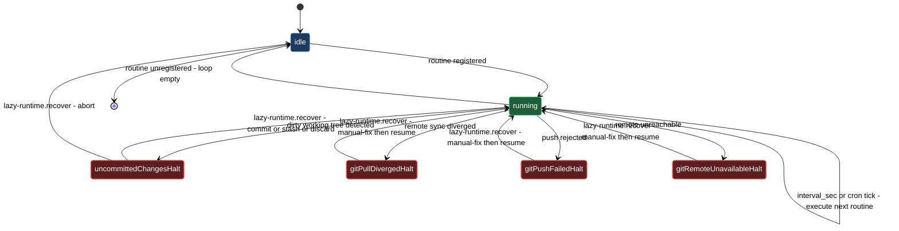

# Runtime daemon — routine management and recovery

The lazycortex-core runtime daemon is a per-repo serial loop. It reads the routine registry from `.claude/lazy.settings.json`, runs each entry in order according to its `interval_sec` or cron schedule, and repeats. Because routines execute one at a time, no two ever contend over the working tree or git state — the daemon is the single serializing authority for all background work in the repo.

Four skills manage that loop from the outside. `/lazy-routine.register` adds a named periodic job to the registry using a type-aware wizard that supports five routine types and two dispatch shapes. `/lazy-routine.unregister` removes a named routine cleanly and is idempotent. `/lazy-runtime.preflight` validates that an expert-shape routine's target expert is actually launchable — before you wire it into a live routine, or after its spawns start timing out. `/lazy-runtime.recover` is the escape hatch when the daemon halts: it reads the halt context, branches on the reason — dirty working tree or failed remote sync — walks you through the appropriate fix, and clears the halt so the daemon resumes on its next iteration.

## What's in this block

**`/lazy-routine.register`** is the entry point for adding a periodic background job to the daemon. It runs as a type-aware wizard that collects only the fields the chosen routine type needs, validates the result against a per-type schema, and enforces `<plugin>.<verb>` dot-namespace naming. Five types are available — `subprocess`, `inbox`, `schedule`, `git`, and `md-scan` — each covering a distinct shape of recurring work:

- `subprocess` — run any shell command on a fixed interval. Use it for scripts, CLI tools, or any periodic task that does not need expert routing.
- `inbox` — watch a directory and process each file once. With an `expert + request` dispatch the daemon moves each file into job staging; with a `command` dispatch the file stays in the inbox until the consumer removes it.
- `schedule` — fire once per cron boundary using a standard five-field cron expression. Use it for calendar-driven tasks like nightly backups or weekly audits.
- `git` — poll local HEAD for `new_commits`, `new_files`, `changed_files`, `deleted_files`, or `renamed_files` and fire once per match. Use it for CI-like reactions to changes in the working repo.
- `md-scan` — scan vault-relative glob patterns, filter matching markdown files by frontmatter key-value pairs, and fire in-place once per match. Use it for processing request-queue notes tracked in git, such as design-request or review-request documents.

Every type accepts the same two dispatch shapes: either a `command` list (spawn a subprocess) or an `expert + request` pair (queue a job to a named expert). For cross-repo dispatch, the `expert` field accepts an `<expert>@<repo>` suffix — the daemon resolves the target repo from `lazy.settings.json` and routes the job there. The skill refuses to overwrite an existing routine unless you pass `--force`.

**`/lazy-routine.unregister`** removes a named routine from the registry and is idempotent — calling it on a name that does not exist is an INFO, not an error. One routine is protected: `lazy-expert.pump`, the built-in job that drains the expert queue. Removing it requires `--force` and surfaces a warning that expert jobs will stop processing until the routine is re-registered or `/lazy-core.install` is re-run.

**`/lazy-runtime.preflight`** validates that every expert-shape routine's target expert is actually launchable — before a broken config fails silently at runtime and eats the routine's wall timeout. It runs static config checks (does the agent / aspects / protocols resolve, is `mcp_config` a valid path) and then, unless you pass `--no-probe`, emulates the real launch with a trivial prompt that does no real work, catching MCP servers that hang or need interactive auth. On a failing expert it proposes a concrete fix and applies it only after you confirm.

**`/lazy-runtime.recover`** handles daemon halts. The daemon halts in two distinct families: a dirty working tree (a routine or expert left uncommitted changes) and a failed remote sync (the daemon's pre- or post-tick git pull or push hit an unrecoverable state). The skill reads the halt context from `.runtime/state.json`, surfaces which routine triggered the halt — a routine name, `_git_pre` or `_git_post` for daemon-side remote-sync halts, or `lazy-expert.pump` for pump-internal halts — and for dirty-tree halts, which paths are dirty. It then guides you through the appropriate fix and clears the halt atomically once the precondition holds.

## How they work together

Routine management follows a natural lifecycle. You run `/lazy-routine.register` once — typically as part of your plugin's install step — and the daemon picks up the new entry on its very next cycle without a restart. The wizard collects type-specific fields, validates against the per-type schema, and for `inbox` routines also checks whether the working directory is gitignored. An unignored inbox path dirties the tree on every cycle and triggers repeated halts; the wizard offers to add it to `.gitignore` on the spot.

Switching dispatch shapes or routine types is a single step: run `/lazy-routine.register <name> --force` to overwrite in place, or run `/lazy-routine.unregister <name>` and re-register with the new parameters. When you no longer need a routine, run `/lazy-routine.unregister <name>` and the daemon drops it from the schedule immediately.

Before you let a new expert-shape routine run live, reach for `/lazy-runtime.preflight`. It targets every registered routine whose `expert` key points at a local expert, enumerates them, runs the static config checks, and — for the full probe — spawns each expert with a throwaway prompt using the same command line the daemon's pump would use. A malformed agent reference, a missing aspect or protocol, a bad `mcp_config` path, or an MCP server that hangs at startup shows up in a verdict table instead of silently eating your routine's timeout the first time it fires for real. When an expert fails, the skill offers to drop the offending MCP server, fix a bad config path, or print manual login instructions for a server that needs interactive auth — never mutating settings without your explicit confirmation.

The halt-and-recover path is a separate concern. When the daemon halts, `/lazy-runtime.recover` reads `.runtime/state.json` and surfaces the context: which routine triggered the halt (`triggered_by`), which expert and job were involved if applicable, the halt reason, and for dirty-tree halts the list of dirty paths.

For `uncommitted_changes` halts — the most common case — you choose one of four cleanup modes:

- `commit` — keeps the dirty changes permanently (you supply the message; a non-empty message is required).
- `stash` — tucks them into a git stash you can restore later with `git stash pop`.
- `discard` — throws away every dirty change irreversibly.
- `abort` — leaves everything as-is and exits, keeping the daemon halted so you can investigate.

Once cleanup produces a clean tree the skill clears the `daemon_halted` block and the daemon resumes. If the tree is still dirty after cleanup the skill reports `still-dirty` without clearing the halt — run `git status` manually, resolve, and re-invoke `/lazy-runtime.recover`.

For remote-sync halts (`git_pull_diverged`, `git_push_failed`, `git_remote_unavailable`) the daemon cannot safely resolve the situation automatically. The skill surfaces reason-specific guidance and asks you to repair the state by hand before confirming resume:

- `git_pull_diverged` — inspect with `git log --oneline HEAD origin/<branch>`, then rebase, merge, or reset to reconcile the diverged histories.
- `git_push_failed` — try `git push origin <branch>` manually to read the underlying error (auth failure, branch protection, push race).
- `git_remote_unavailable` — check network and VPN, then run `git fetch origin <branch>` to confirm reachability before resuming.

After you confirm, the skill clears the halt block. It runs no git commands itself — the next daemon tick re-evaluates the actual git state. If the halt re-fires immediately, the underlying issue was not fully resolved; reinspect and address the root cause before re-running `/lazy-runtime.recover`.

If a routine's expert keeps timing out after a halt, or you suspect the underlying config rather than a one-off dirty tree, run `/lazy-runtime.preflight` on that expert to confirm the launch actually succeeds before you re-enable the routine.

## Common adjustments

- **Change a routine's configuration** — run `/lazy-routine.register <name> --force` to overwrite in one step, or run `/lazy-routine.unregister <name>` first and then re-register with the new parameters.
- **Remove `lazy-expert.pump`** — only do this if you are intentionally disabling expert job processing. Pass `--force` to `/lazy-routine.unregister lazy-expert.pump`. Run `/lazy-core.install` to restore it.
- **Validate an expert before wiring it into a live routine** — run `/lazy-runtime.preflight <expert>` after registering an expert-shape routine but before you rely on it firing unattended. A quick structural sweep with `--no-probe` catches config typos instantly; the full probe also catches MCP servers that hang or need auth.
- **A routine's expert spawns keep timing out** — run `/lazy-runtime.preflight <expert>` to reproduce the failure with a trivial prompt and a verdict table instead of digging through job logs. Apply the proposed fix (drop the offending MCP server, correct a bad `mcp_config` path, or run the printed `claude mcp login` command by hand) and re-run to confirm.
- **Recover without losing changes** — pick `stash` in the `/lazy-runtime.recover` wizard. Your dirty changes land in a git stash you can restore later with `git stash pop`. Pick `commit` if you want to keep them permanently.
- **Recover with a commit** — pick `commit` in the `/lazy-runtime.recover` wizard and supply a non-empty commit message when prompted. The skill captures every dirty path with `git add -A` and commits under your message.
- **Investigate before cleaning up** — pick `abort` in the `/lazy-runtime.recover` wizard. The daemon stays halted and no changes are made; run `git status` to inspect the dirty paths, then re-invoke `/lazy-runtime.recover` when you are ready.
- **Check daemon halt status before recovering** — inspect `.runtime/state.json` directly to confirm halt state, read the halt reason and `dirty_paths`, and identify which routine or expert triggered the halt (`triggered_by`, `expert`, `job_id`).
- **Narrow an `md-scan` to specific frontmatter states** — the `filter` field accepts a composite filter block; `null` in the `in` list matches files where the key is absent entirely, so `{"frontmatter": {"request_status": {"in": [null, "draft"], "not_in": []}}}` catches both new files and in-progress ones.
- **Route a routine's jobs to a remote repo's expert** — use `<expert>@<repo>` in the `expert` field when registering. The target repo must be registered in `lazy.settings.json` and reachable from the daemon's working directory.
- **Halt re-fires immediately after resume** — if a remote-sync halt returns on the very next daemon tick, the underlying condition was not fully resolved. Run `git fetch origin <branch>; git log --oneline HEAD origin/<branch>` and address the actual cause before re-running `/lazy-runtime.recover`.

## Runtime lifecycle

## See also

- [install-and-audit](install-and-audit.md) — Bootstrap the daemon via `/lazy-core.install`, which writes the `lazy-core.runtime` block and optionally sets up a launchd/systemd supervisor.
- [experts](experts.md) — The async expert team whose jobs are drained by the `lazy-expert.pump` routine this block manages.
- [setup-runtime](walkthroughs/setup-runtime.md) — Bootstrap the per-repo serial daemon so the async expert team has an executor.
- [setup-routine](walkthroughs/setup-routine.md) — Register a dot-namespaced periodic routine with the runtime daemon and remove it cleanly when it is no longer needed.
