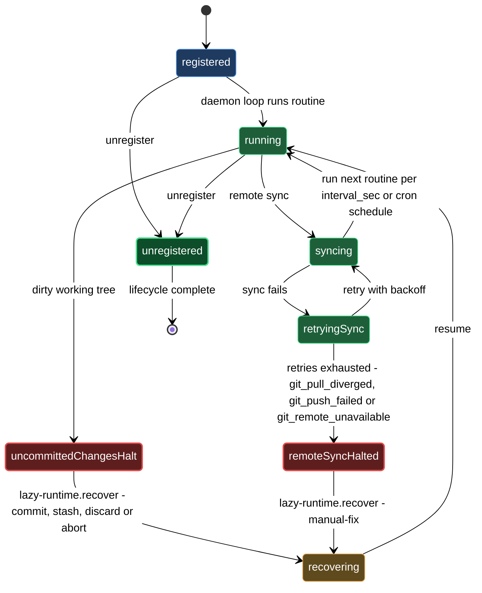

# Runtime daemon — routine management and recovery

The lazycortex-core runtime daemon is a per-repo serial loop. It reads the routine registry from `.claude/lazy.settings.json`, runs each entry in order according to its `interval_sec` or cron schedule, and repeats. Because routines execute one at a time, no two ever contend over the working tree or git state — the daemon is the single serializing authority for all background work in the repo.

Six skills manage that loop and the processes around it. `/lazy-routine.register` adds a named periodic job to the registry using a type-aware wizard that supports five routine types and two dispatch shapes. `/lazy-routine.unregister` removes a named routine cleanly and is idempotent. `/lazy-runtime.tick` runs the daemon's own iteration by hand on a checkout whose daemon isn't running — one iteration, a full drain, or a single named routine. `/lazy-runtime.preflight` validates that an expert-shape routine's target expert is actually launchable — before you wire it into a live routine, or after its spawns start timing out. `/lazy-runtime.recover` is the escape hatch when the daemon halts: it reads the halt context, branches on the reason — dirty working tree, failed remote sync, invalid routine config, or a closed rate-limit window — walks you through the appropriate fix, and clears the halt so the daemon resumes on its next iteration. `/lazy-core.daemon-authoring` is the decision point before any *new* periodic LLM-calling process is written anywhere — in this repo or another — steering it either into this daemon as a routine or, when it must run standalone, onto the same host-wide rate-limit guard the daemon itself uses.

## What's in this block

**`/lazy-routine.register`** is the entry point for adding a periodic background job to the daemon. It runs as a type-aware wizard that collects only the fields the chosen routine type needs, validates the result against a per-type schema, and enforces `<plugin>.<verb>` dot-namespace naming. Five types are available — `subprocess`, `inbox`, `schedule`, `git`, and `md-scan` — each covering a distinct shape of recurring work:

- `subprocess` — run any shell command on a fixed interval. Use it for scripts, CLI tools, or any periodic task that does not need expert routing.
- `inbox` — watch a directory and dispatch one job per file. With an `expert + request` dispatch, the daemon references each file by its path — the file is never copied into the job bundle — and deletes it only once the job's response proves a finished outcome; with a `command` dispatch the file stays in the inbox until the consumer removes it.
- `schedule` — fire once per cron boundary using a standard five-field cron expression. Use it for calendar-driven tasks like nightly backups or weekly audits.
- `git` — poll local HEAD for `new_commits`, `new_files`, `changed_files`, `deleted_files`, or `renamed_files` and fire once per match. Use it for CI-like reactions to changes in the working repo.
- `md-scan` — scan vault-relative glob patterns, filter matching markdown files by frontmatter key-value pairs, and fire in-place once per match. Use it for processing request-queue notes tracked in git, such as design-request or review-request documents.

Every type accepts the same two dispatch shapes: either a `command` list (spawn a subprocess) or an `expert + request` pair (queue a job to a named expert). For cross-repo dispatch, the `expert` field accepts an `<expert>@<repo>` suffix — the daemon resolves the target repo from `lazy.settings.json` and routes the job there. The skill refuses to overwrite an existing routine unless you pass `--force`.

For `inbox` routines dispatching to an expert, every job's response is judged strictly, not inferred. `response.json` must carry an explicit `outcome` field — a value from the expert's protocol, or the reserved `deferred` token — or the response is rejected outright: nothing an expert writes to a status field of its own choosing counts. The first rejection keeps the bundle queued and hands the expert the reason for a corrective re-spawn; a second violation in a row fails the job for good and opens an incident. The reserved `deferred` outcome means the expert deliberately postponed the work and left the input untouched — the routine parks that bundle rather than treating it as done or failed, and offers the file back to the queue only after the routine's optional `deferred_retry_sec` field elapses (default one day, tunable per routine since it waits on the world changing by hand rather than a transient fault). Across every shape, the input file itself is deleted only against a proven success — a failed, still-parked, or still-deferred bundle keeps the file exactly where it was, so nothing in the inbox is ever dispatched twice.

**`/lazy-routine.unregister`** removes a named routine from the registry and is idempotent — calling it on a name that does not exist is an INFO, not an error. One routine is protected: `lazy-expert.pump`, the built-in job that drains the expert queue. Removing it requires `--force` and surfaces a warning that expert jobs will stop processing until the routine is re-registered or `/lazy-core.install` is re-run.

**`/lazy-runtime.preflight`** validates that every expert-shape routine's target expert is actually launchable — before a broken config fails silently at runtime and eats the routine's wall timeout. It runs static config checks (does the agent / aspects / protocols resolve, is `mcp_config` a valid path, does the expert resolve an explicit model — pinned or via `agent_models` — rather than silently inheriting the operator's CLI default, and does every inbox routine dispatching to that expert point at a resolvable `inbox_dir` — a declared external directory that is missing or dangling fails the expert here instead of eating a routine's timeout the first time it fires for real) and then, unless you pass `--no-probe`, emulates the real launch with a trivial prompt that does no real work, catching MCP servers that hang or need interactive auth. On a failing expert it proposes a concrete fix and applies it only after you confirm. Every expert spawns hermetically by default — none of the lazycortex hooks (`git-guard`, `check-public`, `model-router`, `settings-guard`, `commit-recorder`) run inside it unless you opt specific ones back in via that expert's `hooks.enabled` list — and the verdict table's active-hooks column shows exactly which ones are wired in for each expert. Above the per-expert table it also prints checkout-level findings that are not about any one expert: a fail when another daemon on this host already drives the exact same physical inbox directory — a silent double-dispatch nobody chose — and a warn when the `daemon.run_here` gate is a bare `true` in a checkout whose working directories are partly sourced from outside git. It also fails — with a matching warn on the read side — when the expert-spawn sandbox allowlist is checked against a resolved path that one of its own entries reaches only through a symlink, permitting nothing where the data actually lives; the finding names the exact repair, `lazycortex-core sandbox-sync --repo-root <repo>`, which records the resolved locations without dropping anything already declared.

**`/lazy-runtime.recover`** handles daemon halts. The daemon halts across two distinct families: a dirty working tree (a routine or expert left uncommitted changes) and everything else the daemon cannot safely resolve on its own — a failed remote sync, a routine entry that no longer matches its type's schema, or a closed subscription rate-limit window. The skill reads the halt context from `.runtime/state.json`, surfaces which routine triggered the halt — a routine name, `_git_pre` or `_git_post` for daemon-side remote-sync halts, or `lazy-expert.pump` for pump-internal halts — and for dirty-tree halts, which paths are dirty. It then guides you through the appropriate fix and clears the halt atomically once the precondition holds.

**`/lazy-runtime.tick`** runs the daemon's own iteration primitive by hand — the same priority order, the same commit-like-the-daemon discipline — on a checkout whose daemon is not currently running. With no arguments it runs one iteration: every due routine in priority order, then the pump processes at most one READY job, exactly the daemon's own single-spawn ceiling. `--drain` repeats iterations, sleeping between them exactly as the daemon would, until nothing is due and the READY queue is empty — it stops early on a halt, a dirty tree, a raised rate-limit flag, or a pass that made no progress. Naming a routine (`/lazy-runtime.tick <name>`) runs only that routine, ignoring its interval, and ignores `--drain`. It refuses outright while a live daemon holds the checkout — a concurrent manual tick would race it over the tree, index, and job queue. The tick commits exactly as the daemon does, under the daemon's own bot identities, but always defers the push: nothing is published during the run, and the next pushing iteration — the daemon's own, once restarted — carries the commits forward. If that work must not reach `origin` yet, say so before the daemon is restarted.

**`/lazy-core.daemon-authoring`** guides the authoring of any *new* periodic process that spends LLM tokens, in any repository, so it is born wired to the host's subscription rate-limit guard instead of migrated onto it later. The first question it asks is whether the target repository is already driven by this daemon — a `routines` section in `lazy.settings.json`, or a `com.lazycortex.runtime.*` supervisor unit. If it is, the answer is always a routine: register the work via `/lazy-routine.register` and let the existing daemon carry it, rather than standing up a second daemon beside a running one. Only when the repository sits outside the lazycortex runtime does the skill walk the standalone path — every LLM call must go through `~/.local/bin/lazy-claude` by absolute path (a bare `lazy-claude` resolves to nothing under launchd's or cron's minimal `PATH`), and the skill hands over a launchd (or systemd-timer) skeleton with an explicit `PATH`, fixed log files, and state kept outside both the plist directory and `/tmp`. The wrapper's `exit 75` means the rate-limit window is closed and the call was refused before spending any tokens — a quiet, expected skip, not a failure to alert on; `exit 69` means no real `claude` executable was found and is a genuine error.

## How they work together

Routine management follows a natural lifecycle. You run `/lazy-routine.register` once — typically as part of your plugin's install step — and the daemon picks up the new entry on its very next cycle without a restart. The wizard collects type-specific fields, validates against the per-type schema, and for `inbox` routines also checks whether the working directory is gitignored. An unignored inbox path dirties the tree on every cycle and triggers repeated halts; the wizard offers to add it to `.gitignore` on the spot.

Switching dispatch shapes or routine types is a single step: run `/lazy-routine.register <name> --force` to overwrite in place, or run `/lazy-routine.unregister <name>` and re-register with the new parameters. When you no longer need a routine, run `/lazy-routine.unregister <name>` and the daemon drops it from the schedule immediately.

Before you let a new expert-shape routine run live, reach for `/lazy-runtime.preflight`. It targets every registered routine whose `expert` key points at a local expert, enumerates them, runs the static config checks, and — for the full probe — spawns each expert with a throwaway prompt using the same command line the daemon's pump would use. A malformed agent reference, a missing aspect or protocol, a bad `mcp_config` path, an inbox routine whose declared directory does not resolve, or an MCP server that hangs at startup shows up in a verdict table instead of silently eating your routine's timeout the first time it fires for real. When an expert fails, the skill offers to drop the offending MCP server, fix a bad config path, pin a model tier for an expert that resolves none, or print manual login instructions for a server that needs interactive auth — never mutating settings without your explicit confirmation. The same table doubles as a quick way to confirm which lazycortex hooks are actually active in an expert's spawns, which matters if you've just added a `hooks.enabled` entry and want proof it took effect before the routine fires unattended. Above that table, checkout-level findings apply regardless of which expert you targeted — if this host is already running another checkout that drives the same physical inbox, every expert below can report `ok` individually while the checkout itself is not safe to run; that finding is not one of the fixes the skill applies automatically, because which checkout should own a shared inbox is your decision. A sandbox allowlist that resolves through a symlink to a location none of its entries literally cover surfaces the same way, but unlike the inbox-ownership finding, Step 3 offers to fix it outright: accepting it runs `lazycortex-core sandbox-sync`, which appends the resolved locations without touching anything already recorded.

The halt-and-recover path is a separate concern from a single job's outcome. `daemon_halted` is a working-tree, remote-sync, config, or rate-limit condition that stops the whole loop; a rejected response envelope or a `deferred` outcome is a per-job condition an inbox routine's own reconcile pass handles on its next tick, without ever touching the daemon halt state. When the daemon does halt, `/lazy-runtime.recover` reads `.runtime/state.json` and surfaces the context: which routine triggered the halt (`triggered_by`), which expert and job were involved if applicable, the halt reason, and for dirty-tree halts the list of dirty paths.

For `uncommitted_changes` halts — the most common case — you choose one of four cleanup modes:

- `commit` — keeps the dirty changes permanently (you supply the message; a non-empty message is required).
- `stash` — tucks them into a git stash you can restore later with `git stash pop`.
- `discard` — throws away every dirty change irreversibly.
- `abort` — leaves everything as-is and exits, keeping the daemon halted so you can investigate.

Once cleanup produces a clean tree the skill clears the `daemon_halted` block and the daemon resumes. If the tree is still dirty after cleanup the skill reports `still-dirty` without clearing the halt — run `git status` manually, resolve, and re-invoke `/lazy-runtime.recover`.

For remote-sync, config, and rate-limit halts the daemon does not attempt to resolve the situation itself — automatic resolution of a `git_pull_diverged` or `git_push_failed` state could silently drop your commits, and only you know whether an unfamiliar field in a routine's config is a typo or an intentional addition the schema hasn't grown to cover yet. A brief network blip does not reach this point at all — the daemon's pre- and post-tick git sync retries the underlying fetch/pull/push a few times with increasing backoff (2s, then 5s, then 10s) before giving up, so a transient hiccup clears itself without ever touching the halt state. Once that retry window is exhausted — or one of the other halt reasons fires directly, with no retry involved — the skill surfaces reason-specific guidance and asks you to repair the state (or, for a rate-limit window, simply wait or resume early) before confirming resume:

- `git_pull_diverged` — inspect with `git log --oneline HEAD origin/<branch>`, then rebase, merge, or reset to reconcile the diverged histories.
- `git_push_failed` — try `git push origin <branch>` manually to read the underlying error (auth failure, branch protection, push race).
- `git_remote_unavailable` — check network and VPN, then run `git fetch origin <branch>` to confirm reachability before resuming. By the time this halt fires, the daemon has already retried the sync several times over roughly 17 seconds without success, so treat it as a real outage rather than a blip.
- `routine_config_invalid` — a `routines.<name>` entry in `.claude/lazy.settings.json` (or its `.local.json` overlay) no longer matches that routine type's schema, so the daemon dropped it and stopped instead of silently skipping its work. Read the schema error from the routine's incident (`lazycortex-core error-list`, or the newest runtime journal record naming that routine), then fix the entry by hand or re-register it with `/lazy-routine.register <name> --force`.
- `rate_limit` — the host's subscription rate-limit window is closed. Nothing is broken and no git repair is needed: the daemon lifts this halt itself once the window reopens (the halt context's `resets_at` says when, as epoch seconds). Resume early only if you want the queue moving again right away — safe to do, since the pump's pre-spawn check still refuses to actually spawn while the window stays closed, so an early resume burns no tokens.

After you confirm, the skill clears the halt block. It runs no git commands itself — the next daemon tick re-evaluates the actual state. If the halt re-fires immediately, the underlying issue was not fully resolved; reinspect and address the root cause before re-running `/lazy-runtime.recover`.

Once the daemon is back on its feet and its next push actually advances `origin/<base_branch>` — whether that push is a plain fast-forward or the result of a post-rebase retry — an optional `daemon.git.post_push_hook` fires. Set it as a shell command in the `daemon.git` block of `lazy.settings.json` and the daemon runs it via `sh -c` from the repo root with `LAZY_PUSH_REPO`, `LAZY_PUSH_BRANCH`, `LAZY_PUSH_REMOTE`, `LAZY_PUSH_OLD_SHA`, and `LAZY_PUSH_NEW_SHA` in its environment — enough to trigger a deploy, ping a channel, or kick off any other post-push automation keyed to what just moved. The hook is crash-isolated from the daemon's own tick: a non-zero exit, a timeout past `post_push_timeout_sec` (30 seconds by default), or a spawn failure is journaled but never halts the daemon, retries the push, or fails the tick. It also never fires on a tick where nothing was actually pushed — an in-sync tick, the already-published fallthrough, and a discarded rebase-conflict retry all skip it.

If a routine's expert keeps timing out after a halt, or you suspect the underlying config rather than a one-off dirty tree, run `/lazy-runtime.preflight` on that expert to confirm the launch actually succeeds before you re-enable the routine.

When the daemon itself is not running — a supervisor unit stopped, or a checkout that has never wired one up — `/lazy-runtime.tick` steps in as the exact same executor: one iteration, a full `--drain` to catch the queue up, or a single named routine fired on demand. It refuses instead of racing a live daemon, so running it against a checkout whose daemon is already up is always safe — the tick simply declines. Because every tick defers its push, running several ticks in a row before the daemon (or a manual `git push`) resumes is safe too; the commits queue up on the branch waiting for whichever push happens next.

Before any of the above matters, `/lazy-core.daemon-authoring` is the fork in the road for a periodic LLM-calling process that does not exist yet. A repository already running this daemon gets a routine, drafted through `/lazy-routine.register` exactly as described above; a repository that is not — or a process that must outlive this daemon's own lifecycle — gets a standalone daemon wired through the same rate-limit guard the daemon's own experts already respect, so two independent processes on one host never burn through the subscription window without either one knowing about the other.

## Common adjustments

- **Change a routine's configuration** — run `/lazy-routine.register <name> --force` to overwrite in one step, or run `/lazy-routine.unregister <name>` first and then re-register with the new parameters.
- **Remove `lazy-expert.pump`** — only do this if you are intentionally disabling expert job processing. Pass `--force` to `/lazy-routine.unregister lazy-expert.pump`. Run `/lazy-core.install` to restore it.
- **Validate an expert before wiring it into a live routine** — run `/lazy-runtime.preflight <expert>` after registering an expert-shape routine but before you rely on it firing unattended. A quick structural sweep with `--no-probe` catches config typos instantly; the full probe also catches MCP servers that hang or need auth.
- **A routine's expert spawns keep timing out** — run `/lazy-runtime.preflight <expert>` to reproduce the failure with a trivial prompt and a verdict table instead of digging through job logs. Apply the proposed fix (drop the offending MCP server, correct a bad `mcp_config` path, or run the printed `claude mcp login` command by hand) and re-run to confirm.
- **An expert has no explicit model and fails preflight** — run `/lazy-runtime.preflight <expert>` and pick a tier (sonnet, opus, or haiku) when prompted; the skill pins it as an `agent_models` entry so the expert's headless spawns never silently inherit the operator's CLI default.
- **Check which lazycortex hooks actually run in an expert's spawns** — run `/lazy-runtime.preflight <expert>` and read the verdict table's active-hooks column. Every expert spawns hermetically by default (no lazycortex hooks run); only the hooks named in that expert's `hooks.enabled` list are active.
- **An inbox routine's declared directory does not resolve** — `/lazy-runtime.preflight <expert>` fails with `inbox_dir '<path>' does not resolve` when that path is declared as externally sourced (data living outside git) but missing or dangling in this checkout. Re-run `/lazy-core.install`, which restores the symlink from the recorded source, then re-run preflight to confirm.
- **Jobs fail with `Operation not permitted` even though the config looks correct** — the sandbox allowlist names a directory reached through a symlink, and confinement is checked against the resolved path. Run `/lazy-runtime.preflight <expert>` and accept the `sandbox` fix, or run `lazycortex-core sandbox-sync --repo-root <repo>` by hand; it appends the resolved locations and never drops a recorded entry.
- **Two checkouts fight over the same inbox** — `/lazy-runtime.preflight` reports a `fail` above the verdict table even though every expert underneath reads `ok` individually — this host already has another checkout driving that exact inbox directory. Set `daemon.run_here: false` in the checkout that must not drive it, then re-run.
- **An inbox job's file waits an unusually long time before it is offered back to the queue** — its expert reported the reserved `deferred` outcome, so the routine leaves the input untouched until `deferred_retry_sec` elapses (default one day). Set `deferred_retry_sec` on the `inbox` routine when registering (`/lazy-routine.register <name> --force`) to shorten or lengthen that window for a routine whose deferrals resolve on a different cadence.
- **An inbox job's file is stuck and never re-dispatches, but no deferral is involved** — the job's response is missing an `outcome` field (an envelope violation) and has already used its one corrective re-spawn, so it failed for good with an incident; a transient spawn fault ages out and re-dispatches on its own after about an hour, but a reproducing envelope violation does not. Check the error ledger for the incident, fix the expert's protocol so it always writes `outcome`, and clear the stale job bundle so the file re-dispatches.
- **Recover without losing changes** — pick `stash` in the `/lazy-runtime.recover` wizard. Your dirty changes land in a git stash you can restore later with `git stash pop`. Pick `commit` if you want to keep them permanently.
- **Recover with a commit** — pick `commit` in the `/lazy-runtime.recover` wizard and supply a non-empty commit message when prompted. The skill captures every dirty path with `git add -A` and commits under your message.
- **Investigate before cleaning up** — pick `abort` in the `/lazy-runtime.recover` wizard. The daemon stays halted and no changes are made; run `git status` to inspect the dirty paths, then re-invoke `/lazy-runtime.recover` when you are ready.
- **Check daemon halt status before recovering** — inspect `.runtime/state.json` directly to confirm halt state, read the halt reason and `dirty_paths`, and identify which routine or expert triggered the halt (`triggered_by`, `expert`, `job_id`).
- **Narrow an `md-scan` to specific frontmatter states** — the `filter` field accepts a composite filter block; `null` in the `in` list matches files where the key is absent entirely, so `{"frontmatter": {"request_status": {"in": [null, "draft"], "not_in": []}}}` catches both new files and in-progress ones.
- **Route a routine's jobs to a remote repo's expert** — use `<expert>@<repo>` in the `expert` field when registering. The target repo must be registered in `lazy.settings.json` and reachable from the daemon's working directory.
- **A daemon push or pull hits a brief network blip** — no action needed. The daemon retries the underlying fetch/pull/push automatically with increasing backoff (2s, 5s, 10s) before it would ever halt; a `git_remote_unavailable` halt only fires once that whole retry window is exhausted, so seeing the halt at all means the remote stayed unreachable throughout.
- **Halt re-fires immediately after resume** — if a remote-sync halt returns on the very next daemon tick, the underlying condition was not fully resolved. Run `git fetch origin <branch>; git log --oneline HEAD origin/<branch>` and address the actual cause before re-running `/lazy-runtime.recover`.
- **Run something after every daemon push** — set `daemon.git.post_push_hook` (and optionally `post_push_timeout_sec`) in the `daemon.git` block of `lazy.settings.json`. It only fires on a push that actually advances `origin/<base_branch>`; a failing or hanging hook is journaled and never affects the daemon's own tick, so it is safe to point at flaky external automation.
- **Tick the runtime by hand when the daemon isn't running** — run `/lazy-runtime.tick` for one iteration, `/lazy-runtime.tick --drain` to keep going until the queue is empty, or `/lazy-runtime.tick <name>` to fire just one routine regardless of its interval. It refuses outright against a live daemon — stop the supervisor unit first (`launchctl stop com.lazycortex.runtime.<repo>` / `systemctl --user stop lazy-core-runtime-<repo>`) if you need to tick that checkout anyway.
- **Author a new periodic process that calls an LLM** — run `/lazy-core.daemon-authoring` before the first line of its launch command exists. In a repo already driven by this daemon it routes you to `/lazy-routine.register` instead of standing up a second daemon; outside one, it hands you a supervisor skeleton wired through `~/.local/bin/lazy-claude`.
- **A standalone daemon's LLM calls exit 75 and nothing runs** — that is the rate-limit guard doing its job, not a bug: the subscription window is closed and the call was refused before spending tokens. Wait for the window, or inspect the records under `${XDG_CACHE_HOME:-$HOME/.cache}/lazycortex/rate-limit/` to see who raised the flag and until when.
- **Recover from a `routine_config_invalid` halt** — fix the offending `routines.<name>` entry by hand, or re-register it with `/lazy-routine.register <name> --force`, then pick `resume` in `/lazy-runtime.recover`; the skill's manual-fix path prints where to read the schema error first.
- **Recover from a `rate_limit` halt** — usually no action needed; the daemon lifts it itself once the window reopens. Pick `resume` in `/lazy-runtime.recover` only if you want the queue moving again immediately — safe, since the pump still refuses to spawn while the window is closed.

## Runtime lifecycle

```mermaid
%%{init: {'themeVariables':{'background':'transparent','transitionColor':'#000','transitionLabelColor':'#000','labelBackgroundColor':'#fff','edgeLabelBackground':'#fff','stateLabelColor':'#fff'},'themeCSS':'.edgeLabel{background-color:transparent!important}.edgeLabel p{background-color:transparent!important}','state':{'diagramPadding':5,'useMaxWidth':true}}}%%
stateDiagram-v2
  [*] --> registered
  registered --> running : daemon loop runs routine
  running --> syncing : remote sync
  syncing --> running : run next routine per interval_sec or cron schedule
  syncing --> retryingSync : sync fails
  retryingSync --> syncing : retry with backoff
  retryingSync --> remoteSyncHalted : retries exhausted - git_pull_diverged, git_push_failed or git_remote_unavailable
  running --> uncommittedChangesHalt : dirty working tree
  uncommittedChangesHalt --> recovering : lazy-runtime.recover - commit, stash, discard or abort
  remoteSyncHalted --> recovering : lazy-runtime.recover - manual-fix
  recovering --> running : resume
  registered --> unregistered : unregister
  running --> unregistered : unregister
  unregistered --> [*] : lifecycle complete

  style registered fill:#1e3a5f,stroke:#4a90e2,color:#fff
  style running fill:#1e5f3a,stroke:#4ae290,color:#fff
  style syncing fill:#1e5f3a,stroke:#4ae290,color:#fff
  style retryingSync fill:#1e5f3a,stroke:#4ae290,color:#fff
  style uncommittedChangesHalt fill:#5f1e1e,stroke:#e24a4a,color:#fff,stroke-width:2px
  style remoteSyncHalted fill:#5f1e1e,stroke:#e24a4a,color:#fff,stroke-width:2px
  style recovering fill:#5f4a1e,stroke:#e2a14a,color:#fff
  style unregistered fill:#0d4d2a,stroke:#4ae290,color:#fff,stroke-width:2px
```

## See also

- [install-and-audit](install-and-audit.md) — Bootstrap the daemon via `/lazy-core.install`, which writes the `lazy-core.runtime` block and optionally sets up a launchd/systemd supervisor.
- [experts](experts.md) — The async expert team whose jobs are drained by the `lazy-expert.pump` routine this block manages.
- [setup-runtime](walkthroughs/setup-runtime.md) — Bootstrap the per-repo serial daemon so the async expert team has an executor.
- [setup-routine](walkthroughs/setup-routine.md) — Register a dot-namespaced periodic routine with the runtime daemon and remove it cleanly when it is no longer needed.
