# Troubleshooting

## Python 3.12 or higher is required but not found

**Symptom**: Running `/lazy-core.install` immediately asks how to install Python, or reports "Python 3.12+ required — re-run /lazy-core.install once installed."

**Likely cause**: The `python3` binary on the current machine is either absent or reports a version below 3.12. Every LazyCortex plugin requires Python 3.12 as a single floor — hook scripts, runtime helpers, and install tooling all depend on it.

**Fix**: Install or upgrade Python 3.12 using the route that matches your machine — `brew install python@3.12 && brew link python@3.12 --force` on macOS, or `pyenv install 3.12 && pyenv global 3.12` on Linux. Run the install command in your own terminal (the skill prints the correct command but never runs system package managers on your behalf). Once the upgrade is in place, re-run `/lazy-core.install`.

---

## `/lazy-core.install` aborts: plugin not installed or cache empty

**Symptom**: Running `/lazy-core.install` produces an error like "plugin isn't actually installed — enable it first", or "plugin cache is empty — run `/plugin update` first", or (at Step 4) "plugin cache is broken".

**Likely cause**: Either `lazycortex-core@lazycortex` is not in `enabledPlugins` in your `~/.claude/settings.json`, or the marketplace entry for `lazycortex` is missing from `extraKnownMarketplaces`. Alternatively, the plugin is enabled but the local cache has never been populated or was truncated — the `rules/*.md` or `templates/core/` directory is empty or absent.

**Fix**: For a missing or unrecognised plugin, add both blocks to `~/.claude/settings.json`:
```json
{
  "extraKnownMarketplaces": {
    "lazycortex": {
      "source": { "source": "github", "repo": "mebius-san/lazy-cortex" },
      "autoUpdate": true
    }
  },
  "enabledPlugins": {
    "lazycortex-core@lazycortex": true
  }
}
```
Restart Claude Code, then re-run `/lazy-core.install`. For a cache problem, run `/plugin update lazycortex-core@lazycortex` first to restore the full plugin files, then re-run `/lazy-core.install`.

---

## `/lazy-core.install` fails seeding `agent_models` defaults

**Symptom**: `/lazy-core.install` fails at Step 6 with a message like "default-tiers.json missing or invalid at `<path>`; reinstall lazycortex-core".

**Likely cause**: `lazy-core.agent-models/default-tiers.json` inside the plugin cache cannot be read or parsed. This file is the single source of truth for built-in subagent model tiers; the skill refuses to fall back to hardcoded values.

**Fix**: Reinstall `lazycortex-core` by running `/plugin update lazycortex-core@lazycortex`, then re-run `/lazy-core.install`.

---

## `/lazy-core.install` fails writing settings or installing the daemon supervisor

**Symptom**: `/lazy-core.install` fails at Step 9 with "settings file unwritable", or at Step 13 with a message about a missing plist/service template file, or `launchctl load` / `systemctl enable` returning a non-zero exit code.

**Likely cause (unwritable settings)**: `.claude/lazy.settings.json` or its parent directory has permissions that prevent writing.

**Likely cause (supervisor template missing)**: The plugin cache does not contain `templates/runtime/com.lazycortex.runtime.plist` (macOS) or `templates/runtime/lazy-core-runtime.service` (Linux) because the cache was only partially downloaded.

**Likely cause (launchctl/systemctl error)**: On macOS, the plist was written but `launchctl load` encountered a substitution error or permissions issue. On Linux, the systemd user instance is not running, or `daemon-reload` has not been called.

**Fix (unwritable)**: Check permissions on `.claude/lazy.settings.json` and the `.claude/` directory. Ensure both are writable by your current user, then re-run `/lazy-core.install`.

**Fix (template missing)**: Run `/plugin update lazycortex-core@lazycortex` to restore the full cache, then re-run `/lazy-core.install` and accept the daemon supervisor install offer again.

**Fix (macOS launchctl)**: Inspect the plist at `~/Library/LaunchAgents/com.lazycortex.runtime.<repo-name>.plist` for literal `{REPO_ROOT}` or `{REPO_NAME}` placeholders. If found, re-run `/lazy-core.install` to regenerate. Otherwise run `launchctl load <path>` manually from your terminal.

**Fix (Linux systemd)**: Run `systemctl --user daemon-reload` then `systemctl --user enable --now lazy-core-runtime-<repo-name>.service`, or re-run `/lazy-core.install` to reinstall the unit.

---

## `/lazy-core.install` Step 7 fails: file exists where `.logs/` or `.runtime/` directory is expected

**Symptom**: `/lazy-core.install` fails at Step 7 with a message like "`.logs/` or `.runtime/` not a directory".

**Likely cause**: A plain file named `.logs` or `.runtime` already exists at the repo root. The bootstrap helper requires these to be directories, not files.

**Fix**: Rename or remove the file by hand from your terminal, then re-run `/lazy-core.install`. The helper will create the directory on retry.

---

## The daemon never starts for this checkout after install

**Symptom**: `/lazy-core.install` completed without errors and reported a daemon supervisor installed, but the daemon does not appear to be running for this checkout.

**Likely cause**: Gate 2 (`daemon.run_here`) is recorded as `false` in this checkout's gitignored `lazy.settings.local.json`. The install skill records the per-checkout decision once and never re-asks; if you declined at the prompt, the supervisor was skipped and will not start.

**Fix**: Open `.claude/lazy.settings.local.json` in this checkout, set `daemon.run_here` to `true` (or delete the key), then re-run `/lazy-core.install`. The skill reads the flag on entry and, finding the decision reversed, proceeds to install the supervisor for this checkout.

---

## `/lazy-core.install` never re-asks about the daemon

**Symptom**: You want to change your daemon setup choices (enable it for a project, or start it on this checkout) but re-running `/lazy-core.install` silently skips all daemon questions.

**Likely cause**: Both gates are already persisted — `daemon.enabled` in the tracked `lazy.settings.json` (shared with all clones) and `daemon.run_here` in this checkout's gitignored `lazy.settings.local.json`. The skill honours recorded decisions silently, so it never re-prompts.

**Fix**: Edit the relevant flag directly and re-run `/lazy-core.install`:
- To change the project-wide daemon policy, update `daemon.enabled` in `.claude/lazy.settings.json`.
- To change the decision for this checkout only, update `daemon.run_here` in `.claude/lazy.settings.local.json` (or delete that key to let the next install re-ask).

---

## The daemon starts but the metrics endpoint never comes up

**Symptom**: You enabled Prometheus metrics during `/lazy-core.install`, but nothing answers on the recorded port, and the daemon otherwise looks healthy.

**Likely cause**: Another process — often another lazycortex daemon on the same host — is already bound to the port this checkout recorded. The daemon detects the conflict at startup, records an incident naming the holder (pid, command, and the owning repo if it is another registered daemon), and keeps running with metrics disabled rather than retry-looping.

**Fix**: Re-run `/lazy-core.install` and go through the metrics step again — ports are allocated sequentially from 9464, skipping ports already recorded by other checkouts on the same host, so a re-run typically lands on a free one. Restart the daemon afterward to pick up the new port. To pick a port by hand instead, edit `metrics.port` in this checkout's gitignored `.claude/lazy.settings.local.json`, then restart the daemon.

---

## `/lazy-core.setup` stops at Step 0: settings migration errored

**Symptom**: Running `/lazy-core.setup` halts immediately with a message like "failed: `<stderr>`" in its Step 0 line, and the Step 6 report shows Steps 1–5 with outcome `aborted-by-migration-failure`. No child skills run.

**Likely cause**: `lazy_settings.py migrate` exited non-zero before any installer had a chance to read or write `.claude/lazy.settings.json`. This typically means a migration ladder file under `lazy_settings_migrations/` has a malformed `MIGRATIONS` callable, or the settings file itself is so corrupted that the ladder cannot parse it.

**Fix**: Read the captured stderr in the Step 6 report to identify which migration module or settings section is at fault. If the settings file is corrupt, inspect `.claude/lazy.settings.json` and fix the JSON syntax. If the error names a specific migration module, reinstall `lazycortex-core` via `/plugin update lazycortex-core@lazycortex` to restore the migration ladder, then re-run `/lazy-core.setup`.

---

## `/lazy-core.setup` reports one or more child skills failed

**Symptom**: `/lazy-core.setup` completes its run but the report shows one or more child skills under the "failed" section with a reason.

**Likely cause**: A child skill (such as `/lazy-core.install`, `/lazy-guard.allow-mcp`, or `/lazy-core.agent-models`) encountered a failure that appears in its own report. `/lazy-core.setup` never aborts the chain on a child failure — it collects all results and surfaces them together.

**Fix**: Read the reason listed per failed child in the setup report. Address the root cause for each (the other entries in this guide cover the most common child failure modes). Then re-run `/lazy-core.setup` — it is idempotent, so children that already succeeded will complete cleanly again and previously-failed ones will be retried.

---

## `/lazy-core.scaffold-local` fails: registry missing, or the core CLI can't be resolved

**Symptom**: Running `/lazy-core.scaffold-local` (or the install-time `/lazy-core.scaffold-sync`) fails with "registry not found at `<path>`", "cannot resolve core CLI — lazycortex-core not installed", or "core CLI not found at `<path>`".

**Likely cause (registry missing)**: `.claude/rules/lazy-core.scaffold.md` — the registry the `_local` scaffold entries live in — has never been initialised in this project.

**Likely cause (core CLI unresolved)**: `installed_plugins.json` has no `lazycortex-core@lazycortex` entry, so the skill has nothing to dispatch the underlying `scaffold` subcommand through.

**Likely cause (core CLI path stale)**: The `installPath` recorded in `installed_plugins.json` points at a plugin-cache path that no longer exists — typical after a version bump left an old cache directory behind.

**Fix (registry missing)**: Run `/lazy-core.install` to initialise the scaffold registry, then re-run.

**Fix (core CLI unresolved or stale)**: Install `lazycortex-core` if it isn't yet (`/lazy-core.install`), or refresh a stale cache path with `/plugin update lazycortex-core@lazycortex`. Then re-run `/lazy-core.scaffold-local` or `/lazy-core.scaffold-sync`.

---

## `/lazy-core.scaffold-local` can't find the entry to remove, or `/lazy-core.scaffold-sync` reports a template-path collision

**Symptom**: `/lazy-core.scaffold-local` fails removing an entry with "entry … not found in the `_local` registry map"; or `/lazy-core.scaffold-sync` fails with "collision — template path `<key>` declared by …".

**Likely cause (entry not found)**: The entry name passed for removal does not match anything currently registered — a typo, or the entry was already removed.

**Likely cause (collision)**: Two template groups in the plugin's `scaffold.entries.json` manifests declare the same template path with overlapping globs, which the sync step refuses to merge silently.

**Fix (entry not found)**: List the current `_local` entries first (`scaffold list --registry <regPath>`) to confirm the exact name, then retry the removal.

**Fix (collision)**: This surfaces during a plugin's own install-time sync, not from hand-editing — re-run `/plugin update` for the plugin reporting the collision (a fixed manifest ships in the update), then re-run its install skill so `/lazy-core.scaffold-sync` re-dispatches cleanly.

---

## `/lazy-core.audit` fails: "lazy.settings.json is not valid JSON"

**Symptom**: Running `/lazy-core.audit` aborts immediately with an error like "lazy.settings.json is not valid JSON".

**Likely cause**: `.claude/lazy.settings.json` was hand-edited and the edit broke JSON syntax — a trailing comma, an unclosed brace, a stray character.

**Fix**: Open the file and fix the syntax error directly, or re-scaffold it from scratch by running `/lazy-core.install` (idempotent — it fills in missing structure without touching anything already valid). Then re-run `/lazy-core.audit`.

---

## `/lazy-core.audit` reports an expert reference that "did not resolve"

**Symptom**: `/lazy-core.audit` flags one of your registered experts with a message like "reference did not resolve" for its `agent` field.

**Likely cause**: The `agent` value in `lazy.settings.json[experts]` uses a format the audit doesn't recognise, or points at an agent that no longer exists — a typo, a plugin that was removed, or an agent file that was deleted.

**Fix**: Check the `agent` field against one of the three recognised formats — `<plugin>:<name>`, `user:<name>`, or a bare `<name>`. If the target agent genuinely no longer exists, re-run `/lazy-core.install` to re-register the expert against a valid agent.

---

## `/lazy-core.audit` flags a routine command as failing even though the plugin is installed

**Symptom**: `/lazy-core.audit` reports a routine's `command:` entry as failing, but you can confirm the named plugin is installed and working.

**Likely cause**: The routine's recorded command path points at an older plugin-cache layout. Plugin binaries live under a versioned path; if the routine was registered against an earlier install, the path in `lazy.settings.json` can go stale after a plugin update.

**Fix**: Re-install the plugin that owns the routine (`/plugin update <plugin>@lazycortex`), then re-run `/lazy-core.install` for that plugin so the routine's command path is refreshed. Re-run `/lazy-core.audit` to confirm.

---

## `/lazy-core.doctor` Fix L1 fails: systemd unit not found

**Symptom**: `/lazy-core.doctor` offers to restart the daemon via `systemctl --user restart`, but the fix fails with "Unit not found".

**Likely cause**: The systemd user unit was never installed for this checkout — this happens on a first-time daemon setup where the unit-install step of `/lazy-core.install` was skipped or interrupted.

**Fix**: Run `/lazy-core.install` to install the unit file and register it (`systemctl --user daemon-reload`), then re-run `/lazy-core.doctor` to confirm the daemon restarts cleanly.

---

## `/lazy-core.doctor` can't clean up a dead job: Permission denied

**Symptom**: `/lazy-core.doctor` identifies a dead expert job and offers to remove its directory, but the fix fails with "Permission denied".

**Likely cause**: The job directory was created by a different user or process and the current user lacks write permission to remove it.

**Fix**: Remove the job directory by hand from your terminal with the appropriate permissions (`sudo rm -rf` or `chown` first, depending on your setup), then re-run `/lazy-core.doctor` to confirm the job no longer shows as dead.

---

## `/lazy-core.doctor` can't remove a stray routine, or the routine keeps coming back

**Symptom**: `/lazy-core.doctor` offers to remove a routine it considers stray, but the fix fails with "settings file not writable" — or the fix succeeds, but the same routine reappears the next time you run `/lazy-core.doctor`.

**Likely cause (not writable)**: `.claude/lazy.settings.json` is read-only or the current process lacks write permission.

**Likely cause (reappears)**: The routine is one a plugin re-adds automatically on every install — running `/lazy-core.install` again after the removal restores it because the plugin's default-routines bootstrap doesn't know it was deliberately removed.

**Fix (not writable)**: Fix the file's permissions, then re-run `/lazy-core.doctor`.

**Fix (reappears)**: If you don't want the routine at all, re-run `/lazy-core.install` and decline the relevant routine at the prompt (where the install flow offers one), rather than removing it after the fact via `/lazy-core.doctor`.

---

## `/lazy-core.agent-models` fails with "invalid --scope value"

**Symptom**: Running `/lazy-core.agent-models` (or `/lazy-core.optimize` Phase 7) produces an error about an unrecognised flag.

**Likely cause**: A flag other than `--scope=auto`, `--scope=project`, `--scope=global`, or `--dry-run` was passed to the skill. Any unrecognised token causes an immediate fail.

**Fix**: Re-run with a valid flag. Valid scope values are `auto` (default), `project`, and `global`. Example: `/lazy-core.agent-models --scope=project`.

---

## An agent dispatches to the default model despite a tier being configured

**Symptom**: An agent you assigned a tier via `/lazy-core.agent-models` (e.g. `opus`) runs on the default model instead.

**Likely cause**: The tier value stored in `lazy.settings.json` is not one of the three recognised strings (`haiku`, `sonnet`, `opus`). A typo (e.g. `"sonnet-3-7"`, `"claude-opus"`) causes the hook to treat the entry as unset and fall through to the default model. The hook emits a warning to stderr but never blocks the dispatch.

**Fix**: Run `/lazy-core.agent-models` to review and correct the entries. The skill fills only missing entries by default — to replace an incorrect value, remove the bad entry from `lazy.settings.json` first (the skill will then detect it as missing and prompt you to fill it in), or run `/lazy-core.doctor` which flags unrecognised tier values as a configuration error and offers to fix them.

---

## `LAZY_AGENT_MODEL_FLOOR` has no effect

**Symptom**: You set `LAZY_AGENT_MODEL_FLOOR` in your environment to cap the maximum model tier, but agents still dispatch at a higher tier than intended.

**Likely cause**: The env var value is not one of the three recognised tier names (`haiku`, `sonnet`, `opus`). The hook logs a warning to stderr and ignores an unrecognised floor value entirely.

**Fix**: Confirm the value of `LAZY_AGENT_MODEL_FLOOR` in your shell environment (`echo $LAZY_AGENT_MODEL_FLOOR`). Correct it to one of `haiku`, `sonnet`, or `opus`, then restart Claude Code so the hook picks up the updated environment.

---

## A dispatch string appears in multiple `agent_models` groups and routes unexpectedly

**Symptom**: An agent routes to an unexpected model tier. Inspecting `lazy.settings.json` reveals the same dispatch string listed under two different group keys with different tier values.

**Likely cause**: The `model-router` hook flattens all groups at load time. When the same dispatch string appears in more than one group, the last group processed wins and a warning is emitted to stderr.

**Fix**: Run `/lazy-core.agent-models` to audit the current state. After the skill reports, remove the duplicate entry from the group where it should not appear — the skill writes only missing entries and will not remove duplicates automatically. Running `/lazy-core.doctor` will also flag cross-group duplicate keys as a configuration error.

---

## An agent pinned via `/lazy-core.agent-models` doesn't route on daemon dispatches

**Symptom**: You pinned a tier for an expert's agent through `/lazy-core.agent-models`, confirmed the entry landed in `agent_models` in `lazy.settings.json`, but jobs dispatched to that expert by a routine still resolve to no explicit model, or a different tier than you expected.

**Likely cause**: The expert runtime resolves `agent_models` from the **project-scope** `lazy.settings.json` only — a headless daemon dispatch never sees the global file (`~/.claude/lazy.settings.json`), even though the interactive `lazy-core.model-router` hook does merge global under project. If the entry landed in the global file — because the owning plugin's install scope was global, or because a scope flag routed it there — the daemon-facing resolver never reads it.

**Fix**: Re-run `/lazy-core.agent-models`. The wizard now detects when a dispatch string matches an `experts.<name>.agent` entry (or the built-in doctor dispatch, `lazycortex-core:lazy-runtime.doctor`) in the current repo, and routes that entry to the project-scope file automatically regardless of its group — re-running moves any existing global-only pin into scope. If you hand-edited `lazy.settings.json`, move the entry from the global file into the project's `.claude/lazy.settings.json[agent_models]` yourself.

---

## A non-interactive rollout leaves some agent-model tiers or MCP entries unresolved

**Symptom**: A repo processed by a non-interactive rollout (no one answering prompts) comes back with some `agent_models` entries or MCP `allow`/`ask` entries applied, and others still missing — the run's own report lists the leftovers as `needs-interactive`.

**Likely cause**: Both `/lazy-core.agent-models` and `/lazy-guard.allow-mcp` only auto-apply, without a user channel, the subset of decisions that are already recorded rather than guessed. For `/lazy-core.agent-models`, that means curated tiers from `default-tiers.json` (Batch 1) land automatically, while agents with no curated tier (Batches 2 and 3) have no safe default to pick and are left missing. For `/lazy-guard.allow-mcp`, that means new `allow`/`ask` entries at a scope the skill can already infer from existing entries, and preload-hook merges into a hook that already exists, apply automatically — while an undetermined scope, an `allow`→`ask` reversal, a cross-scope leak, or the initial "install the preload hook at all?" decision all require a person's judgment and are reported rather than guessed.

**Fix**: Run the interactive form of the skill directly to clear the remainder — `/lazy-core.agent-models` for the still-missing agent tiers, or `/lazy-guard.allow-mcp <server>` for the still-open MCP scope, reversal, or leak-cleanup decisions — and answer the prompts once. Both skills are idempotent: entries already applied by the non-interactive pass are left untouched, and only the reported `needs-interactive` items re-prompt.

---

## MCP tools keep prompting for permission after running `/lazy-guard.allow-mcp`

**Symptom**: You ran `/lazy-guard.allow-mcp` for a server but Claude Code still asks for permission every time a tool from that server is called.

**Likely cause 1**: The permissions were written to `settings.json` (tracked) but Claude Code applies permissions from `settings.local.json` (gitignored). The skill defaults to `settings.local.json`; if you have a `settings.json` entry for the same tool, the two files may conflict.

**Likely cause 2**: The server's tools fall into the "medium-risk / skip" bucket — these are intentionally left out of both `allow` and `ask` lists so Claude Code prompts once per call for the user to decide in context. This is the intended behaviour for tools in that bucket.

**Fix for cause 1**: Re-run `/lazy-guard.allow-mcp` — it will detect the cross-scope duplicates and strip the redundant entries from the tracked `settings.json` automatically after per-entry confirmation.

**Fix for cause 2**: If you want the tool always allowed without a prompt, run `/lazy-guard.allow-mcp` again and explicitly override the classifier for that tool when prompted.

---

## `/lazy-guard.allow-mcp` stops: server not found or server not loaded

**Symptom**: Running `/lazy-guard.allow-mcp <server-name>` produces an error like "server not found — discovered servers are: …", or the server is defined but skipped with "server isn't loaded — restart Claude Code and re-run".

**Likely cause (not found)**: The server name passed as input is not defined in `~/.mcp.json` or `./.mcp.json` at this scope. Either the name is misspelled or the server definition has not been added yet.

**Likely cause (not loaded)**: The server is defined in `.mcp.json` but has zero matching `mcp__<server>__*` tools visible in the current session. The server may have failed to start, or the session predates its definition. The skill never invents tool names.

**Fix (not found)**: Check the server name against the list shown in the error. Correct the typo or add the server entry to the appropriate `.mcp.json` file, then re-run `/lazy-guard.allow-mcp`.

**Fix (not loaded)**: Restart Claude Code so the server loads and its tools become visible in the session, then re-run `/lazy-guard.allow-mcp`.

---

## `/lazy-repo.mark-public` Step 4 won't proceed: FAIL findings still unresolved

**Symptom**: `/lazy-repo.mark-public` halts at Step 4 with a message that FAIL findings remain.

**Likely cause**: At least one secret-class (category A) finding from the Step 2 audit was not resolved during Step 3. The skill requires every FAIL finding to be encrypted, template-ized, or redacted before it will write the waiver file or proceed to the GitHub visibility flip.

**Fix**: Return to Step 3 and choose a resolution strategy for each outstanding FAIL finding — encrypt the value, replace it with a template placeholder, or redact it from the file. Once all FAIL findings are gone, re-run `/lazy-repo.mark-public` to continue from Step 4 (the skill is idempotent and will resume cleanly).

---

## `/lazy-repo.mark-public` Step 5 fails: `gh` not on PATH or unauthenticated

**Symptom**: The GitHub visibility flip at Step 5 of `/lazy-repo.mark-public` does not run, with an error about `gh` not being found or requiring login.

**Likely cause**: GitHub CLI (`gh`) is not installed on the current machine, or `gh auth login` has not been run.

**Fix**: Install GitHub CLI (`brew install gh` on macOS, or see [cli.github.com](https://cli.github.com)) and run `gh auth login`. Then execute `gh repo edit --visibility public` manually from the repo root when ready. The security audit and waiver file created by earlier steps remain valid — no need to re-run the full flow.

---

## The pre-commit hook doesn't fire on commits

**Symptom**: You commit to a public repo and Claude Code does not scan staged changes.

**Likely cause**: `.guard-waivers.json` is missing from the repo root. The pre-commit hook uses the presence of this file as the opt-in signal — without it, scanning is disabled.

**Fix**: Run `/lazy-repo.mark-public`. The skill creates `.guard-waivers.json` at the repo root with the correct schema, which is the opt-in signal that activates the hook. From the next commit onward, every `git commit` triggers the scan automatically.

---

## A routine's expert spawns keep timing out or the job dies doing nothing

**Symptom**: A routine (inbox, schedule, git, or md-scan) that dispatches to an expert never produces a result — the job sits until it eats the routine's wall timeout and dies, with no useful output in `response.json`. `/lazy-expert.collect-job` eventually reports `status: failed` or the job never leaves `active`.

**Likely cause**: Expert spawns run headless and hermetic (`claude -p ... --strict-mcp-config`) — by default an expert loads no MCP servers at all, only the ones declared per-expert via `mcp_config` in `lazy.settings.json[experts]`. If one of those declared servers hangs on initialization (a stdio server waiting on a socket that never connects, a remote server that needs interactive auth) or fails to spawn, the whole `claude -p` invocation stalls until the routine's timeout kills it. The expert never gets to write a response, so the job looks like it silently died.

**Fix**: Run `/lazy-runtime.preflight` (optionally `/lazy-runtime.preflight <expert-name>` to target one expert). It emulates the same spawn the pump uses, with a trivial prompt that does no real work, and reports each declared MCP server's status — `connected`, `timed-out`, `auth-required`, or `spawn-failed`. For a timed-out or failing server it offers to drop the server from that expert's `mcp_config` (the expert then spawns hermetically without it) or, for a server that needs interactive login, prints the exact `claude mcp login <name>` command to run by hand before re-running. Re-run `/lazy-runtime.preflight` after applying a fix to confirm the expert is launchable, then re-dispatch the routine.

---

## An expert (or the built-in doctor) runs on an unexpected, unpinned model

**Symptom**: A dispatched job — including the daemon's own built-in health-check routine — appears to run on whatever model your interactive CLI happens to default to on that machine, rather than the tier you configured. There is no error; the daemon's spend or behaviour just looks inconsistent across machines or over time.

**Likely cause**: The dispatch resolved to no explicit model pin — no per-expert `model` override and no matching entry for the agent's dispatch string in `agent_models`. Every dispatchable agent, including the daemon's built-in doctor, is expected to resolve an explicit tier; when it can't, the spawn silently inherits the CLI's ambient default instead of failing loudly. The runtime records a best-effort `unpinned_model` incident on the repo's error ledger the first time this happens for a given expert, but nothing on the surface blocks the dispatch itself.

**Fix**: Run `/lazy-runtime.preflight` — it emulates the same spawn and reports a FAIL with a `pin-model` fix offer for any expert that resolves no model; accept the fix to pin a tier directly into the project's `agent_models`. For the built-in doctor routine specifically, re-run `/lazy-core.install` — its install step seeds the doctor's own expert entry (agent reference plus a `sonnet` default tier) into the project scope, which is what the runtime reads for that dispatch.

---

## `/lazy-runtime.preflight` has nothing to validate

**Symptom**: Running `/lazy-runtime.preflight` reports "No expert-shape routines carry a local expert to validate" and exits without probing anything.

**Likely cause**: Every registered routine is either `command`-shape (a plain subprocess, no expert dispatch) or targets a cross-repo expert (`expert@<repo>`) rather than an expert local to the repo you ran the preflight from. The skill only emulates spawns for experts it can actually launch from the current repo.

**Fix**: Register an `expert`-shape routine first via `/lazy-routine.register`, or run `/lazy-runtime.preflight` from inside the repo that actually owns the expert you want to validate.

---

## `/lazy-runtime.preflight` reports every server `timed-out` at once

**Symptom**: The preflight report shows every declared MCP server for an expert as `timed-out`, even servers that normally connect fine.

**Likely cause**: The probe hit its 90-second wall budget on the whole spawn, not on one individual server — this usually means the `claude -p` invocation itself never got going, most often because `claude` isn't on `PATH` in the environment the preflight ran in, or the CLI isn't authenticated.

**Fix**: Confirm `claude` resolves and works by hand: run `claude -p "hi"` directly in your terminal. If that hangs or errors, fix the underlying `claude` CLI setup (PATH, authentication) first, then re-run `/lazy-runtime.preflight`.

---

## `/lazy-runtime.preflight` warns "plugin-dir resolution was best-effort"

**Symptom**: The preflight report includes a note that plugin-dir resolution was best-effort, and a server that should be fine shows up as failing.

**Likely cause**: The preflight ran interactively with no `LAZYCORTEX_PLUGIN_DIRS` environment variable set, so it fell back to deriving plugin directories from the repo and the plugin cache rather than the daemon's authoritative resolution. This fallback can misidentify a plugin's `bin/` location in unusual cache layouts, producing a false-negative probe failure.

**Fix**: Treat a failure alongside this warning as unconfirmed. Re-run the same expert under the daemon (which always exports `LAZYCORTEX_PLUGIN_DIRS`), or export `LAZYCORTEX_PLUGIN_DIRS` yourself before running `/lazy-runtime.preflight` interactively, then confirm the result.

---

## `/lazy-runtime.preflight` can't apply a fix: tree is mid-merge or mid-rebase

**Symptom**: `/lazy-runtime.preflight` identifies a broken `mcp_config` entry and proposes a fix, but refuses to apply it, citing that it cannot commit the settings change right now.

**Likely cause**: The repo is mid-merge, mid-rebase, or otherwise has git in a transactional state. The skill will not write and commit a settings change while a git transaction is in progress, to avoid interleaving with it.

**Fix**: Finish or abort the in-progress git transaction (`git merge --continue`/`--abort`, `git rebase --continue`/`--abort`), then re-run `/lazy-runtime.preflight` to apply the fix.

---

## `/lazy-expert.dispatch-job` fails: experts directory not initialised

**Symptom**: Running `/lazy-expert.dispatch-job` produces an error like "`.experts/` not initialised — run `/lazy-core.install` first."

**Likely cause**: The expert runtime has not been bootstrapped for this repo. `/lazy-expert.dispatch-job` requires the `.experts/` directory layout to exist before it can write job files.

**Fix**: Run `/lazy-core.install`. When the wizard asks whether to bootstrap runtime/experts, answer yes. The install skill creates `.experts/`, writes `lazy.settings.json[experts]`, and bootstraps the required directory layout. Then re-run `/lazy-expert.dispatch-job`.

---

## `/lazy-expert.dispatch-job` rejects the payload or expert name

**Symptom**: `/lazy-expert.dispatch-job` aborts immediately with "payload missing required field(s): kind, role" (or `request`), or with "`<expert_name>` is not registered in `lazy.settings.json[experts]`".

**Likely cause (missing fields)**: The payload dict is missing one or more of the three standard fields — `kind`, `role`, and `request` — that every expert protocol requires.

**Likely cause (not registered)**: The `expert_name` argument does not match any key in `lazy.settings.json[experts]`. The expert was never added during install, the name contains a typo, or the settings file was manually edited and the entry was lost.

**Fix (missing fields)**: Add the missing fields to your payload. All three must be present: `kind`, `role`, and `request`.

**Fix (not registered)**: Verify the expert name against `lazy.settings.json[experts]`. If the expert is missing, register it via the `/lazy-core.install` expert wizard. Then re-dispatch with the correct `expert_name`.

---

## `/lazy-expert.dispatch-job` routes to the wrong expert silently

**Symptom**: A job dispatched appears to complete without error, but the result is missing or seems to have been processed by the wrong worker. Running `/lazy-expert.list-jobs` shows the job under an unexpected expert key.

**Likely cause**: The `expert_name` argument contains a typo that does not match any key in `lazy.settings.json[experts]`. The skill creates the job directory under the named key regardless — if the key is unrecognised, the daemon's pump routine skips it silently on every drain cycle.

**Fix**: Run `/lazy-expert.list-jobs` to see all active job directories and confirm which expert key the job landed under. Cancel the misrouted job with `/lazy-expert.cancel-job`, then re-dispatch with the correct `expert_name`.

---

## `/lazy-expert.collect-job` returns `status: missing` or cancel reports "Job not found"

**Symptom**: `/lazy-expert.collect-job` reports `status: missing`, or `/lazy-expert.cancel-job` reports "Job `<job_id>` not found for expert `<expert_name>`."

**Likely cause**: The job directory was never created (the dispatch failed silently or the wrong `expert_name` was used), or the job was already cancelled.

**Fix**: Verify the `job_id` and `expert_name` match exactly what `/lazy-expert.dispatch-job` returned. Run `/lazy-expert.list-jobs` to see all active jobs and confirm whether the job was dispatched. If the job is absent, re-dispatch with the correct payload and expert name.

---

## `/lazy-expert.collect-job` reports `status: failed` with a malformed response

**Symptom**: `/lazy-expert.collect-job` returns `status: failed` and the error output suggests the expert's `response.json` is unreadable or contains invalid JSON.

**Likely cause**: The expert agent wrote an invalid JSON response, or a crash mid-write left `response.json` in a truncated state. The collect skill reads this file directly and raises `json.JSONDecodeError` if it cannot parse it.

**Fix**: Inspect the file at `.experts/.jobs/<expert>/<job_id>/response.json` directly to see what the expert wrote. If the file is corrupt, the job cannot be recovered — cancel it with `/lazy-expert.cancel-job` and re-dispatch with the same payload.

---

## `/lazy-expert.list-jobs` rejects the status filter

**Symptom**: Running `/lazy-expert.list-jobs` with a `status` argument fails immediately with "status must be one of: queued, active, dead, done, failed."

**Likely cause**: The value passed to the `status` filter is not one of the five recognised strings. Common mistakes include `pending` (old vocabulary), `IN_PROGRESS`, `DONE` (uppercase), or `ready`.

**Fix**: Use one of the five valid filter values: `queued`, `active`, `dead`, `done`, or `failed`. To see all jobs regardless of status, omit the `status` argument entirely.

---

## `/lazy-routine.register` fails: name format, already registered, or unknown type

**Symptom**: Running `/lazy-routine.register` fails with "routine names must be `<plugin>.<verb>` format", "routine `<name>` already registered. Use `--force` to overwrite", "unknown type 'X'", "missing required field(s)", or "`.claude/lazy.settings.json` unwritable".

**Likely cause (name format)**: The `name` argument does not contain exactly one dot, or one of the two parts is empty.

**Likely cause (already registered)**: A routine with the same name is already present in the `lazy-core.runtime` section of `.claude/lazy.settings.json`. The skill refuses to silently overwrite.

**Likely cause (unknown type)**: The `type` field is not one of `subprocess`, `inbox`, `schedule`, `git`, or `md-scan`.

**Likely cause (missing fields)**: The configuration dict is missing one or more fields required by the routine type's schema.

**Likely cause (unwritable)**: `.claude/lazy.settings.json` does not exist (the expert runtime was never bootstrapped) or the file has permissions that prevent writing.

**Fix (name format)**: Rename the routine to follow `<plugin>.<verb>` convention, for example `acme-lint.tick`.

**Fix (already registered)**: Re-run with `--force` to overwrite, or run `/lazy-routine.unregister <name>` first.

**Fix (unknown type)**: Correct the `type` to one of the five supported values.

**Fix (missing fields)**: Add the missing fields; run `/lazy-routine.register` in wizard mode (without a pre-built `cfg` dict) to be prompted for each required field in order.

**Fix (unwritable)**: Run `/lazy-core.install` to bootstrap the file. If the file exists but is read-only, fix its permissions, then re-run `/lazy-routine.register`.

---

## `/lazy-routine.unregister` refuses to remove `lazy-expert.pump`

**Symptom**: Running `/lazy-routine.unregister lazy-expert.pump` fails with "`lazy-expert.pump` is the built-in expert pump; removing it breaks the experts pipeline."

**Likely cause**: The skill protects the built-in pump routine from accidental removal. Without `lazy-expert.pump`, the runtime daemon stops draining the job queue and expert jobs queue indefinitely.

**Fix**: If removal is intentional, pass the `--force` flag: `/lazy-routine.unregister lazy-expert.pump --force`. Expert jobs will stop being processed until the routine is re-registered. To restore it later, re-run `/lazy-core.install` — the install skill re-registers the pump if experts are configured.

---

## A plugin's install/configure wizard reports `routine_absent` while offering optional protocols

**Symptom**: While setting up a routine, a plugin's install or configure flow surfaces `routine_absent` from its optional-protocols step and stops offering anything.

**Likely cause**: `lazy-routine.offer-protocols` — the shared helper every plugin's configurator calls to offer relevant optional protocols for a routine — requires the routine to already be registered in `.claude/lazy.settings.json` before it can attach protocols to it. If the routine's own registration step was skipped or declined earlier in the same wizard, there is nothing to attach protocols to.

**Fix**: Re-run the plugin's install/configure flow from the start so the routine registration step (`/lazy-routine.register`, invoked internally by the wizard) completes before the protocols offer runs. If you intentionally declined the routine, the protocols offer is expected to be skipped — no action needed.

---

## The runtime daemon appears stale after install

**Symptom**: `/lazy-core.doctor` reports "runtime daemon appears stale" even after running `/lazy-core.install` and setting up the supervisor. Re-running the doctor immediately after install still shows the same warning.

**Likely cause 1**: On macOS, the launchd plist was written to `~/Library/LaunchAgents/` but has not been loaded yet. A `launchctl load` step is required before `launchctl kickstart` can start the daemon.

**Likely cause 2**: The daemon started successfully but has not yet written a JSONL log line — this takes up to one polling interval (`polling_interval_sec`, default 5 seconds). The liveness check uses log recency as one of its signals.

**Fix for cause 1**: Run `/lazy-core.doctor`. When it reports the daemon as stalled, accept the "Restart via supervisor" fix offer (Fix L1). If `launchctl kickstart` fails with "No such process", the plist is not loaded — run `launchctl load ~/Library/LaunchAgents/com.lazycortex.runtime.<repo-name>.plist` manually, then re-run `/lazy-core.install` to re-register the supervisor if needed.

**Fix for cause 2**: Wait one polling cycle (5 seconds by default), then re-run `/lazy-core.doctor` to confirm the daemon is now live.

---

## The runtime daemon halted and cleanup left the tree still dirty

**Symptom**: Running `/lazy-runtime.recover` reports "working tree still dirty; refusing to resume" even after you chose a cleanup mode (commit, stash, or discard).

**Likely cause**: The cleanup operation did not produce a fully clean working tree. This can happen when a submodule has dirty state that `git checkout -- .` or `git stash` does not cover, when a routine left behind untracked files that the chosen mode did not address, or when the cleanup itself raised an error mid-run and left the tree partially cleaned.

**Fix**: Run `git status` manually to see what remains dirty. Resolve any outstanding files by hand — commit them, stash them, or discard them as appropriate — then re-invoke `/lazy-runtime.recover`. The skill re-reads the halt state and re-attempts the resume once the tree is clean.

---

## `/lazy-runtime.recover` requires a commit message or reports unparseable state file

**Symptom**: Running `/lazy-runtime.recover` and choosing "commit" as the cleanup mode fails with "commit mode requires a non-empty message", or the skill fails with a message about `.runtime/state.json` being unparseable or corrupt.

**Likely cause (empty message)**: The commit mode prompt was answered with an empty string or the message field was omitted.

**Likely cause (unparseable state)**: The state file was partially written during a crash or interrupted cleanup, leaving it in a truncated JSON state.

**Fix (empty message)**: Re-invoke `/lazy-runtime.recover`, choose "commit" again, and supply a non-empty commit message when prompted. The default suggestion is `<triggered_by>: recover from halt`.

**Fix (unparseable state)**: The daemon itself treats an unparseable state file as "not halted" and resumes automatically on its next polling iteration. If you want to force the issue, delete `.runtime/state.json` from your terminal (the daemon recreates it on the next iteration), then confirm the daemon is live via `/lazy-core.doctor`.

---

## A remote-sync halt re-fires immediately after `/lazy-runtime.recover`

**Symptom**: You confirmed the repair through `/lazy-runtime.recover` for a `git_pull_diverged`, `git_push_failed`, or `git_remote_unavailable` halt, but the daemon halts again on the very next tick with the same reason.

**Likely cause**: `/lazy-runtime.recover` on the manual-fix path only clears the halt block — it does not itself run any git commands. If the underlying network issue, divergence, or push rejection was not fully resolved before you confirmed, the daemon's next pre-tick remote sync re-detects the same failure and halts again.

**Fix**: Re-inspect the actual git state from your terminal: run `git fetch origin <branch>` to test reachability, `git log --oneline HEAD origin/<branch>` to check for divergence, or `git push origin <branch>` to observe the push rejection message. Resolve the root cause first, then re-run `/lazy-runtime.recover` and confirm once the situation is genuinely clear.

---

## The daemon's post-push hook doesn't seem to fire, or fires but nothing happens

**Symptom**: You configured `daemon.git.post_push_hook` in `lazy.settings.json`, but the automation it is meant to trigger (a deploy, a notification, anything downstream of a push) never appears to run — with no error surfaced anywhere in the daemon's normal output, and the daemon itself keeps ticking normally.

**Likely cause**: The hook is deliberately isolated from the daemon's own health, by design. A non-zero exit, a timeout past `post_push_timeout_sec` (30 seconds by default), or a spawn failure is recorded as a `_post_push_hook` entry in the daemon's journal at `.logs/lazy-core/runtime/<date>.jsonl` — it never halts the daemon, retries the push, or fails the tick, so nothing about the daemon's visible behaviour signals a hook failure. It is also possible the hook simply never fired: it only runs immediately after a push that actually advances `origin/<base_branch>` — an in-sync tick, the already-published fallthrough, and a discarded rebase-conflict retry all skip it on purpose.

**Fix**: Check today's journal file at `.logs/lazy-core/runtime/<date>.jsonl` for a `_post_push_hook` record — its error message names the exit code, "timeout", or the underlying spawn failure. Reproduce the command by hand with `sh -c "<your command>"`, exporting the same five environment variables the daemon sets — `LAZY_PUSH_REPO`, `LAZY_PUSH_BRANCH`, `LAZY_PUSH_REMOTE`, `LAZY_PUSH_OLD_SHA`, `LAZY_PUSH_NEW_SHA` — to see the actual failure. Fix the command, or raise `post_push_timeout_sec` in the `daemon.git` block of `lazy.settings.json` if it legitimately needs more than 30 seconds. If no `_post_push_hook` record appears for a tick where you expected one, confirm a push actually advanced `origin/<base_branch>` on that tick (`git log origin/<base_branch>`) before assuming the hook itself is broken.

---

## `/lazy-memory.write` or `/lazy-memory.reflect` rejects the expert as not marked persona

**Symptom**: Running `/lazy-memory.write` or `/lazy-memory.reflect` aborts with "`<expert>` is not marked persona; run `/lazy-memory.mark-persona <expert>` first."

**Likely cause**: The expert's entry in `lazy.settings.json[experts]` does not carry `lazycortex-core:lazy-memory.persona-aspect` in its `aspects[]`. Both skills refuse to proceed unless the expert has opted into the memory subsystem.

**Fix**: Run `/lazy-memory.mark-persona <expert>`. The skill appends the persona aspect to the expert's entry and is idempotent — re-running on an already-marked expert returns `already-marked` with no change. Then retry the original skill.

---

## `/lazy-memory.write` rejects the note: frontmatter invalid or consolidate path out of scope

**Symptom**: Running `/lazy-memory.write` fails with "frontmatter-invalid: missing required field: summary" (or `title`, `tags`, `type`), "frontmatter-invalid: tag must be prefixed `memory/`", or "consolidate-out-of-scope: `<path>`".

**Likely cause (frontmatter)**: The note body is missing one or more required frontmatter fields, or at least one `tags` entry does not carry the `memory/` prefix.

**Likely cause (consolidate)**: The path passed via `--consolidate` does not live under `.logs/` or `.memory/`. The skill only allows consolidation of paths in those two directories.

**Fix (frontmatter)**: Add the missing field or correct the tag prefix. Every tag must read `memory/<topic>`. The `type` field must be one of `persona | rule | example | warning | fact`. Once the frontmatter is valid, re-run `/lazy-memory.write` with the corrected note body.

**Fix (consolidate)**: Remove the out-of-scope path from the `--consolidate` list and retry. Files outside `.logs/` or `.memory/` must be removed manually.

---

## `/lazy-memory.write` fails with "commit-failed"

**Symptom**: `/lazy-memory.write` reaches the commit step but fails with "commit-failed: git add returned …" or "commit-failed: git commit returned …".

**Likely cause**: A pre-commit hook rejected the staged change, or another Claude Code session holds the staging lock (`lazy-core.git-guard`) and the write couldn't acquire it. The skill leaves the staged index intact for inspection.

**Fix**: Wait for the other session to finish staging, or check the `.git/lazy-git.lock` timestamp to gauge how long it has been held. Then re-run `/lazy-memory.write` — the write is idempotent when the note body is unchanged, so it will complete cleanly on retry.

---

## `/lazy-memory.index` fails: ".memory/" not present

**Symptom**: Running `/lazy-memory.index` aborts immediately with "`.memory/` not present".

**Likely cause**: The memory subsystem has not been bootstrapped for this repo. The `.memory/` directory is created by `/lazy-core.install` when you accept the expert runtime wizard — if install was skipped or never run, the directory does not exist.

**Fix**: Run `/lazy-core.install`. When the wizard asks whether to bootstrap runtime/experts, answer yes — the install skill creates `.memory/` and bootstraps the directory layout. Then re-run `/lazy-memory.index`.

---

## `/lazy-memory.reflect` reports no source files found

**Symptom**: `/lazy-memory.reflect` completes but reports `source_count: 0` and the expert returns `outcome=empty`.

**Likely cause**: The expert has no recent run logs under `.logs/claude/<expert>/` and no existing memory notes under `.memory/<expert>/`. The reflect job has nothing to consolidate.

**Fix**: Dispatch a few normal jobs to the expert first (via `/lazy-expert.dispatch-job`) so it accumulates run logs. Once at least one run log exists, `/lazy-memory.reflect` will find something to consolidate. The default window is the last 30 days — if logs exist but are older, pass `--days <N>` with a larger value.

---

## `/lazy-memory.mark-persona` rejects the expert name

**Symptom**: Running `/lazy-memory.mark-persona <expert>` fails with "`<expert>` is not registered in `lazy.settings.json[experts]`."

**Likely cause**: The name passed to the skill is either a typo or the expert was never registered.

**Fix**: Verify the expert name against `lazy.settings.json[experts]`. If the expert does not yet exist, register it via `/lazy-core.install` — the wizard prompts for a name, agent reference, and optional protocols/aspects. Then re-run `/lazy-memory.mark-persona`.

---

## `/lazy-log.clean` aborts or Step 1 fails

**Symptom**: Running `/lazy-log.clean` aborts immediately with ".logs/claude/ absent", or exits at Step 1 with "failed: `<reason>`".

**Likely cause (absent)**: The run-log directory does not exist yet — no skill has produced a run log in this repo.

**Likely cause (Step 1 failed)**: The canonical-name resolver script (`resolve-canonical.py`) errored — typically because `CLAUDE_PLUGIN_ROOT` is unset, Python is missing, or the script produced malformed JSON.

**Fix (absent)**: Run any logged skill once (for example `/lazy-core.audit`) to create `.logs/claude/` and at least one log file. Then re-run `/lazy-log.clean`.

**Fix (Step 1)**: Check the reason string in the error. Ensure `lazycortex-core` is properly installed by re-running `/lazy-core.install`. If the error mentions Python, verify that `python3` resolves to 3.12 or higher in the current shell environment.

---

## Migrated from `lazycortex-log` (since core 3.0.0)

`lazycortex-log` was retired and its artifacts absorbed into `lazycortex-core`. If you see commit-hook errors like:

```
Hook error: python3 "${CLAUDE_PLUGIN_ROOT}/lazycortex-log/hooks/lazy-log.commit-recorder.py": No such file
```

…recover with:

1. `/lazy-core.setup` — strips orphan registrations and adds core's new ones.
2. **Restart any open sessions** — Claude Code holds hook registrations in memory; existing sessions keep failing until restarted.

New sessions pick up the consolidated hook from `lazycortex-core` cleanly.

---

## Diagnostic flowchart

```mermaid
%%{init: {'themeVariables':{'lineColor':'#000','textColor':'#000','edgeLabelBackground':'#fff'},'themeCSS':'.edgeLabel{background-color:transparent!important}.edgeLabel p{background-color:transparent!important}','flowchart':{'diagramPadding':5,'useMaxWidth':true}}}%%
flowchart TD
  observedSymptom{Observed symptom?}

  installOrSetup[install-or-setup: python floor, plugin cache, settings writability, supervisor/unit errors, metrics port, audit findings]
  scaffold[scaffold: registry glob match, template not found, specificity tie resolution, contract violation]
  agentModels[agent-models: model resolution order, subagent_type routing miss, model override rejected]
  mcpOrSecurity[mcp-or-security: server config missing, guard scan FAIL, credential leak, waiver file absent]
  hookNotFiring[hook-not-firing: matcher glob mismatch, hooks block missing in settings.json, PreToolUse-PostToolUse wiring]
  expertRuntime[expert-runtime: init, payload, registration, collect-cancel, spawn hangs, preflight]
  routines[routines: command resolution, daemon registry walk miss, cadence-schedule config, blocking subprocess order]
  daemonOrRuntime[daemon-or-runtime: stale daemon, never starts, recover loops, state unparseable, remote halt refires]
  memory[memory: Hindsight MCP connectivity, bank routing, recall-retain failure, auto-memory file conflict]
  logClean[log-clean: distill cadence gate, waiver frontmatter reason, log dir naming, audit listing]

  observedSymptom -->|install-or-setup| installOrSetup
  observedSymptom -->|scaffold| scaffold
  observedSymptom -->|agent-models| agentModels
  observedSymptom -->|mcp-or-security| mcpOrSecurity
  observedSymptom -->|hook-not-firing| hookNotFiring
  observedSymptom -->|expert-runtime| expertRuntime
  observedSymptom -->|routines| routines
  observedSymptom -->|daemon-or-runtime| daemonOrRuntime
  observedSymptom -->|memory| memory
  observedSymptom -->|log-clean| logClean

  classDef guard fill:#5f4a1e,stroke:#e2a14a,color:#fff
  classDef success fill:#0d4d2a,stroke:#4ae290,color:#fff,stroke-width:2px

  class observedSymptom guard
  class installOrSetup success
  class scaffold success
  class agentModels success
  class mcpOrSecurity success
  class hookNotFiring success
  class expertRuntime success
  class routines success
  class daemonOrRuntime success
  class memory success
  class logClean success
```


