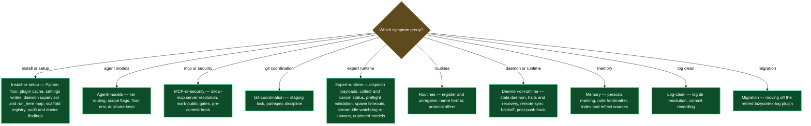

# Troubleshooting

## Python 3.12 or higher is required but not found

**Symptom**: Running `/lazy-core.install` immediately asks how to install Python, or reports "Python 3.12+ required — re-run /lazy-core.install once installed."

**Likely cause**: The `python3` binary on the current machine is either absent or reports a version below 3.12. Every LazyCortex plugin requires Python 3.12 as a single floor — hook scripts, runtime helpers, and install tooling all depend on it.

**Fix**: Install or upgrade Python 3.12 using the route that matches your machine — `brew install python@3.12 && brew link python@3.12 --force` on macOS, or `pyenv install 3.12 && pyenv global 3.12` on Linux. Run the install command in your own terminal (the skill prints the correct command but never runs system package managers on your behalf). Once the upgrade is in place, re-run `/lazy-core.install`.

---

## `/lazy-core.install` aborts: plugin not installed or cache empty

**Symptom**: Running `/lazy-core.install` produces an error like "plugin isn't actually installed — enable it first", or "plugin cache is empty — run `/plugin update` first", or (at Step 4) "plugin cache is broken".

**Likely cause**: Either `lazycortex-core@lazycortex` is not in `enabledPlugins` in your `~/.claude/settings.json`, or the marketplace entry for `lazycortex` is missing from `extraKnownMarketplaces`. Alternatively, the plugin is enabled but the local cache has never been populated or was truncated — the `rules/*.md` or `templates/core/` directory is empty or absent.

**Fix**: For a missing or unrecognised plugin, add both blocks to `~/.claude/settings.json`:
```json
{
  "extraKnownMarketplaces": {
    "lazycortex": {
      "source": { "source": "github", "repo": "mebius-san/lazy-cortex" },
      "autoUpdate": true
    }
  },
  "enabledPlugins": {
    "lazycortex-core@lazycortex": true
  }
}
```
Restart Claude Code, then re-run `/lazy-core.install`. For a cache problem, run `/plugin update lazycortex-core@lazycortex` first to restore the full plugin files, then re-run `/lazy-core.install`.

---

## `/lazy-core.install` fails seeding `agent_models` defaults

**Symptom**: `/lazy-core.install` fails at Step 6 with a message like "default-tiers.json missing or invalid at `<path>`; reinstall lazycortex-core".

**Likely cause**: `lazy-core.agent-models/default-tiers.json` inside the plugin cache cannot be read or parsed. This file is the single source of truth for built-in subagent model tiers; the skill refuses to fall back to hardcoded values.

**Fix**: Reinstall `lazycortex-core` by running `/plugin update lazycortex-core@lazycortex`, then re-run `/lazy-core.install`.

---

## `/lazy-core.install` Step 8 fails: settings.json malformed JSON

**Symptom**: `/lazy-core.install` fails at Step 8 with an error about invalid JSON in one of the four standard settings paths.

**Likely cause**: Step 8 strips stale `lazycortex-log` hook registrations left behind by the plugin's retirement (see the migration note at the end of this page) out of the four standard settings files — project and user `settings.json` / `settings.local.json`. If one of those was hand-edited and now contains invalid JSON, the step cannot read it to check for stale entries.

**Fix**: Open the settings file the error names and fix the JSON syntax error, then re-run `/lazy-core.install`.

---

## `/lazy-core.install` fails writing settings or installing the daemon supervisor

**Symptom**: `/lazy-core.install` fails at Step 9 with "settings file unwritable", or at Step 13 with a message about a missing plist/service template file, or `launchctl load` / `systemctl enable` returning a non-zero exit code.

**Likely cause (unwritable settings)**: `.claude/lazy.settings.json` or its parent directory has permissions that prevent writing.

**Likely cause (supervisor template missing)**: The plugin cache does not contain `templates/runtime/com.lazycortex.runtime.plist` (macOS) or `templates/runtime/lazy-core-runtime.service` (Linux) because the cache was only partially downloaded.

**Likely cause (launchctl/systemctl error)**: On macOS, the plist was written but `launchctl load` encountered a substitution error or permissions issue. On Linux, the systemd user instance is not running, or `daemon-reload` has not been called.

**Fix (unwritable)**: Check permissions on `.claude/lazy.settings.json` and the `.claude/` directory. Ensure both are writable by your current user, then re-run `/lazy-core.install`.

**Fix (template missing)**: Run `/plugin update lazycortex-core@lazycortex` to restore the full cache, then re-run `/lazy-core.install` and accept the daemon supervisor install offer again.

**Fix (macOS launchctl)**: Inspect the plist at `~/Library/LaunchAgents/com.lazycortex.runtime.<repo-name>.plist` for literal `{REPO_ROOT}` or `{REPO_NAME}` placeholders. If found, re-run `/lazy-core.install` to regenerate. Otherwise run `launchctl load <path>` manually from your terminal.

**Fix (Linux systemd)**: Run `systemctl --user daemon-reload` then `systemctl --user enable --now lazy-core-runtime-<repo-name>.service`, or re-run `/lazy-core.install` to reinstall the unit.

---

## `/lazy-core.install` Step 7 fails: file exists where `.logs/` or `.runtime/` directory is expected

**Symptom**: `/lazy-core.install` fails at Step 7 with a message like "`.logs/` or `.runtime/` not a directory".

**Likely cause**: A plain file named `.logs` or `.runtime` already exists at the repo root. The bootstrap helper requires these to be directories, not files.

**Fix**: Rename or remove the file by hand from your terminal, then re-run `/lazy-core.install`. The helper will create the directory on retry.

---

## The daemon never starts for this checkout after install

**Symptom**: `/lazy-core.install` completed without errors and reported a daemon supervisor installed, but the daemon does not appear to be running for this checkout — or a re-run reports `not-this-host` or `not-this-checkout` without asking anything.

**Likely cause**: `daemon.run_here` in the tracked `lazy.settings.json` is a hostname-to-checkout-path map (`{"nexus": "~/lazy-runtime/Money"}`), and a machine or checkout the map does not name gets no supervisor — the daemon refuses to start there even with `daemon.enabled: true`. `not-this-host` means this machine's hostname isn't a key in the map at all; `not-this-checkout` means this machine is in the map, but pointed at a different checkout's path than the one you're running from.

**Fix**: Decide which machine and checkout should drive the project, then edit the map — add `{"<hostname -s>": "<absolute path to that checkout>"}` (or correct the path on an existing host key) in the tracked `.claude/lazy.settings.json[daemon][run_here]`, then re-run `/lazy-core.install` from that checkout. The skill reads the map fresh on entry and, finding this host/path pair now named, installs the supervisor.

---

## `/lazy-core.install` never re-asks about the daemon

**Symptom**: You want to change your daemon setup choices (enable it for a project, or point at a different machine/checkout to drive it) but re-running `/lazy-core.install` silently skips all daemon questions.

**Likely cause**: Both gates are already persisted in the tracked `lazy.settings.json` — `daemon.enabled` (Gate 1) and `daemon.run_here` (Gate 2, a hostname-to-checkout-path map), both shared with every clone. The skill honours recorded decisions silently, so it never re-prompts; re-pointing which checkout drives the project is a deliberate edit, not an install-time default.

**Fix**: Edit the relevant key directly in `.claude/lazy.settings.json` and re-run `/lazy-core.install`:
- To change the project-wide daemon policy, update `daemon.enabled`.
- To change which machine/checkout drives it, edit `daemon.run_here` — add or correct the `{"<hostname>": "<checkout path>"}` entry for the machine that should drive it, or remove an entry (or empty the map to `{}`) to stop a machine from driving it. `/lazy-core.install` reacts to the new map state without asking.

---

## An old `daemon.run_here` value blocks the daemon after an upgrade

**Symptom**: After upgrading `lazycortex-core`, `/lazy-core.install` reports **run-here-invalid** and asks the daemon question again, even though this checkout already answered it once — and the daemon refuses to start until you answer.

**Likely cause**: `daemon.run_here` is recorded on disk as a plain boolean or a bare host list — the shape an older `lazy-core.install` wrote before the gate became a hostname-to-checkout-path map. Neither a boolean nor a bare hostname can say which checkout on a machine should drive the project (a machine commonly holds more than one clone of the same project), so the current install refuses to run the daemon against the old shape and asks again rather than guess.

**Fix**: Answer the question `/lazy-core.install` asks — it writes the correct `{"<hostname>": "<checkout path>"}` map entry, preserving any other machine's entry already on record. Once the map carries this machine and checkout, re-runs proceed silently again.

---

## The daemon starts but the metrics endpoint never comes up

**Symptom**: You enabled Prometheus metrics during `/lazy-core.install`, but nothing answers on the recorded port, and the daemon otherwise looks healthy.

**Likely cause**: Another process — often another lazycortex daemon on the same host — is already bound to the port this checkout recorded. The daemon detects the conflict at startup, records an incident naming the holder (pid, command, and the owning repo if it is another registered daemon), and keeps running with metrics disabled rather than retry-looping.

**Fix**: Re-run `/lazy-core.install` and go through the metrics step again — ports are allocated sequentially from 9464, skipping ports already recorded by other checkouts on the same host, so a re-run typically lands on a free one. Restart the daemon afterward to pick up the new port. To pick a port by hand instead, edit `metrics.port` in this checkout's gitignored `.claude/lazy.settings.local.json`, then restart the daemon.

---

## `/lazy-core.install` Step 7 fails: `.gitignore` unwritable

**Symptom**: `/lazy-core.install` fails at Step 7 with an error about `.gitignore` being unwritable.

**Likely cause**: The bootstrap step hit a permission or I/O error while appending the standard ignore lines to `.gitignore` at the repo root — the file or its parent directory is read-only for your current user.

**Fix**: Check permissions on `.gitignore` and the repo root, then re-run `/lazy-core.install`. The step is idempotent — retrying after fixing permissions completes cleanly.

---

## `/lazy-core.install` Step 9c reports `git: skipped-no-branch`

**Symptom**: Step 9c of `/lazy-core.install` reports `git: skipped-no-branch` in its summary, and the daemon sets up no remote git sync for this checkout.

**Likely cause**: The checkout is on a detached `HEAD` — there is no current branch for the daemon to track, so Step 9c has nothing to derive `daemon.git.base_branch` from.

**Fix**: Check out a branch (`git checkout <branch>`), then re-run `/lazy-core.install`. Until then the daemon does no remote sync at all — it neither commits nor pushes on your behalf.

---

## The daemon commits but never pushes

**Symptom**: The runtime daemon is enabled and clearly running — routine output lands as commits in your checkout — but those commits never show up on the remote, and nothing ever complains about it.

**Likely cause**: Earlier versions of `/lazy-core.install` seeded `daemon.git` as `null` and nothing else ever filled it in, so a daemon-enabled repo with no remote-sync configuration silently committed locally forever. Install now derives both fields when the block is absent — `base_branch` from the checkout's current branch, `remote_sync: pull_push` when an `origin` remote exists — but a repo installed under the older behaviour keeps its already-recorded `git: null` block, since the derivation only fills an absent block and never overwrites a value already on record.

**Fix**: Add a remote if you don't have one yet (`git remote add origin <url>`). If `.claude/lazy.settings.json` still shows `daemon.git` as literally `null`, delete the block so install has something to derive into, then re-run `/lazy-core.install`. `/lazy-core.audit` also flags a daemon-enabled repo whose `git` block is null or missing `base_branch`, and `/lazy-core.doctor` offers a fix to apply the same derivation directly.

---

## `/lazy-core.install` Step 11 expert wizard skips or flags a candidate

**Symptom**: While registering experts, `/lazy-core.install` Step 11 either shows no candidates at all, or lists one flagged `parse-error` or `protocol-unresolvable` instead of offering it for registration.

**Likely cause ("no candidates found")**: No agent file carrying `expert_protocol:` frontmatter was found under any of the three discovery scopes — there is genuinely nothing to register yet, and the wizard skips itself automatically.

**Likely cause (`parse-error`)**: A candidate agent file's frontmatter is malformed YAML, so the wizard cannot read its declared protocol.

**Likely cause (`protocol-unresolvable`)**: The candidate's `expert_protocol:` value points at a reference the resolver cannot find — the protocol file is missing, or the plugin that ships it isn't installed.

**Fix ("no candidates")**: No action needed — install any plugin that ships an expert agent and re-run.

**Fix (`parse-error`)**: Fix the malformed frontmatter in the flagged agent file, then re-run `/lazy-core.install` to pick it up.

**Fix (`protocol-unresolvable`)**: Verify the protocol file exists at the referenced path, or reinstall the plugin that should ship it (`/plugin update <plugin>@lazycortex`), then re-run `/lazy-core.install`.

---

## A declared external directory stays absent after install

**Symptom**: You declared an external working directory during `/lazy-core.install`, but the slot in your checkout never gets a symlink and nothing else complains about it.

**Likely cause**: This checkout has no `external_dirs.root` on record and you answered "Leave as is" when Step 12.5 asked — the wizard records `declined` in the checkout's local overlay and never re-asks.

**Fix**: Delete `external_dirs.declined` from `.claude/lazy.settings.local.json`, then re-run `/lazy-core.install` to be asked once more.

---

## A declared external directory is reported "skipped (was missing: PermissionError …)"

**Symptom**: `/lazy-core.install` reports one declared external directory as skipped with a `PermissionError`, while the rest of your declared directories repair normally.

**Likely cause**: The filesystem refused to create the symlink for that one slot — a read-only parent directory, or the slot already held by another process.

**Fix**: Fix the permission on the parent directory (or free the slot), then re-run `/lazy-core.install` — or accept the equivalent fix offer (Fix L4) the next time you run `/lazy-core.doctor`.

---

## The daemon halts with `uncommitted_changes` right after install, and `git status` lists the external directories

**Symptom**: Right after `/lazy-core.install` finishes, the daemon halts on its first tick with reason `uncommitted_changes`, and `git status` shows the external working-directory symlinks it just created as untracked or modified.

**Likely cause**: The symlinked slots are visible to git — either Step 12.5 recorded `ignores-declined` because you declined the `.gitignore` update it offered, or your existing `.gitignore` only covers the directory form of the name (`Data/`) while the slot itself is a symlink, which a directory-only ignore line does not match.

**Fix**: Re-run `/lazy-core.install` and accept the ignore-coverage question this time — it appends the anchored, slashless line (`/Data`) next to whatever is already there, which does match a symlink. Then commit or clean the working tree and run `/lazy-runtime.recover` to clear the halt.

---

## `/lazy-core.install` Step 12.5 reports `inbox-conflict` and no supervisor is installed

**Symptom**: `/lazy-core.install` reaches Step 12.5, reports `inbox-conflict`, and does not install the daemon supervisor for this checkout.

**Likely cause**: Another checkout already registered on this host runs an inbox routine that resolves to the same physical directory as one you're about to register here. Installing a second supervisor would mean two daemons dispatching every file in that inbox twice.

**Fix**: Decide which checkout should actually drive that inbox. In the tracked `.claude/lazy.settings.json[daemon][run_here]` of the project that should not, remove this host's entry (or empty the map to `{}`), then re-run `/lazy-core.install`. The install reads the map fresh, sees this host/checkout no longer named, and tears down any supervisor unit it already installed there instead of starting one.

---

## Both checkouts' daemons are halted with `inbox_collision`

**Symptom**: Two checkouts on the same host both have their daemons halted with reason `inbox_collision`, and removing the supervisor from one checkout does not clear the halt in the other.

**Likely cause**: The guard is symmetric and permanent by design — each daemon detects the collision independently at its own startup and raises its own halt block, which is state rather than a live probe. Nothing auto-clears it; only a dirty-tree halt self-clears.

**Fix**: Decide which checkout should drive the shared inbox. In the checkout that should not, remove this host's entry from the tracked `.claude/lazy.settings.json[daemon][run_here]` map (or empty it to `{}`). Then run `/lazy-runtime.recover` in the surviving checkout to clear its halt block explicitly — removing the losing checkout's supervisor alone does not do this for you.

---

## `/lazy-core.setup` stops at Step 0: settings migration errored

**Symptom**: Running `/lazy-core.setup` halts immediately with a message like "failed: `<stderr>`" in its Step 0 line, and the Step 6 report shows Steps 1–5 with outcome `aborted-by-migration-failure`. No child skills run.

**Likely cause**: `lazy_settings.py migrate` exited non-zero before any installer had a chance to read or write `.claude/lazy.settings.json`. This typically means a migration ladder file under `lazy_settings_migrations/` has a malformed `MIGRATIONS` callable, or the settings file itself is so corrupted that the ladder cannot parse it.

**Fix**: Read the captured stderr in the Step 6 report to identify which migration module or settings section is at fault. If the settings file is corrupt, inspect `.claude/lazy.settings.json` and fix the JSON syntax. If the error names a specific migration module, reinstall `lazycortex-core` via `/plugin update lazycortex-core@lazycortex` to restore the migration ladder, then re-run `/lazy-core.setup`.

---

## `/lazy-core.setup` reports one or more child skills failed

**Symptom**: `/lazy-core.setup` completes its run but the report shows one or more child skills under the "failed" section with a reason.

**Likely cause**: A child skill (such as `/lazy-core.install`, `/lazy-guard.allow-mcp`, or `/lazy-core.agent-models`) encountered a failure that appears in its own report. `/lazy-core.setup` never aborts the chain on a child failure — it collects all results and surfaces them together.

**Fix**: Read the reason listed per failed child in the setup report. Address the root cause for each (the other entries in this guide cover the most common child failure modes). Then re-run `/lazy-core.setup` — it is idempotent, so children that already succeeded will complete cleanly again and previously-failed ones will be retried.

---

## `/lazy-core.setup` ran a child skill you didn't expect

**Symptom**: `/lazy-core.setup` runs, and among the plugins it installed or reconfigured is one you didn't intend to touch this time.

**Likely cause**: `/lazy-core.setup` has no top-level per-plugin confirmation — it discovers every applicable `<namespace>.install` skill among enabled plugins and runs the whole chain in one pass.

**Fix**: Run `/lazy-core.setup --dry-run` first to preview the full plan before committing to it. If a specific plugin should be skipped going forward, disable that plugin, then re-run `/lazy-core.setup` — every child is idempotent, so re-running after a partial or unwanted pass is safe.

## `/lazy-core.audit` fails: "lazy.settings.json is not valid JSON"

**Symptom**: Running `/lazy-core.audit` aborts immediately with an error like "lazy.settings.json is not valid JSON".

**Likely cause**: `.claude/lazy.settings.json` was hand-edited and the edit broke JSON syntax — a trailing comma, an unclosed brace, a stray character.

**Fix**: Open the file and fix the syntax error directly, or re-scaffold it from scratch by running `/lazy-core.install` (idempotent — it fills in missing structure without touching anything already valid). Then re-run `/lazy-core.audit`.

---

## `/lazy-core.audit` reports an expert reference that "did not resolve"

**Symptom**: `/lazy-core.audit` flags one of your registered experts with a message like "reference did not resolve" for its `agent` field.

**Likely cause**: The `agent` value in `lazy.settings.json[experts]` uses a format the audit doesn't recognise, or points at an agent that no longer exists — a typo, a plugin that was removed, or an agent file that was deleted.

**Fix**: Check the `agent` field against one of the three recognised formats — `<plugin>:<name>`, `user:<name>`, or a bare `<name>`. If the target agent genuinely no longer exists, re-run `/lazy-core.install` to re-register the expert against a valid agent.

---

## `/lazy-core.audit` flags a routine command as failing even though the plugin is installed

**Symptom**: `/lazy-core.audit` reports a routine's `command:` entry as failing, but you can confirm the named plugin is installed and working.

**Likely cause**: The routine's recorded command path points at an older plugin-cache layout. Plugin binaries live under a versioned path; if the routine was registered against an earlier install, the path in `lazy.settings.json` can go stale after a plugin update.

**Fix**: Re-install the plugin that owns the routine (`/plugin update <plugin>@lazycortex`), then re-run `/lazy-core.install` for that plugin so the routine's command path is refreshed. Re-run `/lazy-core.audit` to confirm.

---

## `/lazy-core.audit` reports the daemon liveness check as WARN right after a fresh install

**Symptom**: `/lazy-core.audit`'s daemon liveness check (Agent D) reports WARN on the very first run after `/lazy-core.install`, even though nothing appears broken.

**Likely cause**: This is expected — the daemon supervisor was just installed and has not been started yet, so there is no live process or recent log line for the check to confirm against.

**Fix**: Start the daemon via the supervisor mechanism `/lazy-core.install` offered — `launchctl load` on macOS or `systemctl --user start` on Linux — then re-run `/lazy-core.audit` once the daemon has had a chance to write its first log line.

---

## `/lazy-core.audit` silently reports nothing for the expert runtime section

**Symptom**: Agent D of `/lazy-core.audit` produces no output at all for expert runtime / daemon findings, even though experts are configured in `lazy.settings.json`.

**Likely cause**: `${CLAUDE_PLUGIN_ROOT}/bin` did not resolve in the current environment (a sandboxed session, or a plugin path that failed to expand), so the audit's Python helper (`lazy_settings.py`) could never be imported.

**Fix**: Confirm `${CLAUDE_PLUGIN_ROOT}` resolves to the actual plugin install path in your session, and that `bin/lazy_settings.py` exists at that path. If the plugin cache looks intact but the variable still doesn't resolve, restart Claude Code and re-run `/lazy-core.audit`.

---

## `/lazy-core.doctor` Fix L1 fails: systemd unit not found

**Symptom**: `/lazy-core.doctor` offers to restart the daemon via `systemctl --user restart`, but the fix fails with "Unit not found".

**Likely cause**: The systemd user unit was never installed for this checkout — this happens on a first-time daemon setup where the unit-install step of `/lazy-core.install` was skipped or interrupted.

**Fix**: Run `/lazy-core.install` to install the unit file and register it (`systemctl --user daemon-reload`), then re-run `/lazy-core.doctor` to confirm the daemon restarts cleanly.

---

## `/lazy-core.doctor` can't clean up a dead job: Permission denied

**Symptom**: `/lazy-core.doctor` identifies a dead expert job and offers to remove its directory, but the fix fails with "Permission denied".

**Likely cause**: The job directory was created by a different user or process and the current user lacks write permission to remove it.

**Fix**: Remove the job directory by hand from your terminal with the appropriate permissions (`sudo rm -rf` or `chown` first, depending on your setup), then re-run `/lazy-core.doctor` to confirm the job no longer shows as dead.

---

## `/lazy-core.doctor` can't remove a stray routine, or the routine keeps coming back

**Symptom**: `/lazy-core.doctor` offers to remove a routine it considers stray, but the fix fails with "settings file not writable" — or the fix succeeds, but the same routine reappears the next time you run `/lazy-core.doctor`.

**Likely cause (not writable)**: `.claude/lazy.settings.json` is read-only or the current process lacks write permission.

**Likely cause (reappears)**: The routine is one a plugin re-adds automatically on every install — running `/lazy-core.install` again after the removal restores it because the plugin's default-routines bootstrap doesn't know it was deliberately removed.

**Fix (not writable)**: Fix the file's permissions, then re-run `/lazy-core.doctor`.

**Fix (reappears)**: If you don't want the routine at all, re-run `/lazy-core.install` and decline the relevant routine at the prompt (where the install flow offers one), rather than removing it after the fact via `/lazy-core.doctor`.

---

## `/lazy-core.doctor` skips its expert-runtime section even though experts are configured

**Symptom**: Running `/lazy-core.doctor` skips its expert-runtime health section entirely, even though `lazy.settings.json` clearly has experts configured.

**Likely cause**: The skip guard for this section only fires when it finds none of an `experts` section, a `lazy-core.runtime` section, or a non-empty `external_dirs.paths` list — if your settings file stores this configuration somewhere non-standard, the guard misses it.

**Fix**: Run `/lazy-core.audit` directly — Agent D surfaces the same expert-runtime findings without the skip guard, so you can confirm what doctor missed.

## `/lazy-core.agent-models` fails with "invalid --scope value"

**Symptom**: Running `/lazy-core.agent-models` (or `/lazy-core.optimize` Phase 7) produces an error about an unrecognised flag.

**Likely cause**: A flag other than `--scope=auto`, `--scope=project`, `--scope=global`, or `--dry-run` was passed to the skill. Any unrecognised token causes an immediate fail.

**Fix**: Re-run with a valid flag. Valid scope values are `auto` (default), `project`, and `global`. Example: `/lazy-core.agent-models --scope=project`.

---

## An agent dispatches to the default model despite a tier being configured

**Symptom**: An agent you assigned a tier via `/lazy-core.agent-models` (e.g. `opus`) runs on the default model instead.

**Likely cause**: The tier value stored in `lazy.settings.json` is not one of the three recognised strings (`haiku`, `sonnet`, `opus`). A typo (e.g. `"sonnet-3-7"`, `"claude-opus"`) causes the hook to treat the entry as unset and fall through to the default model. The hook emits a warning to stderr but never blocks the dispatch.

**Fix**: Run `/lazy-core.agent-models` to review and correct the entries. The skill fills only missing entries by default — to replace an incorrect value, remove the bad entry from `lazy.settings.json` first (the skill will then detect it as missing and prompt you to fill it in), or run `/lazy-core.doctor` which flags unrecognised tier values as a configuration error and offers to fix them.

---

## `LAZY_AGENT_MODEL_FLOOR` has no effect

**Symptom**: You set `LAZY_AGENT_MODEL_FLOOR` in your environment to cap the maximum model tier, but agents still dispatch at a higher tier than intended.

**Likely cause**: The env var value is not one of the three recognised tier names (`haiku`, `sonnet`, `opus`). The hook logs a warning to stderr and ignores an unrecognised floor value entirely.

**Fix**: Confirm the value of `LAZY_AGENT_MODEL_FLOOR` in your shell environment (`echo $LAZY_AGENT_MODEL_FLOOR`). Correct it to one of `haiku`, `sonnet`, or `opus`, then restart Claude Code so the hook picks up the updated environment.

---

## A dispatch string appears in multiple `agent_models` groups and routes unexpectedly

**Symptom**: An agent routes to an unexpected model tier. Inspecting `lazy.settings.json` reveals the same dispatch string listed under two different group keys with different tier values.

**Likely cause**: The `model-router` hook flattens all groups at load time. When the same dispatch string appears in more than one group, the last group processed wins and a warning is emitted to stderr.

**Fix**: Run `/lazy-core.agent-models` to audit the current state. After the skill reports, remove the duplicate entry from the group where it should not appear — the skill writes only missing entries and will not remove duplicates automatically. Running `/lazy-core.doctor` will also flag cross-group duplicate keys as a configuration error.

---

## An agent pinned via `/lazy-core.agent-models` doesn't route on daemon dispatches

**Symptom**: You pinned a tier for an expert's agent through `/lazy-core.agent-models`, confirmed the entry landed in `agent_models` in `lazy.settings.json`, but jobs dispatched to that expert by a routine still resolve to no explicit model, or a different tier than you expected.

**Likely cause**: The expert runtime resolves `agent_models` from the **project-scope** `lazy.settings.json` only — a headless daemon dispatch never sees the global file (`~/.claude/lazy.settings.json`), even though the interactive `lazy-core.model-router` hook does merge global under project. If the entry landed in the global file — because the owning plugin's install scope was global, or because a scope flag routed it there — the daemon-facing resolver never reads it.

**Fix**: Re-run `/lazy-core.agent-models`. The wizard now detects when a dispatch string matches an `experts.<name>.agent` entry (or the built-in doctor dispatch, `lazycortex-core:lazy-runtime.doctor`) in the current repo, and routes that entry to the project-scope file automatically regardless of its group — re-running moves any existing global-only pin into scope. If you hand-edited `lazy.settings.json`, move the entry from the global file into the project's `.claude/lazy.settings.json[agent_models]` yourself.

---

## A non-interactive rollout leaves some agent-model tiers or MCP entries unresolved

**Symptom**: A repo processed by a non-interactive rollout (no one answering prompts) comes back with some `agent_models` entries or MCP `allow`/`ask` entries applied, and others still missing — the run's own report lists the leftovers as `needs-interactive`.

**Likely cause**: Both `/lazy-core.agent-models` and `/lazy-guard.allow-mcp` only auto-apply, without a user channel, the subset of decisions that are already recorded rather than guessed. For `/lazy-core.agent-models`, that means curated tiers from `default-tiers.json` (Batch 1) land automatically, while agents with no curated tier (Batches 2 and 3) have no safe default to pick and are left missing. For `/lazy-guard.allow-mcp`, that means new `allow`/`ask` entries at a scope the skill can already infer from existing entries, and preload-hook merges into a hook that already exists, apply automatically — while an undetermined scope, an `allow`→`ask` reversal, a cross-scope leak, or the initial "install the preload hook at all?" decision all require a person's judgment and are reported rather than guessed.

**Fix**: Run the interactive form of the skill directly to clear the remainder — `/lazy-core.agent-models` for the still-missing agent tiers, or `/lazy-guard.allow-mcp <server>` for the still-open MCP scope, reversal, or leak-cleanup decisions — and answer the prompts once. Both skills are idempotent: entries already applied by the non-interactive pass are left untouched, and only the reported `needs-interactive` items re-prompt.

---

## MCP tools keep prompting for permission after running `/lazy-guard.allow-mcp`

**Symptom**: You ran `/lazy-guard.allow-mcp` for a server but Claude Code still asks for permission every time a tool from that server is called.

**Likely cause 1**: The permissions were written to `settings.json` (tracked) but Claude Code applies permissions from `settings.local.json` (gitignored). The skill defaults to `settings.local.json`; if you have a `settings.json` entry for the same tool, the two files may conflict.

**Likely cause 2**: The server's tools fall into the "medium-risk / skip" bucket — these are intentionally left out of both `allow` and `ask` lists so Claude Code prompts once per call for the user to decide in context. This is the intended behaviour for tools in that bucket.

**Fix for cause 1**: Re-run `/lazy-guard.allow-mcp` — it will detect the cross-scope duplicates and strip the redundant entries from the tracked `settings.json` automatically after per-entry confirmation.

**Fix for cause 2**: If you want the tool always allowed without a prompt, run `/lazy-guard.allow-mcp` again and explicitly override the classifier for that tool when prompted.

---

## `/lazy-guard.allow-mcp` stops: server not found or server not loaded

**Symptom**: Running `/lazy-guard.allow-mcp <server-name>` produces an error like "server not found — discovered servers are: …", or the server is defined but skipped with "server isn't loaded — restart Claude Code and re-run".

**Likely cause (not found)**: The server name passed as input is not defined in `~/.mcp.json` or `./.mcp.json` at this scope. Either the name is misspelled or the server definition has not been added yet.

**Likely cause (not loaded)**: The server is defined in `.mcp.json` but has zero matching `mcp__<server>__*` tools visible in the current session. The server may have failed to start, or the session predates its definition. The skill never invents tool names.

**Fix (not found)**: Check the server name against the list shown in the error. Correct the typo or add the server entry to the appropriate `.mcp.json` file, then re-run `/lazy-guard.allow-mcp`.

**Fix (not loaded)**: Restart Claude Code so the server loads and its tools become visible in the session, then re-run `/lazy-guard.allow-mcp`.

---

## `/lazy-repo.mark-public` Step 4 won't proceed: FAIL findings still unresolved

**Symptom**: `/lazy-repo.mark-public` halts at Step 4 with a message that FAIL findings remain.

**Likely cause**: At least one secret-class (category A) finding from the Step 2 audit was not resolved during Step 3. The skill requires every FAIL finding to be encrypted, template-ized, or redacted before it will write the waiver file or proceed to the GitHub visibility flip.

**Fix**: Return to Step 3 and choose a resolution strategy for each outstanding FAIL finding — encrypt the value, replace it with a template placeholder, or redact it from the file. Once all FAIL findings are gone, re-run `/lazy-repo.mark-public` to continue from Step 4 (the skill is idempotent and will resume cleanly).

---

## `/lazy-repo.mark-public` Step 5 fails: `gh` not on PATH or unauthenticated

**Symptom**: The GitHub visibility flip at Step 5 of `/lazy-repo.mark-public` does not run, with an error about `gh` not being found or requiring login.

**Likely cause**: GitHub CLI (`gh`) is not installed on the current machine, or `gh auth login` has not been run.

**Fix**: Install GitHub CLI (`brew install gh` on macOS, or see [cli.github.com](https://cli.github.com)) and run `gh auth login`. Then execute `gh repo edit --visibility public` manually from the repo root when ready. The security audit and waiver file created by earlier steps remain valid — no need to re-run the full flow.

---

## The pre-commit hook doesn't fire on commits

**Symptom**: You commit to a public repo and Claude Code does not scan staged changes.

**Likely cause 1**: `.guard-public.json` is missing from the repo root. The pre-commit hook uses the presence of this file as the opt-in signal — without it, scanning is disabled.

**Likely cause 2**: You committed with a chained or flag-form command — `git add . && git commit -m "..." && git push`, `git -C <dir> commit`, or `cd <dir> && git commit` — on a plugin version older than this fix. Earlier versions of the `lazy-guard.check-public` hook only recognized a `Bash` command that literally started with `git commit`, so any chained invocation slipped through unscanned even with `.guard-public.json` present.

**Fix for cause 1**: Run `/lazy-repo.mark-public`. The skill creates `.guard-public.json` at the repo root with the correct schema, which is the opt-in signal that activates the hook. From the next commit onward, every `git commit` triggers the scan automatically.

**Fix for cause 2**: Run `/plugin update lazycortex-core@lazycortex` to pick up the current hook, which detects `git commit` anywhere in the command — chained or flag-prefixed — not just at the start. Restart any open Claude Code sessions afterward; hook registrations are held in memory for the session's lifetime.

---

## Git staging is refused: "another Claude session is staging…"

**Symptom**: A `git add`, `git commit`, or equivalent staging call is refused with a message naming another Claude Code session as the current staging holder, even though you don't see another session obviously active.

**Likely cause**: The per-repo staging lock at `.git/lazy-git.lock` is held by a session whose PID is dead, on a different host, or has sat idle past the staleness threshold — the hook's auto-break heuristics only release the lock once one of those conditions is confirmed, so a genuinely-recent hold on the same host is (correctly) treated as still in progress and blocks new staging. This applies only when the repo runs the staging-window mutex row of `lazy-core.git-guard`.

**Fix**: Run `/lazy-core.git-status` to see who holds the lock, how long it has been held, and whether the break-the-lock heuristics already consider it breakable. If the report shows it should already be breakable, retry the git operation — the hook re-evaluates on the next call. If the lock is genuinely stuck (the holder confirmed abandoned, heuristics not yet satisfied), run `/lazy-core.git-unlock`; it shows the same holder details and asks for confirmation before force-clearing the lock.

---

## A `git commit`, `git add`, `git rm`, or `git mv` is refused: "the git index belongs to the operator"

**Symptom**: A `git commit` (bare, `-a`/`-am`, `.`, `:/`, or a directory pathspec), a `git add` that would stage file content, a `git rm`, a `git mv`, or an `mcp__git__git_add` / `mcp__git__git_commit` call is refused with a `lazy-core.git-guard` deny message saying the git index belongs to the operator and naming the required explicit-pathspec form.

**Likely cause**: The repo's default git-guard row is the pathspec discipline — the shared index is treated as operator territory, not session scratch space. Under this row, `git add` may only register a path with `-N` (no content staged); `git rm` and `git mv` are refused outright because both auto-stage as a side effect; a commit must name every path explicitly (`-- <path> <path>`) — never bare, `-a`/`-am`, `.`, `:/`, or a directory pathspec; and the MCP `git_add` / `git_commit` tools are refused unconditionally because neither can carry a pathspec at all.

**Fix**: Rephrase into the canonical form the deny message names — never retry verbatim and never bypass with `--no-verify`. For a new file, run `git add -N <path>` to register it, then commit with `git commit -m "..." -- <path> <path>`. For a rename or delete, use a plain Bash `mv` / `rm` in the worktree (never `git mv` / `git rm`), then commit the old and new paths explicitly. Switch any MCP git-tool call to the equivalent Bash `git` command. `git reset` stays unrestricted. A bare or broad commit is only accepted mid-merge/rebase/cherry-pick (git itself refuses a partial commit there) or as `--amend` against an already-clean index.

**Likely cause (a legitimate command was refused, pre-5.19.0)**: Two separate parser bugs in `lazy-core.git-guard`, both fixed in core 5.19.0, could deny an already-correct command. First, a quoted multi-paragraph `-m` message containing a blank line was split into two invocations at the newline before quote-balance was checked, so an ordinary `git commit -m "subject\n\nbody"` came back looking unbalanced and got denied outright. Second, `git -C <other-repo> ...` was judged against the *current* repo's guard settings instead of the repository the command actually targets, so a legitimate cross-repo command (for example, a publish mirror sync) was refused as if it touched the shared index here.

**Fix (legitimate command refused)**: Run `/plugin update lazycortex-core@lazycortex` to pick up core 5.19.0 or later, then restart any open Claude Code sessions — hook registrations are held in memory for the session's lifetime. Re-run the same command afterward: a multi-line commit message now parses as one invocation, and a `-C <dir>` command is judged against the repository it actually names rather than the current one.

---

## A routine's expert spawns keep timing out or the job dies doing nothing

**Symptom**: A routine (inbox, schedule, git, or md-scan) that dispatches to an expert never produces a result — the job sits until it eats the routine's wall timeout and dies, with no useful output in `response.json`. `/lazy-expert.collect-job` eventually reports `status: failed` or the job never leaves `active`.

**Likely cause**: Expert spawns run headless and hermetic (`claude -p ... --strict-mcp-config`) — by default an expert loads no MCP servers at all, only the ones declared per-expert via `mcp_config` in `lazy.settings.json[experts]`. If one of those declared servers hangs on initialization (a stdio server waiting on a socket that never connects, a remote server that needs interactive auth) or fails to spawn, the whole `claude -p` invocation stalls until the routine's timeout kills it. The expert never gets to write a response, so the job looks like it silently died.

**Fix**: Run `/lazy-runtime.preflight` (optionally `/lazy-runtime.preflight <expert-name>` to target one expert). It emulates the same spawn the pump uses, with a trivial prompt that does no real work, and reports each declared MCP server's status — `connected`, `timed-out`, `auth-required`, or `spawn-failed`. For a timed-out or failing server it offers to drop the server from that expert's `mcp_config` (the expert then spawns hermetically without it) or, for a server that needs interactive login, prints the exact `claude mcp login <name>` command to run by hand before re-running. Re-run `/lazy-runtime.preflight` after applying a fix to confirm the expert is launchable, then re-dispatch the routine.

---

## A live expert job gets killed and re-spawned while it's still working

**Symptom**: An expert job — especially one dispatched to an `opus`-tier agent producing a long response — gets killed and re-spawned partway through, sometimes several times in a row, even though the process was still working and never actually froze.

**Likely cause**: The daemon's pump kills and re-spawns an expert's process group after `daemon.stream_idle_timeout_sec` seconds of stdout silence, treating a silent stream as a frozen one. An `opus`-tier expert composing a long document can legitimately think in silence for minutes, which the watchdog can't tell apart from a genuine freeze. Versions of `lazycortex-core` before this fix shipped (and seeded via `/lazy-core.install`) a 90-second default, which routinely fired on a live opus job — up to `stream_max_retries` times in a row before the job was left with a transient error. The shipped default is now 900 seconds. A `daemon` section that still carries exactly the old seeded literal `90` is raised to `900` automatically the next time settings are migrated; any other explicit value you set yourself, including one you happened to also pick as `90`, is left untouched, since the migration only recognises its own former seed by matching the literal, not the key's mere presence.

**Fix**: If you never set `stream_idle_timeout_sec` yourself, no action is needed beyond being on a current `lazycortex-core` — the migration applies the next time `lazy.settings.json` is read (for example, on the next `/lazy-core.install` or `/lazy-core.setup` run, or the daemon's own next tick). If you deliberately set a low value and are now dispatching long-thinking `opus` jobs, raise `daemon.stream_idle_timeout_sec` in `.claude/lazy.settings.json` yourself — 900 seconds is the current shipped default and a reasonable floor for opus-tier work.

---

## An expert (or the built-in doctor) runs on an unexpected, unpinned model

**Symptom**: A dispatched job — including the daemon's own built-in health-check routine — appears to run on whatever model your interactive CLI happens to default to on that machine, rather than the tier you configured. There is no error; the daemon's spend or behaviour just looks inconsistent across machines or over time.

**Likely cause**: The dispatch resolved to no explicit model pin — no per-expert `model` override and no matching entry for the agent's dispatch string in `agent_models`. Every dispatchable agent, including the daemon's built-in doctor, is expected to resolve an explicit tier; when it can't, the spawn silently inherits the CLI's ambient default instead of failing loudly. The runtime records a best-effort `unpinned_model` incident on the repo's error ledger the first time this happens for a given expert, but nothing on the surface blocks the dispatch itself.

**Fix**: Run `/lazy-runtime.preflight` — it emulates the same spawn and reports a FAIL with a `pin-model` fix offer for any expert that resolves no model; accept the fix to pin a tier directly into the project's `agent_models`. For the built-in doctor routine specifically, re-run `/lazy-core.install` — its install step seeds the doctor's own expert entry (agent reference plus a `sonnet` default tier) into the project scope, which is what the runtime reads for that dispatch.

---

## `/lazy-runtime.preflight` has nothing to validate

**Symptom**: Running `/lazy-runtime.preflight` reports "No expert-shape routines carry a local expert to validate" and exits without probing anything.

**Likely cause**: Every registered routine is either `command`-shape (a plain subprocess, no expert dispatch) or targets a cross-repo expert (`expert@<repo>`) rather than an expert local to the repo you ran the preflight from. The skill only emulates spawns for experts it can actually launch from the current repo.

**Fix**: Register an `expert`-shape routine first via `/lazy-routine.register`, or run `/lazy-runtime.preflight` from inside the repo that actually owns the expert you want to validate.

---

## `/lazy-runtime.preflight` reports every server `timed-out` at once

**Symptom**: The preflight report shows every declared MCP server for an expert as `timed-out`, even servers that normally connect fine.

**Likely cause**: The probe hit its 90-second wall budget on the whole spawn, not on one individual server — this usually means the `claude -p` invocation itself never got going, most often because `claude` isn't on `PATH` in the environment the preflight ran in, or the CLI isn't authenticated.

**Fix**: Confirm `claude` resolves and works by hand: run `claude -p "hi"` directly in your terminal. If that hangs or errors, fix the underlying `claude` CLI setup (PATH, authentication) first, then re-run `/lazy-runtime.preflight`.

---

## `/lazy-runtime.preflight` warns "plugin-dir resolution was best-effort"

**Symptom**: The preflight report includes a note that plugin-dir resolution was best-effort, and a server that should be fine shows up as failing.

**Likely cause**: The preflight ran interactively with no `LAZYCORTEX_PLUGIN_DIRS` environment variable set, so it fell back to deriving plugin directories from the repo and the plugin cache rather than the daemon's authoritative resolution. This fallback can misidentify a plugin's `bin/` location in unusual cache layouts, producing a false-negative probe failure.

**Fix**: Treat a failure alongside this warning as unconfirmed. Re-run the same expert under the daemon (which always exports `LAZYCORTEX_PLUGIN_DIRS`), or export `LAZYCORTEX_PLUGIN_DIRS` yourself before running `/lazy-runtime.preflight` interactively, then confirm the result.

---

## `/lazy-runtime.preflight` can't apply a fix: tree is mid-merge or mid-rebase

**Symptom**: `/lazy-runtime.preflight` identifies a broken `mcp_config` entry and proposes a fix, but refuses to apply it, citing that it cannot commit the settings change right now.

**Likely cause**: The repo is mid-merge, mid-rebase, or otherwise has git in a transactional state. The skill will not write and commit a settings change while a git transaction is in progress, to avoid interleaving with it.

**Fix**: Finish or abort the in-progress git transaction (`git merge --continue`/`--abort`, `git rebase --continue`/`--abort`), then re-run `/lazy-runtime.preflight` to apply the fix.

---

## `/lazy-runtime.preflight` reports every expert `ok` but a `fail` line sits above the table

**Symptom**: `/lazy-runtime.preflight` reports every individual expert as `ok`, but a `fail` line appears above the per-expert table and the overall run does not pass.

**Likely cause**: Each expert is individually launchable, but the checkout as a whole is not — another daemon already registered on this host drives one of the same inboxes this checkout would use, so starting this checkout's daemon would double-dispatch every file that lands there.

**Fix**: Remove this host's entry from the tracked `.claude/lazy.settings.json[daemon][run_here]` map in the checkout that must not drive the shared inbox (or empty the map to `{}`), then re-run `/lazy-runtime.preflight` to confirm.

---

## An expert job fails with `Operation not permitted` even though `/lazy-runtime.preflight` reports it as launchable

**Symptom**: An expert job fails with `Operation not permitted`, but `/lazy-runtime.preflight` for that expert reports everything fine — no missing MCP server, no unresolvable agent, no bad `mcp_config` path.

**Likely cause**: The sandbox allowlist that confines the expert's spawn names a directory reached through a symlink — commonly one of the external working directories `/lazy-core.install` links in at Step 12.5 — and confinement is checked against the resolved (real) path rather than the symlinked one, so the allowlist entry never actually matches what the spawn tries to reach.

**Fix**: Run `/lazy-runtime.preflight` again — it now offers a `sandbox` fix for this case; accept it, or run `lazycortex-core sandbox-sync --repo-root "$PWD"` by hand to regenerate `.runtime/sandbox.settings.json` against resolved paths.

---

## `/lazy-expert.dispatch-job` fails: experts directory not initialised

**Symptom**: Running `/lazy-expert.dispatch-job` produces an error like "`.experts/` not initialised — run `/lazy-core.install` first."

**Likely cause**: The expert runtime has not been bootstrapped for this repo. `/lazy-expert.dispatch-job` requires the `.experts/` directory layout to exist before it can write job files.

**Fix**: Run `/lazy-core.install`. When the wizard asks whether to bootstrap runtime/experts, answer yes. The install skill creates `.experts/`, writes `lazy.settings.json[experts]`, and bootstraps the required directory layout. Then re-run `/lazy-expert.dispatch-job`.

---

## `/lazy-expert.dispatch-job` rejects the payload or expert name

**Symptom**: `/lazy-expert.dispatch-job` aborts immediately with "payload missing required field(s): kind, role" (or `request`), or with "`<expert_name>` is not registered in `lazy.settings.json[experts]`".

**Likely cause (missing fields)**: The payload dict is missing one or more of the three standard fields — `kind`, `role`, and `request` — that every expert protocol requires.

**Likely cause (not registered)**: The `expert_name` argument does not match any key in `lazy.settings.json[experts]`. The expert was never added during install, the name contains a typo, or the settings file was manually edited and the entry was lost.

**Fix (missing fields)**: Add the missing fields to your payload. All three must be present: `kind`, `role`, and `request`.

**Fix (not registered)**: Verify the expert name against `lazy.settings.json[experts]`. If the expert is missing, register it via the `/lazy-core.install` expert wizard. Then re-dispatch with the correct `expert_name`.

---

## `/lazy-expert.dispatch-job` routes to the wrong expert silently

**Symptom**: A job dispatched appears to complete without error, but the result is missing or seems to have been processed by the wrong worker. Running `/lazy-expert.list-jobs` shows the job under an unexpected expert key.

**Likely cause**: The `expert_name` argument contains a typo that does not match any key in `lazy.settings.json[experts]`. The skill creates the job directory under the named key regardless — if the key is unrecognised, the daemon's pump routine skips it silently on every drain cycle.

**Fix**: Run `/lazy-expert.list-jobs` to see all active job directories and confirm which expert key the job landed under. Cancel the misrouted job with `/lazy-expert.cancel-job`, then re-dispatch with the correct `expert_name`.

---

## `/lazy-expert.dispatch-job` fails with a `JSONDecodeError` on the protocols argument

**Symptom**: `/lazy-expert.dispatch-job` raises a `JSONDecodeError` pointing at the protocols argument instead of dispatching the job.

**Likely cause**: The protocols argument was passed as something other than a JSON array literal — a bare comma-separated string, a single unquoted name, or an empty string instead of `'[]'`.

**Fix**: Pass a JSON array literal — `'[]'` for no protocols, or `'["plugin:protocol-name"]'` to attach one — then re-dispatch with the corrected argument.

---

## `/lazy-expert.collect-job` returns `status: missing` or cancel reports "Job not found"

**Symptom**: `/lazy-expert.collect-job` reports `status: missing`, or `/lazy-expert.cancel-job` reports "Job `<job_id>` not found for expert `<expert_name>`."

**Likely cause**: The job directory was never created — the dispatch failed silently, or the `job_id` / `expert_name` was mistyped.

**Fix**: Verify the `job_id` and `expert_name` match exactly what `/lazy-expert.dispatch-job` returned. Run `/lazy-expert.list-jobs` to see all active jobs and confirm whether the job was dispatched. If the job is absent, re-dispatch with the correct payload and expert name.

---

## `/lazy-expert.collect-job` reports `status: pending` forever for a job you cancelled

**Symptom**: You ran `/lazy-expert.cancel-job` for a job and it confirmed "cancelled — executor stopped", but polling that same job afterward with `/lazy-expert.collect-job` keeps reporting `status: pending` instead of ever settling.

**Likely cause**: Cancelling a job stops its executor and stamps a `CANCELLED` marker on the bundle, but the bundle directory — request, response, transcript, result — is deliberately kept on disk for post-mortem rather than removed, and cancellation never writes the `DONE` marker. `/lazy-expert.collect-job` only distinguishes `missing`, `pending`, `done`, and `failed`; a cancelled bundle with no `DONE` marker reads as `pending` indefinitely.

**Fix**: Use `/lazy-expert.list-jobs` to check the job's real state instead — a cancelled job is reported there with `status: cancelled`. Treat that as the terminal answer for a cancelled job; `/lazy-expert.collect-job` will never resolve it out of `pending`.

---

## `/lazy-expert.collect-job` reports `status: failed` with a malformed response

**Symptom**: `/lazy-expert.collect-job` returns `status: failed` and the error output suggests the expert's `response.json` is unreadable or contains invalid JSON.

**Likely cause**: The expert agent wrote an invalid JSON response, or a crash mid-write left `response.json` in a truncated state. The collect skill reads this file directly and raises `json.JSONDecodeError` if it cannot parse it.

**Fix**: Inspect the file at `.experts/.jobs/<expert>/<job_id>/response.json` directly to see what the expert wrote. If the file is corrupt, the job cannot be recovered — cancel it with `/lazy-expert.cancel-job` and re-dispatch with the same payload.

---

## A job never reaches `done`, and an inbox stops draining

**Symptom**: A job dispatched to an expert never settles — `/lazy-expert.collect-job` keeps reporting `pending`, then eventually `failed`. If the job came from an `inbox`-type routine, new files stop moving out of that routine's input directory entirely; they just pile up.

**Likely cause**: The expert's `response.json` never wrote an `outcome` field. The runtime treats `outcome` as the one field every expert response must carry, and a response missing it is rejected outright rather than accepted. The first rejection keeps the job queued — the bad response is discarded, and the next spawn is told what was wrong with the previous attempt. A second response that still omits `outcome` fails the job for good and opens a `job_error` incident on the repo's error ledger. The usual root cause is a protocol file (`.claude/references/*-protocol.md`) that tells its expert to write some status field of its own — `status`, `state` — in place of `outcome`. Every job dispatched under that protocol hits the same rejection, and because a routine's queue is worked one job at a time, a stuck expert pauses the routine feeding it — for an inbox routine, that shows up as the input directory no longer draining.

**Fix**: Run `/lazy-core.doctor` — its expert-runtime section names the offending protocol file directly, as a `protocol_envelope` finding ("protocol `<name>` overrides the response envelope: `<detail>`"). Edit that protocol file so its response-shape section documents `outcome` (with whichever values your protocol needs) instead of a rival `status`/`state` field. A job that already failed with a `job_error` incident does not retry itself — once the protocol is fixed, re-dispatch it with `/lazy-expert.dispatch-job`.

---

## `/lazy-expert.list-jobs` rejects the status filter

**Symptom**: Running `/lazy-expert.list-jobs` with a `status` argument fails immediately with "status must be one of: queued, active, cancelled, dead, done, failed."

**Likely cause**: The value passed to the `status` filter is not one of the six recognised strings. Common mistakes include `pending` (old vocabulary), `IN_PROGRESS`, `DONE` (uppercase), `ready`, or `CANCELLED` (uppercase — the filter is case-sensitive).

**Fix**: Use one of the six valid filter values: `queued`, `active`, `cancelled`, `dead`, `done`, or `failed`. To see all jobs regardless of status, omit the `status` argument entirely.

---

## `/lazy-routine.register` fails: name format, already registered, or unknown type

**Symptom**: Running `/lazy-routine.register` fails with "routine names must be `<plugin>.<verb>` format", "routine `<name>` already registered. Use `--force` to overwrite", "unknown type 'X'", "missing required field(s)", "`<inbox_dir>` is not gitignored", or "`.claude/lazy.settings.json` unwritable".

**Likely cause (name format)**: The `name` argument does not contain exactly one dot, or one of the two parts is empty.

**Likely cause (already registered)**: A routine with the same name is already present in the `lazy-core.runtime` section of `.claude/lazy.settings.json`. The skill refuses to silently overwrite.

**Likely cause (unknown type)**: The `type` field is not one of `subprocess`, `inbox`, `schedule`, `git`, or `md-scan`.

**Likely cause (missing fields)**: The configuration dict is missing one or more fields required by the routine type's schema.

**Likely cause (inbox not gitignored)**: An `inbox`-type routine's working directory is tracked by git rather than gitignored. The wizard refuses to register a routine whose scratch area would otherwise pollute your commits.

**Likely cause (unwritable)**: `.claude/lazy.settings.json` does not exist (the expert runtime was never bootstrapped) or the file has permissions that prevent writing.

**Fix (name format)**: Rename the routine to follow `<plugin>.<verb>` convention, for example `acme-lint.tick`.

**Fix (already registered)**: Re-run with `--force` to overwrite, or run `/lazy-routine.unregister <name>` first.

**Fix (unknown type)**: Correct the `type` to one of the five supported values.

**Fix (missing fields)**: Add the missing fields; run `/lazy-routine.register` in wizard mode (without a pre-built `cfg` dict) to be prompted for each required field in order.

**Fix (inbox not gitignored)**: Add the inbox directory to `.gitignore` — the wizard offers to do this for you at the prompt — or point the routine at a directory that already lives outside version control.

**Fix (unwritable)**: Run `/lazy-core.install` to bootstrap the file. If the file exists but is read-only, fix its permissions, then re-run `/lazy-routine.register`.

---

## `/lazy-routine.unregister` refuses to remove `lazy-expert.pump`

**Symptom**: Running `/lazy-routine.unregister lazy-expert.pump` fails with "`lazy-expert.pump` is the built-in expert pump; removing it breaks the experts pipeline."

**Likely cause**: The skill protects the built-in pump routine from accidental removal. Without `lazy-expert.pump`, the runtime daemon stops draining the job queue and expert jobs queue indefinitely.

**Fix**: If removal is intentional, pass the `--force` flag: `/lazy-routine.unregister lazy-expert.pump --force`. Expert jobs will stop being processed until the routine is re-registered. To restore it later, re-run `/lazy-core.install` — the install skill re-registers the pump if experts are configured.

---

## The runtime daemon appears stale after install

**Symptom**: `/lazy-core.doctor` reports "runtime daemon appears stale" even after running `/lazy-core.install` and setting up the supervisor. Re-running the doctor immediately after install still shows the same warning.

**Likely cause 1**: On macOS, the launchd plist was written to `~/Library/LaunchAgents/` but has not been loaded yet. A `launchctl load` step is required before `launchctl kickstart` can start the daemon.

**Likely cause 2**: The daemon started successfully but has not yet written a JSONL log line — this takes up to one polling interval (`polling_interval_sec`, default 5 seconds). The liveness check uses log recency as one of its signals.

**Fix for cause 1**: Run `/lazy-core.doctor`. When it reports the daemon as stalled, accept the "Restart via supervisor" fix offer (Fix L1). If `launchctl kickstart` fails with "No such process", the plist is not loaded — run `launchctl load ~/Library/LaunchAgents/com.lazycortex.runtime.<repo-name>.plist` manually, then re-run `/lazy-core.install` to re-register the supervisor if needed.

**Fix for cause 2**: Wait one polling cycle (5 seconds by default), then re-run `/lazy-core.doctor` to confirm the daemon is now live.

---

## `/lazy-runtime.recover` reports "Daemon is not halted. Nothing to recover."

**Symptom**: You run `/lazy-runtime.recover` expecting to clear a halt, but it reports the daemon was never halted in the first place.

**Likely cause**: The daemon's state file did not actually carry a `daemon_halted` block when the skill ran — whatever prompted you to run recovery (a stale status page, a cached daemon-status view) no longer matches the daemon's current state.

**Fix**: No action needed. Confirm the current state directly with `cat .runtime/state.json`, or re-run `/lazy-core.doctor` to get a fresh liveness read.

---

## The runtime daemon halted and cleanup left the tree still dirty

**Symptom**: Running `/lazy-runtime.recover` reports "working tree still dirty; refusing to resume" even after you chose a cleanup mode (commit, stash, or discard).

**Likely cause**: The cleanup operation did not produce a fully clean working tree. This can happen when a submodule has dirty state that `git checkout -- .` or `git stash` does not cover, when a routine left behind untracked files that the chosen mode did not address, or when the cleanup itself raised an error mid-run and left the tree partially cleaned.

**Fix**: Run `git status` manually to see what remains dirty. Resolve any outstanding files by hand — commit them, stash them, or discard them as appropriate — then re-invoke `/lazy-runtime.recover`. The skill re-reads the halt state and re-attempts the resume once the tree is clean.

---

## `/lazy-runtime.recover` requires a commit message or reports unparseable state file

**Symptom**: Running `/lazy-runtime.recover` and choosing "commit" as the cleanup mode fails with "commit mode requires a non-empty message", or the skill fails with a message about `.runtime/state.json` being unparseable or corrupt.

**Likely cause (empty message)**: The commit mode prompt was answered with an empty string or the message field was omitted.

**Likely cause (unparseable state)**: The state file was partially written during a crash or interrupted cleanup, leaving it in a truncated JSON state.

**Fix (empty message)**: Re-invoke `/lazy-runtime.recover`, choose "commit" again, and supply a non-empty commit message when prompted. The default suggestion is `<triggered_by>: recover from halt`.

**Fix (unparseable state)**: The daemon itself treats an unparseable state file as "not halted" and resumes automatically on its next polling iteration. If you want to force the issue, delete `.runtime/state.json` from your terminal (the daemon recreates it on the next iteration), then confirm the daemon is live via `/lazy-core.doctor`.

---

## A remote-sync halt re-fires immediately after `/lazy-runtime.recover`

**Symptom**: You confirmed the repair through `/lazy-runtime.recover` for a `git_pull_diverged`, `git_push_failed`, or `git_remote_unavailable` halt, but the daemon halts again on the very next tick with the same reason.

**Likely cause**: `/lazy-runtime.recover` on the manual-fix path only clears the halt block — it does not itself run any git commands. If the underlying network issue, divergence, or push rejection was not fully resolved before you confirmed, the daemon's next pre-tick remote sync re-detects the same failure and halts again. A `git_remote_unavailable` halt specifically is no longer raised on a brief network blip — the daemon now retries a remote-touching command through a short backoff ladder (2s, then 5s, then 10s) before giving up, and logs a routine-result note when a retry recovers. Seeing this halt therefore means the remote stayed unreachable for the whole ~17-second window, not just a moment; a transient blip shorter than that now resolves silently mid-tick and never reaches you as a halt at all.

**Fix**: Re-inspect the actual git state from your terminal: run `git fetch origin <branch>` to test reachability, `git log --oneline HEAD origin/<branch>` to check for divergence, or `git push origin <branch>` to observe the push rejection message. Resolve the root cause first, then re-run `/lazy-runtime.recover` and confirm once the situation is genuinely clear.

**Update — `git_remote_unavailable` can clear itself**: Once a `git_remote_unavailable` halt has stood for about an hour, the daemon's hourly health-check tick re-probes the remote directly (`git ls-remote --heads origin`) before doing anything else, and clears the halt on its own the moment the remote answers — no `/lazy-runtime.recover` run required. This self-heal is scoped to `git_remote_unavailable` only; `git_pull_diverged` and `git_push_failed` still need the manual fetch/log/push inspection above followed by an explicit `/lazy-runtime.recover` confirmation, since only a person can judge whether a divergence or rejection is genuinely resolved.

---

## The daemon's post-push hook doesn't seem to fire, or fires but nothing happens

**Symptom**: You configured `daemon.git.post_push_hook` in `lazy.settings.json`, but the automation it is meant to trigger (a deploy, a notification, anything downstream of a push) never appears to run — with no error surfaced anywhere in the daemon's normal output, and the daemon itself keeps ticking normally.

**Likely cause**: The hook is deliberately isolated from the daemon's own health, by design. A non-zero exit, a timeout past `post_push_timeout_sec` (30 seconds by default), or a spawn failure is recorded as a `_post_push_hook` entry in the daemon's journal at `.logs/lazy-core/runtime/<date>.jsonl` — it never halts the daemon, retries the push, or fails the tick, so nothing about the daemon's visible behaviour signals a hook failure. It is also possible the hook simply never fired: it only runs immediately after a push that actually advances `origin/<base_branch>` — an in-sync tick, the already-published fallthrough, and a discarded rebase-conflict retry all skip it on purpose.

**Fix**: Check today's journal file at `.logs/lazy-core/runtime/<date>.jsonl` for a `_post_push_hook` record — its error message names the exit code, "timeout", or the underlying spawn failure. Reproduce the command by hand with `sh -c "<your command>"`, exporting the same five environment variables the daemon sets — `LAZY_PUSH_REPO`, `LAZY_PUSH_BRANCH`, `LAZY_PUSH_REMOTE`, `LAZY_PUSH_OLD_SHA`, `LAZY_PUSH_NEW_SHA` — to see the actual failure. Fix the command, or raise `post_push_timeout_sec` in the `daemon.git` block of `lazy.settings.json` if it legitimately needs more than 30 seconds. If no `_post_push_hook` record appears for a tick where you expected one, confirm a push actually advanced `origin/<base_branch>` on that tick (`git log origin/<base_branch>`) before assuming the hook itself is broken.

---

## `/lazy-runtime.tick` refuses saying the daemon is running

**Symptom**: Running `/lazy-runtime.tick` (with or without `--drain`, or a named routine) refuses immediately, telling you the daemon is running.

**Likely cause**: The checkout's supervisor unit already holds a live daemon. A concurrent manual tick would race that daemon over the working tree, the git index, and the job queue, so the skill refuses outright rather than risk the collision.

**Fix**: Either let the running daemon do the work, or stop its supervisor first — `launchctl stop com.lazycortex.runtime.<repo-name>` on macOS, `systemctl --user stop lazy-core-runtime-<repo-name>` on Linux — then re-run `/lazy-runtime.tick`. Alternatively, run the tick from a checkout that has no daemon supervisor installed.

---

## `/lazy-runtime.tick <name>` refuses with "unknown routine"

**Symptom**: Running `/lazy-runtime.tick <routine-name>` fails, and the refusal lists the routines that are actually registered.

**Likely cause**: The name passed does not match any key in `lazy.settings.json[routines]` — a typo, or a routine that was never registered (or was already unregistered).

**Fix**: Check the refusal's listed names against what you intended to run. Pick one of those, or register the routine first via `/lazy-routine.register`, then re-run `/lazy-runtime.tick <name>`.

---

## `/lazy-runtime.tick` summary reports `halted: true`

**Symptom**: The JSON summary `/lazy-runtime.tick` prints ends with `halted: true`, and no further routines ran that pass.

**Likely cause**: A routine halted the runtime mid-tick — a dirty working tree, a closed rate-limit window, or a remote-sync failure. This is the same halt state the daemon itself would raise; `/lazy-runtime.tick` surfaces it rather than pushing through.

**Fix**: Run `/lazy-runtime.recover` to see the halt reason explained and clear it. Until it clears, subsequent ticks run cleanly but skip every routine that isn't marked `ignore_halt`.

---

## A new daemon's headless calls all exit 75 immediately

**Symptom**: You followed `/lazy-core.daemon-authoring` to wire a new standalone daemon through `~/.local/bin/lazy-claude`, but every headless call exits 75 right away and no tokens are spent.

**Likely cause**: Exit 75 is not an error — it means the host's subscription rate-limit window is closed, and the wrapper refused the call before burning any tokens. A live record of the closed window sits under `${XDG_CACHE_HOME:-$HOME/.cache}/lazycortex/rate-limit/`. The daemon is healthy; retrying in a loop or alerting on 75 defeats the point of the guard.

**Fix**: Wait for the window to reopen — the daemon's own next scheduled tick picks the work back up. If you need to know who raised the flag and until when, inspect the records under `${XDG_CACHE_HOME:-$HOME/.cache}/lazycortex/rate-limit/` directly.

---

## A new daemon exits 69 under launchd but works fine in a shell

**Symptom**: A standalone daemon wired via `/lazy-core.daemon-authoring` runs correctly when you invoke its script by hand in a terminal, but exits 69 when launchd or systemd runs it.

**Likely cause**: Exit 69 means the wrapper found no real `claude` executable on `PATH` — and launchd/cron hand a process their own minimal `PATH`, not your shell's. If the plist's `EnvironmentVariables` `PATH` key (or the systemd unit's `Environment=PATH=…` line) doesn't include the directory `claude` actually lives in, the wrapper can't find it even though it's called by absolute path.

**Fix**: Add the directory containing the real `claude` binary to the plist's `EnvironmentVariables` `PATH` key (or the systemd unit's `Environment=PATH=…` line), then reload the supervisor unit.

---

## `/lazy-core.daemon-authoring` can't find `~/.local/bin/lazy-claude`

**Symptom**: Following `/lazy-core.daemon-authoring` to wire a new daemon, the wrapper path `~/.local/bin/lazy-claude` the skill tells you to call doesn't exist on this host.

**Likely cause**: `/lazy-core.install` has not run on this host since the `lazy-claude` wrapper shipped — it's the install skill that places the wrapper, not `/lazy-core.daemon-authoring` itself.

**Fix**: Run `/lazy-core.install` once against any repo on this host (the wrapper is host-level, not per-repo), then re-check `~/.local/bin/lazy-claude` and continue with `/lazy-core.daemon-authoring`.

---

## `/lazy-memory.write` or `/lazy-memory.reflect` rejects the expert as not marked persona

**Symptom**: Running `/lazy-memory.write` or `/lazy-memory.reflect` aborts with "`<expert>` is not marked persona; run `/lazy-memory.mark-persona <expert>` first."

**Likely cause**: The expert's entry in `lazy.settings.json[experts]` does not carry `lazycortex-core:lazy-memory.persona-aspect` in its `aspects[]`. Both skills refuse to proceed unless the expert has opted into the memory subsystem.

**Fix**: Run `/lazy-memory.mark-persona <expert>`. The skill appends the persona aspect to that one expert's entry and is idempotent — re-running on an already-marked expert returns `already-marked` with no change. Then retry the original skill.

---

## `/lazy-memory.write` rejects the note: frontmatter invalid or consolidate path out of scope

**Symptom**: Running `/lazy-memory.write` fails with "frontmatter-invalid: missing required field: summary" (or `title`, `tags`, `type`), "frontmatter-invalid: tag must be prefixed `memory/`", or "consolidate-out-of-scope: `<path>`".

**Likely cause (frontmatter)**: The note body is missing one or more required frontmatter fields, or at least one `tags` entry does not carry the `memory/` prefix.

**Likely cause (consolidate)**: The path passed via `--consolidate` does not live under `.logs/` or `.memory/`. The skill only allows consolidation of paths in those two directories.

**Fix (frontmatter)**: Add the missing field or correct the tag prefix. Every tag must read `memory/<topic>`. The `type` field must be one of `persona | rule | example | warning | fact`. Once the frontmatter is valid, re-run `/lazy-memory.write` with the corrected note body.

**Fix (consolidate)**: Remove the out-of-scope path from the `--consolidate` list and retry. Files outside `.logs/` or `.memory/` must be removed manually.

---

## `/lazy-memory.write` fails with "commit-failed"

**Symptom**: `/lazy-memory.write` reaches the commit step but fails with "commit-failed: git add returned …" or "commit-failed: git commit returned …".

**Likely cause**: A pre-commit hook rejected the staged change, or another Claude Code session holds the staging lock (`lazy-core.git-guard`) and the write couldn't acquire it. The skill leaves the staged index intact for inspection.

**Fix**: Wait for the other session to finish staging, or check the `.git/lazy-git.lock` timestamp to gauge how long it has been held. Then re-run `/lazy-memory.write` — the write is idempotent when the note body is unchanged, so it will complete cleanly on retry.

---

## `/lazy-memory.index` fails: ".memory/" not present

**Symptom**: Running `/lazy-memory.index` aborts immediately with "`.memory/` not present".

**Likely cause**: The memory subsystem has not been bootstrapped for this repo. The `.memory/` directory is created by `/lazy-core.install` when you accept the expert runtime wizard — if install was skipped or never run, the directory does not exist.

**Fix**: Run `/lazy-core.install`. When the wizard asks whether to bootstrap runtime/experts, answer yes — the install skill creates `.memory/` and bootstraps the directory layout. Then re-run `/lazy-memory.index`.

---

## `/lazy-memory.reflect` reports no source files found

**Symptom**: `/lazy-memory.reflect` completes but reports `source_count: 0` and the expert returns `outcome=empty`.

**Likely cause**: The expert has no recent run logs under `.logs/claude/<expert>/` and no existing memory notes under `.memory/<expert>/`. The reflect job has nothing to consolidate.

**Fix**: Dispatch a few normal jobs to the expert first (via `/lazy-expert.dispatch-job`) so it accumulates run logs. Once at least one run log exists, `/lazy-memory.reflect` will find something to consolidate. The default window is the last 30 days — if logs exist but are older, pass `--days <N>` with a larger value.

---

## `/lazy-memory.mark-persona` rejects the expert name

**Symptom**: Running `/lazy-memory.mark-persona <expert>` fails with "`<expert>` is not registered in `lazy.settings.json[experts]`."

**Likely cause**: The name passed to the skill is either a typo or the expert was never registered.

**Fix**: Verify the expert name against `lazy.settings.json[experts]`. If the expert does not yet exist, register it via `/lazy-core.install` — the wizard prompts for a name, agent reference, and optional protocols/aspects. Then re-run `/lazy-memory.mark-persona`.

---

## `/lazy-log.clean` aborts or Step 1 fails

**Symptom**: Running `/lazy-log.clean` aborts immediately with ".logs/claude/ absent", or exits at Step 1 with "failed: `<reason>`".

**Likely cause (absent)**: The run-log directory does not exist yet — no skill has produced a run log in this repo.

**Likely cause (Step 1 failed)**: The canonical-name resolver script (`resolve-canonical.py`) errored — typically because `CLAUDE_PLUGIN_ROOT` is unset, Python is missing, or the script produced malformed JSON.

**Fix (absent)**: Run any logged skill once (for example `/lazy-core.audit`) to create `.logs/claude/` and at least one log file. Then re-run `/lazy-log.clean`.

**Fix (Step 1)**: Check the reason string in the error. Ensure `lazycortex-core` is properly installed by re-running `/lazy-core.install`. If the error mentions Python, verify that `python3` resolves to 3.12 or higher in the current shell environment.

---

## Migrated from `lazycortex-log` (since core 3.0.0)

`lazycortex-log` was retired and its artifacts absorbed into `lazycortex-core`. If you see commit-hook errors like:

```
Hook error: python3 "${CLAUDE_PLUGIN_ROOT}/lazycortex-log/hooks/lazy-log.commit-recorder.py": No such file
```

…recover with:

1. `/lazy-core.setup` — strips orphan registrations and adds core's new ones.
2. **Restart any open sessions** — Claude Code holds hook registrations in memory; existing sessions keep failing until restarted.

New sessions pick up the consolidated hook from `lazycortex-core` cleanly.

---

## Diagnostic flowchart


```mermaid
%%{init: {'themeVariables':{'lineColor':'#000','textColor':'#000','edgeLabelBackground':'#fff'},'themeCSS':'.edgeLabel{background-color:transparent!important}.edgeLabel p{background-color:transparent!important}','flowchart':{'diagramPadding':5,'useMaxWidth':true}}}%%
flowchart TD
  symptomGroup{"Which symptom group?"}

  installOrSetup["Install-or-setup — Python floor, plugin cache, settings writes, daemon supervisor and run_here map, scaffold registry, audit and doctor findings"]
  agentModels["Agent-models — tier routing, scope flags, floor env, duplicate keys"]
  mcpOrSecurity["MCP-or-security — allow-mcp server resolution, mark-public gates, pre-commit hook"]
  gitCoordination["Git-coordination — staging lock, pathspec discipline"]
  expertRuntime["Expert-runtime — dispatch payloads, collect and cancel status, preflight validation, spawn timeouts, stream-idle watchdog re-spawns, unpinned models"]
  routines["Routines — register and unregister, name format, protocol offers"]
  daemonOrRuntime["Daemon-or-runtime — stale daemon, halts and recovery, remote-sync backoff, post-push hook"]
  memory["Memory — persona marking, note frontmatter, index and reflect sources"]
  logClean["Log-clean — log dir resolution, commit recording"]
  migration["Migration — moving off the retired lazycortex-log plugin"]

  symptomGroup -->|install or setup| installOrSetup
  symptomGroup -->|agent models| agentModels
  symptomGroup -->|mcp or security| mcpOrSecurity
  symptomGroup -->|git coordination| gitCoordination
  symptomGroup -->|expert runtime| expertRuntime
  symptomGroup -->|routines| routines
  symptomGroup -->|daemon or runtime| daemonOrRuntime
  symptomGroup -->|memory| memory
  symptomGroup -->|log clean| logClean
  symptomGroup -->|migration| migration

  classDef guard fill:#5f4a1e,stroke:#e2a14a,color:#fff
  classDef success fill:#0d4d2a,stroke:#4ae290,color:#fff,stroke-width:2px

  class symptomGroup guard
  class installOrSetup success
  class agentModels success
  class mcpOrSecurity success
  class gitCoordination success
  class expertRuntime success
  class routines success
  class daemonOrRuntime success
  class memory success
  class logClean success
  class migration success
```
