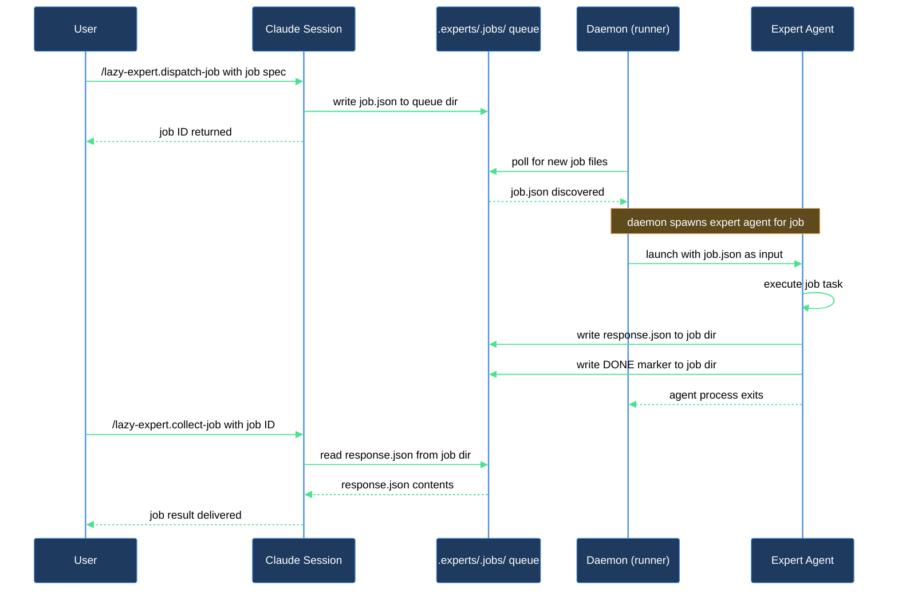

# Add a named expert and dispatch your first async job

Think of experts as named coworkers on your async team. You hand one a task, it works in the background, and you carry on with something else. When the daemon finishes the job you pick up the result. This walkthrough assumes the expert runtime is already bootstrapped — see the *install-and-audit* chapter for the registration step — and takes you through the rest of the loop: dispatch a first job to a named expert role, watch its status while it runs, and collect the finished result.

## Outcome

After this walkthrough you have:

- At least one dispatched job with a collected result you can read.
- A working mental model of the queue's status values, so you know when to check back.

## What you need

- `lazycortex-core` installed and restarted in Claude Code.
- The expert runtime already bootstrapped for this repo — `.experts/` exists, `lazy.settings.json[experts]` has at least one registered expert besides `_version`, and the expert-spawn sandbox is configured in `.claude/settings.local.json`. If any of that is missing, work through the *install-and-audit* chapter first, then come back here.
- The daemon running (a supervisor unit, or the `.claude/bin/lazy.runtime.sh` shim started manually) — see Step 1 below if you're not sure.
- A git repo to run async jobs in (the runtime is always per-repo).

## The journey

### Step 1 — Confirm the runtime is ready

Before dispatching, confirm two things are already in place:

- **At least one expert is registered.** Check `lazy.settings.json[experts]` for a key besides `_version`. If it's empty, work through the *install-and-audit* chapter's expert-registration step — `/lazy-core.install` scans installed plugins for expert candidates (agents carrying `expert_protocol:` frontmatter) and registers them automatically, no per-candidate prompt.
- **The daemon is running.** If you installed a supervisor during install, it's already running — skip to Step 2. Otherwise, in a terminal outside Claude Code run the shim:

```
.claude/bin/lazy.runtime.sh
```

The shim resolves the runner from the plugin cache and starts it. The daemon logs to stdout; it wakes on each polling cycle, drains any queued jobs, and runs registered routines. Leave it running in a `tmux` or `screen` pane — you do not need to restart it for each job.

**Verification gate**: `lazy.settings.json[experts]` contains at least one expert key besides `_version`, and the daemon prints its startup message and enters its polling loop without errors.

### (Optional) Aspects and arguments

Two additional fields can be set on a registered expert in `lazy.settings.json[experts][<expert>]`, and both flow through to every dispatched job's `config.json`:

- `aspects[]` — adds behavior layers. The most commonly used aspect is `lazycortex-core:lazy-memory.persona-aspect` (long-term memory). Run `/lazy-memory.mark-persona <expert>` to opt in; the skill writes the aspects array for you — do not edit it by hand.
- `arguments{}` — pinned named values rendered into every job's prompt for this expert. These are static values that should follow the expert across all dispatches (e.g. a preferred code style, a target language, a review rubric). For one-off overrides, pass extra fields in the job `payload` instead.

### Step 2 — Dispatch a job

Run `/lazy-expert.dispatch-job` and supply the required inputs:

- `expert_name` — the local key you defined in `lazy.settings.json[experts]` (e.g. `designer`).
- `payload` — a dict with three required fields:
  - `kind` — the protocol kind string defined by the expert's contract (e.g. `doc-review`).
  - `role` — a role label for this job (often matches the expert name or describes the task type).
  - `request` — the human-readable task description (e.g. `Review docs/api.md for clarity and completeness`).

One optional input:

- `protocols` — a JSON array of protocol reference strings (e.g. `["lazycortex-core:lazy-core.expert-protocols-contract"]`). Defaults to `[]` when omitted. Pass this when the expert's agent requires an explicit protocol reference written into `config.json` alongside the request.

Example:

```
/lazy-expert.dispatch-job expert_name=designer payload={"kind":"doc-review","role":"designer","request":"Review docs/api.md for clarity and completeness"}
```

The skill validates the payload against the protocol contract, writes the job directory under `.experts/.jobs/<expert_name>/<job_id>/` with a `request.json`, a `READY` marker, and a `config.json` capturing the expert's full configuration (agent ref, protocols, aspects, arguments, git author). It then prints:

```
job_id:     <job_id>
queue_path: .experts/.jobs/designer/<job_id>
```

Note the `job_id` — you need it to collect the result.

**Verification gate**: the `queue_path` directory exists and contains `request.json`, `config.json`, and a `READY` marker.

### Step 3 — Check the queue while you wait

The daemon picks up queued jobs on its next polling cycle. While it runs you can check progress at any time with `/lazy-expert.list-jobs`:

```
/lazy-expert.list-jobs
```

To narrow to a specific expert or status:

```
/lazy-expert.list-jobs expert=designer
/lazy-expert.list-jobs status=queued
/lazy-expert.list-jobs status=active
/lazy-expert.list-jobs status=done
/lazy-expert.list-jobs status=failed
```

The output is a table with `expert`, `job_id`, `status`, and `age_sec` columns. Status values:

| Status | Meaning |
|--------|---------|
| `queued` | `READY` marker written; daemon has not yet picked this job up |
| `active` | Daemon is running the expert agent for this job right now |
| `dead` | Daemon wrote a `DEAD` marker — job stalled or was interrupted |
| `done` | Expert finished with a successful outcome; result is ready |
| `failed` | Expert finished but reported an error outcome |

The `age_sec` column counts seconds since the relevant marker's modification time — useful for spotting jobs that have been sitting a long time.

You can dispatch additional jobs, continue working on the codebase, or run other skills — the daemon drains the queue in the background regardless.

### Step 4 — Collect the result

Once `/lazy-expert.list-jobs` shows `status=done` for your job, run:

```
/lazy-expert.collect-job expert_name=designer job_id=<job_id>
```

The skill prints:

```
status: done
result files (Read these to retrieve output):
  - .experts/.jobs/designer/<job_id>/result/<file>
```

Open the listed result files to read the expert's output. If status comes back as `pending`, the daemon has not finished yet — wait a polling cycle and re-run `/lazy-expert.collect-job`. If it comes back as `failed`, the skill prints the error message from `response.json`. If status is `missing`, the `job_id` or `expert_name` is wrong — verify against the output from Step 2.

If `/lazy-expert.list-jobs` shows the job as `dead` but `/lazy-expert.collect-job` returns `pending`, the daemon stalled before writing the DONE marker — the job needs to be re-dispatched or recovered. Run `/lazy-runtime.recover` to clear any daemon halt, then re-dispatch the job.

## After you're done

- **Dispatch more jobs any time** — the daemon keeps running. Any job you send with `/lazy-expert.dispatch-job` goes into the queue and is picked up on the next polling cycle.
- **Check the full queue** — `/lazy-expert.list-jobs` shows all jobs across all experts. Pass `status=done` to review completed work or `status=failed` to find errors. Use `status=dead` to spot jobs that were interrupted mid-run.
- **Register more experts** — see the *install-and-audit* chapter's "Adding experts after initial install" note.
- **Cancel a job you no longer need** — run `/lazy-expert.cancel-job job_id=<job_id>` for any job that is still queued or in progress.
- **Add memory to an expert** — run `/lazy-memory.mark-persona <expert>` to opt an expert into the long-term memory subsystem. After a few dispatches accumulate run logs, run `/lazy-memory.reflect <expert>` to have the expert write its first memory notes under `.memory/<expert>/`. See the *add-memory-to-expert* walkthrough for the full flow.
- **Register plugin routines** — if a plugin also needs periodic background work, run `/lazy-routine.register` to add it to the daemon's rotation alongside `lazy-expert.pump`.
- **Daemon stopped?** — if you did not install a supervisor, re-run `.claude/bin/lazy.runtime.sh`. The daemon is stateless between restarts; jobs that were queued when it stopped will be picked up on the next cycle. If the daemon halted on a dirty working tree, run `/lazy-runtime.recover` first.

## How the pieces fit


