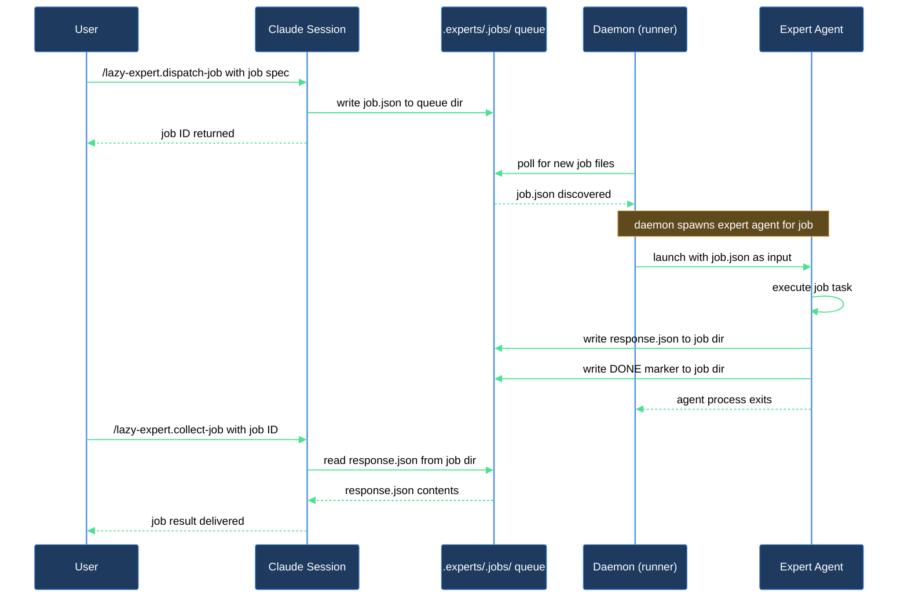

# Add a named expert and dispatch your first async job

Think of experts as named coworkers on your async team. You hand one a task, it works in the background, and you carry on with something else. When the daemon finishes the job you pick up the result. This walkthrough takes you through the full loop: enable the expert runtime during `/lazy-core.install`, dispatch a first job to a named expert role, watch its status while it runs, and collect the finished result.

## Outcome

After this walkthrough you have:

- The expert runtime bootstrapped in your repo (`.experts/`, the flat `daemon` and `routines` sections in `.claude/lazy.settings.json`, and the `.claude/bin/lazy.runtime.sh` shim).
- `.memory/` tracked in git and `.experts/` gitignored.
- At least one named expert registered in `lazy.settings.json[experts]` and the `lazy-expert.pump` routine wired into the daemon's rotation.
- The expert-spawn sandbox configured in `.claude/settings.local.json` so the daemon can read and write the repo on each job.
- At least one dispatched job with a collected result you can read.

## What you need

- `lazycortex-core` installed and restarted in Claude Code.
- A git repo to run async jobs in (the runtime is always per-repo).
- Python 3.12 or later available in the shell where you start the daemon.
- `CLAUDE_PLUGIN_ROOT` set correctly — `/lazy-core.install` writes this into `.claude/bin/lazy.runtime.sh` automatically.

## The journey

### Step 1 — Enable the expert runtime

Run `/lazy-core.install` inside the repo. The install wizard walks through 16 ordered steps; the runtime and expert phases are Steps 9–13. When Step 9b asks whether to bootstrap runtime/experts for this repo, answer **Yes**. The skill:

- Writes the flat `daemon` and `routines` sections into `.claude/lazy.settings.json` with the daemon's polling interval and cleanup schedule — the runtime daemon reads these directly via `load_section`.
- Creates `.experts/` and seeds `lazy.settings.json[experts]` with `{"_version": 1}`.
- Writes the `.claude/bin/lazy.runtime.sh` shim, which resolves the latest plugin runner at exec time — supervisor units do not need re-rendering after `/plugin update`.
- Bootstraps `.memory/` at the repo root and ensures it is tracked in git (not gitignored), so memory notes written by persona-marked experts are version-controlled alongside your code.
- Adds `.experts/` to `.gitignore` (`.logs/` and `.runtime/` are handled by an earlier step).

When Step 11 scans installed plugins for expert candidates, each candidate found is registered automatically using a deterministic bot identity (`<agent_name>@lazycortex.local`) — the wizard does not prompt per candidate. These are written into `lazy.settings.json[experts]` by the skill; do not edit the file by hand.

Once at least one expert is registered, Step 12 bootstraps the `lazy-expert.pump` routine into the flat `routines` section of `.claude/lazy.settings.json`. Step 13 then offers to install a daemon supervisor via macOS launchd or Linux systemd — but only when the pump routine was freshly registered in Step 12. If Step 12 found the routine already present (a re-run), Step 13 is skipped. Choose the supervisor option that matches your machine, or skip and start the daemon manually in Step 2.

If you already ran `/lazy-core.install` and skipped the runtime phase, re-run the skill — it is idempotent and detects what is already present.

**Verification gate**: `lazy.settings.json[experts]` exists and contains at least one expert key besides `_version`. `.claude/lazy.settings.json` has both a `daemon` section and a `routines` section with `lazy-expert.pump` listed.

### Step 1.5 — Configure the expert-spawn sandbox

Step 13.5 of `/lazy-core.install` configures the expert-spawn sandbox in `.claude/settings.local.json`. When it runs, answer **Yes — merge the recommended block** if prompted (on a first-time install it applies silently; it only asks on a genuine conflict).

This step matters: the runtime daemon spawns `claude -p --permission-mode dontAsk` for every expert job. Without an explicit sandbox and permissions block in `settings.local.json`, those spawns cannot `Read`, `Write`, or `Edit` anything in the repo. The skill merges the required `sandbox`, `additionalDirectories`, and `permissions.allow` / `permissions.deny` blocks into your existing `settings.local.json` (or creates the file if absent), scoped to the current repo root — it never overwrites keys you already have.

`settings.local.json` is gitignored and per-machine. Re-run `/lazy-core.install` on each machine after cloning to set up the sandbox there too.

**Verification gate**: `.claude/settings.local.json` exists and contains `permissions.allow` listing at least `Read`, `Write`, and `Edit`.

### (Optional) Aspects and arguments

The wizard registers each expert with `agent` and `git_author` only. Two additional fields are available in `lazy.settings.json[experts][<expert>]`:

- `aspects[]` — adds behavior layers. The most commonly used aspect is `lazycortex-core:lazy-memory.persona-aspect` (long-term memory). Run `/lazy-memory.mark-persona <expert>` after the wizard to opt in; the skill writes the aspects array for you — do not edit it by hand.
- `arguments{}` — pinned named values rendered into every job's prompt for this expert. These are static values that should follow the expert across all dispatches (e.g. a preferred code style, a target language, a review rubric). To add or update arguments, re-run `/lazy-core.install` and accept the candidate again in the expert-add wizard. For one-off overrides, pass extra fields in the job `payload` instead.

Both fields flow through to `config.json` when a job is dispatched, so the daemon always has the full expert configuration alongside the request.

### Step 2 — Start the daemon

If you installed a supervisor in Step 1, the daemon is already running — skip to Step 3.

Otherwise, in a terminal outside Claude Code run the shim:

```
.claude/bin/lazy.runtime.sh
```

The shim resolves the runner from the plugin cache and starts it. The daemon logs to stdout; it wakes on each polling cycle, drains any queued jobs, and runs registered routines. Leave it running in a `tmux` or `screen` pane — you do not need to restart it for each job.

**Verification gate**: the daemon prints its startup message and enters its polling loop without errors.

### Step 3 — Dispatch a job

Run `/lazy-expert.dispatch-job` and supply the required inputs:

- `expert_name` — the local key you defined in `lazy.settings.json[experts]` (e.g. `designer`).
- `payload` — a dict with three required fields:
  - `kind` — the protocol kind string defined by the expert's contract (e.g. `doc-review`).
  - `role` — a role label for this job (often matches the expert name or describes the task type).
  - `request` — the human-readable task description (e.g. `Review docs/api.md for clarity and completeness`).

One optional input:

- `protocols` — a JSON array of protocol reference strings (e.g. `["lazycortex-core:lazy-core.expert-protocols-contract"]`). Defaults to `[]` when omitted. Pass this when the expert's agent requires an explicit protocol reference written into `config.json` alongside the request.

Example:

```
/lazy-expert.dispatch-job expert_name=designer payload={"kind":"doc-review","role":"designer","request":"Review docs/api.md for clarity and completeness"}
```

The skill validates the payload against the protocol contract, writes the job directory under `.experts/.jobs/<expert_name>/<job_id>/` with a `request.json`, a `READY` marker, and a `config.json` capturing the expert's full configuration (agent ref, protocols, aspects, arguments, git author). It then prints:

```
job_id:     <job_id>
queue_path: .experts/.jobs/designer/<job_id>
```

Note the `job_id` — you need it to collect the result.

**Verification gate**: the `queue_path` directory exists and contains `request.json`, `config.json`, and a `READY` marker.

### Step 4 — Check the queue while you wait

The daemon picks up queued jobs on its next polling cycle. While it runs you can check progress at any time with `/lazy-expert.list-jobs`:

```
/lazy-expert.list-jobs
```

To narrow to a specific expert or status:

```
/lazy-expert.list-jobs expert=designer
/lazy-expert.list-jobs status=queued
/lazy-expert.list-jobs status=active
/lazy-expert.list-jobs status=done
/lazy-expert.list-jobs status=failed
```

The output is a table with `expert`, `job_id`, `status`, and `age_sec` columns. Status values:

| Status | Meaning |
|--------|---------|
| `queued` | `READY` marker written; daemon has not yet picked this job up |
| `active` | Daemon is running the expert agent for this job right now |
| `dead` | Daemon wrote a `DEAD` marker — job stalled or was interrupted |
| `done` | Expert finished with a successful outcome; result is ready |
| `failed` | Expert finished but reported an error outcome |

The `age_sec` column counts seconds since the relevant marker's modification time — useful for spotting jobs that have been sitting a long time.

You can dispatch additional jobs, continue working on the codebase, or run other skills — the daemon drains the queue in the background regardless.

### Step 5 — Collect the result

Once `/lazy-expert.list-jobs` shows `status=done` for your job, run:

```
/lazy-expert.collect-job expert_name=designer job_id=<job_id>
```

The skill prints:

```
status: done
result files (Read these to retrieve output):
  - .experts/.jobs/designer/<job_id>/result/<file>
```

Open the listed result files to read the expert's output. If status comes back as `pending`, the daemon has not finished yet — wait a polling cycle and re-run `/lazy-expert.collect-job`. If it comes back as `failed`, the skill prints the error message from `response.json`. If status is `missing`, the `job_id` or `expert_name` is wrong — verify against the output from Step 3.

If `/lazy-expert.list-jobs` shows the job as `dead` but `/lazy-expert.collect-job` returns `pending`, the daemon stalled before writing the DONE marker — the job needs to be re-dispatched or recovered. Run `/lazy-runtime.recover` to clear any daemon halt, then re-dispatch the job.

## After you're done

- **Dispatch more jobs any time** — the daemon keeps running. Any job you send with `/lazy-expert.dispatch-job` goes into the queue and is picked up on the next polling cycle.
- **Check the full queue** — `/lazy-expert.list-jobs` shows all jobs across all experts. Pass `status=done` to review completed work or `status=failed` to find errors. Use `status=dead` to spot jobs that were interrupted mid-run.
- **Register more experts** — add roles to `lazy.settings.json[experts]` by re-running `/lazy-core.install`; the skill picks up any newly eligible candidates and registers them automatically.
- **Cancel a job you no longer need** — run `/lazy-expert.cancel-job job_id=<job_id>` for any job that is still queued or in progress.
- **Add memory to an expert** — run `/lazy-memory.mark-persona <expert>` to opt an expert into the long-term memory subsystem. After a few dispatches accumulate run logs, run `/lazy-memory.reflect <expert>` to have the expert write its first memory notes under `.memory/<expert>/`. See the *add-memory-to-expert* walkthrough for the full flow.
- **Register plugin routines** — if a plugin also needs periodic background work, run `/lazy-routine.register` to add it to the daemon's rotation alongside `lazy-expert.pump`.
- **Daemon stopped?** — if you did not install a supervisor, re-run `.claude/bin/lazy.runtime.sh`. The daemon is stateless between restarts; jobs that were queued when it stopped will be picked up on the next cycle. If the daemon halted on a dirty working tree, run `/lazy-runtime.recover` first.
- **Cloned to a new machine?** — run `/lazy-core.install` again in the repo. It re-installs the supervisor unit and merges the expert-spawn sandbox block into the machine's `settings.local.json`. Pick up from Step 1.5 if you only need the sandbox.

## How the pieces fit


