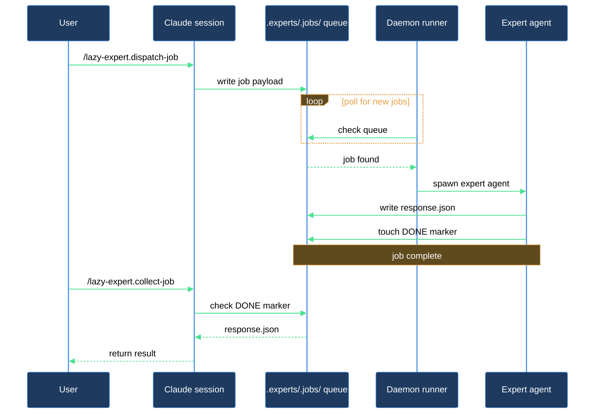

# Add a named expert and dispatch your first async job

Think of experts as named coworkers on your async team. You hand one a task, it works in the background, and you carry on with something else. When the queue is drained you pick up the result. This walkthrough takes you through the full loop — bootstrap the expert registration via `/lazy-core.install`, dispatch a first job to a named expert role, watch its status while it runs, and collect the finished result.

## Outcome

After this walkthrough you have:

- At least one dispatched job with a collected result you can read.
- A working mental model of the queue's status values, so you know when to check back — including the difference between a job that failed and one the expert deliberately postponed.

## What you need

- `lazycortex-core` installed and restarted in Claude Code.
- A git repo to run async jobs in (the runtime is always per-repo).
- A way to drain the queue — either the background daemon (a supervisor unit, or the `.claude/bin/lazy.runtime.sh` shim started manually) or manual ticks via `/lazy-runtime.tick`. Neither is on by default; see Step 1 below.

## The journey

### Step 1 — Bootstrap the expert runtime

Run `/lazy-core.install` in the repo you want the async team to work in. Alongside the rest of its bootstrap, the install skill:

- Creates `.experts/` and registers every expert candidate it finds — any installed plugin's agent carrying `expert_protocol:` frontmatter is registered automatically in `lazy.settings.json[experts]`, no per-candidate prompt. Registration happens whether or not a background daemon runs anywhere — experts are dispatch-routing config used by interactive flows too.
- Registers the built-in routines, including the queue-draining `lazy-expert.pump`, in `lazy.settings.json[routines]` — again unconditionally. The daemon is never required for the queue itself to exist.
- Seeds `lazy.settings.json[daemon]` with `enabled: false` as the default. A project only gets a background daemon **supervisor** once you explicitly set that flag to `true` in the tracked settings and re-run `/lazy-core.install` — at which point the skill asks the one remaining question, `daemon.run_here` (a per-machine "does this checkout drive the daemon" map), and installs the supervisor (launchd on macOS, systemd on Linux) once you confirm.
- Does **not** seed `daemon.token_env`. Whenever the daemon process actually runs — the supervisor or the manual shim, never `/lazy-runtime.tick` — it refuses to start under the machine's ambient login and instead requires an explicit token, named by this key. Setting it is on you; see the queue-draining bullet below.
- Seeds the `git` section of the project's `lazy.settings.json` with the git-guard's `enabled`, `pathspec_enabled`, and `mutex_enabled` flags — defaults that match the guard's current behavior, written down so you (or the expert's dispatched work) can tune them later without reading the hook source.
- Offers, once, to connect alternative LLM providers for expert jobs — every expert job works against the Anthropic default with no entry at all, so a plain `Yes`/`No` prompt appears only the first time, and only while no `providers` entry exists yet anywhere in `lazy.settings.json`. Answer `No` and nothing is written; answer `Yes` and name one or more providers to have the skill collect and validate each entry (base URL, token variable, a four-tier model map) into the gitignored `.claude/lazy.settings.local.json` on your behalf. Skip the prompt entirely, or add a provider later, by running `/lazy-core.providers add` any time — assigning a registered provider to a given expert is a separate step, covered next.

Confirm two things are in place before dispatching:

- **At least one expert is registered.** Check `lazy.settings.json[experts]` for a key besides `_version`. If it's empty, no plugin you have installed ships an expert candidate yet — install one, or re-run `/lazy-core.install` after adding your own agent with `expert_protocol:` frontmatter.
- **Decide how the queue gets drained.** With `daemon.enabled` left at its default `false`, nothing drains the queue automatically — run `/lazy-runtime.tick` by hand whenever you want queued jobs picked up; it runs the same routines, in the same priority order, as the daemon would, and needs no token of its own. If you'd rather have it run continuously, two things need to be true before the daemon process will actually start:
  - **`daemon.token_env` is set.** The daemon refuses to run under the machine's ambient login — it requires an explicit OAuth token, named by `daemon.token_env` (a string naming an environment variable, e.g. `"CLAUDE_TOKEN_MYPROJECT"`) in the tracked `lazy.settings.json[daemon]` section, resolved from either the real environment or a matching line in `~/.claude/.env`. `/lazy-core.install` does not seed this key — set it yourself before the daemon's first start. Left absent, blank, or naming a variable that resolves nowhere, the daemon process exits immediately with an explicit error naming what's missing.
  - **`daemon.enabled: true` and `daemon.run_here` name this checkout.** Set `daemon.enabled: true` in the tracked `lazy.settings.json` and re-run `/lazy-core.install` to get the `run_here` prompt and a supervisor unit.

  Or, outside Claude Code, start the shim directly once both are set:

```
.claude/bin/lazy.runtime.sh
```

The shim resolves the runner from the plugin cache and starts it — the same token gate applies here too. The daemon logs to stdout; it wakes on each polling cycle, drains any queued jobs, and runs registered routines. Leave it running in a `tmux` or `screen` pane — you do not need to restart it for each job.

**Verification gate**: `lazy.settings.json[experts]` contains at least one expert key besides `_version`, and either you know to run `/lazy-runtime.tick` by hand, or — for a background daemon — `daemon.token_env` is set and resolves, and the daemon prints its startup message and enters its polling loop instead of exiting on a missing-token error.

### (Optional) Aspects, arguments, and provider

Three additional fields can be set on a registered expert in `lazy.settings.json[experts][<expert>]`, and all three flow through to every dispatched job's `config.json`:

- `aspects[]` — adds behavior layers. The most commonly used aspect is `lazycortex-core:lazy-memory.persona-aspect` (long-term memory). Run `/lazy-memory.mark-persona <expert>` to opt in; the skill writes the aspects array for you — do not edit it by hand.
- `arguments{}` — pinned named values rendered into every job's prompt for this expert. These are static values that should follow the expert across all dispatches (e.g. a preferred code style, a target language, a review rubric). For one-off overrides, pass extra fields in the job `payload` instead.
- `provider` — points this expert's dispatched jobs at a non-Anthropic endpoint registered in the provider registry, instead of the Anthropic default. Register the provider first — via the one-time prompt in Step 1, or by running `/lazy-core.providers add` — then set this field to the provider's name.

### Step 2 — Dispatch a job

Run `/lazy-expert.dispatch-job` and supply the required inputs:

- `expert_name` — the local key you defined in `lazy.settings.json[experts]` (e.g. `designer`).
- `payload` — a dict with three required fields:
  - `kind` — the protocol kind string defined by the expert's contract (e.g. `doc-review`).
  - `role` — a role label for this job (often matches the expert name or describes the task type).
  - `request` — the human-readable task description (e.g. `Review docs/api.md for clarity and completeness`).

One optional input:

- `protocols` — a JSON array of protocol reference strings (e.g. `["lazycortex-core:lazy-core.expert-protocols-contract"]`). Defaults to `[]` when omitted. Pass this when the expert's agent requires an explicit protocol reference written into `config.json` alongside the request.

Example:

```
/lazy-expert.dispatch-job expert_name=designer payload={"kind":"doc-review","role":"designer","request":"Review docs/api.md for clarity and completeness"}
```

The skill validates the payload against the protocol contract, writes the job directory under `.experts/.jobs/<expert_name>/<job_id>/` with a `request.json`, a `READY` marker, and a `config.json` capturing the expert's full configuration (agent ref, protocols, aspects, arguments, git author). It then prints:

```
job_id:     <job_id>
queue_path: .experts/.jobs/designer/<job_id>
```

Note the `job_id` — you need it to collect the result.

**Verification gate**: the `queue_path` directory exists and contains `request.json`, `config.json`, and a `READY` marker.

### Step 3 — Check the queue while you wait

The queue is drained on the next `lazy-expert.pump` cycle — the daemon's next polling cycle if you have one running, or the next time you (or a routine schedule) run `/lazy-runtime.tick`. While it runs you can check progress at any time with `/lazy-expert.list-jobs`:

```
/lazy-expert.list-jobs
```

To narrow to a specific expert or status:

```
/lazy-expert.list-jobs expert=designer
/lazy-expert.list-jobs status=queued
/lazy-expert.list-jobs status=active
/lazy-expert.list-jobs status=done
/lazy-expert.list-jobs status=failed
/lazy-expert.list-jobs status=cancelled
```

The output is a table with `expert`, `job_id`, `status`, and `age_sec` columns. Status values:

| Status | Meaning |
|--------|---------|
| `queued` | `READY` marker written; the pump has not yet picked this job up |
| `active` | The pump is running the expert agent for this job right now |
| `cancelled` | Job was cancelled via `/lazy-expert.cancel-job` — its bundle stays on disk for forensics |
| `dead` | A `DEAD` marker was written — job stalled or was interrupted |
| `done` | Expert finished and its response reports an explicit, non-error, non-deferred outcome |
| `deferred` | Expert finished but reported the reserved `deferred` outcome — it deliberately postponed the work and left its inputs untouched. Appears in an unfiltered listing; it is neither `done` nor `failed`. |
| `failed` | Expert finished but its response reports an error outcome — or omits an outcome entirely, is empty, or fails to parse. A finished job is only `done` when it explicitly says so; anything else counts as `failed` |

The `age_sec` column counts seconds since the relevant marker's modification time — useful for spotting jobs that have been sitting a long time.

You can dispatch additional jobs, continue working on the codebase, or run other skills — the queue drains in the background (daemon) or on your next `/lazy-runtime.tick` regardless.

### Step 4 — Collect the result

Once `/lazy-expert.list-jobs` shows `status=done` for your job, run:

```
/lazy-expert.collect-job expert_name=designer job_id=<job_id>
```

The skill prints:

```
status: done
result files (Read these to retrieve output):
  - .experts/.jobs/designer/<job_id>/result/<file>
```

Open the listed result files to read the expert's output. If status comes back as `pending`, the job has not been drained yet — wait a cycle (or run `/lazy-runtime.tick`) and re-run `/lazy-expert.collect-job`.

If status comes back as `failed`, the skill prints the error message from `response.json` when the expert set one. A response that never explicitly reported a finished outcome — missing, empty, or unreadable — has no error field to show; inspect `.experts/.jobs/designer/<job_id>/response.json` directly to see what the expert actually wrote.

If status comes back as `deferred`, the expert deliberately postponed the work rather than finishing or failing it, and left every input untouched — this is not a failure, and there is no result file to read. Check `response.json` for the reason, then re-dispatch a fresh `/lazy-expert.dispatch-job` for the same task when you're ready to retry; a job you dispatched directly has no automatic retry.

If status is `missing`, the `job_id` or `expert_name` is wrong — verify against the output from Step 2.

If `/lazy-expert.list-jobs` shows the job as `dead` but `/lazy-expert.collect-job` returns `pending`, the pump stalled before writing the DONE marker — the job needs to be re-dispatched or recovered. Run `/lazy-runtime.recover` to clear any daemon halt, then re-dispatch the job.

## After you're done

- **Dispatch more jobs any time** — the queue keeps accepting work. Any job you send with `/lazy-expert.dispatch-job` goes into the queue and is picked up on the next drain, whether that's the daemon's next polling cycle or your next `/lazy-runtime.tick`.
- **Check the full queue** — `/lazy-expert.list-jobs` shows all jobs across all experts. Pass `status=done` to review completed work, `status=failed` to find errors, or `status=cancelled` to review jobs you stopped.
- **Register more experts** — install a plugin that ships an `expert_protocol:`-tagged agent, then re-run `/lazy-core.install`; the new candidate registers automatically.
- **Cancel a job you no longer need** — run `/lazy-expert.cancel-job expert_name=designer job_id=<job_id>` for any job that is still queued or in progress. Cancellation stops the running executor immediately and marks the bundle `CANCELLED`; nothing is deleted, so the job stays visible in `/lazy-expert.list-jobs` for forensics.
- **Add memory to an expert** — run `/lazy-memory.mark-persona <expert>` to opt an expert into the long-term memory subsystem. After a few dispatches accumulate run logs, run `/lazy-memory.reflect <expert>` to have the expert write its first memory notes under `.memory/<expert>/`. See the *add-memory-to-expert* walkthrough for the full flow.
- **Register plugin routines** — if a plugin also needs periodic background work, run `/lazy-routine.register` to add it to the daemon's rotation alongside `lazy-expert.pump`.
- **No daemon running?** — that's the default; nothing is wrong. Run `/lazy-runtime.tick` by hand whenever you want the queue drained — same routines, same order as the daemon, no token required. To get continuous draining instead, set `lazy.settings.json[daemon].enabled: true`, set `daemon.token_env` to name an environment variable holding an OAuth token (seeded in `~/.claude/.env` or the real environment — the daemon refuses to start without it), and re-run `/lazy-core.install`, or start the shim directly with `.claude/bin/lazy.runtime.sh`. If a daemon you did start halted on a dirty working tree, run `/lazy-runtime.recover` first.

## How the pieces fit


```mermaid
%%{init: {'themeVariables':{'background':'transparent','primaryColor':'#1e3a5f','primaryBorderColor':'#4a90e2','primaryTextColor':'#fff','lineColor':'#4ae290','actorBkg':'#1e3a5f','actorBorder':'#4a90e2','actorTextColor':'#fff','actorLineColor':'#4a90e2','signalColor':'#4ae290','signalTextColor':'#000','noteBkgColor':'#5f4a1e','noteBorderColor':'#e2a14a','noteTextColor':'#fff','labelBoxBkgColor':'#5f4a1e','labelBoxBorderColor':'#e2a14a','labelTextColor':'#fff','loopTextColor':'#e2a14a'},'sequence':{'diagramPadding':5,'useMaxWidth':true}}}%%
sequenceDiagram
  participant user as User
  participant claudeSession as Claude session
  participant jobsQueue as .experts/.jobs/ queue
  participant daemon as Daemon runner
  participant expertAgent as Expert agent

  user->>claudeSession: /lazy-expert.dispatch-job
  claudeSession->>jobsQueue: write job payload
  loop poll for new jobs
    daemon->>jobsQueue: check queue
  end
  jobsQueue-->>daemon: job found
  daemon->>expertAgent: spawn expert agent
  expertAgent->>jobsQueue: write response.json
  expertAgent->>jobsQueue: touch DONE marker
  Note over jobsQueue,expertAgent: job complete
  user->>claudeSession: /lazy-expert.collect-job
  claudeSession->>jobsQueue: check DONE marker
  jobsQueue-->>claudeSession: response.json
  claudeSession-->>user: return result
```
