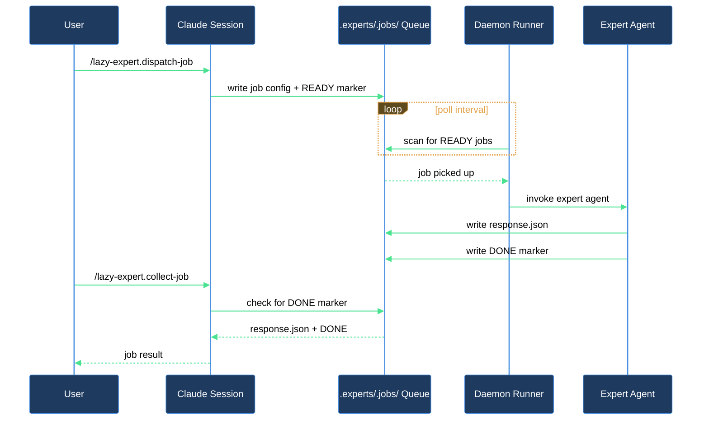

# How do I bootstrap the runtime daemon and recover it if it halts?

The expert runtime gives you a serial, per-repo daemon that drains a job queue and runs registered plugin routines. Getting from zero to a daemon that runs in the background is a short journey: install and start it, confirm it is actually polling, then know how to unblock it if a job or routine leaves the working tree dirty or a remote-sync operation fails.

## Outcome

After completing this walkthrough you have a running runtime daemon that polls for expert jobs and registered routines on a regular interval, and a working recovery path if the daemon ever halts — either from a dirty working tree or a failed remote sync.

## What you need

- `lazycortex-core` enabled in `~/.claude/settings.json` and the plugin cache populated (run `/plugin update lazycortex-core@lazycortex` if you have not already).
- A git repository — the runtime is project-scoped and writes state under `.runtime/` and journal logs under `.logs/lazy-core/runtime/`.
- Python 3.12 or later on your `$PATH` — the daemon and all runtime scripts are Python.

## The journey

### Step 1 — Install and start the daemon

Run `/lazy-core.install` inside the repo and answer **Yes** to the runtime-daemon wizard. The wizard's full sequence — what it writes to `lazy.settings.json`, the expert-discovery scan, the daemon-supervisor offer, the expert-spawn sandbox question, and the optional Prometheus metrics endpoint — is covered in the **Install, audit, and maintain lazycortex-core** block chapter; work through Steps there before continuing here. Come back once the wizard has finished.

If you chose a supervisor during install, the daemon is already running — skip to Step 2. Otherwise start it by hand from the repo root:

```
.claude/bin/lazy.runtime.sh
```

The daemon reads the flat `daemon` and `routines` sections of `lazy.settings.json`, runs the `lazy-expert.pump` routine on each polling iteration, drains any `READY` jobs it finds, and loops. One daemon per repo means no two routines ever contend over the working tree or git state.

### Step 2 — Verify the daemon is polling (verification gate)

After one polling interval, open `.runtime/state.json` and confirm the `last_run` timestamp is recent. If the timestamp is absent or stale, check that the shim is executable (`ls -l .claude/bin/lazy.runtime.sh`) and that Python 3.12+ is on your `$PATH`.

### Step 3 — Recover if the daemon halts

The daemon halts in two situations and writes a `daemon_halted` block to `.runtime/state.json` in both cases. If you notice jobs stop processing, run:

```
/lazy-runtime.recover
```

The skill reads the halt context and shows you `triggered_by` (which routine or `lazy-expert.pump` caused the halt), `expert` + `job_id` (when the halt came from inside an expert job), and `reason` (the halt family).

**Working-tree halt (`uncommitted_changes`)** — a routine or expert left uncommitted changes behind. The skill also shows `dirty_paths` (the captured `git status --porcelain` output) and asks how to clean up before resuming:

- **commit** — stages everything and commits with a message you provide. Use when the dirty changes are intentional work you want to keep.
- **stash** — runs `git stash push -u`. Tucks the dirt away so you can restore it manually later.
- **discard** — runs `git checkout -- . && git clean -fd`. Throws away every dirty change. This is irreversible.
- **abort** — leaves everything as-is and exits. The daemon stays halted until you clean up manually and re-run the skill.

**Remote-sync halts (`git_pull_diverged` / `git_push_failed` / `git_remote_unavailable`)** — the daemon's pre- or post-tick remote sync (configured via the `daemon.git` block in `lazy.settings.json`) hit an unrecoverable state. The skill does not attempt to fix these automatically (automatic resolution could silently drop your commits). Instead it surfaces reason-specific guidance — for example, inspecting `git log --oneline HEAD origin/<branch>` for a diverged branch, or checking network and `git remote -v` for a remote-unavailable halt. After you resolve the situation by hand, confirm **resume** to clear the halt block. The daemon's next tick re-evaluates; if the condition persists it will halt again with the same reason.

Once cleanup or manual repair succeeds and the tree is clean, the skill atomically clears the `daemon_halted` block from `state.json`. The daemon resumes scheduling on its next iteration with no restart required.

If the tree is still dirty after cleanup (e.g., a submodule left additional changes), the skill reports `still-dirty` and leaves the halt block in place. Run `git status` to inspect, resolve the remaining changes, and re-run `/lazy-runtime.recover`.

## After you're done

The daemon runs continuously, draining jobs and firing registered routines. The built-in `lazy-expert.pump` routine processes them serially per expert so there is never contention. An autonomous `lazy-runtime.doctor` routine runs hourly and handles DEAD expert jobs automatically — retrying recoverable failures and permanently failing jobs the daemon can no longer make progress on — without requiring operator action.

If your `daemon.git` block sets `remote_sync: "pull_push"` and you also want automation to fire the moment the daemon's work actually lands on `origin` — a deploy hook, a notification, waking a device to pull — set `daemon.git.post_push_hook` to a shell command. It runs after every push that advances the branch (fast-forward or post-rebase), with the push context available in `LAZY_PUSH_REPO`, `LAZY_PUSH_BRANCH`, `LAZY_PUSH_REMOTE`, `LAZY_PUSH_OLD_SHA`, and `LAZY_PUSH_NEW_SHA` environment variables. The hook is crash-isolated: a non-zero exit, a timeout past `post_push_timeout_sec` (30 seconds by default), or a spawn failure is journaled but never halts the daemon, retries the push, or fails the tick — it also never fires on a tick where nothing was actually pushed.

If you opted into the metrics endpoint during install, the daemon exposes runtime health (routine ticks, errors, tokens, queue depth) on the allocated loopback port for a Prometheus-compatible scraper — nothing further to do here, it runs alongside job draining with no separate startup step.

The `daemon_halted` recovery path is an expected operational event, not an error in the daemon itself. When it fires often from a particular routine, that routine's output logic is leaving dirt behind — investigate there, not in the daemon.

## How setup and recovery connect


