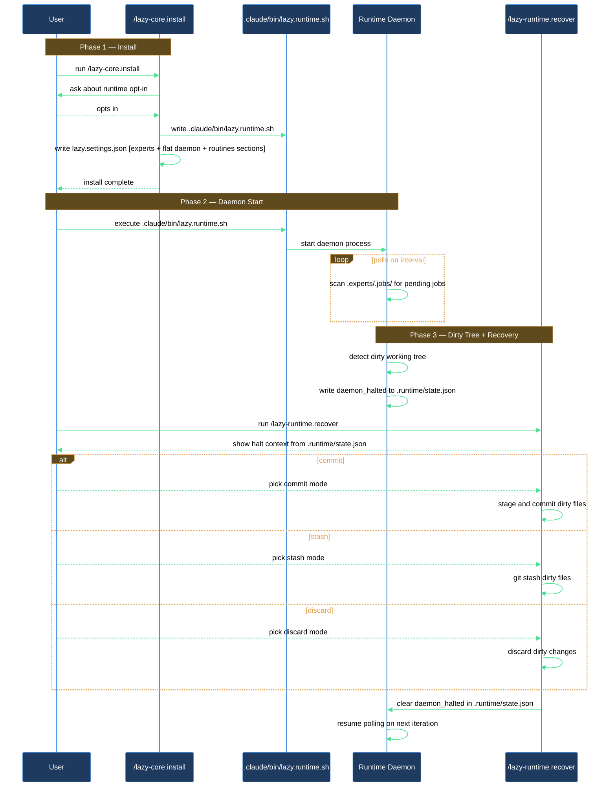

# How do I bootstrap the runtime daemon and recover it if the working tree halts?

The expert runtime gives you a serial, per-repo daemon that drains a job queue and runs registered plugin routines — without hitting Claude Code's subagent nesting limit. Setting it up takes three actions: run the runtime-daemon wizard inside `/lazy-core.install`, start the daemon with `.claude/bin/lazy.runtime.sh`, and know how to unblock it with `/lazy-runtime.recover` if a job or routine leaves the working tree dirty or a remote-sync operation fails.

## Outcome

After completing this walkthrough you have a running runtime daemon that polls for expert jobs and registered routines on a 5-second interval, a `.claude/bin/lazy.runtime.sh` shim committed to the repo that stays current after every `/plugin update`, and a working recovery path if the daemon ever halts — either from a dirty working tree or a failed remote sync.

## What you need

- `lazycortex-core` enabled in `~/.claude/settings.json` and the plugin cache populated (run `/plugin update lazycortex-core@lazycortex` if you have not already).
- A git repository — the runtime is project-scoped and writes state under `.runtime/` and journal logs under `.logs/lazy-core/runtime/`.
- Python 3.12 or later on your `$PATH` — the daemon and all runtime scripts are Python.
- At least one agent file with an `expert_protocol:` frontmatter field somewhere the wizard can discover it (plugin cache, `~/.claude/agents/`, or `.claude/agents/`). If none exist the wizard skips expert registration; you can re-run `/lazy-core.install` after adding agents.

## The journey

### Step 1 — Run `/lazy-core.install` inside the repo

Open a Claude Code session rooted in the target repository and run:

```
/lazy-core.install
```

The skill detects install scope automatically. Because the runtime is project-scoped, run it inside the repo rather than from a global session.

The install first verifies Python 3.12 or later is available. If Python is absent or too old, the skill surfaces the install options (Homebrew on macOS, pyenv cross-platform) and aborts; re-run once the floor is met.

### Step 2 — Answer yes to the runtime-daemon wizard

During install, the wizard asks whether to bootstrap runtime and experts for the repo. Answer **Yes**. The skill writes:

- `lazy.settings.json[experts]` — the experts section, initially containing only `_version`.
- `.claude/bin/lazy.runtime.sh` — the runtime shim, made executable. The shim resolves the latest `lazycortex-core/bin/runner` from the plugin cache at exec time, so it stays current after `/plugin update` without needing a re-run. On subsequent installs the shim is content-tracked and refreshed if it has drifted from the shipped version.
- Flat `daemon` and `routines` sections inside `.claude/lazy.settings.json` — daemon configuration including polling interval (default: 5 seconds), job-cleanup retention windows, and an empty routines map. These are top-level section keys read directly by the daemon; they are never nested under a `lazy-core.runtime` object.
- `.memory/` directory at the repo root — tracked in git so memory notes survive clones. This directory is created even when the daemon is disabled, because experts can be dispatched interactively too.
- Entries in `.gitignore` covering `.logs/`, `.runtime/`, `.experts/`, and `.claude/lazy.settings.local.json`.
- A `.lazyignore` file at the repo root (seeded from the plugin's template if absent) — extra tree-walking excludes (venvs, `node_modules`, `__pycache__`) that all routines honour via git's ignore engine.

Next, the wizard scans all enabled plugins' agent files and the global and project `agents/` directories for files carrying `expert_protocol:` frontmatter, and registers each discovered candidate automatically — there are no per-candidate prompts and no scan confirmation. Each expert receives a deterministic bot git identity (`<agent_name>@lazycortex.local`) so the daemon can distinguish expert commits from operator commits. When at least one expert is registered, the `lazy-expert.pump` routine is added to `routines` automatically. Because the pump routine was freshly added, the wizard then offers a daemon supervisor — choose **macOS launchd** or **Linux systemd** to start the daemon automatically on login, or **Skip** to start it by hand. On re-runs where the pump routine is already present, the supervisor offer does not appear; use your OS's service manager directly if you need to re-install the supervisor.

### Step 3 — Configure the expert-spawn sandbox

After the supervisor question, the wizard offers to configure `.claude/settings.local.json` with a sandbox + permissions block for expert-spawned subprocesses. Answer **Yes — merge the recommended block**.

The daemon spawns `claude -p --permission-mode dontAsk` for every expert job. Without the sandbox block, those spawns either run unrestricted or cannot read or write anything. The wizard merges only the missing keys — it never overwrites your existing settings. `settings.local.json` is gitignored, so this is per-machine configuration.

If you skip this step, expert jobs will fail silently with permission errors. You can re-run `/lazy-core.install` at any time to add the block.

### Step 4 — Start the daemon

If you chose a supervisor in Step 2, the daemon is already running. If you skipped or want to start it manually, run from the repo root:

```
.claude/bin/lazy.runtime.sh
```

The daemon reads the flat `daemon` and `routines` sections of `lazy.settings.json`, runs the `lazy-expert.pump` routine on each polling iteration, drains any `READY` jobs it finds, and loops. One daemon per repo means no two routines ever contend over the working tree or git state.

### Step 5 — Verify the daemon is polling (verification gate)

After one polling interval, open `.runtime/state.json` and confirm the `last_run` timestamp is recent. If the timestamp is absent or stale, check that the shim is executable (`ls -l .claude/bin/lazy.runtime.sh`) and that Python 3.12+ is on your `$PATH`.

### Step 6 — Recover if the daemon halts

The daemon halts in two situations and writes a `daemon_halted` block to `.runtime/state.json` in both cases. If you notice jobs stop processing, run:

```
/lazy-runtime.recover
```

The skill reads the halt context and shows you `triggered_by` (which routine or `lazy-expert.pump` caused the halt), `expert` + `job_id` (when the halt came from inside an expert job), and `reason` (the halt family).

**Working-tree halt (`uncommitted_changes`)** — a routine or expert left uncommitted changes behind. The skill also shows `dirty_paths` (the captured `git status --porcelain` output) and asks how to clean up before resuming:

- **commit** — stages everything and commits with a message you provide. Use when the dirty changes are intentional work you want to keep.
- **stash** — runs `git stash push -u`. Tucks the dirt away so you can restore it manually later.
- **discard** — runs `git checkout -- . && git clean -fd`. Throws away every dirty change. This is irreversible.
- **abort** — leaves everything as-is and exits. The daemon stays halted until you clean up manually and re-run the skill.

**Remote-sync halts (`git_pull_diverged` / `git_push_failed` / `git_remote_unavailable`)** — the daemon's pre- or post-tick remote sync hit an unrecoverable state. The skill does not attempt to fix these automatically (automatic resolution could silently drop your commits). Instead it surfaces reason-specific guidance — for example, inspecting `git log --oneline HEAD origin/<branch>` for a diverged branch, or checking network and `git remote -v` for a remote-unavailable halt. After you resolve the situation by hand, confirm **resume** to clear the halt block. The daemon's next tick re-evaluates; if the condition persists it will halt again with the same reason.

Once cleanup or manual repair succeeds and the tree is clean, the skill atomically clears the `daemon_halted` block from `state.json`. The daemon resumes scheduling on its next iteration with no restart required.

If the tree is still dirty after cleanup (e.g., a submodule left additional changes), the skill reports `still-dirty` and leaves the halt block in place. Run `git status` to inspect, resolve the remaining changes, and re-run `/lazy-runtime.recover`.

## After you're done

The daemon runs continuously, draining jobs and firing registered routines. The built-in `lazy-expert.pump` routine processes them serially per expert so there is never contention. An autonomous `lazy-runtime.doctor` routine runs hourly and handles DEAD expert jobs automatically — retrying recoverable failures and permanently failing jobs the daemon can no longer make progress on — without requiring operator action.

If you add new expert agents later, re-run `/lazy-core.install` — the wizard's expert-discovery phase picks up newly discovered agent files without touching existing registrations (it is idempotent). Because the pump routine is already registered on re-runs, the supervisor install offer will not appear again; only the first run that freshly registers the pump triggers it.

After cloning the repo to a new machine, re-run `/lazy-core.install` — the shim, settings files, and `.memory/` directory are committed to the repo, but the daemon supervisor unit (launchd plist or systemd service) is per-user and is not in the repo. The wizard regenerates and loads it for the current machine. The `settings.local.json` sandbox block is also per-machine; run the wizard or add it manually after cloning.

The `daemon_halted` recovery path is an expected operational event, not an error in the daemon itself. When it fires often from a particular routine, that routine's output logic is leaving dirt behind — investigate there, not in the daemon.

## How setup and recovery connect


