# Insert and refresh diagrams in your documentation

The drawing block is the primary user surface of lazycortex-diagram. It lets you add a new diagram under any heading in a Markdown file, or bring an existing diagram up to the current style standard, without hand-authoring a single fence. You name the file and the heading; the dispatcher picks the diagram kind and format, hands the job to a per-format writer agent, and writes the result in place.

Two skills cover the two main operations: `/lazy-diagram.draw` creates a new fence under a heading that has none, and `/lazy-diagram.fix` re-renders an existing fence against the current templates and scheme. Behind both sits a pair of single-pass writer agents — one for Mermaid, one for ASCII — each of which returns only the fence body; the dispatcher adds the surrounding backticks and writes the file.

## What's in this block

### `/lazy-diagram.draw` — new-fence dispatcher

`/lazy-diagram.draw` takes a `target_file`, an `anchor_section` heading, and a free-form `request` describing what the diagram should depict. It validates that both the file and the heading exist, then works through kind and format resolution before touching the file.

Kind resolution follows a ranked heuristic over your request text. Phrases about services exchanging messages resolve to a sequence diagram; state lifecycle transitions resolve to a state diagram; entity relationships with foreign keys resolve to an ERD; deployment topology with distinct components resolves to an architecture diagram; and so on across more than a dozen supported kinds. When two kinds compete, the dispatcher picks the one whose upper-bound fits the request without splitting. If the request is too thin to satisfy a kind's lower bound, the outcome is `skipped-below-threshold` and no fence is written — prose alone is the better artifact.

When the heuristic cannot settle on one confident pick — two kinds tie, or you pinned only one of `kind` / `format` and the other axis still has more than one plausible value — the dispatcher stops and asks you directly, rather than guessing: a single question naming each candidate `(kind, format)` pair, with the heuristic's top match marked as the recommended option. Your answer applies to that one draw call only — nothing is persisted, so re-running the same request later asks again unless you pin `kind=` / `format=` to skip the ambiguity outright.

Format resolution runs after kind: Mermaid is the default when a Mermaid template exists for the kind. ASCII is selected when the request explicitly asks for plain-text or terminal output, or when the kind is `fs-tree` (directory trees), or when only an ASCII template exists for that kind. The dispatcher never silently switches format — if the pinned combination has no template it fails fast with `failed:format-not-supported-for-kind`.

Once kind and format are settled, the dispatcher verifies the named style scheme is present, then dispatches the appropriate writer agent. If the writer returns a body, the dispatcher byte-compares it against any existing fence under the anchor and writes only when the bytes differ (`created` for a new fence, `replaced` for a changed one, `unchanged` when the body is identical).

You can pin `kind=`, `format=`, or `scheme=` to override any part of the resolution. Pins skip the corresponding heuristic step entirely.

### `/lazy-diagram.fix` — in-place re-conformer

`/lazy-diagram.fix` targets a heading that already has a fence. For a Mermaid fence it infers kind and format from the syntax marker — `flowchart` maps to `flow`, `sequenceDiagram` to `sequence`, `architecture-beta` to `architecture`, and so on — so you do not need to know what kind the fence was drawn as. A `text` (ASCII) fence carries no such marker, so fix reads the body's shape instead, testing six ordered rules from most specific to most general: tree characters with a trailing `/` or a ` ← <note>` annotation mean `fs-tree`; tree characters without either mean `tree` (a taxonomy); boxes with no connectors and a chrome-sample inventory (`[ Primary button ]`, `( Spinner ... )`) mean `controls-scheme`; boxes with no connectors that tile one surface mean `layout`; connectors where every multi-exit box is a labelled `<Question?>` diamond mean `decision-tree`; anything else with connectors is `flow`. It then reads the surrounding prose in the host section as the request and re-dispatches the same writer agent pipeline used by `/lazy-diagram.draw`.

Use fix when a diagram has drifted: the palette changed when a new scheme shipped, the init directive format evolved, or the terminology in the host prose was renamed after the fence was first drawn. Fix brings the fence back to the current contract in place. If fix cannot disambiguate kind — a plain `flowchart` marker that could be several Mermaid kinds, or an ASCII body that matches none of the six shape rules or mixes features from two of them — it surfaces the candidate list and asks you to pin `kind=` for that call rather than guess and redraw the wrong shape.

If there is no fence under the anchor yet, fix fails — it does not create new fences. Use `/lazy-diagram.draw` for that.

### Per-format writer agents — the rendering layer

`lazy-diagram.draw-mermaid` and `lazy-diagram.draw-ascii` are single-pass writer agents. They are dispatched internally by draw and fix; you do not call them directly unless you have already resolved `(kind, format)` and want to bypass the dispatcher heuristic.

Each agent reads two sources: the kind's template file (structure, roles, idioms, and a style-only exemplar) and, for Mermaid, the named scheme file (`styles-<scheme>.json`). The scheme supplies the init directive, hex values per role, and text constants. The agent substitutes roles with scheme hex, emits the init directive byte-for-byte from the scheme, and returns the fence body — no surrounding backticks, no prose, no narration. The dispatcher wraps and writes.

The Mermaid agent covers flow, sequence, state, ERD, class, architecture, layout, nav, tree, controls-scheme, decision-tree, screen-scheme, journey, mindmap, Gantt, and timeline. The ASCII agent covers controls-scheme, decision-tree, flow, fs-tree, layout, and tree — kinds where character-art communicates structure more directly than a rendered graph would.

Every node label the Mermaid agent emits in a `flowchart` or `graph` diagram is quoted — `id["text"]` — even when the label looks plain. This closes a real rendering bug: Mermaid reads the character right after the opening bracket as a shape modifier, so a label starting with a slash (natural when a node is named after a slash-command, e.g. `/lazy-wiki.install`) used to produce `[/lazy-wiki.install …]`, an unterminated parallelogram that never renders. Quoting also means a label can carry parentheses, brackets, `#`, and `-` without you escaping anything. Practically: you can name a flow/architecture node after any slash-command and trust it to render.

Both agents enforce density bounds. A request that maps to more nodes, participants, or states than the kind's upper bound triggers `split-into-N`, which surfaces a suggested seam list. You then make separate `/lazy-diagram.draw` calls, one per seam, each targeting its own sub-heading.

## How they work together

The dispatcher is the only entry point; the writer agents have no user channel and write no files themselves. Their return value is text — the fence body — which the dispatcher inspects, compares, and writes. This separation means the rendering logic (templates, scheme binding, density checks) can evolve inside the agents without touching the I/O or idempotence logic in the skills.

Kind and format detection from prose context means you can describe what you want in plain language — "show how the three services talk to each other when a request comes in" — and get an appropriate diagram without declaring a kind. The `scheme` parameter lets you switch from the default palette to any named scheme in `${CLAUDE_PLUGIN_ROOT}/templates/diagram.mermaid/styles-*.json`; non-default palettes are useful when a plugin ships a branded colour set or when a document targets a dark-mode host. ASCII format is chosen automatically for kinds where character-art is structurally clearer (directory trees, terminal layout sketches), and explicitly when the request names terminal or plain-text output.

The shipped template and scheme files are the contract: every fence drawn by this block is traceable back to a template (structure reference) and a scheme (colour source). No hex is invented by the agent; no style is hand-composed. When the contract changes — a new scheme ships, an init directive format updates — running `/lazy-diagram.fix` across affected files brings them current without you editing any fence by hand.

## What you need

- lazycortex-diagram installed in your project (run `/lazy-diagram.install` first if you have not already).
- A Markdown file with the target heading already present. Both `/lazy-diagram.draw` and `/lazy-diagram.fix` require the `anchor_section` heading to exist before they run.
- For `/lazy-diagram.fix`: a fence must already exist under the heading.

## How draw and fix route a request

```mermaid
%%{init: {'themeVariables':{'background':'transparent','lineColor':'#000','textColor':'#000','edgeLabelBackground':'#fff'},'themeCSS':'.edgeLabel{background-color:transparent!important}.edgeLabel p{background-color:transparent!important}','flowchart':{'diagramPadding':5,'useMaxWidth':true}}}%%
flowchart LR
  userInvokesDrawOrFix["User invokes draw or fix"]
  dispatcherValidatesInputs["Dispatcher validates inputs, resolves kind/format"]
  inputsValid{"Inputs valid?"}
  formatCompatible{"Format compatible with kind?"}
  reportValidationError["Report validation error"]
  writerAgentComposes["Writer agent selected (mermaid or ASCII), composes diagram"]
  densityCheck{"Density within bounds?"}
  splitIntoN["Return split-into-N"]
  skippedBelowThreshold["Return skipped-below-threshold"]
  byteCompare{"Fence changed?"}
  writeFence["Fence written"]
  skipWrite["Write skipped, no-op"]

  userInvokesDrawOrFix -->|invoke| dispatcherValidatesInputs
  dispatcherValidatesInputs -->|resolve| inputsValid
  inputsValid -->|invalid| reportValidationError
  inputsValid -->|valid| formatCompatible
  formatCompatible -->|incompatible| reportValidationError
  formatCompatible -->|compatible| writerAgentComposes
  writerAgentComposes -->|compose| densityCheck
  densityCheck -->|exceeds density| splitIntoN
  densityCheck -->|below threshold| skippedBelowThreshold
  densityCheck -->|within bounds| byteCompare
  byteCompare -->|changed| writeFence
  byteCompare -->|identical| skipWrite

  classDef entry fill:#1e3a5f,stroke:#4a90e2,color:#fff
  classDef guard fill:#5f4a1e,stroke:#e2a14a,color:#fff
  classDef action fill:#1e5f3a,stroke:#4ae290,color:#fff
  classDef success fill:#0d4d2a,stroke:#4ae290,color:#fff,stroke-width:2px
  classDef error fill:#5f1e1e,stroke:#e24a4a,color:#fff,stroke-width:2px

  class userInvokesDrawOrFix entry
  class dispatcherValidatesInputs action
  class inputsValid guard
  class formatCompatible guard
  class reportValidationError error
  class writerAgentComposes action
  class densityCheck guard
  class splitIntoN error
  class skippedBelowThreshold error
  class byteCompare guard
  class writeFence success
  class skipWrite success
```

<!-- /lazy-diagram.draw lands the fence here; do not author a code block manually. -->
