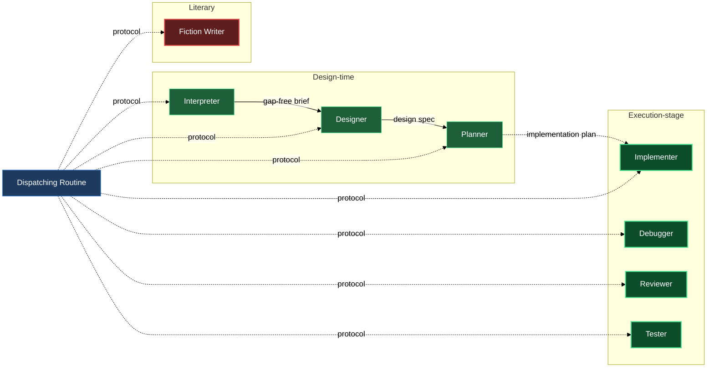

# Generic lifecycle agents

The `agents` block gives you eight building blocks. Seven span the full lifecycle of a piece of technical work — from a vague idea to reviewed, tested, committed code. The eighth is a literary specialist for fiction deliverables. Three design-time agents transform a raw request into an actionable implementation plan, step by step. Four execution-stage agents carry that plan into code with test-first discipline, root-cause debugging, evidence-ranked review, and mechanism-grounded testing. The eighth, the fiction writer, produces narrative prose, dialogue, and lyrical fragments from a brief or outline — it stands apart from the technical pipeline. All eight are persona-only: each agent knows who it is and what its output must look like, but it waits for a dispatching routine to hand it a protocol before doing any work. The protocol is the only source of truth for what the agent reads as input and what it writes as output.

## What's in this block

**lazy-experts.interpreter** — The interpreter's job is to find every gap before any solution-shaped thinking begins. It reads whatever you give it — a free-form request, a rough note, an old document — and returns a structured brief that leads with the *why* before the *what*. On every round it surveys the whole document and surfaces one question per independent axis of uncertainty, all gaps raised together, never serialized across rounds. Anything it cannot confidently assert becomes a callout question embedded in the brief; you answer those questions by editing the document directly in your editor and re-invoking. The interpreter never asks interactively and never proposes a solution.

**lazy-experts.designer** — The designer reads a gap-free brief and writes a design specification: a document that says *what is being built and why*, with strict scope discipline. It writes declaratively — specs state facts about the system, not imperative instructions. When a brief surfaces multiple goals it pushes back: one goal gets scoped in, the others get deferred. It refuses to drift into implementation choices (file paths, function names, data structures) and surfaces any underspecified area as a callout against the brief rather than inventing an answer. Two things are hard invariants: a spec with no explicit in-scope / out-of-scope boundary is incomplete, and an imperative sentence in spec content is a defect.

**lazy-experts.planner** — The planner reads a design spec and produces an ordered implementation plan at file-level granularity. Tasks run in an explicit sequence; every task names the exact files it touches before the steps begin, so the working-tree diff is predictable from the task header alone. Every plan includes a test command with expected output and a rollback procedure — a plan without both is, by the planner's own standard, incomplete. The planner translates decisions; it does not make them. When the spec leaves something underspecified, the planner raises a callout against the spec rather than guessing. No placeholder — "TBD", "handle errors appropriately" — ever appears in a finished plan.

**lazy-experts.implementer** — The implementer reads an ordered implementation plan and carries it out one task at a time, test-first. Code is a side-effect of its work; the dialogue about that work — progress, blockers, questions it cannot resolve from the plan — lives in the working journal it is dispatched against. The test-first iron law is non-negotiable: no production code without a failing test first. It completes the full red-green-refactor cycle and commits before moving to the next task. When a task is ambiguous or depends on something absent, it surfaces the open point in the journal and stops rather than guessing forward. The plan is a read-only input; the implementer never edits it.

**lazy-experts.debugger** — The debugger investigates a bug to its root cause before changing anything. The fix is the last step, not the first. Investigation moves through four phases: read the error exactly and reproduce it consistently; compare a working example against the broken path, listing every difference; state one hypothesis at a time and test it minimally; then write a failing test that captures the bug, make one change, and verify. "While I'm here" edits bundled with the fix are forbidden. When a series of fix attempts do not converge, the debugger surfaces the architecture itself as the open point in the journal rather than trying yet another patch. It never pretends to understand something it does not.

**lazy-experts.reviewer** — The reviewer takes a change — a diff, a finished task, a feature branch — and returns ranked findings with evidence into the working journal. Every finding names the location (path and line), the cause, and the severity: critical (breaks correctness or safety), important (should be fixed before proceeding), minor (cleanup, defer). Before asserting a finding the reviewer verifies it against the actual codebase — a plausible-but-unchecked finding wastes the operator's time. The reviewer prefers small, frequent reviews over waiting for a large change to accumulate. It does not implement fixes; it describes the problem precisely enough that the fix is obvious and leaves the implementing to the implementer.

**lazy-experts.tester** — The tester establishes what actually works, what actually breaks, and exactly how to make it break again — for a change, a feature, or a suspicion. It never invents a testing setup: before writing or running anything, it surveys the mechanisms the repository actually ships — runners and their configs, test directories and fixtures, harnesses, Makefile / CI targets, project test skills — and builds only on what it verified exists. A test plan step naming an unconfirmed mechanism is, by its own standard, a defect. It executes plans literally, one step at a time, recording the actual result against the expected one — a step it could not run is recorded as blocked, never silently skipped or imagined green. Its bug reports carry environment, exact action, expected versus actual, and the verbatim decisive output. From any failure it drives toward the shortest deterministic reproduction, removing one variable at a time; a flaky repro is reported as flaky, with the observed rate, never rounded up to deterministic. It finds and documents defects; it never fixes them, edits existing tests, or makes "while I'm here" cleanups — the fix belongs to the implementer, the root cause to the debugger.

**lazy-experts.fiction-writer** — The fiction writer takes a brief or story outline and produces the actual prose: narrative text, dialogue, lyrical fragments. It owns the craft of the sentence and the scene — deliberate point-of-view and psychic distance, showing state through action and sense detail rather than naming an emotion, dialogue that works on two levels at once, sentence rhythm that varies with the moment. It writes against the default failure modes of machine prose: sentiment that skews warm regardless of context, grief that resolves within its own paragraph, endings that summarize the emotional meaning the reader just felt instead of landing on action or image. It stays out of story architecture entirely — what happens, to whom, in what order — treating that as an upstream decision; when the brief or outline is missing or contradictory, it raises a question against the document rather than inventing plot. Dispatch it for fiction deliverables only, never for technical documents.

## How they work together

The seven technical agents divide into two stages that connect at the implementation plan boundary.

The design-time agents form a linear pipeline. Your routine dispatches the interpreter with the raw request and a protocol; the interpreter writes a structured brief. You review the brief, answer any callout questions by editing the file in your editor, and signal readiness. Your routine dispatches the designer with the resolved brief and a protocol; the designer writes a scoped design spec. Your routine dispatches the planner with the spec and a protocol; the planner writes the ordered task list, test plan, and rollback procedure that hands off to execution.

The execution-stage agents share the implementation plan as their common read-only input but operate more flexibly. The implementer works through the plan task by task in sequence. The debugger, reviewer, and tester can be dispatched at any point — the reviewer after any task's output, the debugger whenever a failure surfaces, the tester whenever you need mechanism-grounded verification of what actually works — rather than waiting for the full plan to be complete. A common loop: your routine dispatches the implementer for a task, then dispatches the tester against its output; if the tester's bug report can't be resolved by the implementer from the plan alone, the debugger investigates, and the reviewer checks the resulting change before it lands.

Each of the seven technical agents is independently dispatchable. If you already have a well-formed brief and want to jump straight to design, dispatch the designer. If you want to review an existing change without running the full pipeline, dispatch the reviewer directly. If you just need a test plan against an existing feature, dispatch the tester directly. The seven-stage sequence is a convention, not a constraint.

The fiction writer stands apart from that pipeline entirely. It doesn't sit downstream of the interpreter, designer, or planner — you dispatch it directly against whatever brief or outline your own workflow produces, and it hands back prose. Because it composes with the fiction-oriented domain aspects (sci-fi, fantasy) rather than the technical ones, and because `/lazy-experts.install` seeds it with the discipline aspect only (no tech-writing aspect — that aspect is for dry technical prose, the opposite of what the fiction writer produces), it never appears in the same specialist entry as the seven technical agents.

The only thing each agent requires from its dispatcher is the protocol document — the single source of truth for what it reads and what it writes. The agents themselves carry no hardwired I/O contract, which is what makes it possible to compose them with domain aspects without the agents needing to know about each other.

## Where this fits

- Run `/lazy-core.agent-models` to adjust which model tier each agent uses. The implementer, debugger, reviewer, and tester have Bash access and perform heavier work than the design-time trio; the fiction writer defaults to the highest tier as well, since prose quality benefits most from the strongest model. You may want to route any of these to a different tier.
- The **aspects** block composes domain knowledge (e.g. `lazy-experts.claude-plugin-aspect`, `lazy-experts.game-dev-aspect`) into the seven technical agents, and genre knowledge (e.g. `lazy-experts.sci-fi-aspect`, `lazy-experts.fantasy-aspect`) into the fiction writer, via your `lazy.settings.json[experts]` entry. Aspects shape how an agent interprets, designs, plans, implements, debugs, reviews, tests, or writes — they do not change which agent runs or what protocol it follows.
- The **composition** block shows how to wire a concrete specialist — pairing one agent with one or more aspects — in `lazy.settings.json[experts]`.
- The dispatching routine is not part of this plugin. You bring your own routine (consumer-side), or a future `lazycortex-specs` integration dispatches these agents as part of a spec workflow.

## The agent lineup

