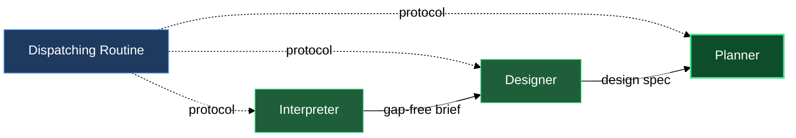

# Generic doc-producing agents

The `agents` block gives you three building blocks for transforming a vague idea into an actionable implementation plan — one step at a time, without any single agent overstepping its lane. The interpreter turns raw input into a structured brief, the designer turns that brief into a design spec, and the planner turns the spec into a file-level task list. All three are persona-only: they know who they are and what their output must look like, but they wait for a dispatching routine to hand them an I/O protocol before they do any work.

## What's in this block

**lazy-experts.interpreter** — The interpreter's job is to find every gap before any solution-shaped thinking begins. It reads whatever you give it — a free-form request, a rough note, an old document — and returns a structured brief that leads with the *why* before the *what*. On each invocation it surveys the whole document and surfaces one question per independent axis of uncertainty — all gaps raised together, never serialized across rounds. Anything it cannot confidently assert becomes a callout question embedded in the brief; you answer those questions by editing the document directly in your editor and re-invoking. The interpreter never asks interactively and never proposes a solution — it operates asynchronously through the document, one round at a time.

**lazy-experts.designer** — The designer reads a gap-free brief and writes a design specification: a document that says *what is being built and why*, with strict scope discipline. It works declaratively — specs state facts about the system, not imperative instructions. When a brief surfaces multiple goals it pushes back: one goal gets scoped in, the others get deferred — it does not silently expand the spec to cover everything. It refuses to drift into implementation choices (file paths, function names, data structures) and surfaces any underspecified area in the brief as a callout against the input rather than inventing an answer.

**lazy-experts.planner** — The planner reads a design spec and produces an ordered implementation plan at file-level granularity. Tasks run in an explicit sequence; every task names the exact files it touches before the steps begin, so the working-tree diff is predictable from the task header alone. Every plan includes a test command with expected output and a rollback procedure — a plan without both is, by the planner's own standard, incomplete. The planner translates decisions; it does not make them. When the spec leaves something underspecified, the planner raises a callout against the spec rather than guessing.

## How they work together

The three agents form a linear pipeline. A routine on your side dispatches them in sequence, supplying a protocol document to each one — the protocol is the only source of truth for what the agent reads as input and what it writes as output. The agents themselves carry no hardwired I/O contract.

A typical flow: your routine dispatches the interpreter with your raw request and a protocol. The interpreter writes a structured brief into a result directory; if it finds open questions it embeds them as callout blocks in that brief. You review the brief, answer any callout questions by editing the file in your own editor, and signal readiness. Your routine then dispatches the designer with the resolved brief and a protocol. The designer writes a design spec — one scoped goal, no scope creep. Your routine dispatches the planner with the spec and a protocol. The planner writes an ordered task list, test plan, and rollback procedures that an engineer can execute step by step.

Each handoff is an artifact boundary. The interpreter does not know what the designer will do with the brief; the designer does not know what implementation environment the planner targets. This separation is what lets aspects layer domain knowledge onto any agent without the agents needing to know about each other — run `/lazy-core.agent-models` to adjust which model tier each agent uses, and see the `aspects` block to attach domain expertise.

When you only need part of the pipeline — say, you already have a well-formed brief and want to jump straight to design — you can dispatch the designer directly. Each agent is independently dispatchable; the three-stage sequence is a convention, not a constraint.

## Where this fits

- The **aspects** block composes domain knowledge (e.g. `lazy-experts.claude-plugin-aspect`, `lazy-experts.game-dev-aspect`) into any of these agents via your `lazy.settings.json[experts]` entry. Aspects shape how an agent interprets, designs, or plans; they do not change which agent runs.
- The **composition** block shows how to wire a concrete specialist — pairing one agent with one or more aspects — in `lazy.settings.json[experts]`.
- The dispatching routine is not part of this plugin. You bring your own routine (consumer-side), or a future `lazycortex-specs` integration dispatches these agents as part of a spec workflow.

## The three-stage pipeline

