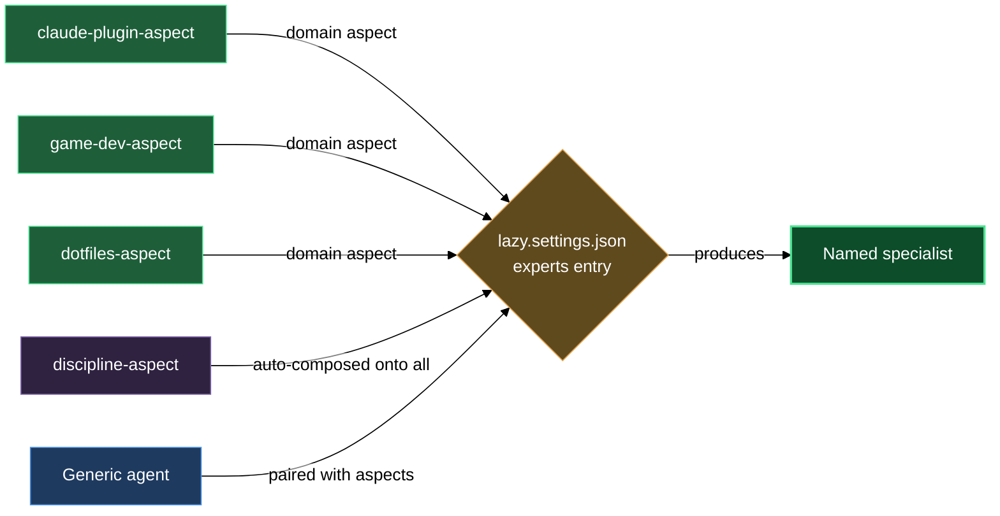

# Domain aspects and the discipline aspect

The aspects block is a set of pure prompt layers — each one adds a body of knowledge or behavioral discipline to whichever generic expert (`interpreter`, `designer`, `planner`, or any other) you pair it with. You declare the pairing in `lazy.settings.json[experts]` and the expert runtime merges the aspect bodies into the agent's system prompt at dispatch time. The result is a named specialist — for example a `claude-plugin-planner` or a `game-designer` — without authoring a fresh agent for each domain.

`lazycortex-experts` ships four aspects across two categories. Three are **domain aspects**: you pick the ones relevant to a project and wire them into the specialists you want. The fourth is the **discipline aspect**: it composes onto every seeded expert automatically, regardless of domain. `/lazy-experts.install` handles both — it seeds all nine built-in domain-specialist entries (agent × domain-aspect) into `lazy.settings.json[experts]`, and it adds `lazycortex-experts:lazy-experts.discipline-aspect` to every entry's `aspects[]` list. All four aspects are public-marketplace-safe and composable with aspects your own plugins ship.

## What's in this block

**`lazy-experts.discipline-aspect`** is the cross-cutting aspect — every seeded specialist carries it, and you should include it in any specialist you hand-author as well. It adds three iron laws the expert holds itself to regardless of its role or domain: verify before claiming done (evidence must be named in the document, never implied), never guess past an input gap (surface the gap and stop rather than inventing an answer and proceeding), and no performative agreement (evaluate the operator's input technically; push back with reasons if it is wrong). It also adds the async-translation principle: wherever a synchronous workflow would pause to ask a human, the expert translates that gate into an open point in the document instead, then stops and waits for the operator to answer there. The discipline aspect does not change what a specialist produces — it changes the rigor with which the specialist produces it and the honesty with which it reports. Because it is role-independent, it carries no domain discovery and adds no tooling of its own; the shape of open-point callouts, checkboxes, and markers is always defined by the dispatching protocol, not by this aspect.

**`lazy-experts.claude-plugin-aspect`** adds LazyCortex plugin authoring expertise to the composing agent. A specialist that includes this aspect knows the plugin directory layout, the marketplace registration contract, the per-artifact authoring contracts (agents, skills, rules, references, help chapters), the install and publish lifecycle, and the consumer-effort versioning semantics (patch / minor / major). The aspect anchors every design claim to a concrete contract file path and enforces obligations like tier-registration for new agents and scaffold-template use for new artifacts. Use it to build a specialist that interprets plugin-change requests, designs plugin additions, or plans plugin implementation as a sequence of conventional commits.

**`lazy-experts.game-dev-aspect`** adds general game-development expertise — core loop, progression, balance, telemetry, and content-versus-mechanics separation. The aspect is engine-agnostic, genre-agnostic, and platform-agnostic by design; when a brief pins Unity, Unreal, Godot, or a custom engine the specialist mirrors that pin literally. It obliges the agent to name the core loop explicitly, identify the progression curve, flag missing telemetry for every balance lever, separate mechanics from content in section structure, and schedule implementation plans in playable vertical slices. Use it to build a specialist that interprets a game-design request, writes a game-design document, or plans a game-implementation milestone list.

**`lazy-experts.dotfiles-aspect`** adds personal-computer and network configuration management expertise — dotfile-repo conventions, shell rc structure, host-versus-personal split, package-manager manifests, init systems, and secret-handling boundaries. The aspect is tool-neutral (chezmoi, yadm, stow, Nix home-manager, or ad-hoc); when a brief pins a tool the specialist honors that pin. It obliges the agent to push host-specific values behind template variables, never commit secrets, split shell rc files by responsibility, flag unversioned tools in package manifests, and declare init-system units with explicit run conditions. Use it to build a specialist that interprets a config-repo request, writes a config-repo design, or plans a dotfiles migration that keeps every machine in a working state.

## How they work together

The discipline aspect and the domain aspects serve different purposes and compose independently.

**The discipline aspect is not optional for installed specialists.** `/lazy-experts.install` adds `lazycortex-experts:lazy-experts.discipline-aspect` to every entry it seeds. When you hand-author a specialist entry you should include it too — a specialist without it lacks the iron laws that make expert output trustworthy across multiple dispatch rounds. It composes transparently: because it adds no domain discovery and no tooling of its own, it cannot conflict with any domain aspect or with other aspects your own plugins ship.

**Domain aspects are your choice per project.** Pick the ones that match the work at hand. You can compose one, two, or all three onto the same agent. The aspect resolver (part of `lazycortex-core`'s expert runtime) merges whichever aspect bodies you list into the agent's system prompt before dispatch, in declaration order. Order matters only when obligations conflict — earlier aspects take precedence in any ambiguous obligation.

The `lazy.settings.json[experts]` entry is the composition point. A typical hand-authored entry names one agent, the discipline aspect, and one domain aspect:

```jsonc
"experts": {
  "_version": 1,
  "claude-plugin-planner": {
    "agent": "lazycortex-experts:lazy-experts.planner",
    "aspects": [
      "lazycortex-experts:lazy-experts.discipline-aspect",
      "lazycortex-experts:lazy-experts.claude-plugin-aspect"
    ]
  },
  "game-designer": {
    "agent": "lazycortex-experts:lazy-experts.designer",
    "aspects": [
      "lazycortex-experts:lazy-experts.discipline-aspect",
      "lazycortex-experts:lazy-experts.game-dev-aspect"
    ]
  }
}
```

Running `/lazy-experts.install` writes all nine built-in domain-specialist entries — one per (agent × domain-aspect) pair across the three domain aspects and the three design-time agents: `claude-plugin-interpreter`, `claude-plugin-designer`, `claude-plugin-planner`, `game-interpreter`, `game-designer`, `game-planner`, `dotfiles-interpreter`, `dotfiles-designer`, `dotfiles-planner`. Every seeded entry carries the discipline aspect and `lazycortex-core:lazy-memory.persona-aspect` so the specialist accumulates private memory under `.memory/<self>/` across runs. Install is idempotent — existing entries are never overwritten, so any specialist you hand-customized survives a re-run.

When you need a specialist that covers multiple domains in one run — for example a config-repo design for a LazyCortex development machine — you list both domain aspects in the same entry alongside the discipline aspect. The aspect bodies carry no side-effects and add no new write permissions. They expand what the agent knows, what it considers a complete or incomplete brief, and the rigor it applies to its own output — they do not change where or how it writes its result, which remains governed by the protocol the dispatching routine supplies.

## Where this fits

- The **agents** block (`claude/lazycortex-experts/help/agents.md`) describes the six generic agents that aspects compose onto — interpreter, designer, planner, implementer, debugger, and reviewer.
- The **composition** block describes how to assemble a named specialist end-to-end, including naming conventions and how to wire a dispatching routine.
- To register the model tier for a new specialist you author, run `/lazy-core.agent-models` — the skill writes the `lazy.settings.json[agent_models]` entry; do not hand-edit the file.

## How aspects wire into a specialist


