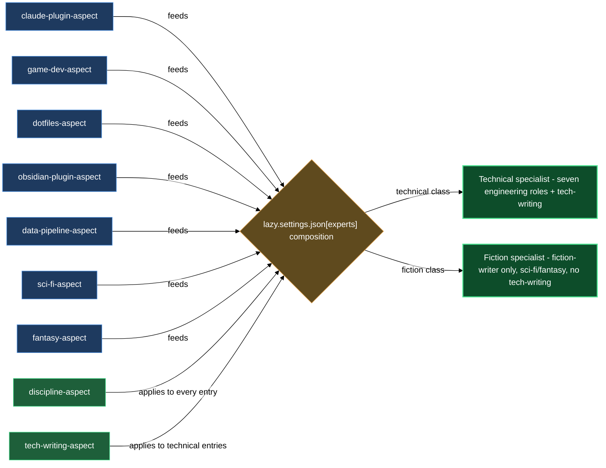

# Domain aspects and the two cross-cutting aspects

The aspects block is a set of pure prompt layers — each one adds a body of knowledge or behavioral discipline to whichever generic expert (`interpreter`, `designer`, `planner`, `implementer`, `debugger`, `reviewer`, `tester`, or `fiction-writer`) you pair it with. You declare the pairing in `lazy.settings.json[experts]` and the expert runtime merges the aspect bodies into the agent's system prompt at dispatch time. The result is a named specialist — for example a `claude-plugin-planner`, a `game-designer`, an `obsidian-plugin-implementer`, or a `sci-fi-writer` — without authoring a fresh agent for each domain.

`lazycortex-experts` ships nine aspects across two categories. Seven are **domain aspects**: you pick the ones relevant to a project and wire them into the specialists you want. Two are **cross-cutting aspects** that compose automatically per class rather than by hand-pick: `discipline` onto every seeded expert, and `tech-writing` onto every seeded expert in a technical class only. `/lazy-experts.install` handles all of it — it asks which classes to register (`claude-plugin`, `game-dev`, `dotfiles`, `obsidian-plugin`, `data-pipeline`, `sci-fi`, `fantasy`), then seeds the roles the class map assigns for each chosen class, wiring `lazycortex-experts:lazy-experts.discipline-aspect` onto every entry and `lazycortex-experts:lazy-experts.tech-writing-aspect` onto technical-class entries only. All nine aspects are public-marketplace-safe and composable with aspects your own plugins ship.

## What's in this block

**`lazy-experts.discipline-aspect`** is the cross-cutting aspect that composes onto every seeded specialist regardless of class — technical or fiction. It adds three iron laws the expert holds itself to regardless of its role or domain: verify before claiming done (evidence must be named in the document, never implied), never guess past an input gap (surface the gap and stop rather than inventing an answer and proceeding), and no performative agreement (evaluate the operator's input technically; push back with reasons if it is wrong). It also adds the async-translation principle: wherever a synchronous workflow would pause to ask a human, the expert translates that gate into an open point in the document instead, then stops and waits for the operator to answer there. Because it is role-independent, it carries no domain discovery and adds no tooling of its own; the shape of open-point callouts, checkboxes, and markers is always defined by the dispatching protocol, not by this aspect.

**`lazy-experts.tech-writing-aspect`** is the second cross-cutting aspect, and it composes onto technical-class specialists only — fiction classes (`sci-fi`, `fantasy`) never carry it, because its bans contradict literary craft. It governs the sentences a technical document is made of, not what the specialist produces: no metaphor or figurative imagery, no atmospheric openings, no evaluative epithets ("elegant", "robust") without a measurable property behind them, no emotional intensifiers, no filler sentence that carries no checkable fact or obligation. It also enforces a single-term-per-concept dictionary inherited verbatim from the upstream document the job carries (a spec inherits its terms from the brief, a plan from the spec); a new term gets one definition sentence at first use and stays fixed after that. Use it on any specialist that writes specs, plans, or reviews — never on `fiction-writer`.

**`lazy-experts.claude-plugin-aspect`** adds LazyCortex plugin authoring expertise to the composing agent. A specialist that includes this aspect knows the plugin directory layout, the marketplace registration contract, the per-artifact authoring contracts (agents, skills, rules, references, help chapters), the install and publish lifecycle, and the consumer-effort versioning semantics (patch / minor / major). The aspect anchors every design claim to a concrete contract file path and enforces obligations like tier-registration for new agents and scaffold-template use for new artifacts. Use it to build a specialist that interprets plugin-change requests, designs plugin additions, or plans plugin implementation as a sequence of conventional commits.

**`lazy-experts.game-dev-aspect`** adds general game-development expertise — core loop, progression, balance, telemetry, and content-versus-mechanics separation. The aspect is engine-agnostic, genre-agnostic, and platform-agnostic by design; when a brief pins Unity, Unreal, Godot, or a custom engine the specialist mirrors that pin literally. It obliges the agent to name the core loop explicitly, identify the progression curve, flag missing telemetry for every balance lever, separate mechanics from content in section structure, and schedule implementation plans in playable vertical slices. Use it to build a specialist that interprets a game-design request, writes a game-design document, or plans a game-implementation milestone list.

**`lazy-experts.dotfiles-aspect`** adds personal-computer and network configuration management expertise — dotfile-repo conventions, shell rc structure, host-versus-personal split, package-manager manifests, init systems, and secret-handling boundaries. The aspect is tool-neutral (chezmoi, yadm, stow, Nix home-manager, or ad-hoc); when a brief pins a tool the specialist honors that pin. It obliges the agent to push host-specific values behind template variables, never commit secrets, split shell rc files by responsibility, flag unversioned tools in package manifests, and declare init-system units with explicit run conditions. Use it to build a specialist that interprets a config-repo request, writes a config-repo design, or plans a dotfiles migration that keeps every machine in a working state.

**`lazy-experts.obsidian-plugin-aspect`** adds Obsidian community-plugin development expertise — plugin lifecycle hygiene, vault/workspace API boundaries, settings persistence, mobile compatibility, metadata-cache interplay, and the community release process. The aspect is neutral on bundler, language flavor, and testing framework; it is opinionated on the conceptual axes every Obsidian plugin must answer. It obliges the agent to design around `onload`/`onLayoutReady`/`onunload`, route every registered command, event, interval, and view through the matching `register*` cleanup helper, prefer `app.vault` over the raw adapter for note reads/writes, keep `data.json` settings separate from rebuildable runtime state, account for the metadata cache's asynchronous catch-up, decide mobile compatibility deliberately, and plan releases against the version-bump triple and community-registry submission step. Use it to build a specialist that interprets an Obsidian plugin request, writes a plugin design, or plans a release the community registry will accept.

**`lazy-experts.data-pipeline-aspect`** adds data-synchronization and pipeline engineering expertise — idempotency, incremental state, resumability, quota and rate-limit budgeting, integrity verification, and source-data safety. The aspect is neutral on transport, storage, and scheduler; it is opinionated on what state marks progress, what happens on re-run, what happens on interruption, and how the result is verified against the source. It obliges the agent to name the idempotency mechanism per stage, state the incremental-state model and when the progress marker is written relative to the side-effect, design for mid-batch interruption as the normal case, budget external quotas explicitly with a backoff strategy, keep source data read-only until the destination copy is proven, verify by reconciling counts/hashes/samples rather than by absence of errors, and park per-item failures in a visible quarantine instead of letting them block the run. Use it to build a specialist that interprets a sync or pipeline request, writes a pipeline design, or plans a migration that survives interruption.

**`lazy-experts.sci-fi-aspect`** adds science-fiction genre expertise to whichever expert composes it — in practice, `fiction-writer`. It treats the story's speculative premise as a system with consequences rather than a backdrop: name the novum (the one invented difference the story runs on) and work its second-order effects through plot, society, and scene; keep extrapolation coherent with whatever the story has already stated about its own technology; let the technology's limits — cost, latency, scarcity, failure — create the dramatic pressure instead of dissolving it. It is neutral on subgenre (hard SF, space opera, cyberpunk, near-future) and matches its plausibility rigor to whichever pin the brief sets.

**`lazy-experts.fantasy-aspect`** adds fantasy genre expertise to whichever expert composes it — in practice, `fiction-writer`. It treats the invented world as a constraint on every scene: magic shows or implies a cost every time it's used, world details that don't change a character's choices or stakes are cut, and established rules, geography, history, and names bind every later sentence — a contradiction with earlier text or the story bible is a defect, not a creative choice. Names and languages stay coherent with their culture's established conventions, and wonder is anchored in what a marvel does to characters and stakes rather than in unattached adjectives. It is neutral on subgenre (epic, urban, dark, fairy-tale).

## How they work together

The two cross-cutting aspects and the seven domain aspects serve different purposes and compose along different rules.

**Discipline is universal; tech-writing is class-gated.** `/lazy-experts.install` adds `lazycortex-experts:lazy-experts.discipline-aspect` to every entry it seeds, technical or fiction. It adds `lazycortex-experts:lazy-experts.tech-writing-aspect` only to entries in a technical class (`claude-plugin`, `game-dev`, `dotfiles`, `obsidian-plugin`, `data-pipeline`, and any future non-fiction class) — fiction-class entries (`sci-fi`, `fantasy`) never receive it, because banning metaphor and atmospheric openings would gut the craft `fiction-writer` exists to practice. When you hand-author a specialist entry, follow the same rule: include discipline always, include tech-writing only if the specialist writes technical documents.

**Domain aspects split into two families that don't mix.** The five technical domain aspects (`claude-plugin`, `game-dev`, `dotfiles`, `obsidian-plugin`, `data-pipeline`) compose onto the seven engineering agents — `interpreter`, `designer`, `planner`, `implementer`, `debugger`, `reviewer`, `tester`. The two genre aspects (`sci-fi`, `fantasy`) compose onto `fiction-writer`. You can combine multiple technical domain aspects on one engineering agent, and you can combine both genre aspects on `fiction-writer` for a story that blends sci-fi and fantasy elements, but a genre aspect on an engineering agent (or a technical domain aspect on `fiction-writer`) has no defined effect — the class map never seeds that pairing, and hand-authoring it does not make it meaningful. The aspect resolver (part of `lazycortex-core`'s expert runtime) merges whichever aspect bodies you list into the agent's system prompt before dispatch, in declaration order; order matters only when obligations conflict, and earlier aspects take precedence in any ambiguous obligation.

The `lazy.settings.json[experts]` entry is the composition point. A hand-authored technical entry names one engineering agent, discipline, tech-writing, and one or more domain aspects; a hand-authored fiction entry names `fiction-writer`, discipline, and one or more genre aspects with no tech-writing:

```jsonc
"experts": {
  "_version": 1,
  "claude-plugin-planner": {
    "agent": "lazycortex-experts:lazy-experts.planner",
    "aspects": [
      "lazycortex-experts:lazy-experts.discipline-aspect",
      "lazycortex-experts:lazy-experts.tech-writing-aspect",
      "lazycortex-experts:lazy-experts.claude-plugin-aspect"
    ]
  },
  "obsidian-plugin-implementer": {
    "agent": "lazycortex-experts:lazy-experts.implementer",
    "aspects": [
      "lazycortex-experts:lazy-experts.discipline-aspect",
      "lazycortex-experts:lazy-experts.tech-writing-aspect",
      "lazycortex-experts:lazy-experts.obsidian-plugin-aspect"
    ]
  },
  "sci-fi-writer": {
    "agent": "lazycortex-experts:lazy-experts.fiction-writer",
    "aspects": [
      "lazycortex-experts:lazy-experts.discipline-aspect",
      "lazycortex-experts:lazy-experts.sci-fi-aspect"
    ]
  }
}
```

Running `/lazy-experts.install` and choosing a technical class (say `data-pipeline`) seeds all seven engineering roles for that class — `data-pipeline.interpreter`, `data-pipeline.designer`, `data-pipeline.planner`, `data-pipeline.implementer`, `data-pipeline.debugger`, `data-pipeline.reviewer`, `data-pipeline.tester` — each carrying discipline, tech-writing, and the domain aspect. Choosing a fiction class (say `sci-fi`) seeds only `fiction-writer` — named for the class — carrying discipline and the genre aspect, with no tech-writing. Every seeded entry also carries `lazycortex-core:lazy-memory.persona-aspect` so the specialist accumulates private memory under `.memory/<self>/` across runs, and a deterministic bot `git_author`. Install is idempotent — existing entries are never overwritten, so any specialist you hand-customized survives a re-run; when the `experts` list already has domain-class entries, install derives the classes already present from their `aspects` and completes only those, never re-asking and never silently adding a class you didn't choose.

The aspect bodies carry no side-effects and add no new write permissions. They expand what the agent knows, what it considers a complete or incomplete brief or draft, and the rigor or genre judgment it applies to its own output — they do not change where or how it writes its result, which remains governed by the protocol the dispatching routine supplies.

## Where this fits

- The **agents** block (`claude/lazycortex-experts/help/agents.md`) describes the generic agents that aspects compose onto — seven engineering agents plus `fiction-writer`, the one that pairs with `sci-fi-aspect` and `fantasy-aspect`.
- The **composition** block describes how to assemble a named specialist end-to-end, including naming conventions and how to wire a dispatching routine.
- To register the model tier for a new specialist you author, run `/lazy-core.agent-models` — the skill writes the `lazy.settings.json[agent_models]` entry; do not hand-edit the file.

## How aspects wire into a specialist


