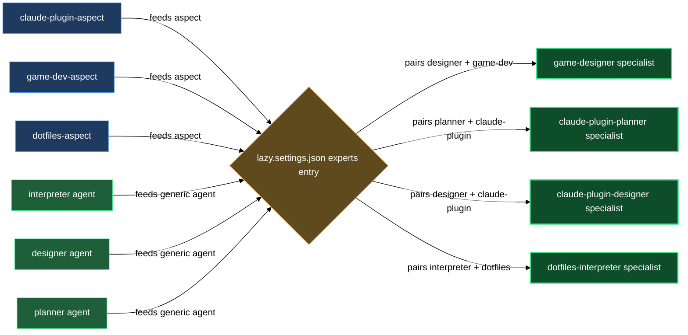

# Domain aspects for specialist composition

The aspects block is a set of pure prompt layers — each one adds a body of domain knowledge to whichever generic expert (`interpreter`, `designer`, or `planner`) you pair it with. You declare the pairing in `lazy.settings.json[experts]` and the expert runtime merges the aspect bodies into the agent's system prompt at dispatch time. The result is a named specialist — for example a `claude-plugin-planner` or a `game-designer` — without authoring a fresh agent for each domain.

`lazycortex-experts` ships three starter aspects: `claude-plugin-aspect` (LazyCortex plugin authoring), `game-dev-aspect` (game design and implementation planning), and `dotfiles-aspect` (personal-computer and network configuration management). All three are public-marketplace-safe, domain-neutral on tooling choices, and composable with each other or with aspects your own plugins ship. Running `/lazy-experts.install` seeds all nine built-in (agent × aspect) specialist entries into `lazy.settings.json[experts]` automatically — you only need to hand-author entries for specialists you invent yourself.

## What's in this block

**`lazy-experts.claude-plugin-aspect`** adds LazyCortex plugin authoring expertise to the composing agent. A specialist that includes this aspect knows the plugin directory layout, the marketplace registration contract, the per-artifact authoring contracts (agents, skills, rules, references, help chapters), the install and publish lifecycle, and the consumer-effort versioning semantics (patch / minor / major). The aspect anchors every design claim to a concrete contract file path and enforces obligations like tier-registration for new agents and scaffold-template use for new artifacts. Use it to build a specialist that interprets plugin-change requests, designs plugin additions, or plans plugin implementation as a sequence of conventional commits.

**`lazy-experts.game-dev-aspect`** adds general game-development expertise — core loop, progression, balance, telemetry, and content-versus-mechanics separation. The aspect is engine-agnostic, genre-agnostic, and platform-agnostic by design; when a brief pins Unity, Unreal, Godot, or a custom engine the specialist mirrors that pin literally. It obliges the agent to name the core loop explicitly, identify the progression curve, flag missing telemetry for every balance lever, separate mechanics from content in section structure, and schedule implementation plans in playable vertical slices. Use it to build a specialist that interprets a game-design request, writes a game-design document, or plans a game-implementation milestone list.

**`lazy-experts.dotfiles-aspect`** adds personal-computer and network configuration management expertise — dotfile-repo conventions, shell rc structure, host-versus-personal split, package-manager manifests, init systems, and secret-handling boundaries. The aspect is tool-neutral (chezmoi, yadm, stow, Nix home-manager, or ad-hoc); when a brief pins a tool the specialist honors that pin. It obliges the agent to push host-specific values behind template variables, never commit secrets, split shell rc files by responsibility, flag unversioned tools in package manifests, and declare init-system units with explicit run conditions. Use it to build a specialist that interprets a config-repo request, writes a config-repo design, or plans a dotfiles migration that keeps every machine in a working state.

## How they work together

Each aspect is independent — you can compose one, two, or all three onto the same agent. The aspect resolver (part of `lazycortex-core`'s expert runtime) merges whichever aspect bodies you list into the agent's system prompt before dispatch, in declaration order.

The `lazy.settings.json[experts]` entry is the composition point. A typical entry names one agent and one or more aspects:

```jsonc
"experts": {
  "_version": 1,
  "claude-plugin-planner": {
    "agent": "lazycortex-experts:lazy-experts.planner",
    "aspects": ["lazycortex-experts:lazy-experts.claude-plugin-aspect"]
  },
  "game-designer": {
    "agent": "lazycortex-experts:lazy-experts.designer",
    "aspects": ["lazycortex-experts:lazy-experts.game-dev-aspect"]
  }
}
```

Running `/lazy-experts.install` writes all nine built-in combinations — one entry per (agent × aspect) pair: `claude-plugin-interpreter`, `claude-plugin-designer`, `claude-plugin-planner`, `game-interpreter`, `game-designer`, `game-planner`, `dotfiles-interpreter`, `dotfiles-designer`, `dotfiles-planner`. Every seeded entry also carries `lazycortex-core:lazy-memory.persona-aspect` so the specialist accumulates private memory under `.memory/<self>/` across runs. Install is idempotent — existing entries are never overwritten, so any specialist you hand-customized survives a re-run.

The aspect bodies themselves carry no side-effects and add no new write permissions. They expand what the agent knows and what it considers a complete or incomplete brief — they do not change where or how it writes its output, which remains governed by the protocol the dispatching routine supplies.

When you need a specialist that covers multiple domains in one run (e.g. a config-repo design for a LazyCortex development machine), you list both aspects in the same entry. The order matters only when obligations conflict — earlier aspects take precedence in any ambiguous obligation.

## Where this fits

- The **agents** block (`claude/lazycortex-experts/help/agents.md`) describes the three generic agents that aspects compose onto — interpreter, designer, and planner.
- The **composition** block describes how to assemble a named specialist end-to-end, including naming conventions and how to wire a dispatching routine.
- To register the model tier for a new specialist you author, run `/lazy-core.agent-models` — the skill writes the `lazy.settings.json[agent_models]` entry; do not hand-edit the file.

## How aspects wire into a specialist


