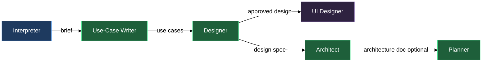

# Design-time agents

Before any code, data, or documentation gets written, seven agents turn a raw request into settled decisions or a sourced answer. The interpreter closes the gaps in what you're asking for. The use-case writer turns a settled request into formal scenarios written in the actor's own language. The designer decides what the thing is and why. The UI designer settles what it looks like and how it behaves on screen. The architect decides how the code is arranged to build it. The researcher answers a question with a sourced report instead of a design. The planner turns all of that into an ordered, file-level sequence of tasks. Each is persona-only — it waits for a dispatching routine to hand it a protocol naming what it reads and what it writes — and each is independently dispatchable when you already have its input in hand.

## What's in this block

**lazy-experts.interpreter** — Takes whatever you hand it — a free-form request, a rough note, an old document — and returns a structured, gap-free brief that leads with *why* before *what*. It surveys the whole input on every round and raises one question per independent axis of uncertainty, all together rather than serialized one at a time; you answer by editing the document directly and re-invoking. When more than one direction is viable, it surfaces two or three candidates with one recommended rather than letting a single direction harden unchallenged. It never proposes a solution and never asks interactively.

**lazy-experts.use-case-writer** — Takes a settled brief or request and writes the formal use cases it implies: scenarios in the actor's own language, with no system internals. Every scenario carries an actor, a goal, a main flow, alternative flows, and pre- and postconditions — a scenario missing any of the five ships incomplete. Steps are stated so someone can check them against the running product, never as vague aspiration. It stops short of acceptance criteria and test plans — those belong to the tester's document — and raises a brief that doesn't name the actor or what counts as success as a question rather than guessing.

**lazy-experts.designer** — Takes a gap-free brief and writes a design specification: what is being built and why, never how. It designs the target the brief asks for, treating the current implementation's gaps, shortcuts, half-built paths, and TODOs as evidence of where the work stands, never as constraints on the spec — the only thing that narrows scope is an explicit in/out-of-scope line the operator recorded in the brief. Decisions and boundaries already recorded for the product are binding: it follows one or names the contradiction as an open question, never overrides one silently. It stays out of the planner's lane (no file paths, task checklists, test plans, function names, or types) and the interpreter's lane (an incomplete brief gets a question raised against it, never a silent guess). The template's own section skeleton stays exactly as templated, but inside a section it is free to add subheadings wherever they buy structure.

**lazy-experts.ui-designer** — Takes an approved design and settles its user interface: screens, states, navigation, and interaction decisions, written into a ui-design document with self-contained HTML mockups laid down beside it as attachments — no external stylesheets, scripts, fonts, or CDN references, so a reviewer can open one straight in a browser. Every screen states its empty, loading, error, and populated states and what moves it between them. A mockup only ever illustrates a decision the document already states — never the reverse — and it is never production frontend code; it approves a look and a flow, it ships nothing.

**lazy-experts.architect** — Takes an approved design — behavior already settled, never an open brief — and writes an architecture document: which modules exist, which way the dependencies point, what is public contract versus internal, what data has to migrate, and what it costs to callers that already exist. It grounds every boundary in the project's actual structure map before naming one, and classifies every touched unit as a subsystem (its own contract, state, and lifecycle) or plain service code. A document that names modules without naming the dependency direction between them, or changes stored data without naming the migration, is incomplete.

**lazy-experts.researcher** — Takes an approved research design — a `design.md` typed `research-design` that states the question — and writes the research report beside it: every route it walked (the spec tree, the code, the structure map, and the wiki before it turns to the open web), a finding for every claim with the exact source it came from, the options compared when the question is one of choice, and a conclusion whose first sentence answers the question and whose second states outright whether the design's hypothesis held. Fact and interpretation never share a sentence, and a finding without a named source doesn't make it into the report. It also validates a research design during review, judging only whether the question is answerable as posed — one question, a bounded scope, a sourced known part — never doing the research itself at that stage.

**lazy-experts.planner** — Takes a design spec and produces an ordered implementation plan at file-level granularity. Every task names the exact files it touches before the steps begin, so the working-tree diff is predictable from the task header alone. Every plan includes a test command with expected output and a rollback procedure — a plan lacking either is, by the planner's own standard, incomplete. It translates decisions rather than making them: an underspecified spec gets a callout, never a guess, and no placeholder ever appears in a finished plan.

## How they work together

The six agents form a pipeline that starts wherever your input already sits and ends at an ordered task list.

Your routine dispatches the interpreter with the raw request and a protocol; the interpreter writes a structured brief. You review it, answer any callout questions by editing the file, and signal readiness. From a settled brief, two paths open. When the work benefits from formal requirements scenarios before design starts, your routine dispatches the use-case writer with the brief; it writes actor-facing use cases that give the designer verifiable ground to build on. Either way, your routine dispatches the designer with the resolved brief (and the use cases, when they exist) and a protocol; the designer writes a scoped design spec.

Two things can branch off an approved design spec, independently of each other. When the work needs its interface settled before or alongside the code, your routine dispatches the UI designer with the approved design; it writes the ui-design document and mockups a reviewer can open without any code shipping. When the work also needs a code-structure design — module boundaries, dependency direction, migration cost — your routine dispatches the architect with the approved spec; the architect writes the architecture document. The UI designer and the architect don't feed each other; both read the same approved design independently.

Finally, your routine dispatches the planner with the design spec (and the architecture document, when one exists) and a protocol; the planner writes the ordered task list, test plan, and rollback procedure that hands off to the execution-stage agents.

The researcher runs on a separate track that starts from a question rather than a feature. When a research asset's design document is approved — typed `research-design`, stating the question, scope, and what's already known — your routine dispatches the researcher; it walks the spec tree, the code, the structure map, and the wiki before turning to the open web, and writes the sourced `research.md` report beside it: every route walked, a finding for every claim with its exact source, the options compared when the question is a choice, and a conclusion whose first sentence answers the question and whose second states outright whether the hypothesis held. It also validates a research design during review, judging only whether the question is answerable as posed. An approved research report is immutable and doesn't feed forward into the designer or the planner the way the rest of the pipeline does — it exists to inform whichever decision sent someone looking for an answer.

Each of the seven is independently dispatchable. If you already have a well-formed brief and want formal scenarios, dispatch the use-case writer directly. If you already have a settled brief and want to jump straight to design, dispatch the designer. If behavior is already decided and only the interface is open, dispatch the UI designer directly. If behavior is decided and only the code's shape is open, dispatch the architect directly with the design spec. If a question just needs an answer, dispatch the researcher directly with the approved research design. The five-stage sequence above is a convention, not a constraint.

## Where this fits

- Run `/lazy-core.agent-models` to adjust which model tier each of these seven agents uses.
- The **aspects** block composes domain knowledge (e.g. `lazy-experts.claude-plugin-aspect`, `lazy-experts.game-dev-aspect`) into all seven via your `lazy.settings.json[experts]` entry. An aspect shapes how an agent interprets, writes use cases, designs, designs UI, architects, researches, or plans — it never changes which agent runs or what protocol it follows.
- The **composition** block shows how to wire a concrete specialist — pairing one of these seven agents with one or more aspects — in `lazy.settings.json[experts]`.
- Once the planner hands off its task list (or, for data-only or documentation work, the designer's approved spec hands off directly), the execution-stage agents pick up the work — see the sibling `execution-stage-agents` article.
- The dispatching routine is not part of this plugin. You bring your own routine (consumer-side), or a future `lazycortex-specs` integration dispatches these agents as part of a spec workflow.

## The design-time pipeline

